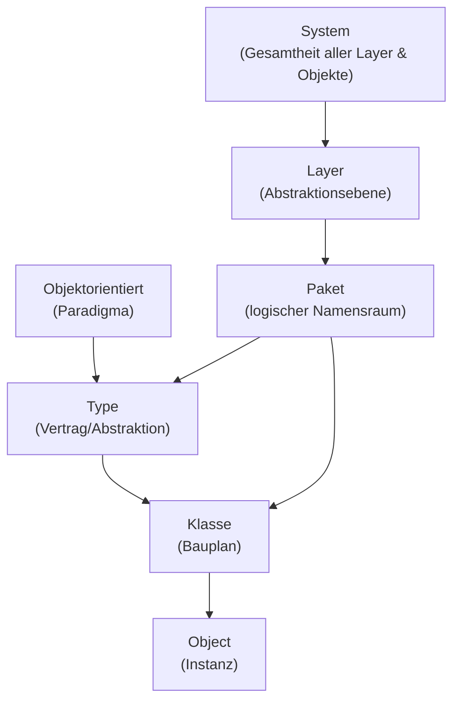
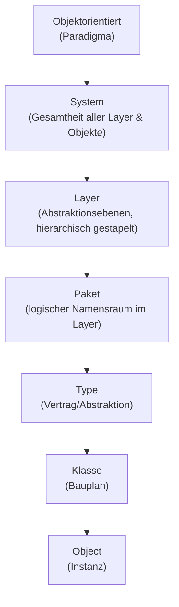
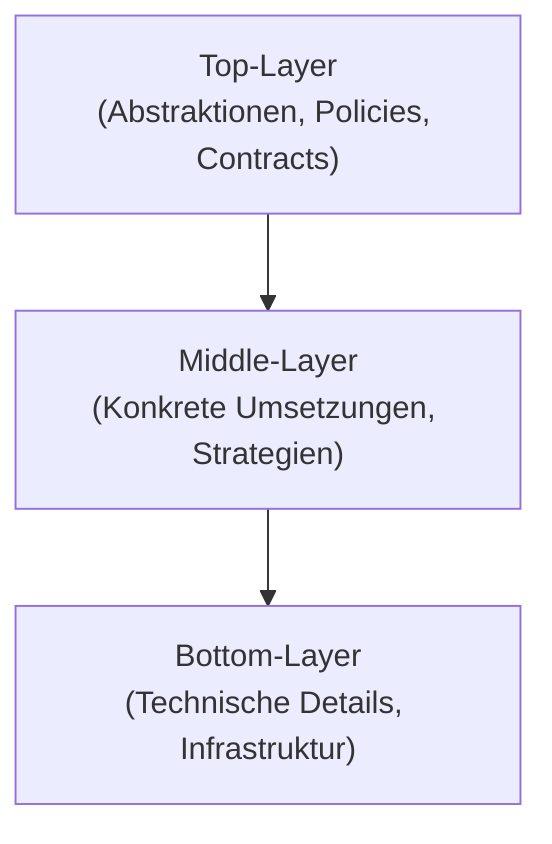
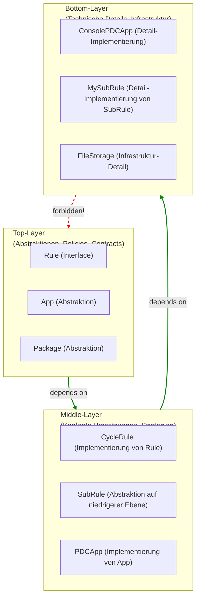
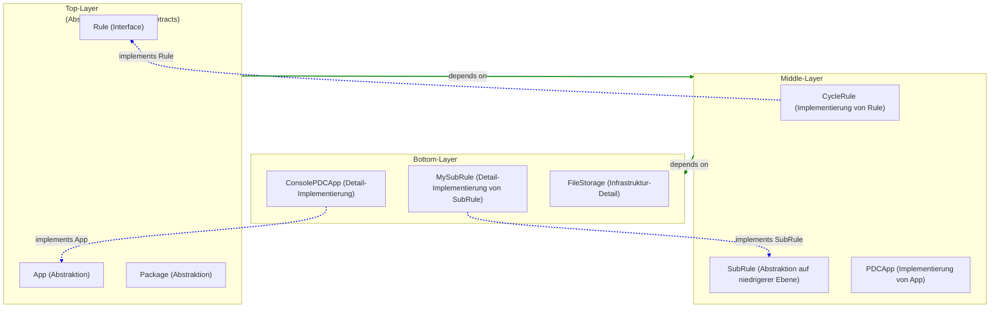
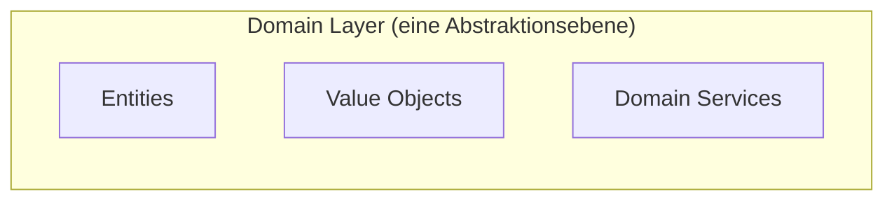
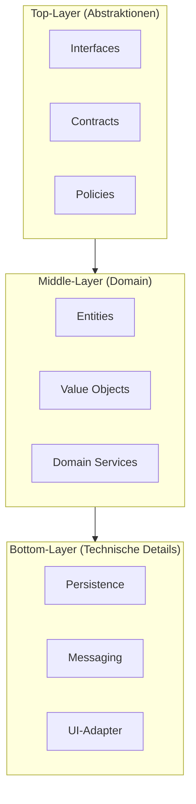

# About this Blog

Many years i try to find the silver bullet for constructing business software from the stretch...  but what i found does not fit my needs moreover it's frustrated me... never the less i don't give up... because i maybe understand...

Then a ask Chat GPT: 21.09.2025
https://chatgpt.com/

Hi GPT, was bedeutet Folgendes, im Sinne von OOP, antworte kurz und pregnant:
1. Objektorientiert?
2. Type
3. Klasse
4. Objekt
5. Paket
6. Layer
7. System

Klar – hier die kurze, prägnante OOP-Definition:

Objektorientiert – Paradigma, das Software als Zusammenspiel autonomer Objekte modelliert.
- Type – Vertrag, der die Form und das Verhalten von Objekten beschreibt (Interface/Abstraktion).
- Klasse – Bauplan, der festlegt, wie ein Typ konkret implementiert wird.
- Object – laufende Instanz eines Typs/Klasse mit eigenem Zustand und Verhalten.
- Paket – logischer Namensraum, der zusammengehörige Typen/Objekte strukturiert.
- Layer – Abstraktionsebene, die Objekte nach Verantwortungsgrad hierarchisch trennt.
- System – Gesamtheit interagierender Objekte und Layer, die gemeinsam Verhalten realisieren.

Damit siehst du:  
- **Objektorientiert** als Wurzel  
- **Type → Klasse → Object** als Kernkette  
- **Pakete** fassen Typen/Klassen zusammen  
- **Layer** ordnen Pakete hierarchisch  
- **System** kapselt alles.

hier ein Schematisches OOP-Bild mit deinen Begriffen

👉 Soll ich dir dieses Diagramm auch in einer **horizontalen Layer-Architektur** darstellen, sodass „System“ oben steht und darunter die Schichten gestapelt sind?
ja
Perfekt 👍 – hier die horizontale Layer-Architektur mit deinen OOP-Begriffen, in gestapelter Darstellung:

me: gibt es in OOP Layer – Abstraktionsebene, die Objekte nach Verantwortungsgrad vertikal trennt?

gpt: Ja, genau ✅

In OOP versteht man unter Layern typischerweise Abstraktionsebenen, die Objekte nach ihrem Verantwortungsgrad (Level of Responsibility) vertikal trennen:

- Oben (hoch) → stabile, allgemeine Abstraktionen (Policies, Interfaces, Domain Contracts).
- Mitte → konkrete Umsetzungen (Services, Strategien, Regelausprägungen).
- Unten (tief) → technische Details (Persistenz, I/O, Framework-Anbindung).

👉 Regeln dabei:

1. Abhängigkeiten verlaufen nur nach unten (Higher-Level → Lower-Level).
2. Objekte eines Layers kennen nur Abstraktionen darunter, nie darüber.
3. Layer = Architekturprinzip, nicht nur Packaging.

Das ist der klassische Layered-Architecture-Ansatz in OOP, wie ihn u. a. Yegor Bugayenko (Elegant Objects) oder Self-XDSD verwenden: oben reine Contracts, unten Implementierungen/Details.

Willst du, dass ich dir ein kurzes Mermaid-Diagramm zeichne, das genau diese vertikale Trennung (Top-Layer → Mid-Layer → Bottom-Layer) zeigt?

Das zeigt klar:  
- **Vertikale Trennung nach Verantwortungsgrad**  
- **Abhängigkeiten verlaufen nur nach unten**  
- Jeder Layer ist eine eigene Abstraktionsebene.  

👉 Soll ich dir auch ein erweitertes Diagramm machen, wo innerhalb jedes Layers **Beispiele für Objekte** (z. B. `Rule`, `CycleRule`, `FileStorage`) stehen?
👉 Soll ich dir zusätzlich die **Abhängigkeitsrichtung als Pfeilbeschriftung** („depends on“) einzeichnen, damit klar wird, dass jede Schicht nur **nach unten** schaut?
👉 Soll ich dir auch die **Regelverletzung** darstellen (z. B. ein Pfeil von Bottom → Top als „forbidden“), um Verstöße sichtbar zu machen?
Alles klar 👍 – hier die erweiterte Version mit zulässigen Abhängigkeiten (grün) und einer Regelverletzung (rot gestrichelter Pfeil „forbidden“), die zeigt, was im OOP-Layering nicht erlaubt ist:

Damit sieht man:  
- **Top-Layer** → reine Abstraktionen (Policies, Interfaces, Verträge)  
- **Middle-Layer** → konkrete Umsetzungen und spezialisierte Abstraktionen  
- **Bottom-Layer** → technische Details und austauschbare Infrastruktur 

So erkennst du sofort:  
- **grüne Pfeile** = erlaubte, einseitige Abhängigkeiten nach unten  
- **roter gestrichelter Pfeil** = verbotene Abhängigkeit (Bottom → Top)  

👉 Soll ich dir dazu noch eine **kurze formale Regelbeschreibung** (wie ein Linter-Check) formulieren, die prüft, ob ein Projekt dieses Layering einhält?

**Me** ist das Bottom → Top wirklich nicht erlaubt, denke bitte nach?

GPT:
In klassischem OOP-Layering / Clean Architecture gilt:
- Top → Bottom: erlaubt ✅
Abstraktionen hängen von Implementierungen in tieferen Schichten ab.

Beispiel: App kennt PDCApp.
- Bottom → Top: nur in einer sehr speziellen Form erlaubt ⚠️
Direkte Kenntnis einer konkreten Abstraktion im Top-Layer durch den Bottom-Layer (z. B. ConsolePDCApp importiert App) → verboten ❌

**Aber:** das Bottom-Layer implementiert Schnittstellen aus dem Top-Layer → das ist erlaubt und notwendig ✅

👉 Das heißt:

- „Depends on“ ist immer nur top-down erlaubt.
- „Implements“ kann bottom → top verlaufen, weil das Bottom-Layer lediglich den Vertrag des Top-Layers erfüllt, aber keine Abhängigkeit zurück aufruft.

**Kurzregel:**

- Darf nicht: Bottom importiert oder ruft Top auf.
- Darf: Bottom implementiert Interfaces, die im Top definiert sind.

👉 Willst du, dass ich das Mermaid-Diagramm so korrigiere, dass der Unterschied „depends on“ (grün) vs. „implements“ (blau, bottom → top) klar wird?
Perfekt 🚀 – hier die korrigierte Version, in der Abhängigkeiten (depends on) grün und Implementierungen (implements) blau dargestellt sind:

🔎 Interpretation:  
- **Grün (depends on)**: Abstraktionen definieren Verträge, höhere Layer kennen tiefere Implementierungen.  
- **Blau gestrichelt (implements)**: Tiefere Layer erfüllen Verträge, die weiter oben definiert sind.  

👉 Soll ich dazu auch ein **kurzes „Gesetz in einem Satz“** formulieren, das die erlaubten Richtungen (depends on vs. implements) formal fixiert?

Hier das Gesetz in einem Satz, sauber formalisiert:

## Layering-Gesetz (OOP):
Ein Layer darf nur nach unten von Abstraktionen zu Implementierungen abhängen (depends on), 
während Implementierungen nach oben ausschließlich die im höheren Layer definierten Abstraktionen erfüllen (implements), 
jedoch niemals auf sie zurückrufen dürfen.

👉 Kurz:

- Top → Bottom = depends on ✅
- Bottom → Top = implements only ✅ (kein Rückruf)
- Alles andere ❌

Willst du, dass ich diese Regel auch als formale if/then-Struktur (z. B. wie Pseudocode für einen Architektur-Linter) aufschreibe?

me: gibt es auch eine horizontale Layer Betrachtung nach OOP analog zu vertikalen?

gpt:
Sehr gute Frage 👌 – ja, es gibt eine horizontale Layer-Betrachtung in OOP, allerdings mit einer anderen Logik als die vertikale Schichtung:

**Vertikale Layer (klassisch)**

- Trennung nach Abstraktionsgrad.
- Oben: Policies, Interfaces, Domain-Konzepte.
- Unten: technische Details, Infrastruktur.

**Fokus:** Architektur-Tiefe (Was ist stabil? Was ist austauschbar?).

**Horizontale Layer (ergänzend)**

*Trennung* nach **Verantwortungsbereich** auf **derselben** Abstraktionsebene.
- Objekte auf gleicher Höhe, aber mit getrennten Rollen.

*Beispiel* Domain-Layer (vertikal betrachtet):
horizontal darin verschiedene „Slices“:

- Entities (zustandsbehaftete Objekte mit Identität)
- Value Objects (unveränderliche, identitätslose Konzepte)
-  Domain Services (Kombination von Regeln, ohne eigenen Zustand)

In der **Infrastruktur-Schicht** könnte die horizontale Trennung z. B. sein:

- Persistence (z. B. JPA-Repositories)
- Messaging (z. B. Kafka-Adapter)
- UI-Adapter (z. B. REST-Controller)

**Analogie:**

- Vertikal = „Abstraktionshöhe“ (oben Ideen, unten Details).
- Horizontal = „Verantwortungsachsen“ (nebenläufige Rollen innerhalb derselben Höhe).

Man kann also sagen:
👉 Vertikale Layer ordnen nach Was ist allgemeiner, was spezieller.
👉 Horizontale Layer ordnen nach Welche Rolle übernimmt ein Objekt auf derselben Höhe.

Willst du, dass ich dir diese vertikale + horizontale Layerung kombiniert als Mermaid-Schema zeichne, damit man das „Koordinatensystem“ sieht?
me: ja, 1 horizontale Layerung einzeln und 2 vertikale + horizontale Layerung kombiniert

## 1. Horizontale Layerung (einzeln, innerhalb einer Ebene)

Beispiel: Domain-Ebene, horizontal nach Verantwortungsarten getrennt.

---

## 2. Vertikale + horizontale Layerung kombiniert  
Koordinatensystem:  
- **Vertikal** = Abstraktionshöhe (Top → Bottom).  
- **Horizontal** = Verantwortungsarten auf derselben Ebene.  

👉 Damit siehst du:  
- **Vertikal**: von Abstraktion (L1) zu Details (L3).  
- **Horizontal**: Spezialisierungen innerhalb einer Ebene (z. B. Domain-Layer in Entities/VOs/Services).  

Soll ich dir als Nächstes eine **formale Regel** formulieren, wie horizontale Layer-Abhängigkeiten erlaubt/verboten sind (z. B. Entities ↔ ValueObjects vs. DomainServices ↔ Entities)?
Sehr gut 👍 – hier die formale Regel für horizontale Layer-Abhängigkeiten (innerhalb einer Abstraktionsebene):

**Horizontales Layering-Gesetz (OOP)**

**Axiome**

Jedes horizontale Layer:
- ℎ[𝑛] h[n] ist eine Rolle innerhalb derselben vertikalen Ebene.
- Objekte in h[n] dürfen nur solche Rollen nutzen, die „untergeordnet“ sind – niemals seitwärts oder nach oben.

Seitwärts-Abhängigkeiten
- ℎ[𝑛]→ℎ[𝑛]
- h[n]→h[n] sind verboten (z. B. Entity ruft Service direkt).

**Beispiel-Regeln (Domain Layer)**

**Entities**
- dürfen Value Objects benutzen ✅
- dürfen Domain Services nicht direkt nutzen ❌
- sind unabhängig voneinander ❌

**Value Objects**
- sind atomar & unveränderlich
- dürfen keine Entities oder Services aufrufen ❌

**Domain Services**
- dürfen Entities und Value Objects benutzen ✅
- dürfen keine anderen Services aufrufen ❌ (stattdessen Orchestrierung durch höheres Layer)

👉 Damit entsteht eine klare Regel:
- Flow innerhalb der Ebene = ValueObject → Entity → Service.
- Seitwärts-Abhängigkeiten verboten.
- Richtung ist strikt „unten nach oben“ innerhalb der Rolle.
