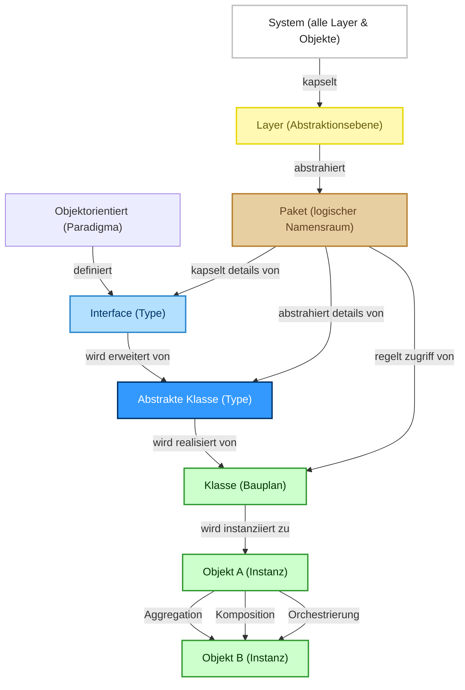
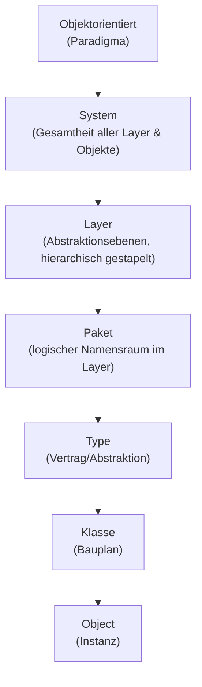
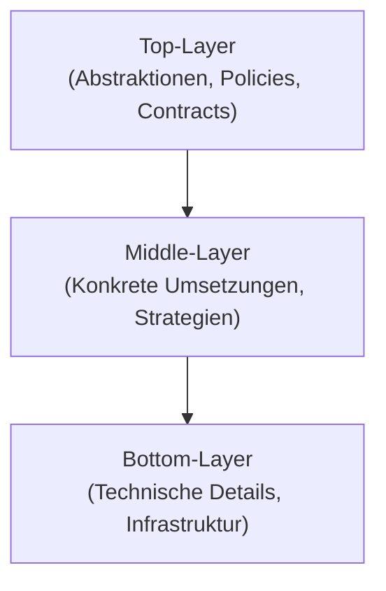
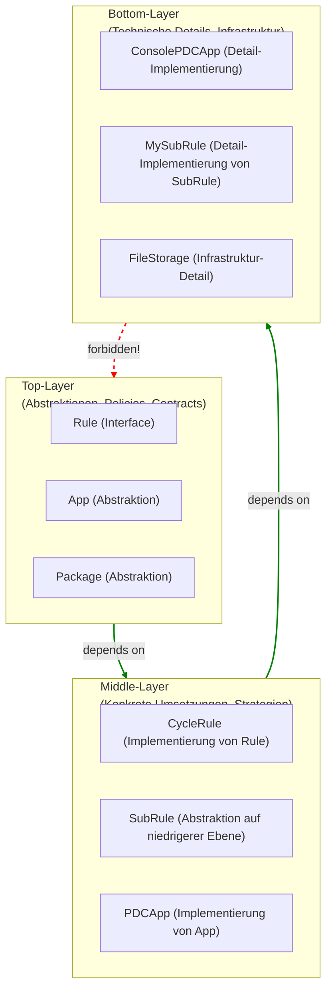
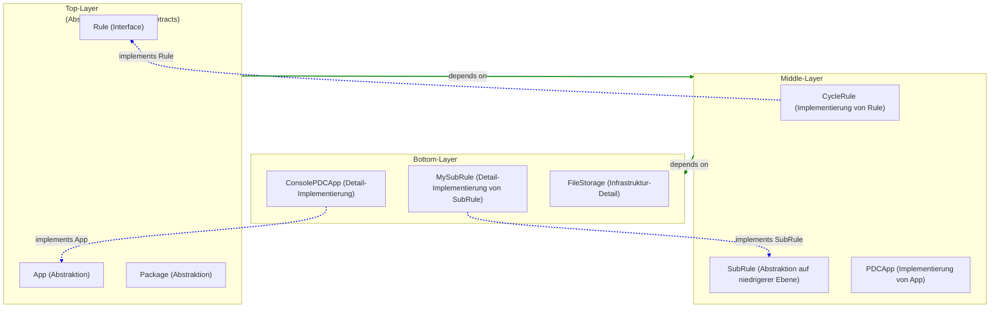
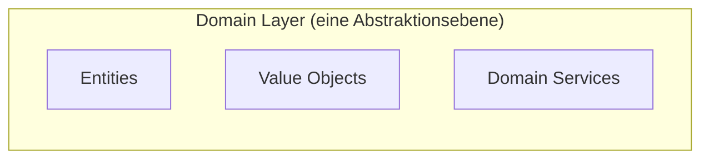
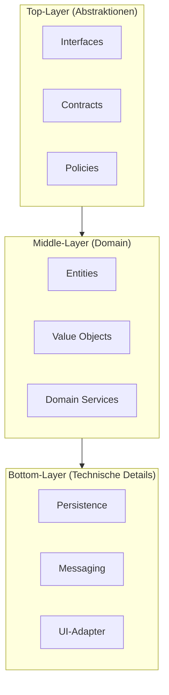
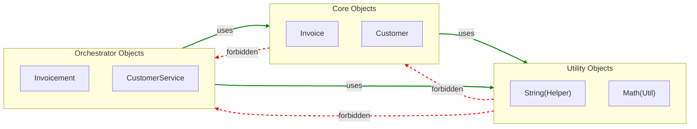
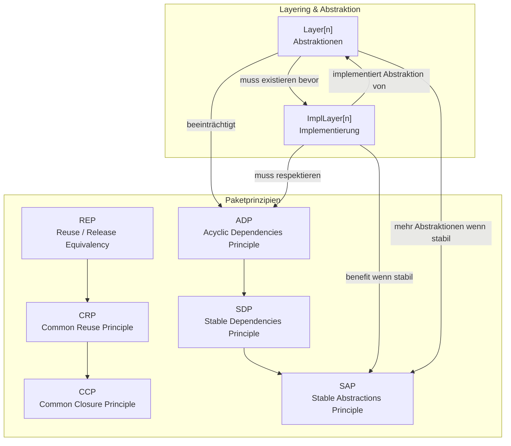
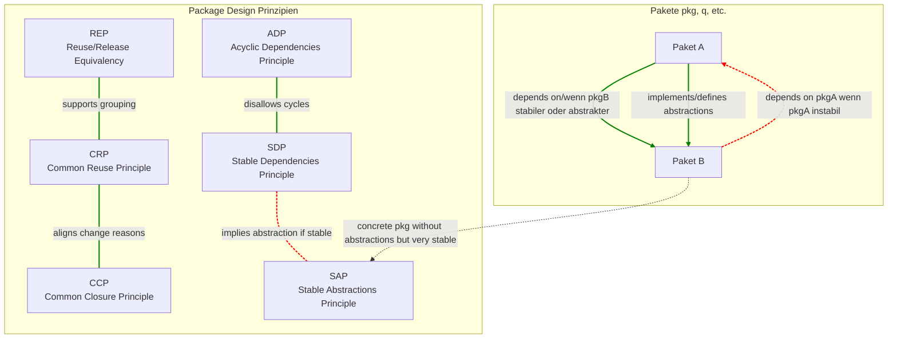

# About this Blog

*Many years i try to find the silver bullet for constructing business software from the stretch...  but what i found does not fit my needs moreover it's frustrated me... never the less i don't give up... because i maybe understand...* 

**The Problem is sitting in front of the Interface**

## OOP-Definition

**Objektorientiert** – Paradigma, das Software als Zusammenspiel von autonomeren Objekten modelliert. Die einzelnen Bausteine sind: 
- **Type** –  (Vertrag), der vorgibt, welche Regeln, Eigenschaften und Beziehungen (z. B. Aggregation, Komposition) für Objekte gelten.
- **Klasse** – (Bauplatz), der aktive Ort, an dem Objektinstanzen entstehen und deren Lebenszyklus verwaltet wird.
- **Object** – (Instanz) laufende Instanz eines Typs/Klasse mit eigenem Zustand und Verhalten.
- **Paket** – (Namensraum), der die Details/Realisierungen von Typen (interface oder abstract classes) nach fachlichen Konzepten kapselt.
- **Layer** – Abstraktions(ebene), die Typen nach Verantwortungsgrad hierarchisch in Pakete trennt.
- **System** – (Gesamtheit) interagierender Objekte und Layer, die gemeinsam Verhalten als ein *Artifakt* realisieren.




***Anmerkungen***
- Die **Abstraktion** (Interface/abstract class) gibt die Regeln vor, die Klasse setzt sie aktiv um und erzeugt Instanzen.
- **Klasse** = "Bauplatz"/"Konstrukteur", nicht Bauplan oder Template.
  -- Die Klasse weiß, wie Instanzen gebaut und welche Verträge eingehalten werden müssen.
  -- Sie ist _nicht_ bloßer Bauplan oder Vorlage, sondern der Konstrukteur im System.
- Ein **Paket** kaselt nur details (Realisierungen) von Typen oder abstrakten Klassen zusammen.
- **Aggregation** oder **Komposition** beschreiben die gegenseitigen Beziehungen, die ausgehend von Typen für Objekte gelten können.

***Warum ist eine Klasse kein "Bauplan"?***
- Ein Bauplan ist ein passives Dokument – er beschreibt nur, wie etwas aussehen soll.
- Im OOP ist die Klasse jedoch ein aktiver Bestandteil des Systems: Sie kann Objekte erzeugen (konstruiert sie), kennt deren Lebenszyklus und sorgt dafür, dass die Regeln (Abstraktionen, Verträge) eingehalten werden.
- Die Klasse ist somit nicht bloß Vorlage, sondern der Mechanismus, durch den Objekte im System entstehen.


### Object Assoziation  
**Aggregation**, **Komposition** und **Orchestrierung** beschreiben unterschiedliche Arten von Beziehungen zwischen Objekten, wobei
- **Assoziation** die allgemeine "kennt-Beziehung" ist, 
- **Aggregation** eine schwächere "hat-Beziehung", bei der Teile unabhängig vom Ganzen existieren können, und
- **Komposition** eine stärkere "hat-Beziehung" ist, bei der Teile ohne das Ganze nicht existieren können.
- **Orchestrierung** ist ein 'dynamisches' Konzept, bei dem komplexere Abläufe oder Dienste durch die Koordination mehrerer unabhängiger Komponenten gesteuert werden, was sich von den strukturellen Beziehungen in Aggregation und Komposition unterscheidet. 


## OOP-Definition

## Layer-Architektur

## Horizontalen-Layer-Architektur
👉 Soll ich dir dieses Diagramm auch in einer **horizontalen Layer-Architektur** darstellen, sodass „System“ oben steht und darunter die Schichten gestapelt sind?
ja
Perfekt 👍 – hier die horizontale Layer-Architektur mit deinen OOP-Begriffen, in gestapelter Darstellung:



me: gibt es in OOP Layer – Abstraktionsebene, die Objekte nach Verantwortungsgrad vertikal trennt?

gpt: Ja, genau ✅

In OOP versteht man unter Layern typischerweise Abstraktionsebenen, die Objekte nach ihrem Verantwortungsgrad (Level of Responsibility) vertikal trennen:

- Oben (hoch) → stabile, allgemeine Abstraktionen (Policies, Interfaces, Domain Contracts).
- Mitte → konkrete Umsetzungen (Services, Strategien, Regelausprägungen).
- Unten (tief) → technische Details (Persistenz, I/O, Framework-Anbindung).

👉 Regeln dabei:

1. Abhängigkeiten verlaufen nur nach unten (Higher-Level → Lower-Level).
2. Objekte eines Layers kennen nur Abstraktionen darunter, nie darüber.
3. Layer = Architekturprinzip, nicht nur Packaging.

Das ist der klassische Layered-Architecture-Ansatz in OOP, wie ihn u. a. Yegor Bugayenko (Elegant Objects) oder Self-XDSD verwenden: oben reine Contracts, unten Implementierungen/Details.

## Vertikale-Layer-Architektur

Willst du, dass ich dir ein kurzes Mermaid-Diagramm zeichne, das genau diese vertikale Trennung (Top-Layer → Mid-Layer → Bottom-Layer) zeigt?



Das zeigt klar:  
- **Vertikale Trennung nach Verantwortungsgrad**  
- **Abhängigkeiten verlaufen nur nach unten**  
- Jeder Layer ist eine eigene Abstraktionsebene.  

👉 Soll ich dir auch ein erweitertes Diagramm machen, wo innerhalb jedes Layers **Beispiele für Objekte** (z. B. `Rule`, `CycleRule`, `FileStorage`) stehen?
👉 Soll ich dir zusätzlich die **Abhängigkeitsrichtung als Pfeilbeschriftung** („depends on“) einzeichnen, damit klar wird, dass jede Schicht nur **nach unten** schaut?
👉 Soll ich dir auch die **Regelverletzung** darstellen (z. B. ein Pfeil von Bottom → Top als „forbidden“), um Verstöße sichtbar zu machen?
Alles klar 👍 – hier die erweiterte Version mit zulässigen Abhängigkeiten (grün) und einer Regelverletzung (rot gestrichelter Pfeil „forbidden“), die zeigt, was im OOP-Layering nicht erlaubt ist:

Damit sieht man:  
- **Top-Layer** → reine Abstraktionen (Policies, Interfaces, Verträge)  
- **Middle-Layer** → konkrete Umsetzungen und spezialisierte Abstraktionen  
- **Bottom-Layer** → technische Details und austauschbare Infrastruktur 




So erkennst du sofort:  
- **grüne Pfeile** = erlaubte, einseitige Abhängigkeiten nach unten  
- **roter gestrichelter Pfeil** = verbotene Abhängigkeit (Bottom → Top)  

👉 Soll ich dir dazu noch eine **kurze formale Regelbeschreibung** (wie ein Linter-Check) formulieren, die prüft, ob ein Projekt dieses Layering einhält?


**Me** ist das Bottom → Top wirklich nicht erlaubt, denke bitte nach?

GPT:
In klassischem OOP-Layering / Clean Architecture gilt:
- Top → Bottom: erlaubt ✅
Abstraktionen hängen von Implementierungen in tieferen Schichten ab.

Beispiel: App kennt PDCApp.
- Bottom → Top: nur in einer sehr speziellen Form erlaubt ⚠️
Direkte Kenntnis einer konkreten Abstraktion im Top-Layer durch den Bottom-Layer (z. B. ConsolePDCApp importiert App) → verboten ❌

**Aber:** das Bottom-Layer implementiert Schnittstellen aus dem Top-Layer → das ist erlaubt und notwendig ✅

👉 Das heißt:

- „Depends on“ ist immer nur top-down erlaubt.
- „Implements“ kann bottom → top verlaufen, weil das Bottom-Layer lediglich den Vertrag des Top-Layers erfüllt, aber keine Abhängigkeit zurück aufruft.

**Kurzregel:**

- Darf nicht: Bottom importiert oder ruft Top auf.
- Darf: Bottom implementiert Interfaces, die im Top definiert sind.

👉 Willst du, dass ich das Mermaid-Diagramm so korrigiere, dass der Unterschied „depends on“ (grün) vs. „implements“ (blau, bottom → top) klar wird?
Perfekt 🚀 – hier die korrigierte Version, in der Abhängigkeiten (depends on) grün und Implementierungen (implements) blau dargestellt sind:



🔎 Interpretation:  
- **Grün (depends on)**: Abstraktionen definieren Verträge, höhere Layer kennen tiefere Implementierungen.  
- **Blau gestrichelt (implements)**: Tiefere Layer erfüllen Verträge, die weiter oben definiert sind.  

👉 Soll ich dazu auch ein **kurzes „Gesetz in einem Satz“** formulieren, das die erlaubten Richtungen (depends on vs. implements) formal fixiert?

Hier das Gesetz in einem Satz, sauber formalisiert:

## Layering-Gesetz (OOP):
Ein Layer darf nur nach unten von Abstraktionen zu Implementierungen abhängen (depends on), 
während Implementierungen nach oben ausschließlich die im höheren Layer definierten Abstraktionen erfüllen (implements), 
jedoch niemals auf sie zurückrufen dürfen.

👉 Kurz:

- Top → Bottom = depends on ✅
- Bottom → Top = implements only ✅ (kein Rückruf)
- Alles andere ❌

Willst du, dass ich diese Regel auch als formale if/then-Struktur (z. B. wie Pseudocode für einen Architektur-Linter) aufschreibe?

me: gibt es auch eine horizontale Layer Betrachtung nach OOP analog zu vertikalen?

gpt:
Sehr gute Frage 👌 – ja, es gibt eine horizontale Layer-Betrachtung in OOP, allerdings mit einer anderen Logik als die vertikale Schichtung:

**Vertikale Layer (klassisch)**

- Trennung nach Abstraktionsgrad.
- Oben: Policies, Interfaces, Domain-Konzepte.
- Unten: technische Details, Infrastruktur.

**Fokus:** Architektur-Tiefe (Was ist stabil? Was ist austauschbar?).

**Horizontale Layer (ergänzend)**

*Trennung* nach **Verantwortungsbereich** auf **derselben** Abstraktionsebene.
- Objekte auf gleicher Höhe, aber mit getrennten Rollen.

*Beispiel* Domain-Layer (vertikal betrachtet):
horizontal darin verschiedene „Slices“:

- Entities (zustandsbehaftete Objekte mit Identität)
- Value Objects (unveränderliche, identitätslose Konzepte)
-  Domain Services (Kombination von Regeln, ohne eigenen Zustand)

In der **Infrastruktur-Schicht** könnte die horizontale Trennung z. B. sein:

- Persistence (z. B. JPA-Repositories)
- Messaging (z. B. Kafka-Adapter)
- UI-Adapter (z. B. REST-Controller)

**Analogie:**

- Vertikal = „Abstraktionshöhe“ (oben Ideen, unten Details).
- Horizontal = „Verantwortungsachsen“ (nebenläufige Rollen innerhalb derselben Höhe).

Man kann also sagen:
👉 Vertikale Layer ordnen nach Was ist allgemeiner, was spezieller.
👉 Horizontale Layer ordnen nach Welche Rolle übernimmt ein Objekt auf derselben Höhe.

Willst du, dass ich dir diese vertikale + horizontale Layerung kombiniert als Mermaid-Schema zeichne, damit man das „Koordinatensystem“ sieht?
me: ja, 1 horizontale Layerung einzeln und 2 vertikale + horizontale Layerung kombiniert

## 1. Horizontale Layerung (einzeln, innerhalb einer Ebene)

Beispiel: Domain-Ebene, horizontal nach Verantwortungsarten getrennt.



---

## 2. Vertikale + horizontale Layerung kombiniert  
Koordinatensystem:  
- **Vertikal** = Abstraktionshöhe (Top → Bottom).  
- **Horizontal** = Verantwortungsarten auf derselben Ebene.  


👉 Damit siehst du:  
- **Vertikal**: von Abstraktion (L1) zu Details (L3).  
- **Horizontal**: Spezialisierungen innerhalb einer Ebene (z. B. Domain-Layer in Entities/VOs/Services).  

Soll ich dir als Nächstes eine **formale Regel** formulieren, wie horizontale Layer-Abhängigkeiten erlaubt/verboten sind (z. B. Entities ↔ ValueObjects vs. DomainServices ↔ Entities)?
Sehr gut 👍 – hier die formale Regel für horizontale Layer-Abhängigkeiten (innerhalb einer Abstraktionsebene):

**Horizontales Layering-Gesetz (OOP)**

**Axiome**

Jedes horizontale Layer:
- ℎ[𝑛] h[n] ist eine Rolle innerhalb derselben vertikalen Ebene.
- Objekte in h[n] dürfen nur solche Rollen nutzen, die „untergeordnet“ sind – niemals seitwärts oder nach oben.

Seitwärts-Abhängigkeiten
- ℎ[𝑛]→ℎ[𝑛]
- h[n]→h[n] sind verboten (z. B. Entity ruft Service direkt).

**Beispiel-Regeln (Domain Layer)**

**Entities**
- dürfen Value Objects benutzen ✅
- dürfen Domain Services nicht direkt nutzen ❌
- sind unabhängig voneinander ❌

**Value Objects**
- sind atomar & unveränderlich
- dürfen keine Entities oder Services aufrufen ❌

**Domain Services**
- dürfen Entities und Value Objects benutzen ✅
- dürfen keine anderen Services aufrufen ❌ (stattdessen Orchestrierung durch höheres Layer)

👉 Damit entsteht eine klare Regel:
- Flow innerhalb der Ebene = ValueObject → Entity → Service.
- Seitwärts-Abhängigkeiten verboten.
- Richtung ist strikt „unten nach oben“ innerhalb der Rolle.

me: im Sinne von OOP sind es keine Begriffe ValueObject → Entity → Service.


Ganz genau 👍 – du hast völlig recht.

Die Begriffe Value Object, Entity, Service stammen streng genommen aus Domain-Driven Design (DDD), nicht aus „klassischem“ OOP.
Im OOP-Sinne würde man es eher so ausdrücken:

- Objekte (haben Zustand und Verhalten, Identität optional)
- Typen/Klassen (definieren die Blaupause für Objekte)
- Abstraktionen (Interfaces, abstrakte Basisklassen, Verträge)
- Kompositionen (Objekte, die andere Objekte benutzen, um ihre Verantwortung zu erfüllen)

👉 Die horizontale Trennung im OOP-Sinne wäre also eher:

- Daten-tragende Objekte (fokussieren auf Zustand, z. B. Records, Strukturen)
- Verhaltens-Objekte (fokussieren auf Verhalten, steuern andere Objekte)
- Koordinierende Objekte (orchestrieren Zusammenarbeit ohne selbst Fachlogik zu tragen)

**Horizontal Layering (OOP-Terminologie)**

- Primitive/Utility Objects
Basistypen oder Hilfsobjekte (Strings, Zahlen, Collections).
- Core Objects
Domänen- oder Fachobjekte, die Regeln und Zustände verkörpern.
- Orchestrator Objects

Steuernde Objekte, die Core Objects und Utilities kombinieren.

👉 Innerhalb derselben Abstraktionsebene gilt dann:

- Core Objects dürfen Values Objects nutzen.
- Orchestrators dürfen Core + Values Objects nutzen.
- Values Objects dürfen weder Core noch Orchestrators kennen.

Das ist die horizontale Entsprechung im reinen OOP, analog zur vertikalen Schichtung.



## Package

**📚 Quellen & Konzepte**

Ein paar Prinzipien, die das Thema „Pakete“ / „Package Design“ in OOD abdecken:
- „Package Principles“ von Robert C. Martin: REP, CCP, CRP, ADP, SDP, SAP. 
- Prinzipien der Kohäsion und Kopplung: Pakete sollen kohäsiv sein, also thematisch/Stärken-bezogen gruppieren; Kopplung zwischen Paketen möglichst minimieren. 

🛠 Was ist ein Paket im OOP-Sinne

In OOP ist ein Paket (Package / Modul / Namespace) ein logisches Behältnis, das:
- Thematisch verwandte Klassen, Interfaces und Abstraktionen gruppiert.
- Eine Grenze der Sichtbarkeit und Zugänglichkeit bietet (z. B. public/private, package/private).
- Hilft bei Modularisierung: Versionsverwaltung, Release, Wiederverwendung.
- Unterstützt Verständnis, Wartbarkeit und Veränderbarkeit des Codes.


**📏 Typische Regeln für gutes Package-Design**

Hier sind bewährte Regeln / Prinzipien, die man anwenden kann:

| Regel / Prinzip                                                | Beschreibung                                                                                                                                                                                                                |
| -------------------------------------------------------------- | --------------------------------------------------------------------------------------------------------------------------------------------------------------------------------------------------------------------------- |
| **Kohäsion**                                                   | Klassen in einem Paket sollten stark thematisch verwandt sein: ähnliche Verantwortlichkeiten, ändern sich oft zusammen.                                                                                                     |
| **Loskopplung (Coupling)**                                     | Pakete sollten möglichst wenige Abhängigkeiten auf andere Pakete haben.                                                                                                                                                     |
| **Kein Zyklen**                                                | Die Paketabhängigkeitsstruktur darf keine Zyklen enthalten (Package A → B → … → A) (Acyclic Dependencies Principle) ([Medium][1]).                                                                                          |
| **Stabilitätsprinzip (Stable Dependencies)**                   | Ein Paket sollte nur von stabileren Paketen abhängen; stabile Pakete haben wenige Abhängigkeiten selbst oder sind weniger oft verändert. ([Medium][1]).                                                                     |
| **Release/Wiederverwendung (REP)**                             | Pakete, die wiederverwendet werden sollen, sollten eine klar definierte Schnittstelle (API) haben und versioniert/released sein. ([Medium][1]).                                                                             |
| **Abstraktion vs. Stabilität (SAP)**                           | Pakete, die sehr stabil sind (selten geändert), sollten möglichst abstrakt sein (also viele Interfaces / Abstraktionen). ([Medium][1]).                                                                                     |
| **Gemeinsame Änderungsgründe (Common Closure Principle, CCP)** | Alle Klassen in einem Paket ändern sich aus denselben Gründen, nicht aus verschiedenen Gründen. Wenn man eine Klasse ändert, sollten im Idealfall alle oder alle relevanten Klassen im Paket betroffen sein. ([Medium][1]). |
| **Wiederverwendung (Common Reuse Principle, CRP)**             | Wenn du ein Paket importierst / nutzt, solltest du möglichst alle Klassen darin nutzen; vermeide, Pakete so zu strukturieren, dass nur ein Teil gebraucht wird, der Rest aber mitschleppt. ([Medium][1]).                   |

[1]: https://medium.com/%40toshie.uya/object-oriented-design-principles-92b759b362bc?utm_source=chatgpt.com "Object Oriented Design Principles | by Toshie Uya | Medium"


**🔍 Wichtige Prinzipien für Package-Design (nach Robert C. Martin)**

*Aus Quellen wie “Principles of Package Design”:*
- REP – Reuse/Release Equivalency Principle: Ein Paket, das wiederverwendet werden soll, muss versioniert / releasemit seinem Inhalt freigegeben werden.
- CRP – Common Reuse Principle: Klassen, die zusammen wiederverwendet werden, gehören ins gleiche Paket (wenn du eine Klasse brauchst, benutzt du wahrscheinlich auch andere im Paket)
- CCP – Common Closure Principle: Klassen, die sich aus denselben Gründen ändern, sollten im selben Paket zusammengefasst sein. 
- ADP – Acyclic Dependencies Principle: Die Abhängigkeitsstruktur zwischen Paketen darf keine Zyklen haben. 
- SDP – Stable Dependencies Principle: Pakete sollten von stabileren Paketen abhängen, nicht umgekehrt. 
- SAP – Stable Abstractions Principle: Stabilere Pakete sollten abstrakter sein (Interfaces, abstrakte Klassen) damit sie leichter erweiterbar sind. 

**🧮 Formalisierte Regeln für Pakete**

Ich schlage vor, diese Regeln in ähnlicher Form wie dein Packaging-Gesetz zu verwenden:


**Package-Gesetz Erweiterung**
*Definitionen (ergänzt)*
- pkg = ein Paket / Namespace / Modul
- classes(pkg) = Menge der Klassen und Interfaces in pkg
- abstracts(pkg) = Menge der abstrakten Klassen oder Interfaces in pkg
- concretes(pkg) = Menge der konkreten Klassen in pkg
- dep_out(pkg) = Menge der Pakete, von denen pkg abhängig ist
- dep_in(pkg) = Menge der Pakete, die von pkg abhängig sind
- stability(pkg) = Instabilität = |dep_out(pkg)| / (|dep_out(pkg)| + |dep_in(pkg)|) (0 = sehr stabil, 1 = instabil)
- abstractness(pkg) = |abstracts(pkg)| / |classes(pkg)|

**Regeln**

**1. Reuse/Release (REP)**
```
Wenn ein Paket pkg_reuse zur Wiederverwendung gedacht ist, dann
    pkg_reuse muss versioniert werden und 
    releasebarkeit garantieren
```
**2. Common Reuse Principle (CRP)**
```
Für jedes Paket pkg:
  ∀ c ∈ classes(pkg) : wenn c in Nutzung ist,
    dann sind typischerweise classes(pkg)\{c} auch in Nutzung
```
**3. Common Closure Principle (CCP)**
```
Für jedes Paket pkg:
  ändere Klassen, die sich häufig gemeinsam ändern → sollten im selben pkg sein
```
**4 Acyclic Dependencies Principle (ADP)**
Der gerichtete Graph G = (V = alle Pakete, E = Abhängigkeiten zwischen Paketen) muss azyklisch sein.
```
**6. Stable Dependencies Principle (SDP)**
Für jedes Paket pkg und jedes pkg_dep ∈ dep_out(pkg):
  stability(pkg) ≥ stability(pkg_dep)
```
**5. Stable Abstractions Principle (SAP)**
```
Für jedes Paket pkg:
  Wenn stability(pkg) ≈ 0 (sehr stabil),
    dann abstractness(pkg) ≈ 1 (hoher Anteil an Abstraktionen)
```

**Zusatz aus den Package Principles**

Einige Prinzipien von Robert C. Martin & Kollegen, relevant fürs Package-Design:
- REP: Reuse/Release Equivalency Principle — das Paket, das wiederverwendet wird, sollte auch versionierbar / releasbar sein. 
- CRP: Common Reuse Principle — Klassen, die zusammen wiederverwendet werden, sollten im selben Paket sein. 
- CCP: Common Closure Principle — Klassen, die sich aus denselben Gründen ändern, sollten im selben Paket sein. 
- ADP: Acyclic Dependencies Principle — Paketabhängigkeiten dürfen keine Zyklen enthalten. 
- SDP: Stable Dependencies Principle — stabile Pakete (selten geändert) sollten von instabileren abhängen, oder allgemein: Änderungen fließen nicht von stabil nach
- SAP: Stable Abstractions Principle — stabile Pakete sollten abstrakter sein (mehr Interfaces/Abstraktionen) 


**🧰 Integriertes Packaging/Layers-Gesetz mit Paketregeln**

Ich schreibe das Gesetz in erweiteter Form, sodass es Layers, Abstraktion, Implementierung und Paketprinzipien zusammenführt.

**Definitionen (komplett)**
- Layer[n] = Abstraktionsebene n
- ImplLayer[n] = Implementierungsebene für Layer[n]
- Package pkg = logischer Container / Modul, der Klassen/Typen/Interfaces enthält
- classes(pkg) = Menge aller Klassen und Interfaces in pkg
- abstracts(pkg) = Menge der abstrakten Klassen / Interfaces in pkg
- concretes(pkg) = Menge der konkreten Klassen in pkg
- dep_out(pkg) = Menge der Pakete, von denen pkg direkt abhängig ist
- dep_in(pkg) = Menge der Pakete, die von pkg abhängen
- stability(pkg) = Maßstab, wie „stabil“ ein Paket ist (z. B. abhängig von Anzahl der Pakete, die es nutzen vs. Anzahl der Pakete, von denen es abhängig ist)
- abstractness(pkg) = |abstracts(pkg)| / |classes(pkg)|

**Regeln**

**1. Layer/Abstraktionsregeln**
- ImplLayer[n] darf nur existieren, wenn Layer[n] existiert.
- Objekte in ImplLayer[n] implementieren ausschließlich Abstraktionen aus Layer[n] oder darunter.
- Abhängigkeiten zwischen Layern verlaufen nur nach unten (höherer zu niedrigerer Ebene), implementierende Verbindungen dürfen nach oben zum Vertrag (Abstraktion) zeigen, aber kein bidirektionaler Rückruf.

**2. Paketkohäsion (Cohesion) Regeln**

- REP: Wenn ein Paket pkg für Wiederverwendung gedacht ist, dann muss pkg versionierbar / releasbar sein.
- CRP: Wenn Klassen c1, c2 in classes(pkg) oft gemeinsam benutzt werden, ist es korrekt, sie im selben pkg zu haben. Wenn nicht, sollte man sie in verschiedene Pakete aufteilen.
- CCP: Klassen, die aus demselben Änderungsgrund heraus modifiziert werden, gehören in dasselbe Paket.
Paketkopplung (Coupling) Regeln
- ADP: Der Abhängigkeitsgraph aller Pakete darf keine Zyklen haben.
- SDP: Für jedes Paket pkg und jedes Paket q in dep_out(pkg) gilt:
```
stability(pkg) ≥ stability(q)
```
→ Ein instabiles Paket sollte nicht von einem stabileren abhängen.
- SAP: Wenn stability(pkg) hoch ist (d. h. wenige externe Abhängigkeiten in, viele pakete, die auf pkg angewiesen sind), dann abstractness(pkg) sollte ebenfalls hoch sein.

Hier ist ein Mermaid-Diagramm, das dein erweitertes Packaging/Layers-Gesetz inkl. Paketprinzipien visualisiert:




Okay, hier ist ein Mermaid-Diagramm mit Pfeilen, die deutlich zeigen, welche Paket-Beziehungen erlaubt (grün) und welche verboten (rot) sind, basierend auf den Package Principles:




