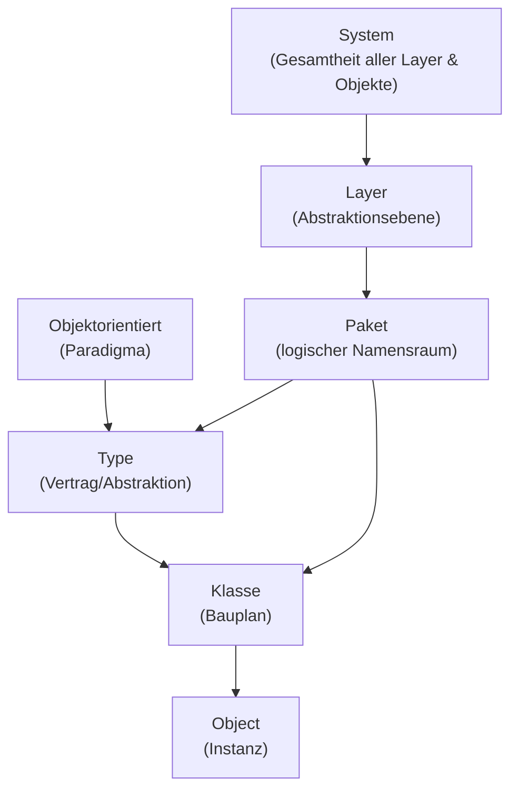
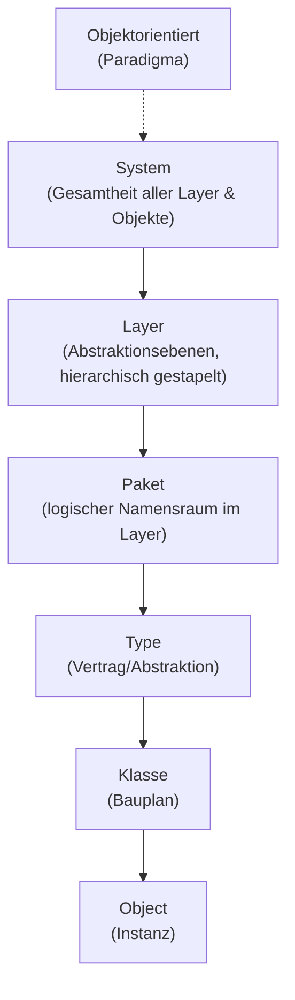
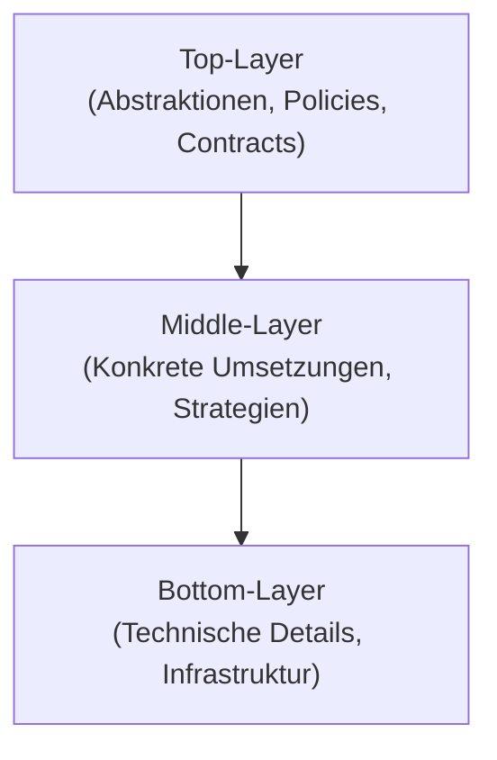

# About this Blog

Many years i try to find the silver bullet for constructing business software from the stretch...  but what i found does not fit my needs moreover it's frustrated me... never the less i don't give up... because i maybe understand...

Then a ask Chat GPT: 21.09.2025
https://chatgpt.com/

Hi GPT, was bedeutet Folgendes, im Sinne von OOP, antworte kurz und pregnant:
1. Objektorientiert?
2. Type im sine von Objektorientiert
3. Klasse im Sinne von Objektorientiert
4. Object im Sinne von Objektorientiert
5. Paket im Sinne von Objektorientiert
6. Layer im Sinne von Objektorientiert
7. System im Sinne von Objektorientiert

Klar – hier die kurze, prägnante OOP-Definition:

Objektorientiert – Paradigma, das Software als Zusammenspiel autonomer Objekte modelliert.
Type – Vertrag, der die Form und das Verhalten von Objekten beschreibt (Interface/Abstraktion).
Klasse – Bauplan, der festlegt, wie ein Typ konkret implementiert wird.
Object – laufende Instanz eines Typs/Klasse mit eigenem Zustand und Verhalten.
Paket – logischer Namensraum, der zusammengehörige Typen/Objekte strukturiert.
Layer – Abstraktionsebene, die Objekte nach Verantwortungsgrad hierarchisch trennt.
System – Gesamtheit interagierender Objekte und Layer, die gemeinsam Verhalten realisieren.

Damit siehst du:  
- **Objektorientiert** als Wurzel  
- **Type → Klasse → Object** als Kernkette  
- **Pakete** fassen Typen/Klassen zusammen  
- **Layer** ordnen Pakete hierarchisch  
- **System** kapselt alles.

hier ein Schematisches OOP-Bild mit deinen Begriffen

👉 Soll ich dir dieses Diagramm auch in einer **horizontalen Layer-Architektur** darstellen, sodass „System“ oben steht und darunter die Schichten gestapelt sind?
ja
Perfekt 👍 – hier die horizontale Layer-Architektur mit deinen OOP-Begriffen, in gestapelter Darstellung:

me: gibt es in OOP Layer – Abstraktionsebene, die Objekte nach Verantwortungsgrad vertikal trennt?

gpt: Ja, genau ✅

In OOP versteht man unter Layern typischerweise Abstraktionsebenen, die Objekte nach ihrem Verantwortungsgrad (Level of Responsibility) vertikal trennen:

- Oben (hoch) → stabile, allgemeine Abstraktionen (Policies, Interfaces, Domain Contracts).
- Mitte → konkrete Umsetzungen (Services, Strategien, Regelausprägungen).
- Unten (tief) → technische Details (Persistenz, I/O, Framework-Anbindung).

👉 Regeln dabei:

1. Abhängigkeiten verlaufen nur nach unten (Higher-Level → Lower-Level).
2. Objekte eines Layers kennen nur Abstraktionen darunter, nie darüber.
3. Layer = Architekturprinzip, nicht nur Packaging.

Das ist der klassische Layered-Architecture-Ansatz in OOP, wie ihn u. a. Yegor Bugayenko (Elegant Objects) oder Self-XDSD verwenden: oben reine Contracts, unten Implementierungen/Details.

Willst du, dass ich dir ein kurzes Mermaid-Diagramm zeichne, das genau diese vertikale Trennung (Top-Layer → Mid-Layer → Bottom-Layer) zeigt?

Das zeigt klar:  
- **Vertikale Trennung nach Verantwortungsgrad**  
- **Abhängigkeiten verlaufen nur nach unten**  
- Jeder Layer ist eine eigene Abstraktionsebene.  

👉 Soll ich dir auch ein erweitertes Diagramm machen, wo innerhalb jedes Layers **Beispiele für Objekte** (z. B. `Rule`, `CycleRule`, `FileStorage`) stehen?
