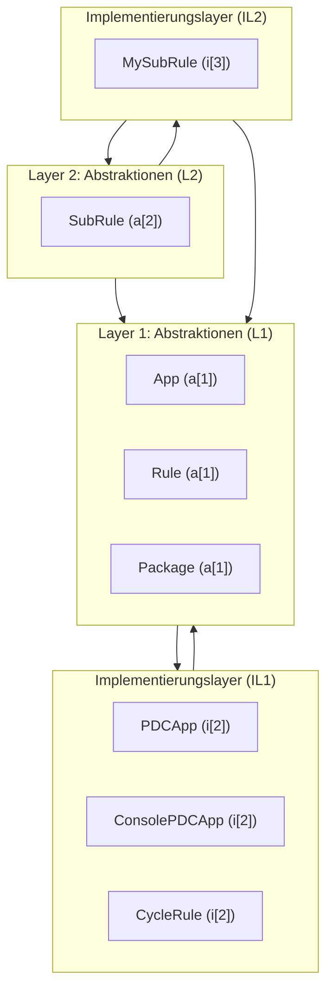

# Formales Layering-Gesetz
## Definitionen
L[n] = Layer der Abstraktionsebene n
(enthält ausschließlich Abstraktionen dieser Ebene, z. B. Interfaces, Policies, Verträge, Domänenbegriffe).

IL[n] = Implementierungslayer zu L[n]
(enthält ausschließlich Objekte, die Abstraktionen aus L[n] konkretisieren oder spezialisieren).
```
Namespace = com.company.<app> = globaler Einstiegspunkt der Architektur (Top-Level).
```
**Axiome**
Existenz von Layers
Jeder Layer L[n] darf nur existieren, wenn er eine wohldefinierte Abstraktionsebene beschreibt.
```
∃ L[n] : L[n] ∈ {Namespace, Namespace.*}
```
Existenz von Implementierungslayern
Ein Implementierungslayer IL[n] darf nur existieren, wenn eine gleichnamige Abstraktion L[n] existiert.
```
∃ L[n] ⇒ ∃ IL[n]
```
Inhaltsregel für Implementierungslayer
Alle Objekte in IL[n] müssen Implementierungen oder Spezialisierungen von L[n] sein.
```
∀ x ∈ IL[n] : x ⊑ L[n]
```
Abhängigkeitsregel
L[n] darf nur Abhängigkeiten zu L[n-1] oder darunter haben.
IL[n] darf nur Abhängigkeiten zu L[n] oder darunter haben.
Formal:
```
L[n] → L[n-1]
IL[n] → {L[n], L[n-1], …}
```
## Implikationen

Layers sind stabil, Implementierungslayer sind variabel
L[n] beschreibt das „Was“ (Vertrag).
IL[n] beschreibt das „Wie“ (Umsetzung).

Hierarchie
Abstraktionen L[n] bilden die Architektur-Hierarchie.
Implementierungslayer IL[n] folgen strikt dieser Hierarchie und dürfen nicht „hochklettern“.

Kein Wildwuchs
Es gibt keine „freien“ Implementierungslayer ohne dazugehörige Abstraktion.
Jede Implementierung ist eindeutig rückführbar auf ihre Abstraktion.

## Diagramm Layering-Gesetz
Beispielabbildung (angepasst an das Paket Beispiel)
```
L1: App, Rule, Package
IL1: app/, rule/
L2: SubRule
IL2: subrule/
L3: (keine weiteren Abstraktionen)
IL3: MySubRule
```

Das Mermaid-Diagramm zum Layering-Gesetz, visualisiert als Schichtenmodell (L[n] = Abstraktionsebene, IL[n] = Implementierungsebene).

👉 Das bedeutet: Jedes a[n] = ein Layer, jedes p[n] = das dazugehörige Implementierungslayer.
So wird dein Packaging-Modell zu einem strengen Layer-Modell im objektorientierten Sinn.


