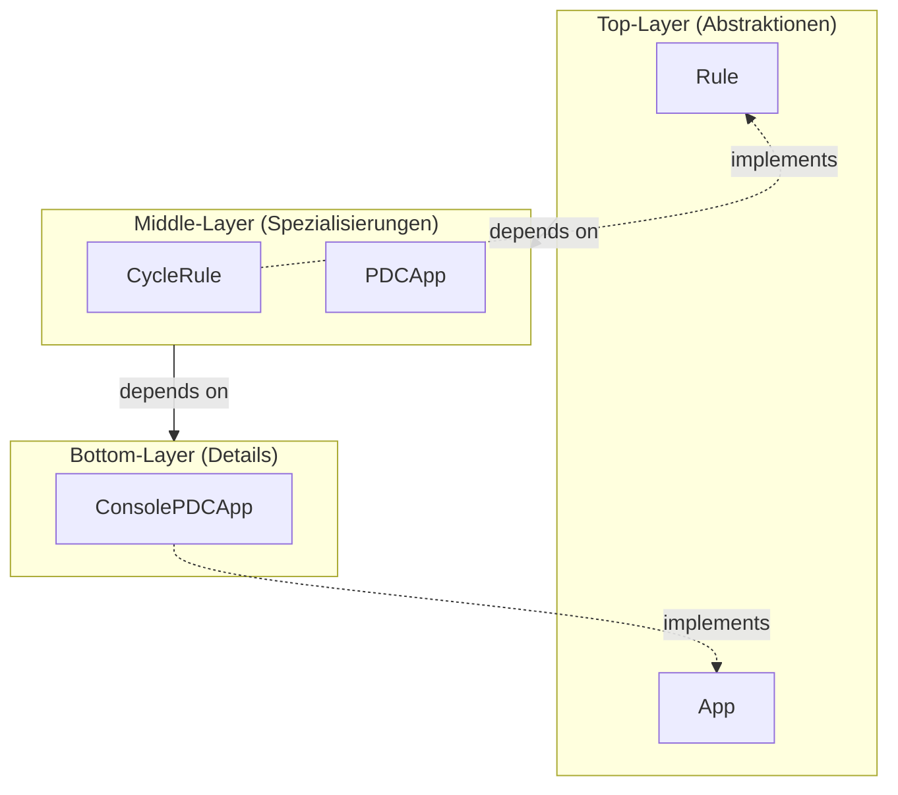
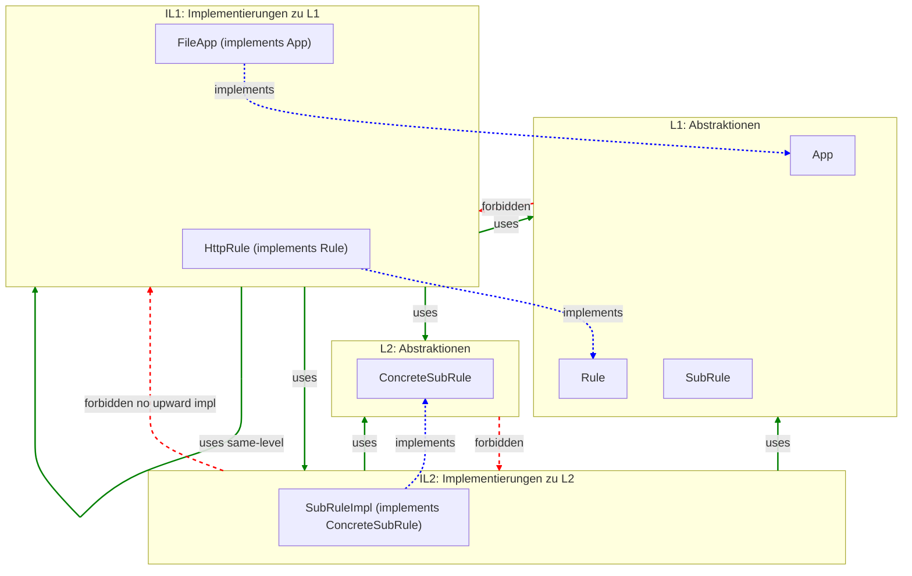
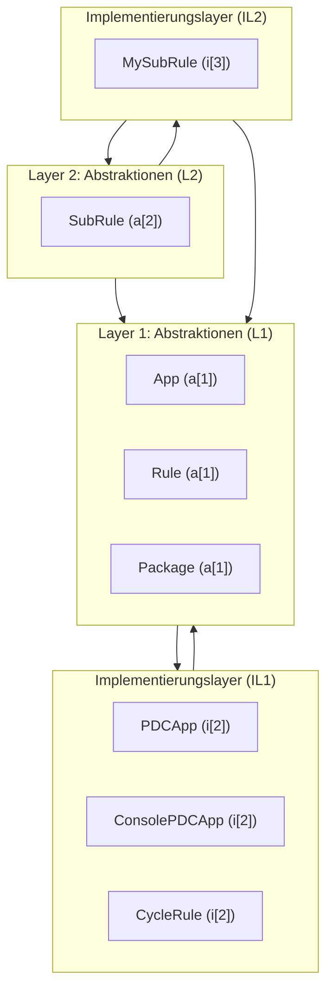
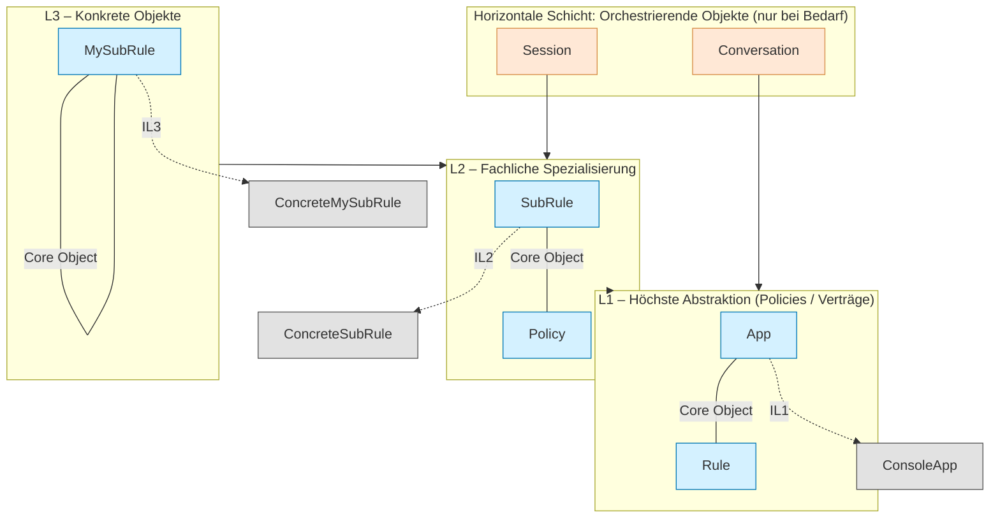
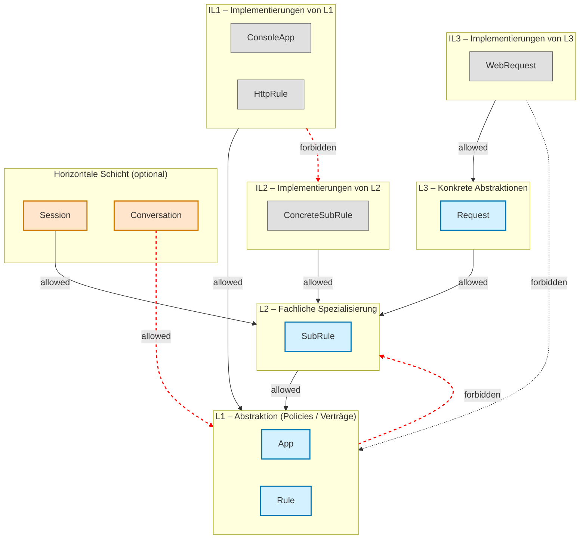
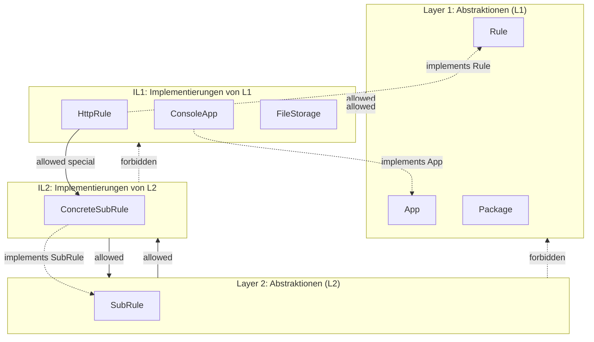

# 1. Layer-OOP

Objektorientierte Systeme bestehen aus Objekten, die reale Dinge oder Vorgänge repräsentieren.  
Ein Layer beschreibt dabei **nicht technische Schichten**, sondern **Abstraktionsebenen und Verantwortungsbereiche zwischen Objekten**.

---

## 1.2 Vertikale Layer (Abstraktionshöhe)

Vertikale Schichtung 'L' trennt Objekte nach ihrem **Abstraktionsgrad** 'n':

-  **Oben:** Allgemeine Regeln, Verträge, Begriffe (stabile Abstraktionen) -  L[n]
-  **Mitte:** Konkretisierungen dieser Regeln -  IL[n + 1]
-  **Unten:** Technische Details und austauschbare Mittel - IL[n + 2]



---

## 1.3 Horizontale Layer (Verantwortungsarten auf gleicher Ebene)

Innerhalb **derselben Abstraktionsebene** dürfen Objekte **unterschiedliche Rollen** haben.  
Diese Rollen folgen **strikten Abhängigkeitsregeln**:

| Layer | Bedeutung | Darf benutzen | Darf nicht benutzen |
|--------|-----------|----------------|---------------------|
| Value Objects | Tragen Daten oder einfache Operationen | – | Core, Orchestrators |
| Core Objects | Repräsentieren stabile Konzepte/Realitäten | Value | Orchestrators |
| Orchestrating Objects | Reale Vorgänge / Abläufe | Core + Value | (keine Abhängigkeit nach oben) |

### Beispiel (OOP-konform benannt)


---

## 1.4 Zusammenhänge & Zusammenfassung

- **Vertikal ordnet nach Abstraktion (Was ist allgemeiner vs. spezieller?).**
- **Horizontal ordnet nach Verantwortung (Welche Rolle übernimmt ein Objekt auf derselben Höhe?).**

✅ **Merksatz:**

> *Vertikale* Layer trennen **Ideen von Details**.  
> *Horizontale* Layer trennen **Zustände von Abläufen**.  

## OOP-Layering-Gesetz (Implementierungsabhängigkeiten)

| Beziehung                                   | Erlaubt? | Bedingung                                                                                  |
| ------------------------------------------- | -------- | ------------------------------------------------------------------------------------------ |
| **IL[n] → L[n]**                            | ✅        | Implementierung kennt ihre eigene Abstraktion                                              |
| **IL[n] → L[n-1] oder L[n-2] ...**          | ✅        | Implementierung darf höhere Abstraktionen (nach oben) verwenden                            |
| **IL[n] → IL[n] (Seitlich, gleiche Ebene)** | ✅        | Solange **keine zyklische Abhängigkeit** entsteht                                          |
| **IL[n] → IL[m] (m > n, nach unten)**       | ✅        | Implementierung darf konkrete Implementierung tieferer Ebene direkt instanziieren / nutzen |
| **IL[n] → IL[m] (m < n, nach oben)**        | ❌        | Keine Abhängigkeit von Detail zu höher liegendem Detail                                    |
| **L[n] → IL[n] oder IL[m]**                 | ❌        | Abstraktionen kennen niemals Implementierungen                                             |


**Kurzform:**
- Abstraktionen dürfen niemals Implementierungen kennen.
- Implementierungen dürfen beliebig nach unten und seitlich greifen (ohne Zyklen) – aber niemals nach oben.




# Formales Layering-Gesetz
## Definitionen
L[n] = Layer der Abstraktionsebene n
(enthält ausschließlich Abstraktionen dieser Ebene, z. B. Interfaces, Policies, Verträge, Domänenbegriffe).

IL[n] = Implementierungslayer zu L[n]
(enthält ausschließlich Objekte, die Abstraktionen aus L[n] konkretisieren oder spezialisieren).
```
Namespace = com.company.<app> = globaler Einstiegspunkt der Architektur (Top-Level).
```
**Axiome**
Existenz von Layers
Jeder Layer L[n] darf nur existieren, wenn er eine wohldefinierte Abstraktionsebene beschreibt.
```
∃ L[n] : L[n] ∈ {Namespace, Namespace.*}
```
Existenz von Implementierungslayern
Ein Implementierungslayer IL[n] darf nur existieren, wenn eine gleichnamige Abstraktion L[n] existiert.
```
∃ L[n] ⇒ ∃ IL[n]
```
Inhaltsregel für Implementierungslayer
Alle Objekte in IL[n] müssen Implementierungen oder Spezialisierungen von L[n] sein.
```
∀ x ∈ IL[n] : x ⊑ L[n]
```
Abhängigkeitsregel
L[n] darf nur Abhängigkeiten zu L[n-1] oder darunter haben.
IL[n] darf nur Abhängigkeiten zu L[n] oder darunter haben.
Formal:
```
L[n] → L[n-1]
IL[n] → {L[n], L[n-1], …}
```
## Implikationen

Layers sind stabil, Implementierungslayer sind variabel
L[n] beschreibt das „Was“ (Vertrag).
IL[n] beschreibt das „Wie“ (Umsetzung).

Hierarchie
Abstraktionen L[n] bilden die Architektur-Hierarchie.
Implementierungslayer IL[n] folgen strikt dieser Hierarchie und dürfen nicht „hochklettern“.

Kein Wildwuchs
Es gibt keine „freien“ Implementierungslayer ohne dazugehörige Abstraktion.
Jede Implementierung ist eindeutig rückführbar auf ihre Abstraktion.

## Diagramm Layering-Gesetz
Beispielabbildung (angepasst an das Paket Beispiel)
```
L1: App, Rule, Package
IL1: app/, rule/
L2: SubRule
IL2: subrule/
L3: (keine weiteren Abstraktionen)
IL3: MySubRule
```




## Kombiniertes Vertikal + Horizontal Layering (3D-Sicht)



| Ebene                          | Bedeutung                               | Farbe                      |
| ------------------------------ | --------------------------------------- | -------------------------- |
| **Abstraktion (L1–L3)**        | Verträge / Policies                     | 🔵 Blau                    |
| **Implementierung (IL1–IL3)**  | Konkrete Ausprägungen                   | ⚪ Grau                     |
| **Horizontale Orchestratoren** | rein koordinierend (falls unvermeidbar) | 🟠 Orange                  |
| **Verbotene Abhängigkeit**     | Darf nicht passieren                    | 🔴 Rote gestrichelte Linie |



| Farbe / Stil              | Bedeutung                                        |
| ------------------------- | ------------------------------------------------ |
| **Grün (normaler Pfeil)** | Erlaubte Abhängigkeit (`depends on`)             |
| **Blau gestrichelt**      | Implementierung / Spezialisierung (`implements`) |
| **Rot gestrichelt**       | Verbotene Abhängigkeit                           |



