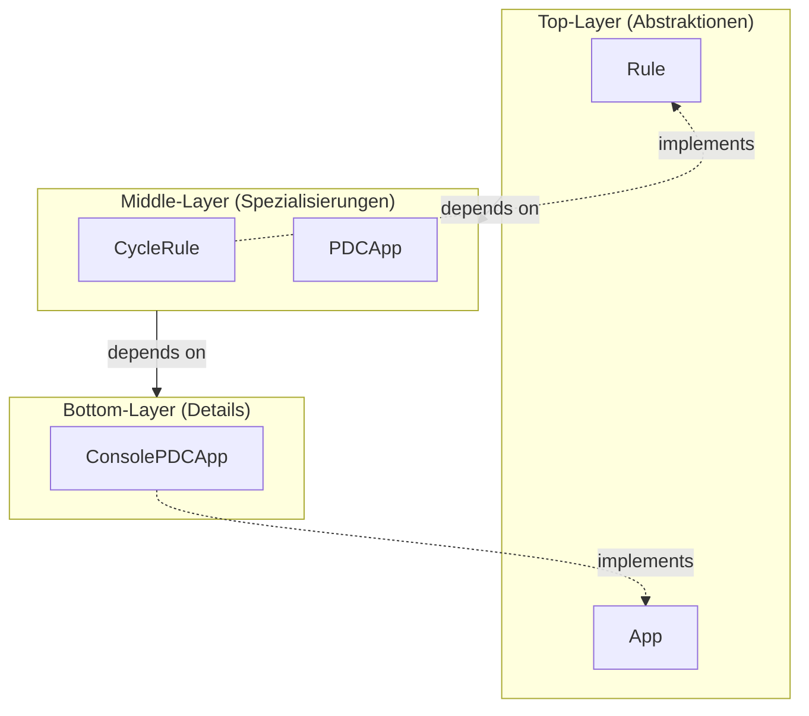
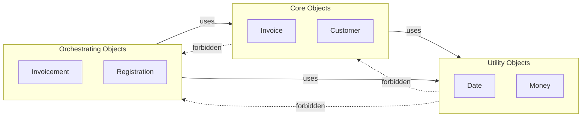
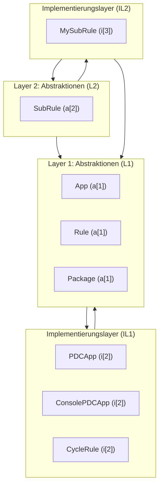
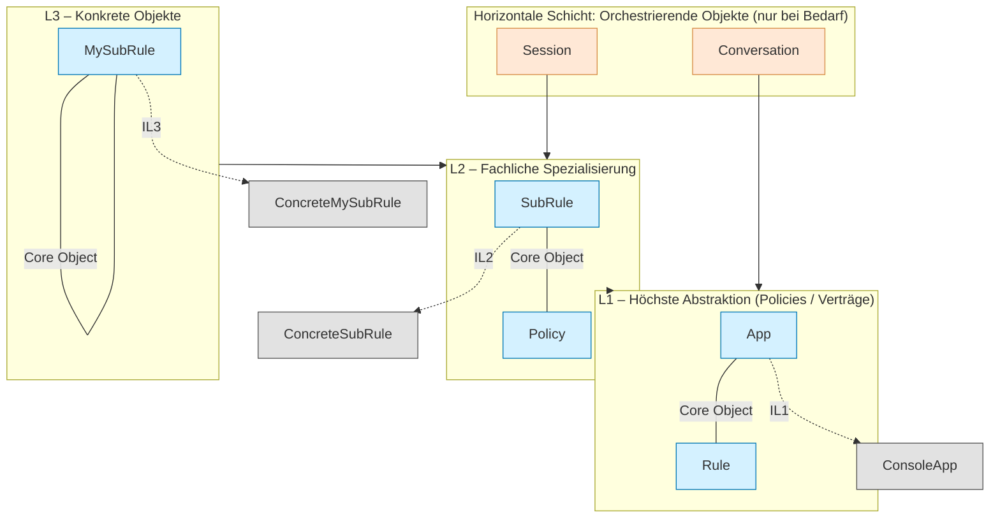

# 1. Layer-OOP

Objektorientierte Systeme bestehen aus Objekten, die reale Dinge oder Vorgänge repräsentieren.  
Ein Layer beschreibt dabei **nicht technische Schichten**, sondern **Abstraktionsebenen und Verantwortungsbereiche zwischen Objekten**.

---

## 1.2 Vertikale Layer (Abstraktionshöhe)

Vertikale Schichtung trennt Objekte nach ihrem **Abstraktionsgrad**:

- **Oben:** Allgemeine Regeln, Verträge, Begriffe (stabile Abstraktionen)
- **Mitte:** Konkretisierungen dieser Regeln
- **Unten:** Technische Details und austauschbare Mittel



---

## 1.3 Horizontale Layer (Verantwortungsarten auf gleicher Ebene)

Innerhalb **derselben Abstraktionsebene** dürfen Objekte **unterschiedliche Rollen** haben.  
Diese Rollen folgen **strikten Abhängigkeitsregeln**:

| Layer | Bedeutung | Darf benutzen | Darf nicht benutzen |
|--------|-----------|----------------|---------------------|
| Utility Objects | Tragen Daten oder einfache Operationen | – | Core, Orchestrators |
| Core Objects | Repräsentieren stabile Konzepte/Realitäten | Utilities | Orchestrators |
| Orchestrating Objects | Reale Vorgänge / Abläufe | Core + Utilities | (keine Abhängigkeit nach oben) |

### Beispiel (OOP-konform benannt)



---

## 1.4 Zusammenhänge & Zusammenfassung

- **Vertikal ordnet nach Abstraktion (Was ist allgemeiner vs. spezieller?).**
- **Horizontal ordnet nach Verantwortung (Welche Rolle übernimmt ein Objekt auf derselben Höhe?).**
- **Alle Objekte müssen reale Dinge oder Vorgänge repräsentieren.**
- **„Service“, „Manager“, „Controller“ sind verboten — außer sie benennen echte Rollen.**

✅ **Merksatz:**

> *Vertikale Layer trennen **Ideen von Details**.  
> Horizontale Layer trennen **Zustände von Abläufen**.  
> Nur reale Dinge dürfen als Objekte existieren.*


# Formales Layering-Gesetz
## Definitionen
L[n] = Layer der Abstraktionsebene n
(enthält ausschließlich Abstraktionen dieser Ebene, z. B. Interfaces, Policies, Verträge, Domänenbegriffe).

IL[n] = Implementierungslayer zu L[n]
(enthält ausschließlich Objekte, die Abstraktionen aus L[n] konkretisieren oder spezialisieren).
```
Namespace = com.company.<app> = globaler Einstiegspunkt der Architektur (Top-Level).
```
**Axiome**
Existenz von Layers
Jeder Layer L[n] darf nur existieren, wenn er eine wohldefinierte Abstraktionsebene beschreibt.
```
∃ L[n] : L[n] ∈ {Namespace, Namespace.*}
```
Existenz von Implementierungslayern
Ein Implementierungslayer IL[n] darf nur existieren, wenn eine gleichnamige Abstraktion L[n] existiert.
```
∃ L[n] ⇒ ∃ IL[n]
```
Inhaltsregel für Implementierungslayer
Alle Objekte in IL[n] müssen Implementierungen oder Spezialisierungen von L[n] sein.
```
∀ x ∈ IL[n] : x ⊑ L[n]
```
Abhängigkeitsregel
L[n] darf nur Abhängigkeiten zu L[n-1] oder darunter haben.
IL[n] darf nur Abhängigkeiten zu L[n] oder darunter haben.
Formal:
```
L[n] → L[n-1]
IL[n] → {L[n], L[n-1], …}
```
## Implikationen

Layers sind stabil, Implementierungslayer sind variabel
L[n] beschreibt das „Was“ (Vertrag).
IL[n] beschreibt das „Wie“ (Umsetzung).

Hierarchie
Abstraktionen L[n] bilden die Architektur-Hierarchie.
Implementierungslayer IL[n] folgen strikt dieser Hierarchie und dürfen nicht „hochklettern“.

Kein Wildwuchs
Es gibt keine „freien“ Implementierungslayer ohne dazugehörige Abstraktion.
Jede Implementierung ist eindeutig rückführbar auf ihre Abstraktion.

## Diagramm Layering-Gesetz
Beispielabbildung (angepasst an das Paket Beispiel)
```
L1: App, Rule, Package
IL1: app/, rule/
L2: SubRule
IL2: subrule/
L3: (keine weiteren Abstraktionen)
IL3: MySubRule
```




## Kombiniertes Vertikal + Horizontal Layering (3D-Sicht)


