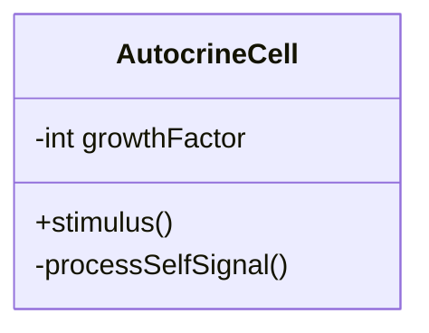
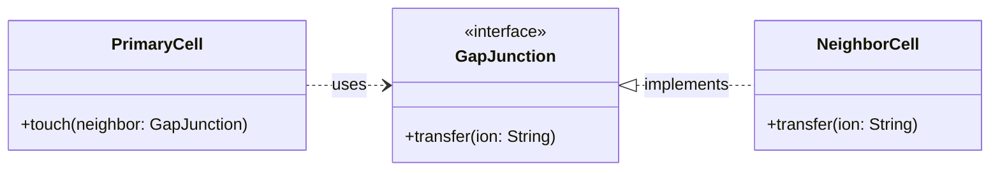
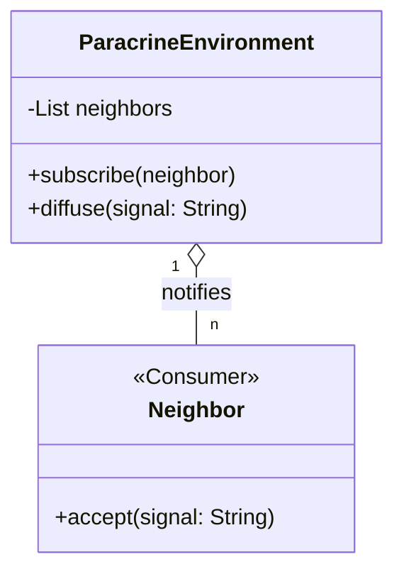
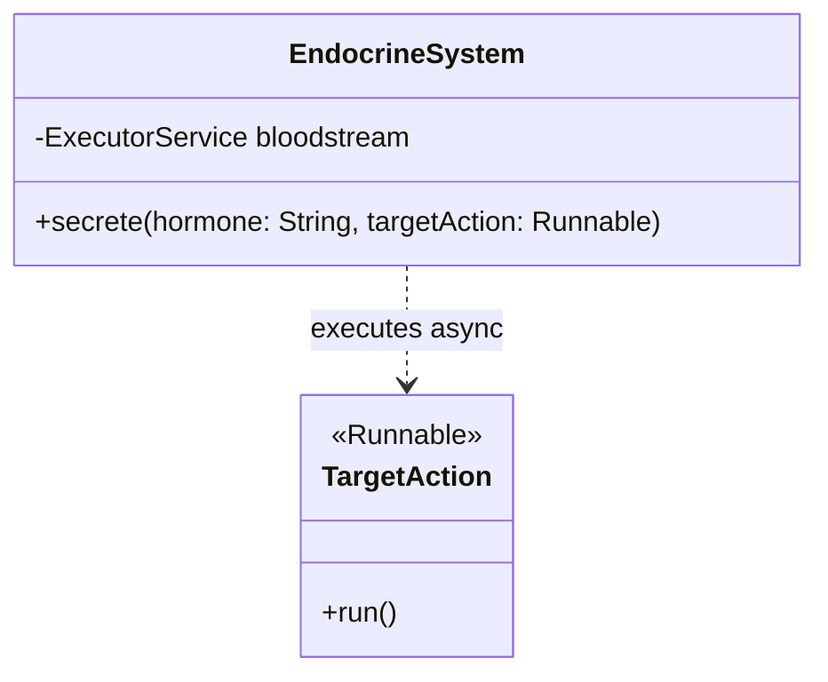
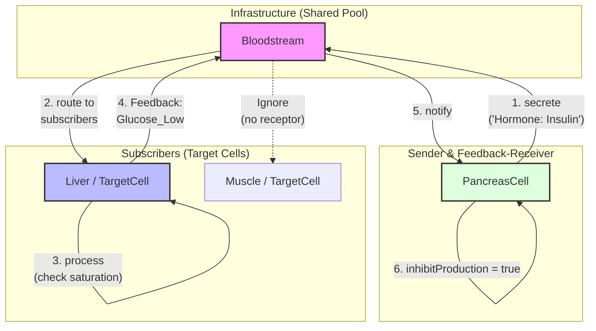
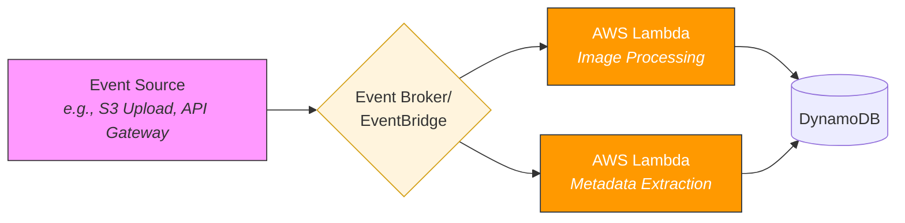

# **Object-Oriented Programming - “the Nature is the Key…”**
> Did you know that modern Object-Oriented Programming (OOP) has its roots not in mathematics, but in biology?
## **1. Introduction: Nature as a Teacher**

Significant innovations in bionics – from Velcro to artificial neural networks – impressively illustrate how technology learns from nature. In the same way, Dr. Alan Kay, one of the pioneers of object-oriented programming (OOP) and creator of Smalltalk, was significantly inspired by cell biology. In particular, the autonomy of individual cells served as a model for him to define the conceptual pillars of OOP. Alan Kay once said that the best way to understand OOP is to read *[Molecular Biology of the Cell](https://www.thriftbooks.com/w/molecular-biology-of-the-cell_keith-roberts_bruce-alberts/248824/#edition=1769535&idiq=4179002)*.


Kay recognized that the way cells in an organism communicate with each other represents a perfect model for the organization of software. Interestingly, he later expressed his dissatisfaction with the term "object orientation" he had chosen because, in his view, it neglected the core aspect of **messaging**.

In 2003, Alan Kay gave the following definition of object-oriented programming:
> "OOP to me means only messaging, local retention and protection and hiding of state-process, and extreme late-binding of all things."

This definition calls for a radical rethink: OOP focuses on autonomous units interacting via messages rather than mere class hierarchies. In languages like C++ or Java, however, this vision gave way to a reality that Kay criticized as "syntactic sugar" for synchronous function calls. This criticism aims at the fact that synchronous calls force tight temporal coupling, while true messaging promotes temporal and spatial decoupling (asynchronicity). In this process, true late binding is lost, as receivers are often already fixed at compile time. In addition, objects often violate encapsulation by disclosing their state, while blocking interactions make concurrency seem like a laboriously added foreign body.

## **2. How it works: Cells and Cell Communication**

To understand the analogy, we must first look at how biological cells function and communicate with each other.

### **The Cell as an Autonomous Unit**

A cell is the smallest living unit of an organism. It possesses:

* A **cell membrane** that separates the interior from the exterior and controls what is allowed in and out.  
* An **internal state** (cytoplasm, organelles, DNA) that is protected from direct external access.  
* **Receptors** on its surface that can receive specific signals.  
* The ability to **process** received signals and to carry out corresponding reactions.

Importantly, no cell has direct access to the interior of another cell. All interactions take place via defined communication interfaces.

### **Signal Transmission Strategies**

In multicellular organisms, there are four basic types of signal transmission, which differ primarily by the distance a signal must travel:

1. **Autocrine signaling:** A cell sends signals to itself to regulate its own state.  
2. **Direct contact:** Cells exchange signals via physical channels (gap junctions) directly between their membranes.  
3. **Paracrine signaling:** Communication with immediate neighbor cells (local diffusion).  
4. **Endocrine signaling:** Signals (hormones) are sent over long distances to distant organs via the blood system.

### **The Three Phases of Cell Communication**

Regardless of the distance, communication usually takes place in three phases:

**Phase 1: Signal Emission and Reception** A sender cell produces a signal molecule and sends it out. The receiver cell has specific receptors that fit this molecule exactly – like a key in a lock.

**Phase 2: Signal Transduction (Forwarding)** The binding of the signal triggers a cascade of reactions inside the cell that process the signal.

**Phase 3: Cellular Response** The cell reacts specifically, e.g., through enzyme activation or gene expression.

## **3. Transfer to Object-Oriented Programming**

The parallels between cell communication and OOP are striking. The four biological types of signal transmission can be directly transferred to software architecture patterns:

1. **Autocrine signaling**:  
   * *IT counterpart:* Internal state management or recursive message processing within an object.  
2. **Direct contact**:  
   * *IT counterpart:* Tightly coupled method calls or shared memory.  
3. **Paracrine signaling**:  
   * *IT counterpart:* Communication within a module or component via local events (**Observer Pattern**).  
4. **Endocrine signaling**:  
   * *IT counterpart:* Asynchronous messaging via a message bus or MQ systems between microservices (**Event-Driven Architecture**).

**Comparison of Analogies:**

| Cell Biology | Object-Oriented Programming |
| :---- | :---- |
| Cell | Object (Instance of a class) |
| Cell membrane | Encapsulation |
| Internal state (Cytoplasm, Organelles) | Private Attributes / Fields |
| Receptors | Public Methods (Interface) |
| Signal molecule | Message / Method Call |
| Receptor-ligand binding | Polymorphism (Calling the appropriate method) |
| Signal transduction | Internal processing in private methods |
| Cellular response | Return value or state change |

## **4. Simulating Signal Transmission Types (in Java)**

### **4.1 Autocrine Signaling**

Here, the object regulates its state through internal feedback, without external interaction.


**Example: Internal State Management**

```java
class AutocrineCell {
  
    private int growthFactor = 0;

    public void stimulus() {  
        // Internal signal to itself  
        this.processSelfSignal();  
    }

    private void processSelfSignal() {  
        this.growthFactor++;  
        System.out.println("Autocrine: Cell regulates itself. Growth Factor: " + growthFactor);  
    }

    public static void main(String[] args) {  
        new AutocrineCell().stimulus();  
    }  
}
```

### **4.2 Direct Contact**

Two objects communicate directly and synchronously with each other, often via interfaces or direct references.



**Example: Tight Coupling**

```java
interface GapJunction {  
    void transfer(String ion);  
}

class NeighborCell implements GapJunction {  
    @Override  
    public void transfer(String ion) {  
        System.out.println("Direct Contact: Ion '" + ion + "' received.");  
    }  
}

class PrimaryCell {  
    public void touch(GapJunction neighbor) {  
        neighbor.transfer("Calcium");  
    }

    public static void main(String[] args) {  
        new PrimaryCell().touch(new NeighborCell());  
    }  
}
```

### **4.3 Paracrine Signaling**

A local event is distributed to all "neighbors" in the environment (module/component).



**Example: With Observer Pattern**

```java
import java.util.*;  
import java.util.function.Consumer;

class ParacrineEnvironment {

    private final List<Consumer<String>> neighbors = new ArrayList<>();

    public void subscribe(Consumer<String> neighbor) { neighbors.add(neighbor); }

    public void diffuse(String signal) {  
        System.out.println("Paracrine: Signal diffusing in the environment...");  
        neighbors.forEach(n -> n.accept(signal));  
    }

    public static void main(String[] args) {  
        ParacrineEnvironment area = new ParacrineEnvironment();  
        area.subscribe(s -> System.out.println("Neighbor A reacts to: " + s));  
        area.subscribe(s -> System.out.println("Neighbor B reacts to: " + s));  
        area.diffuse("Growth Hormone");  
    }  
}
```

### **4.4 Endocrine Signaling**

Messages are distributed to distant receivers via a central system (bloodstream/message bus).


**Example: Asynchronous Messaging**

```java
import java.util.concurrent.*;

class EndocrineSystem {

    private final ExecutorService bloodstream = Executors.newCachedThreadPool();

    public void secrete(String hormone, Runnable targetAction) {  
        System.out.println("Endocrine: Hormone '" + hormone + "' released into the bloodstream.");  
        // Asynchronous execution simulates delivery across distance  
        bloodstream.execute(targetAction);  
    }

    public static void main(String[] args) throws InterruptedException {

        EndocrineSystem body = new EndocrineSystem();

        body.secrete("Adrenaline", () -> System.out.println("Heart Muscle: Increased heart rate!"));  
        body.secrete("Adrenaline", () -> System.out.println("Lungs: Bronchi dilated!"));  
          
        Thread.sleep(100);  
        body.bloodstream.shutdown();  
    }  
}
```


## 5 Actor Model Architecture

The following diagram illustrates the communication between autonomous cells and the bloodstream, including the feedback mechanism.


**Explanation of the Diagram:**

* **Bloodstream (Broker):** Acts as an intermediary. Cells do not know each other; they only interact with the bloodstream.
* **Asynchrony:** All arrows represent asynchronous messages processed via stream (`BlockingQueue`) and the shared thread pool.
* **Feedback Loop:** The dashed line from the Liver back to the Pancreas (via the bloodstream) shows the biological regulatory circuit preventing overproduction.
* **Isolation:** Each cell decides locally (Step 3) whether to accept a signal or ignore it due to saturation.

**Example: Asynchronous Messaging**

The following simulation demonstrates a decentralized, asynchronous communication system inspired by biological cell signaling.

```java
package com.example.msg;

import java.util.ArrayList;
import java.util.List;
import java.util.Map;
import java.util.concurrent.BlockingQueue;
import java.util.concurrent.ConcurrentHashMap;
import java.util.concurrent.ExecutorService;
import java.util.concurrent.Executors;
import java.util.concurrent.LinkedBlockingQueue;
import java.util.concurrent.TimeUnit;

/**
 * Advanced Actor Model Simulation. 
 * 1. Pub-Sub Discovery (Bloodstream as Broker). 
 * 2. Feedback Loops (Bidirectional communication). 
 * 3. Shared Thread Pool (Resource efficiency). 
 * 4. Receptor Saturation (Refractory period).
 */
public class ActorModelDemo {

	// Shared Thread Pool for all cells
	private static final ExecutorService SHARED_POOL = Executors
			.newFixedThreadPool(Runtime.getRuntime().availableProcessors());

	/** The Message interface represents the signal. */
	interface Message {
		boolean containsHormone(String type);
	}

	/** The Cell interface defines interaction points for autonomous units. */
	interface Cell {
		void accept(String content, Cell sender);
		void accept(Message message);
	}

	/** Implementation of a received signal. */
	static class ReceivedMessage implements Message {
		private final String content;
		private final Cell sender;

		public ReceivedMessage(String content, Cell sender) {
			this.content = content;
			this.sender = sender;
		}

		@Override
		public boolean containsHormone(String receptorType) {
			return content.toLowerCase().contains(receptorType.toLowerCase());
		}

		@Override
		public String toString() {
			return content + " (from " + sender.toString() + ")";
		}
	}

	/** Decorator that allows a message to deliver itself to a stream. */
	static class SelfDeliveredMessage implements Message {
		private final Message inner;

		public SelfDeliveredMessage(Message message) {
			this.inner = message;
		}

		public void sendTo(BlockingQueue<Message> stream) {
			stream.offer(this);
		}

		@Override
		public boolean containsHormone(String receptorType) {
			return inner.containsHormone(receptorType);
		}
		
		@Override
		public String toString() {
			return inner.toString();
		}
	}

	/** Base implementation with an autonomous processing loop. */
	abstract static class BaseCell implements Cell {
		protected final String name;
		private final BlockingQueue<Message> transcription = new LinkedBlockingQueue<>();

		public BaseCell(String name) {
			this.name = name;
			SHARED_POOL.submit(() -> {
				while (!Thread.currentThread().isInterrupted()) {
					try {
						onReceive(transcription.take());
					} catch (InterruptedException e) {
						Thread.currentThread().interrupt();
					}
				}
			});
		}

		@Override
		public String toString() {
			return name;
		}

		@Override
		public void accept(String content, Cell sender) {
			this.accept(new ReceivedMessage(content, sender));
		}

		@Override
		public void accept(Message message) {
			this.receive(message);
		}

		protected void receive(Message message) {
			new SelfDeliveredMessage(message).sendTo(transcription);
		}

		protected abstract void onReceive(Message msg);
	}

	/**
	 * Bloodstream as Pub-Sub Broker. Routes signals to registered subscribers.
	 */
	static class Bloodstream extends BaseCell {
		private final Map<String, List<Cell>> cellRegistry = new ConcurrentHashMap<>();

		public Bloodstream(String name) {
			super(name);
		}

		public void subscribe(String hormoneType, Cell cell) {
			cellRegistry.computeIfAbsent(hormoneType.toLowerCase(), k -> new ArrayList<>()).add(cell);
			System.out.println("[System] " + cell.toString() + " subscribed to " + hormoneType);
		}

		@Override
		protected void onReceive(Message msg) {
			System.out.println("[" + name + "] Routing Signal: " + msg.toString());
			cellRegistry.forEach((hormoneType, cells) -> {
				if (msg.containsHormone(hormoneType)) {
					cells.forEach(c -> c.accept(msg));
				}
			});
		}
	}

	/**
	 * Target cell with Feedback Loop. Sends feedback back to the bloodstream after activation.
	 */
	static class TargetCell extends BaseCell {
		private final String receptorType;
		private final Bloodstream bloodstream;
		private long lastActivation = 0;
		private static final long REFRACTORY_MS = 800;

		public TargetCell(String name, String receptorType, Bloodstream bloodstream) {
			super(name);
			this.receptorType = receptorType;
			this.bloodstream = bloodstream;
		}

		@Override
		protected void onReceive(Message msg) {
			if (msg.containsHormone(receptorType)) {
				long now = System.currentTimeMillis();
				if (now - lastActivation < REFRACTORY_MS) {
					System.out.println("[" + name + "] ! SATURATED (Ignoring " + msg.toString() + ")");
					return;
				}

				lastActivation = now;
				System.out.println("[" + name + "] >>> RECEPTOR (" + receptorType + ") ACTIVATED!");

				// Feedback-Loop: Report success back to the system
				if (receptorType.equalsIgnoreCase("Insulin")) {
					System.out.println("[" + name + "] Sending feedback: Glucose dropping...");
					bloodstream.accept("Feedback: Glucose_Low", this);
				}
			}
		}
	}

	/**
	 * A "Sender Actor" that reacts to feedback.
	 */
	static class PancreasCell extends BaseCell {
		private final Bloodstream bloodstream;
		private volatile boolean inhibitProduction = false;

		public PancreasCell(String name, Bloodstream bloodstream) {
			super(name);
			this.bloodstream = bloodstream;
		}

		public void releaseInsulin() {
			if (inhibitProduction) {
				System.out.println("[" + name + "] Production inhibited (Feedback loop active).");
			} else {
				System.out.println("[" + name + "] Secreting Insulin...");
				bloodstream.accept("Hormone: Insulin", this);
			}
		}

		@Override
		protected void onReceive(Message msg) {
			if (msg.containsHormone("Glucose_Low")) {
				System.out.println("[" + name + "] <<< FEEDBACK RECEIVED: Glucose level low. Stopping production.");
				this.inhibitProduction = true;
			}
		}
	}

	public static void main(String[] args) throws InterruptedException {
		System.out.println("--- Actor Simulation with Feedback Loops ---\n");

		Bloodstream bloodstream = new Bloodstream("Bloodstream");
		PancreasCell pancreas = new PancreasCell("Pancreas", bloodstream);
		TargetCell liver = new TargetCell("Liver", "Insulin", bloodstream);

		// Registration
		bloodstream.subscribe("Insulin", liver);
		bloodstream.subscribe("Glucose_Low", pancreas);

		System.out.println("\n--- Cycle 1: Initial Stimulus ---");
		pancreas.releaseInsulin();

		// Wait for asynchronous messages (Insulin -> Liver -> Feedback -> Pancreas) to arrive
		TimeUnit.MILLISECONDS.sleep(1500);

		System.out.println("\n--- Cycle 2: Second Stimulus (Should be inhibited by feedback) ---");
		pancreas.releaseInsulin();

		System.out.println("\nSimulation wrapping up...");
		TimeUnit.MILLISECONDS.sleep(1000);

		SHARED_POOL.shutdownNow();
		System.out.println("\n--- Simulation terminated ---");
	}
}

```

**Code flow  step-by-step:**

* **Step 1. Initialization and Registration**
**Actor Creation:** The main method initializes the Bloodstream (the message broker), the `PancreasCell` (the sender), and the `TargetCell` (the liverreceiver).

**Subscription**: Actors register their "receptors" with the `Bloodstream`. The Liver subscribes to "Insulin", and the Pancreas subscribes to "Glucose_Low" feedback signals.

* **Step 2. Autonomous Processing (The Actor Loop)**
Every `BaseCell` starts its own background thread upon instantiation.

This thread continuously polls an internal transcription (`BlockingQueue`). When a message arrives, the cell processes it via the onReceive method autonomously, ensuring that no external thread can directly manipulate the cell's internal state.

* **Step 3. Cycle 1: The Stimulus Path**
**Action:** `pancreas.releaseInsulin()` is called.

**Propagation:** The Pancreas sends an "Insulin" hormone string to the Bloodstream.

**Routing:** The Bloodstream receives the message and asynchronously routes it to all cells registered for the "Insulin" key (in this case, the Liver).

**Activation:** The Liver receives the message. It checks if it is in a "Refractory Period" (receptor saturation). If not, it activates and triggers a Feedback Loop.

* **Step 4. The Feedback Loop**
**Signal Back:** Upon activation, the Liver sends a new message "Feedback: Glucose_Low" back into the `Bloodstream`.

**Inhibition:** The `Bloodstream` routes this feedback to the Pancreas.

**State Change:** The Pancreas processes this message and sets its internal volatile boolean `inhibitProduction` to true.

* **Step 5. Cycle 2:** Negative Feedback in Action
**Action:** After a delay (sleep), `pancreas.releaseInsulin()` is called again.

**Result:** The Pancreas checks its internal `inhibitProduction` flag. Since the feedback loop from the first cycle was successful, it now refuses to secrete more insulin, printing: "Production inhibited (Feedback loop active).".

* **Step 6. Cleanup**
The `SHARED_POOL` is shut down, terminating the background threads of all autonomous cells, and the simulation ends.

## 6 Event-Driven Architecture (EDA)

An evolutionary development of the messaging vision is presented by the Event Driven Architecture (EDA). At its core, it is an event-controlled architecture. While Alan Kay's messaging concept primarily focused on interaction within a closed system, EDA scales this philosophy to modern, distributed IT landscapes. As a software design pattern, EDA defines the application flow through the targeted generation, detection, and reaction to significant events.

Event-driven architectures have increasingly come into focus recently, especially regarding serverless backends (e.g., AWS Lambdas).



### **The 3 Main Components of EDA**

1. **Event Producer:** A component that determines that a significant event has occurred (e.g., "Order Placed"). The producer publishes this event to a central channel without knowing who will process it.  
2. **Event Broker:** The heart of the infrastructure (e.g., Kafka or RabbitMQ). It receives events, stores them if necessary, and forwards them to interested parties. It decouples producers and consumers spatially and temporally.  
3. **Event Consumer:** Components that "observe" the broker for specific events. When a relevant event arrives, the consumer reacts (e.g., "Create Invoice").

### **Actor Model vs. Event-Driven Architecture**

Although both the Actor Model and Event-Driven Architecture are based on asynchronous messaging, they operate at different levels of granularity and serve different primary purposes. In many modern systems, the Actor Model is viewed as a specialized, highly structured implementation of an event-driven design.

### **Key Differences at a Glance**

| Feature | Actor Model | Event-Driven Architecture (EDA) |
| :---- | :---- | :---- |
| **Primary Unit** | **Actor:** A self-contained unit of state and behavior. | **Event:** A data record of a state change or significant occurrence. |
| **State Management** | **Encapsulated:** Actors own their state; it is private and in-memory. | **Distributed/External:** State is often managed across various services and databases. |
| **Communication** | **Direct/Targeted:** Messages are sent to specific Actor addresses or mailboxes. | **Pub/Sub:** Producers send events to topics; consumers subscribe to what they need. |
| **Granularity** | **Fine-grained:** Millions of tiny Actors can exist in a single system. | **Coarse-grained:** Typically used to decouple large microservices or systems. |
| **Error Handling** | **Supervision:** Hierarchies where parents manage children's errors (e.g., restarts). | **Retry/Dead Letter:** Often handled via message broker or infrastructure policies. |

### **In-Depth Analysis**

1. **Statefulness:** The Actor Model is inherently **stateful**. Each Actor is like a tiny, private state machine processing messages sequentially to avoid race conditions. In contrast, EDA is often **stateless** at the communication level; services react to events and must frequently load state from an external database to process it.  
2. **Coupling:** EDA offers the highest degree of **loose coupling**, as producers do not know who (if anyone) receives their events. Actors are slightly more coupled as a sender needs a reference or address of the target Actor, even if communication remains asynchronous.  
3. **Scalability:**  
   * **Actor Model:** Scales by creating millions of lightweight Actors across a cluster (e.g., Akka, Erlang/OTP).  
   * **EDA:** Scales by adding more consumers to event streams or partitions (e.g., Apache Kafka, AWS EventBridge).

### **When to Use Which?**

* Use the Actor Model if: You need high concurrency, complex state management, and fine-grained isolation (e.g., a gaming engine, a real-time trading platform, or representing individual "Digital Twins" for IoT devices).  
* Use Event-Driven Architecture if: You need to decouple large, independent systems or microservices so they can evolve separately, or if you need to process high-throughput data streams (e.g., order processing pipelines or cross-departmental data synchronization).  
These approaches are not mutually exclusive. A common "best-of-both-worlds" pattern is using **EDA** for communication between services (Inter-Service) and the **Actor Model** for logic within a single service (Intra-Service) to safely handle highly concurrent tasks.


## **7. Summary and Conclusion**

The analogy between cell communication and object-oriented programming reveals fundamental principles of organizing complex systems.

**Core Principles of Both Systems**

Autonomy and Encapsulation: Both cells and objects are autonomous units with protected internal states. They decide for themselves how to react to external signals.

* **Communication instead of direct manipulation:** Interaction occurs exclusively via defined interfaces (receptors or methods). No external system directly accesses the internal state.
* **Specialization with a common basis:** Different cell types share basic characteristics but differ in their specialization – just like derived classes in the inheritance hierarchy.
* **Loose Coupling through Mediation:** Just as the endocrine system uses the bloodstream to distribute signals without sender and receiver needing to know each other, EDA uses brokers to ensure maximum independence between components.

**Lessons Learned:** What we can learn from nature?

1. **Messaging is central:** Alan Kay's original vision emphasized messaging more than classes. The focus should be on communication between objects.
2. **Information hiding is essential:** The cell membrane protects the sensitive cell interior. Encapsulation protects against unwanted dependencies.
3. **Interfaces are more powerful than implementations:** It is not important HOW a cell reacts to a signal, but THAT it has a receptor for it.
4. **Events as Facts:** In nature and in EDA, an event is a fact that has occurred. Systems should be built to react to these facts rather than trying to control the world through command-and-control structures.

### Outlook

**Nature shows us:** Good software design reflects universal principles. When we program, we create digital organisms – systems of objects that communicate, cooperate, and together form something larger than the sum of their parts. 

In modern programming, the *[Actor Model](https://www.linkedin.com/pulse/why-actor-model-closest-realization-alan-kays-vision-h%25C3%25A5var-stavseth-bqpqf) (as in Erlang or Akka) comes closest to this vision of autonomous units communicating only via messages. The Actor Model serves as the primary solution to the limitations of traditional object-oriented programming in distributed systems. While traditional OOP objects often compromise their encapsulation through the use of public getters and setters, which expose internal state to the outside world, actors preserve **strict encapsulation** by interacting solely through **immutable message** passing.

Furthermore, **Event-Driven Architecture** (EDA) scales this biological principle to the macro-level of entire enterprise landscapes. By treating service interactions like endocrine signaling, we move away from rigid, fragile machines toward resilient, evolving digital ecosystems. The convergence of the Actor Model (for local concurrency) and EDA (for global distribution) represents the most faithful modern realization of the "Nature of Software" that Alan Kay envisioned.


## **7. Sources**

* Alan Kay, [The Meaning of 'Object-Oriented Programming' (2003)](https://en.wikipedia.org/wiki/Object-oriented_programming)  
* Alberts, B. et al., [Molecular Biology of the Cell(1994)](https://www.thriftbooks.com/w/molecular-biology-of-the-cell_keith-roberts_bruce-alberts/248824/#edition=1769535&idiq=4179002)  
* Alex Dzwonchyk, [Object Oriented Biology (2017)](https://medium.com/launch-school/object-oriented-biology-6ed991d9e82a)
* Håvar Stavseth, [Why the Actor Model Is the Closest Realization of Alan Kay’s Original Vision of Object-Oriented Programming (2025)](https://www.linkedin.com/pulse/why-actor-model-closest-realization-alan-kays-vision-h%25C3%25A5var-stavseth-bqpqf)
* Khan Academy [Introduction to cell signaling (2025)](https://en.khanacademy.org/science/biology/cell-signaling/mechanisms-of-cell-signaling/a/introduction-to-cell-signaling)
* Khan Academy [Signal-Perception (2025)](https://en.khanacademy.org/science/biology/cell-signaling/mechanisms-of-cell-signaling/a/signal-perception)
* Khan Academy [Intracellular-Signal-Transduction (2025)](https://en.khanacademy.org/science/biology/cell-signaling/mechanisms-of-cell-signaling/a/intracellular-signal-transduction)
* Khan Academy [Cellular-Response (2025)](https://en.khanacademy.org/science/biology/cell-signaling/mechanisms-of-cell-signaling/a/cellular-response)

