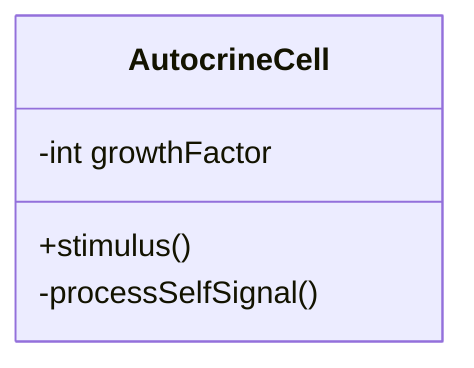
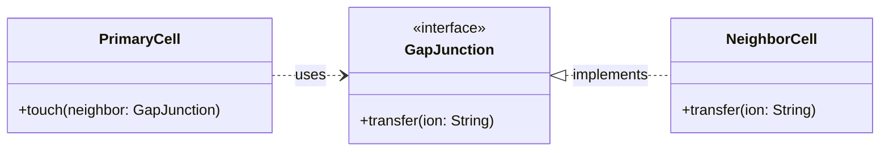
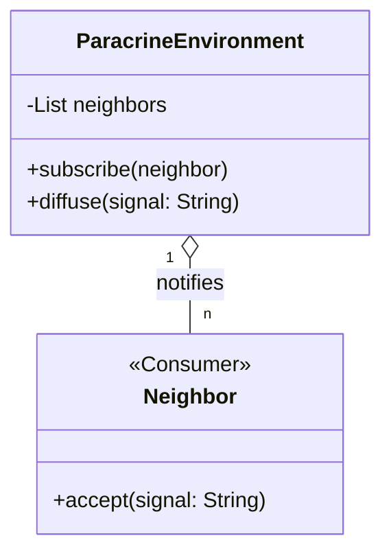
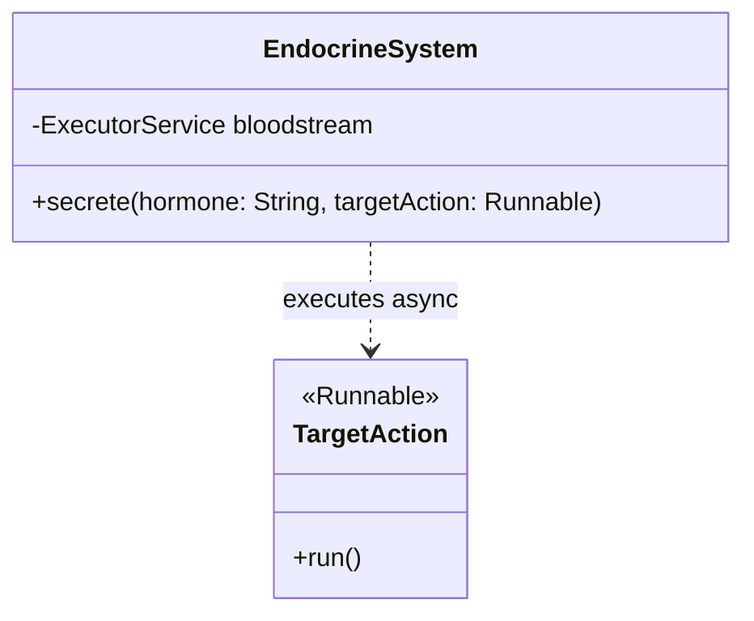

# **Object-Oriented Programming - “the Nature is the Key…”**

## **1. Introduction: Nature as a Teacher**

Significant innovations in bionics – from Velcro to artificial neural networks – impressively illustrate how technology learns from nature. In the same way, Dr. Alan Kay, one of the pioneers of object-oriented programming (OOP) and creator of Smalltalk, was significantly inspired by cell biology. In particular, the autonomy of individual cells served as a model for him to define the conceptual pillars of OOP. Alan Kay once said that the best way to understand OOP is to read *Molecular Biology of the Cell*.

Kay recognized that the way cells in an organism communicate with each other represents a perfect model for the organization of software. Interestingly, he later expressed his dissatisfaction with the term "object orientation" he had chosen because, in his view, it neglected the core aspect of **messaging**.

In 2003, Alan Kay gave the following definition of object-oriented programming:

"OOP to me means only messaging, local retention and protection and hiding of state-process, and extreme late-binding of all things."

This definition calls for a radical rethink: OOP focuses on autonomous units interacting via messages rather than mere class hierarchies. In languages like C++ or Java, however, this vision gave way to a reality that Kay criticized as "syntactic sugar" for synchronous function calls. This criticism aims at the fact that synchronous calls force tight temporal coupling, while true messaging promotes temporal and spatial decoupling (asynchronicity). In this process, true late binding is lost, as receivers are often already fixed at compile time. In addition, objects often violate encapsulation by disclosing their state, while blocking interactions make concurrency seem like a laboriously added foreign body.

## **2. How it works: Cells and Cell Communication**

To understand the analogy, we must first look at how biological cells function and communicate with each other.

### **The Cell as an Autonomous Unit**

A cell is the smallest living unit of an organism. It possesses:

* A **cell membrane** that separates the interior from the exterior and controls what is allowed in and out.  
* An **internal state** (cytoplasm, organelles, DNA) that is protected from direct external access.  
* **Receptors** on its surface that can receive specific signals.  
* The ability to **process** received signals and to carry out corresponding reactions.

Importantly, no cell has direct access to the interior of another cell. All interactions take place via defined communication interfaces.

### **Signal Transmission Strategies**

In multicellular organisms, there are four basic types of signal transmission, which differ primarily by the distance a signal must travel:

1. **Autocrine signaling:** A cell sends signals to itself to regulate its own state.  
2. **Direct contact:** Cells exchange signals via physical channels (gap junctions) directly between their membranes.  
3. **Paracrine signaling:** Communication with immediate neighbor cells (local diffusion).  
4. **Endocrine signaling:** Signals (hormones) are sent over long distances to distant organs via the blood system.

### **The Three Phases of Cell Communication**

Regardless of the distance, communication usually takes place in three phases:

**Phase 1: Signal Emission and Reception** A sender cell produces a signal molecule and sends it out. The receiver cell has specific receptors that fit this molecule exactly – like a key in a lock.

**Phase 2: Signal Transduction (Forwarding)** The binding of the signal triggers a cascade of reactions inside the cell that process the signal.

**Phase 3: Cellular Response** The cell reacts specifically, e.g., through enzyme activation or gene expression.

## **3. Transfer to Object-Oriented Programming**

The parallels between cell communication and OOP are striking. The four biological types of signal transmission can be directly transferred to software architecture patterns:

1. **Autocrine signaling**:  
   * *IT counterpart:* Internal state management or recursive message processing within an object.  
2. **Direct contact**:  
   * *IT counterpart:* Tightly coupled method calls or shared memory.  
3. **Paracrine signaling**:  
   * *IT counterpart:* Communication within a module or component via local events (**Observer Pattern**).  
4. **Endocrine signaling**:  
   * *IT counterpart:* Asynchronous messaging via a message bus or MQ systems between microservices (**Event-Driven Architecture**).

**Comparison of Analogies:**

| Cell Biology | Object-Oriented Programming |
| :---- | :---- |
| Cell | Object (Instance of a class) |
| Cell membrane | Encapsulation |
| Internal state (Cytoplasm, Organelles) | Private Attributes / Fields |
| Receptors | Public Methods (Interface) |
| Signal molecule | Message / Method Call |
| Receptor-ligand binding | Polymorphism (Calling the appropriate method) |
| Signal transduction | Internal processing in private methods |
| Cellular response | Return value or state change |

## **4. Programming Examples in Java: Simulating Signal Transmission Types**

### **4.1 Autocrine Signaling (Internal State Management)**

Here, the object regulates its state through internal feedback, without external interaction.


```java
class AutocrineCell {
  
    private int growthFactor = 0;

    public void stimulus() {  
        // Internal signal to itself  
        this.processSelfSignal();  
    }

    private void processSelfSignal() {  
        this.growthFactor++;  
        System.out.println("Autocrine: Cell regulates itself. Growth Factor: " + growthFactor);  
    }

    public static void main(String[] args) {  
        new AutocrineCell().stimulus();  
    }  
}
```

### **4.2 Direct Contact (Tight Coupling)**

Two objects communicate directly and synchronously with each other, often via interfaces or direct references.



```java
interface GapJunction {  
    void transfer(String ion);  
}

class NeighborCell implements GapJunction {  
    @Override  
    public void transfer(String ion) {  
        System.out.println("Direct Contact: Ion '" + ion + "' received.");  
    }  
}

class PrimaryCell {  
    public void touch(GapJunction neighbor) {  
        neighbor.transfer("Calcium");  
    }

    public static void main(String[] args) {  
        new PrimaryCell().touch(new NeighborCell());  
    }  
}
```

### **4.3 Paracrine Signaling (Observer Pattern)**

A local event is distributed to all "neighbors" in the environment (module/component).



```java
import java.util.*;  
import java.util.function.Consumer;

class ParacrineEnvironment {

    private final List<Consumer<String>> neighbors = new ArrayList<>();

    public void subscribe(Consumer<String> neighbor) { neighbors.add(neighbor); }

    public void diffuse(String signal) {  
        System.out.println("Paracrine: Signal diffusing in the environment...");  
        neighbors.forEach(n -> n.accept(signal));  
    }

    public static void main(String[] args) {  
        ParacrineEnvironment area = new ParacrineEnvironment();  
        area.subscribe(s -> System.out.println("Neighbor A reacts to: " + s));  
        area.subscribe(s -> System.out.println("Neighbor B reacts to: " + s));  
        area.diffuse("Growth Hormone");  
    }  
}
```

### **4.4 Endocrine Signaling (Asynchronous Messaging)**

Messages are distributed to distant receivers via a central system (bloodstream/message bus).


```java
import java.util.concurrent.*;

class EndocrineSystem {

    private final ExecutorService bloodstream = Executors.newCachedThreadPool();

    public void secrete(String hormone, Runnable targetAction) {  
        System.out.println("Endocrine: Hormone '" + hormone + "' released into the bloodstream.");  
        // Asynchronous execution simulates delivery across distance  
        bloodstream.execute(targetAction);  
    }

    public static void main(String[] args) throws InterruptedException {  
        EndocrineSystem body = new EndocrineSystem();  
        body.secrete("Adrenaline", () -> System.out.println("Heart Muscle: Increased heart rate!"));  
        body.secrete("Adrenaline", () -> System.out.println("Lungs: Bronchi dilated!"));  
          
        Thread.sleep(100);  
        body.bloodstream.shutdown();  
    }  
}
```

## **5. Summary and Conclusion**

The analogy between cell communication and object-oriented programming reveals fundamental principles of organizing complex systems.

### **Core Principles of Both Systems**

**Autonomy and Encapsulation**: Both cells and objects are autonomous units with protected internal states. They decide for themselves how to react to external signals.

**Communication instead of direct manipulation**: Interaction occurs exclusively via defined interfaces (receptors or methods). No external system directly accesses the internal state.

**Specialization with a common basis**: Different cell types share basic characteristics but differ in their specialization – just like derived classes in the inheritance hierarchy.

### **Lessons Learned: What we can learn from nature**

1. **Messaging is central**: Alan Kay's original vision emphasized messaging more than classes. The focus should be on communication between objects.  
2. **Information hiding is essential**: The cell membrane protects the sensitive cell interior. Encapsulation protects against unwanted dependencies.  
3. **Interfaces are more powerful than implementations**: It is not important HOW a cell reacts to a signal, but THAT it has a receptor for it.

### **Outlook**

Nature shows us: Good software design reflects universal principles. When we program, we create digital organisms – systems of objects that communicate, cooperate, and together form something larger than the sum of their parts. In modern programming, the **[Actor Model](https://www.google.com/search?q=https://www.linkedin.com/pulse/why-actor-model-closest-realization-alan-kays-vision-h%25C3%25A5var-stavseth-bqpqf)** (as in Erlang or Akka) comes closest to this vision of autonomous units communicating only via messages. The Actor Model serves as the primary solution to the limitations of traditional object-oriented programming in distributed systems. While traditional OOP objects often compromise their encapsulation through the use of public getters and setters, which expose internal state to the outside world, actors preserve **strict encapsulation** by interacting solely through immutable message passing, thereby enabling scalable and maintainable concurrency by eliminating shared mutable state.

## **6. Sources**

* Alan Kay, "The Meaning of 'Object-Oriented Programming'" (2003)  
* Alberts, B. et al., "Molecular Biology of the Cell", 6th Edition, Garland Science (2014)  
* Alex Dzwonchyk, [Object Oriented Biology (2017)](https://medium.com/launch-school/object-oriented-biology-6ed991d9e82a)
* Khan Academy [Introduction to cell signaling (2025)](https://en.khanacademy.org/science/biology/cell-signaling/mechanisms-of-cell-signaling/a/introduction-to-cell-signaling)
* Khan Academy [Introduction to cell signaling (2025)](https://en.khanacademy.org/science/biology/cell-signaling/mechanisms-of-cell-signaling/a/introduction-to-cell-signaling)
* Khan Academy [Introduction to cell signaling (2025)](https://en.khanacademy.org/science/biology/cell-signaling/mechanisms-of-cell-signaling/a/introduction-to-cell-signaling)
* Khan Academy [Introduction to cell signaling (2025)](https://en.khanacademy.org/science/biology/cell-signaling/mechanisms-of-cell-signaling/a/introduction-to-cell-signaling)

* Håvar Stavseth, [“Why the Actor Model Is the Closest Realization of Alan Kay’s Original Vision of Object-Oriented Programming” (2025)](https://www.google.com/search?q=https://www.linkedin.com/pulse/why-actor-model-closest-realization-alan-kays-vision-h%25C3%25A5var-stavseth-bqpqf)
