OOP - Implementierung

```mermaid
graph TB
    subgraph N0["n[0] = com.company.app"]
        direction TB
        
        subgraph L0["Ebene 0: n[0]"]
            direction LR
            A1["User<br/><i>a[1] - interface</i>"]
            A2["Document<br/><i>a[1] - interface</i>"]
            A3["Users<br/><i>a[1] - interface</i>"]
            A4["Documents<br/><i>a[1] - interface</i>"]
        end
        
        subgraph P1["p[1] = n[0].user"]
            U1["Authenticated<br/><i>implements User</i>"]
            U2["Registered<br/><i>implements User</i>"]
            U3["Anonymous<br/><i>implements User</i>"]
        end
        
        subgraph P2["p[1] = n[0].document"]
            D1["Validated<br/><i>implements Document</i>"]
            D2["Draft<br/><i>implements Document</i>"]
            D3["Published<br/><i>implements Document</i>"]
        end
        
        subgraph P3["p[1] = n[0].users"]
            US1["Cached<br/><i>implements Users</i>"]
            US2["Persistent<br/><i>implements Users</i>"]
            US3["InMemory<br/><i>implements Users</i>"]
        end
        
        subgraph P4["p[1] = n[0].documents"]
            DS1["Validated<br/><i>implements Documents</i>"]
            DS2["Indexed<br/><i>implements Documents</i>"]
            DS3["Versioned<br/><i>implements Documents</i>"]
        end
        
        A1 -.->|"∃ a[1] ⇒ p[1] existiert"| P1
        A2 -.->|"∃ a[1] ⇒ p[1] existiert"| P2
        A3 -.->|"∃ a[1] ⇒ p[1] existiert"| P3
        A4 -.->|"∃ a[1] ⇒ p[1] existiert"| P4
        
        subgraph L1["Ebene 1: n[0].user"]
            A5["Credentials<br/><i>a[2] ∈ n[0].user</i>"]
            A6["Registration<br/><i>a[2] ∈ n[0].user</i>"]
        end
        
        subgraph P5["p[2] = n[0].user.credentials"]
            C1["Hashed<br/><i>implements Credentials</i>"]
            C2["Encrypted<br/><i>implements Credentials</i>"]
            C3["Temporary<br/><i>implements Credentials</i>"]
        end
        
        subgraph P6["p[2] = n[0].user.registration"]
            R1["WithEmail<br/><i>implements Registration</i>"]
            R2["WithOAuth<br/><i>implements Registration</i>"]
            R3["WithPhone<br/><i>implements Registration</i>"]
        end
        
        A5 -.->|"∃ a[2] ⇒ p[2] existiert"| P5
        A6 -.->|"∃ a[2] ⇒ p[2] existiert"| P6
        
        subgraph L2["Ebene 2: n[0].user.credentials"]
            A7["Hash<br/><i>a[3] ∈ n[0].user.credentials</i>"]
        end
        
        subgraph P7["p[3] = n[0].user.credentials.hash"]
            H1["Bcrypt<br/><i>implements Hash</i>"]
            H2["Sha256<br/><i>implements Hash</i>"]
            H3["Argon<br/><i>implements Hash</i>"]
        end
        
        A7 -.->|"∃ a[3] ⇒ p[3] existiert"| P7
        
        subgraph L3["Ebene 1: n[0].document"]
            A8["Creation<br/><i>a[2] ∈ n[0].document</i>"]
            A9["Validation<br/><i>a[2] ∈ n[0].document</i>"]
        end
        
        subgraph P8["p[2] = n[0].document.creation"]
            CR1["FromTemplate<br/><i>implements Creation</i>"]
            CR2["FromScratch<br/><i>implements Creation</i>"]
            CR3["FromImport<br/><i>implements Creation</i>"]
        end
        
        subgraph P9["p[2] = n[0].document.validation"]
            V1["Schema<br/><i>implements Validation</i>"]
            V2["Content<br/><i>implements Validation</i>"]
            V3["Signature<br/><i>implements Validation</i>"]
        end
        
        A8 -.->|"∃ a[2] ⇒ p[2] existiert"| P8
        A9 -.->|"∃ a[2] ⇒ p[2] existiert"| P9
        
        subgraph L4["Ebene 1: n[0].users"]
            A10["Persistence<br/><i>a[2] ∈ n[0].users</i>"]
            A11["Authentication<br/><i>a[2] ∈ n[0].users</i>"]
        end
        
        subgraph P10["p[2] = n[0].users.persistence"]
            PE1["Database<br/><i>implements Persistence</i>"]
            PE2["FileSystem<br/><i>implements Persistence</i>"]
            PE3["Cloud<br/><i>implements Persistence</i>"]
        end
        
        subgraph P11["p[2] = n[0].users.authentication"]
            AU1["TokenBased<br/><i>implements Authentication</i>"]
            AU2["SessionBased<br/><i>implements Authentication</i>"]
            AU3["Biometric<br/><i>implements Authentication</i>"]
        end
        
        A10 -.->|"∃ a[2] ⇒ p[2] existiert"| P10
        A11 -.->|"∃ a[2] ⇒ p[2] existiert"| P11
        
        subgraph L5["Ebene 1: n[0].documents"]
            A12["Storage<br/><i>a[2] ∈ n[0].documents</i>"]
        end
        
        subgraph P12["p[2] = n[0].documents.storage"]
            ST1["Compressed<br/><i>implements Storage</i>"]
            ST2["Encrypted<br/><i>implements Storage</i>"]
            ST3["Distributed<br/><i>implements Storage</i>"]
        end
        
        A12 -.->|"∃ a[2] ⇒ p[2] existiert"| P12
    end
    
    style A1 fill:#e8f4fd,stroke:#3b82f6,stroke-width:3px
    style A2 fill:#e8f4fd,stroke:#3b82f6,stroke-width:3px
    style A3 fill:#e8f4fd,stroke:#3b82f6,stroke-width:3px
    style A4 fill:#e8f4fd,stroke:#3b82f6,stroke-width:3px
    style A5 fill:#e8f4fd,stroke:#3b82f6,stroke-width:3px
    style A6 fill:#e8f4fd,stroke:#3b82f6,stroke-width:3px
    style A7 fill:#e8f4fd,stroke:#3b82f6,stroke-width:3px
    style A8 fill:#e8f4fd,stroke:#3b82f6,stroke-width:3px
    style A9 fill:#e8f4fd,stroke:#3b82f6,stroke-width:3px
    style A10 fill:#e8f4fd,stroke:#3b82f6,stroke-width:3px
    style A11 fill:#e8f4fd,stroke:#3b82f6,stroke-width:3px
    style A12 fill:#e8f4fd,stroke:#3b82f6,stroke-width:3px
    
    style U1 fill:#f0fdf4,stroke:#22c55e,stroke-width:2px
    style U2 fill:#f0fdf4,stroke:#22c55e,stroke-width:2px
    style U3 fill:#f0fdf4,stroke:#22c55e,stroke-width:2px
    style D1 fill:#f0fdf4,stroke:#22c55e,stroke-width:2px
    style D2 fill:#f0fdf4,stroke:#22c55e,stroke-width:2px
    style D3 fill:#f0fdf4,stroke:#22c55e,stroke-width:2px
    style US1 fill:#f0fdf4,stroke:#22c55e,stroke-width:2px
    style US2 fill:#f0fdf4,stroke:#22c55e,stroke-width:2px
    style US3 fill:#f0fdf4,stroke:#22c55e,stroke-width:2px
    style DS1 fill:#f0fdf4,stroke:#22c55e,stroke-width:2px
    style DS2 fill:#f0fdf4,stroke:#22c55e,stroke-width:2px
    style DS3 fill:#f0fdf4,stroke:#22c55e,stroke-width:2px
    style C1 fill:#f0fdf4,stroke:#22c55e,stroke-width:2px
    style C2 fill:#f0fdf4,stroke:#22c55e,stroke-width:2px
    style C3 fill:#f0fdf4,stroke:#22c55e,stroke-width:2px
    style R1 fill:#f0fdf4,stroke:#22c55e,stroke-width:2px
    style R2 fill:#f0fdf4,stroke:#22c55e,stroke-width:2px
    style R3 fill:#f0fdf4,stroke:#22c55e,stroke-width:2px
    style H1 fill:#f0fdf4,stroke:#22c55e,stroke-width:2px
    style H2 fill:#f0fdf4,stroke:#22c55e,stroke-width:2px
    style H3 fill:#f0fdf4,stroke:#22c55e,stroke-width:2px
    style CR1 fill:#f0fdf4,stroke:#22c55e,stroke-width:2px
    style CR2 fill:#f0fdf4,stroke:#22c55e,stroke-width:2px
    style CR3 fill:#f0fdf4,stroke:#22c55e,stroke-width:2px
    style V1 fill:#f0fdf4,stroke:#22c55e,stroke-width:2px
    style V2 fill:#f0fdf4,stroke:#22c55e,stroke-width:2px
    style V3 fill:#f0fdf4,stroke:#22c55e,stroke-width:2px
    style PE1 fill:#f0fdf4,stroke:#22c55e,stroke-width:2px
    style PE2 fill:#f0fdf4,stroke:#22c55e,stroke-width:2px
    style PE3 fill:#f0fdf4,stroke:#22c55e,stroke-width:2px
    style AU1 fill:#f0fdf4,stroke:#22c55e,stroke-width:2px
```




DDD - Implementierung

```mermaid
    graph TB
    subgraph N0["n[0] = com.company.app"]
        direction TB
        
        subgraph DOMAIN["Domain Layer"]
            direction TB
            
            subgraph MODEL["domain.model"]
                direction LR
                E1["User<br/><i>interface - Entity</i>"]
                E2["Document<br/><i>interface - Entity</i>"]
                VO1["Credentials<br/><i>interface - Value Object</i>"]
                VO2["Hash<br/><i>interface - Value Object</i>"]
            end
            
            subgraph USER_PKG["domain.model.user"]
                U1["Authenticated"]
                U2["Registered"]
                U3["Anonymous"]
            end
            
            subgraph DOC_PKG["domain.model.document"]
                D1["Validated"]
                D2["Draft"]
                D3["Published"]
            end
            
            subgraph CRED_PKG["domain.model.credentials"]
                C1["Hashed"]
                C2["Encrypted"]
                C3["Temporary"]
            end
            
            subgraph HASH_PKG["domain.model.hash"]
                H1["Bcrypt"]
                H2["Sha256"]
                H3["Argon"]
            end
            
            E1 --> U1 & U2 & U3
            E2 --> D1 & D2 & D3
            VO1 --> C1 & C2 & C3
            VO2 --> H1 & H2 & H3
            
            subgraph REPOS["domain"]
                R1["Users<br/><i>interface - Collection</i>"]
                R2["Documents<br/><i>interface - Collection</i>"]
            end
            
            subgraph USERS_PKG["domain.users"]
                RU1["Cached"]
                RU2["Persistent"]
                RU3["InMemory"]
            end
            
            subgraph DOCS_PKG["domain.documents"]
                RD1["Validated"]
                RD2["Indexed"]
                RD3["Versioned"]
            end
            
            R1 --> RU1 & RU2 & RU3
            R2 --> RD1 & RD2 & RD3
            
            subgraph SERVICES["domain"]
                DS1["Authentication<br/><i>interface - Domain Service</i>"]
            end
            
            subgraph AUTH_PKG["domain.authentication"]
                A1["TokenBased"]
                A2["SessionBased"]
                A3["Biometric"]
            end
            
            DS1 --> A1 & A2 & A3
        end
        
        subgraph INFRA["Infrastructure Layer"]
            direction TB
            
            subgraph PERSIST["infrastructure"]
                P1["Persistence<br/><i>interface</i>"]
            end
            
            subgraph PERSIST_PKG["infrastructure.persistence"]
                PI1["Database"]
                PI2["FileSystem"]
                PI3["Cloud"]
            end
            
            P1 --> PI1 & PI2 & PI3
            
            subgraph SEC["infrastructure"]
                S1["Security<br/><i>interface</i>"]
            end
            
            subgraph SEC_PKG["infrastructure.security"]
                SI1["Encrypted"]
                SI2["Signed"]
                SI3["Audited"]
            end
            
            S1 --> SI1 & SI2 & SI3
        end
        
        subgraph APP["Application Layer"]
            direction TB
            
            subgraph USECASES["application"]
                UC1["UserRegistration<br/><i>interface - Use Case</i>"]
                UC2["UserAuthentication<br/><i>interface - Use Case</i>"]
                UC3["DocumentCreation<br/><i>interface - Use Case</i>"]
            end
            
            subgraph REG_PKG["application.userregistration"]
                UR1["WithEmail"]
                UR2["WithOAuth"]
                UR3["WithPhone"]
            end
            
            subgraph AUTH_UC_PKG["application.userauthentication"]
                UA1["WithPassword"]
                UA2["WithToken"]
                UA3["WithBiometric"]
            end
            
            subgraph DOC_UC_PKG["application.documentcreation"]
                DC1["FromTemplate"]
                DC2["FromScratch"]
                DC3["FromImport"]
            end
            
            UC1 --> UR1 & UR2 & UR3
            UC2 --> UA1 & UA2 & UA3
            UC3 --> DC1 & DC2 & DC3
        end
        
        RU1 & RU2 -.->|"nutzt"| E1
        RD1 & RD2 -.->|"nutzt"| E2
        UR1 & UR2 -.->|"nutzt"| R1
        UA1 & UA2 -.->|"nutzt"| DS1
        DC1 & DC2 -.->|"nutzt"| R2
    end
    
    style E1 fill:#fef3c7,stroke:#f59e0b,stroke-width:2px
    style E2 fill:#fef3c7,stroke:#f59e0b,stroke-width:2px
    style VO1 fill:#dbeafe,stroke:#3b82f6,stroke-width:2px
    style VO2 fill:#dbeafe,stroke:#3b82f6,stroke-width:2px
    
    style R1 fill:#e8f4fd,stroke:#3b82f6,stroke-width:2px
    style R2 fill:#e8f4fd,stroke:#3b82f6,stroke-width:2px
    style DS1 fill:#fce7f3,stroke:#ec4899,stroke-width:2px
    
    style UC1 fill:#ede9fe,stroke:#8b5cf6,stroke-width:2px
    style UC2 fill:#ede9fe,stroke:#8b5cf6,stroke-width:2px
    style UC3 fill:#ede9fe,stroke:#8b5cf6,stroke-width:2px
    
    style P1 fill:#e8f4fd,stroke:#3b82f6,stroke-width:2px
    style S1 fill:#e8f4fd,stroke:#3b82f6,stroke-width:2px
    
    style U1 fill:#f0fdf4,stroke:#22c55e
    style U2 fill:#f0fdf4,stroke:#22c55e
    style U3 fill:#f0fdf4,stroke:#22c55e
    style D1 fill:#f0fdf4,stroke:#22c55e
    style D2 fill:#f0fdf4,stroke:#22c55e
    style D3 fill:#f0fdf4,stroke:#22c55e
    style C1 fill:#f0fdf4,stroke:#22c55e
    style C2 fill:#f0fdf4,stroke:#22c55e
    style C3 fill:#f0fdf4,stroke:#22c55e
    style H1 fill:#f0fdf4,stroke:#22c55e
    style H2 fill:#f0fdf4,stroke:#22c55e
    style H3 fill:#f0fdf4,stroke:#22c55e
    style RU1 fill:#f0fdf4,stroke:#22c55e
    style RU2 fill:#f0fdf4,stroke:#22c55e
    style RU3 fill:#f0fdf4,stroke:#22c55e
    style RD1 fill:#f0fdf4,stroke:#22c55e
    style RD2 fill:#f0fdf4,stroke:#22c55e
    style RD3 fill:#f0fdf4,stroke:#22c55e
    style A1 fill:#f0fdf4,stroke:#22c55e
    style A2 fill:#f0fdf4,stroke:#22c55e
    style A3 fill:#f0fdf4,stroke:#22c55e
    style PI1 fill:#f0fdf4,stroke:#22c55e
    style PI2 fill:#f0fdf4,stroke:#22c55e
    style PI3 fill:#f0fdf4,stroke:#22c55e
    style SI1 fill:#f0fdf4,stroke:#22c55e
    style SI2 fill:#f0fdf4,stroke:#22c55e
    style SI3 fill:#f0fdf4,stroke:#22c55e
    style UR1 fill:#f0fdf4,stroke:#22c55e
    style UR2 fill:#f0fdf4,stroke:#22c55e
    style UR3 fill:#f0fdf4,stroke:#22c55e
    style UA1 fill:#f0fdf4,stroke:#22c55e
    style UA2 fill:#f0fdf4,stroke:#22c55e
    style UA3 fill:#f0fdf4,stroke:#22c55e
    style DC1 fill:#f0fdf4,stroke:#22c55e
    style DC2 fill:#f0fdf4,stroke:#22c55e
    style DC3 fill:#f0fdf4,stroke:#22c55e
    style AU2 fill:#f0fdf4,stroke:#22c55e,stroke-width:2px
    style AU3 fill:#f0fdf4,stroke:#22c55e,stroke-width:2px
    style ST1 fill:#f0fdf4,stroke:#22c55e,stroke-width:2px
    style ST2 fill:#f0fdf4,stroke:#22c55e,stroke-width:2px
    style ST3 fill:#f0fdf4,stroke:#22c55e,stroke-width:2px
```


# Abstractness (A) vs Instability (I) Plot

```html
<html lang="de">
<head>
    <meta charset="UTF-8">
    <meta name="viewport" content="width=device-width, initial-scale=1.0">
    <title>A vs I Plot Vergleich</title>
    <script src="https://cdnjs.cloudflare.com/ajax/libs/Chart.js/3.9.1/chart.min.js"></script>
    <style>
        body {
            font-family: 'Segoe UI', Tahoma, Geneva, Verdana, sans-serif;
            max-width: 1400px;
            margin: 0 auto;
            padding: 20px;
            background: #f8fafc;
        }
        h1 {
            text-align: center;
            color: #1e293b;
            margin-bottom: 10px;
        }
        .subtitle {
            text-align: center;
            color: #64748b;
            margin-bottom: 30px;
            font-size: 14px;
        }
        .container {
            display: grid;
            grid-template-columns: 1fr 1fr;
            gap: 20px;
            margin-bottom: 30px;
        }
        .chart-container {
            background: white;
            border-radius: 8px;
            padding: 20px;
            box-shadow: 0 1px 3px rgba(0,0,0,0.1);
        }
        .chart-title {
            text-align: center;
            font-weight: bold;
            margin-bottom: 15px;
            color: #334155;
        }
        canvas {
            max-height: 400px;
        }
        .metrics {
            background: white;
            border-radius: 8px;
            padding: 20px;
            box-shadow: 0 1px 3px rgba(0,0,0,0.1);
            grid-column: 1 / -1;
        }
        .metrics h2 {
            color: #1e293b;
            margin-bottom: 15px;
            font-size: 18px;
        }
        table {
            width: 100%;
            border-collapse: collapse;
        }
        th, td {
            padding: 10px;
            text-align: left;
            border-bottom: 1px solid #e2e8f0;
        }
        th {
            background: #f1f5f9;
            font-weight: 600;
            color: #475569;
        }
        .good {
            color: #22c55e;
            font-weight: bold;
        }
        .warning {
            color: #f59e0b;
            font-weight: bold;
        }
        .bad {
            color: #ef4444;
            font-weight: bold;
        }
        .legend {
            margin-top: 20px;
            padding: 15px;
            background: #f8fafc;
            border-radius: 6px;
        }
        .legend-item {
            display: inline-block;
            margin-right: 20px;
            font-size: 13px;
        }
        .legend-color {
            display: inline-block;
            width: 12px;
            height: 12px;
            margin-right: 5px;
            border-radius: 2px;
        }
    </style>
</head>
<body>
    <h1>Abstractness vs Instability Plot</h1>
    <div class="subtitle">Vergleich: Klassisches DDD vs OOP-Struktur (Yegor256 Prinzipien)</div>
    
    <div class="container">
        <div class="chart-container">
            <div class="chart-title">Klassisches DDD</div>
            <canvas id="dddChart"></canvas>
        </div>
        <div class="chart-container">
            <div class="chart-title">OOP-Struktur (Yegor256)</div>
            <canvas id="oopChart"></canvas>
        </div>
    </div>

    <div class="metrics">
        <h2>Package Metriken Vergleich</h2>
        <table>
            <thead>
                <tr>
                    <th>Package</th>
                    <th>Abstractness (A)</th>
                    <th>Instability (I)</th>
                    <th>Distance (D)</th>
                    <th>Bewertung</th>
                </tr>
            </thead>
            <tbody id="metricsTable"></tbody>
        </table>
        
        <div class="legend">
            <div class="legend-item">
                <span class="legend-color" style="background: #22c55e;"></span>
                <span>Main Sequence (D ≤ 0.2): Optimal</span>
            </div>
            <div class="legend-item">
                <span class="legend-color" style="background: #f59e0b;"></span>
                <span>Akzeptabel (D ≤ 0.4)</span>
            </div>
            <div class="legend-item">
                <span class="legend-color" style="background: #ef4444;"></span>
                <span>Problematisch (D > 0.4)</span>
            </div>
        </div>
    </div>

    <script>
        // DDD Package Metriken
        const dddPackages = [
            { name: 'domain.model', A: 0.8, I: 0.2, type: 'DDD' },
            { name: 'domain.repository', A: 1.0, I: 0.3, type: 'DDD' },
            { name: 'domain.service', A: 0.7, I: 0.4, type: 'DDD' },
            { name: 'infrastructure.persistence', A: 0.1, I: 0.8, type: 'DDD' },
            { name: 'infrastructure.security', A: 0.1, I: 0.7, type: 'DDD' },
            { name: 'application.usecase', A: 0.5, I: 0.5, type: 'DDD' },
            { name: 'application.service', A: 0.2, I: 0.6, type: 'DDD' }
        ];

        // OOP Package Metriken
        const oopPackages = [
            { name: 'user', A: 0.9, I: 0.1, type: 'OOP' },
            { name: 'document', A: 0.9, I: 0.15, type: 'OOP' },
            { name: 'users', A: 0.85, I: 0.2, type: 'OOP' },
            { name: 'documents', A: 0.85, I: 0.2, type: 'OOP' },
            { name: 'user.credentials', A: 0.8, I: 0.25, type: 'OOP' },
            { name: 'user.registration', A: 0.75, I: 0.3, type: 'OOP' },
            { name: 'user.credentials.hash', A: 0.7, I: 0.35, type: 'OOP' },
            { name: 'document.creation', A: 0.75, I: 0.3, type: 'OOP' },
            { name: 'document.validation', A: 0.8, I: 0.25, type: 'OOP' },
            { name: 'users.persistence', A: 0.15, I: 0.85, type: 'OOP' },
            { name: 'users.authentication', A: 0.2, I: 0.8, type: 'OOP' },
            { name: 'documents.storage', A: 0.15, I: 0.85, type: 'OOP' }
        ];

        // Distance berechnen: D = |A + I - 1|
        function calculateDistance(A, I) {
            return Math.abs(A + I - 1);
        }

        // Bewertung basierend auf Distance
        function evaluateDistance(D) {
            if (D <= 0.2) return { text: 'Optimal', class: 'good' };
            if (D <= 0.4) return { text: 'Akzeptabel', class: 'warning' };
            return { text: 'Problematisch', class: 'bad' };
        }

        // Chart erstellen
        function createChart(canvasId, packages, title) {
            const ctx = document.getElementById(canvasId).getContext('2d');
            
            // Main Sequence Line: A + I = 1
            const mainSequence = [
                { x: 0, y: 1 },
                { x: 1, y: 0 }
            ];

            // Zone of Pain (stable & concrete)
            const painZone = [
                { x: 0, y: 0 },
                { x: 0.3, y: 0 },
                { x: 0, y: 0.3 }
            ];

            // Zone of Uselessness (abstract & unstable)
            const uselessZone = [
                { x: 0.7, y: 1 },
                { x: 1, y: 1 },
                { x: 1, y: 0.7 }
            ];

            new Chart(ctx, {
                type: 'scatter',
                data: {
                    datasets: [
                        {
                            label: 'Main Sequence',
                            data: mainSequence,
                            type: 'line',
                            borderColor: '#22c55e',
                            borderWidth: 2,
                            borderDash: [5, 5],
                            pointRadius: 0,
                            fill: false
                        },
                        {
                            label: 'Packages',
                            data: packages.map(p => ({ x: p.I, y: p.A })),
                            backgroundColor: '#3b82f6',
                            borderColor: '#1e40af',
                            borderWidth: 2,
                            pointRadius: 8,
                            pointHoverRadius: 10
                        }
                    ]
                },
                options: {
                    responsive: true,
                    maintainAspectRatio: true,
                    plugins: {
                        legend: {
                            display: true,
                            position: 'top'
                        },
                        tooltip: {
                            callbacks: {
                                label: function(context) {
                                    if (context.datasetIndex === 1) {
                                        const pkg = packages[context.dataIndex];
                                        const D = calculateDistance(pkg.A, pkg.I);
                                        return [
                                            `Package: ${pkg.name}`,
                                            `A: ${pkg.A.toFixed(2)}`,
                                            `I: ${pkg.I.toFixed(2)}`,
                                            `D: ${D.toFixed(2)}`
                                        ];
                                    }
                                    return '';
                                }
                            }
                        }
                    },
                    scales: {
                        x: {
                            title: {
                                display: true,
                                text: 'Instability (I) →',
                                font: { size: 14, weight: 'bold' }
                            },
                            min: 0,
                            max: 1,
                            ticks: {
                                stepSize: 0.1
                            },
                            grid: {
                                color: '#e2e8f0'
                            }
                        },
                        y: {
                            title: {
                                display: true,
                                text: 'Abstractness (A) →',
                                font: { size: 14, weight: 'bold' }
                            },
                            min: 0,
                            max: 1,
                            ticks: {
                                stepSize: 0.1
                            },
                            grid: {
                                color: '#e2e8f0'
                            }
                        }
                    }
                }
            });
        }

        // Tabelle füllen
        function fillMetricsTable() {
            const tbody = document.getElementById('metricsTable');
            const allPackages = [...dddPackages, ...oopPackages];
            
            allPackages.forEach(pkg => {
                const D = calculateDistance(pkg.A, pkg.I);
                const evaluation = evaluateDistance(D);
                
                const row = tbody.insertRow();
                row.innerHTML = `
                    <td><strong>${pkg.type}:</strong> ${pkg.name}</td>
                    <td>${pkg.A.toFixed(2)}</td>
                    <td>${pkg.I.toFixed(2)}</td>
                    <td>${D.toFixed(3)}</td>
                    <td class="${evaluation.class}">${evaluation.text}</td>
                `;
            });
        }

        // Statistiken berechnen
        function calculateStatistics() {
            const dddDistances = dddPackages.map(p => calculateDistance(p.A, p.I));
            const oopDistances = oopPackages.map(p => calculateDistance(p.A, p.I));
            
            const avgDDD = dddDistances.reduce((a, b) => a + b, 0) / dddDistances.length;
            const avgOOP = oopDistances.reduce((a, b) => a + b, 0) / oopDistances.length;
            
            console.log('DDD Average Distance:', avgDDD.toFixed(3));
            console.log('OOP Average Distance:', avgOOP.toFixed(3));
            console.log('DDD Packages in Main Sequence:', dddDistances.filter(d => d <= 0.2).length);
            console.log('OOP Packages in Main Sequence:', oopDistances.filter(d => d <= 0.2).length);
        }

        // Init
        createChart('dddChart', dddPackages, 'DDD');
        createChart('oopChart', oopPackages, 'OOP');
        fillMetricsTable();
        calculateStatistics();
    </script>
</body>
</html>
```
