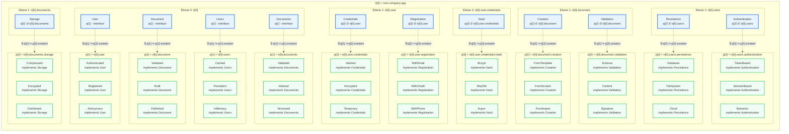

```mermaid
graph TB
    subgraph N0["n[0] = com.company.app"]
        direction TB
        
        subgraph L0["Ebene 0: n[0]"]
            direction LR
            A1["User<br/><i>a[1] - interface</i>"]
            A2["Document<br/><i>a[1] - interface</i>"]
            A3["Users<br/><i>a[1] - interface</i>"]
            A4["Documents<br/><i>a[1] - interface</i>"]
        end
        
        subgraph P1["p[1] = n[0].user"]
            U1["Authenticated<br/><i>implements User</i>"]
            U2["Registered<br/><i>implements User</i>"]
            U3["Anonymous<br/><i>implements User</i>"]
        end
        
        subgraph P2["p[1] = n[0].document"]
            D1["Validated<br/><i>implements Document</i>"]
            D2["Draft<br/><i>implements Document</i>"]
            D3["Published<br/><i>implements Document</i>"]
        end
        
        subgraph P3["p[1] = n[0].users"]
            US1["Cached<br/><i>implements Users</i>"]
            US2["Persistent<br/><i>implements Users</i>"]
            US3["InMemory<br/><i>implements Users</i>"]
        end
        
        subgraph P4["p[1] = n[0].documents"]
            DS1["Validated<br/><i>implements Documents</i>"]
            DS2["Indexed<br/><i>implements Documents</i>"]
            DS3["Versioned<br/><i>implements Documents</i>"]
        end
        
        A1 -.->|"∃ a[1] ⇒ p[1] existiert"| P1
        A2 -.->|"∃ a[1] ⇒ p[1] existiert"| P2
        A3 -.->|"∃ a[1] ⇒ p[1] existiert"| P3
        A4 -.->|"∃ a[1] ⇒ p[1] existiert"| P4
        
        subgraph L1["Ebene 1: n[0].user"]
            A5["Credentials<br/><i>a[2] ∈ n[0].user</i>"]
            A6["Registration<br/><i>a[2] ∈ n[0].user</i>"]
        end
        
        subgraph P5["p[2] = n[0].user.credentials"]
            C1["Hashed<br/><i>implements Credentials</i>"]
            C2["Encrypted<br/><i>implements Credentials</i>"]
            C3["Temporary<br/><i>implements Credentials</i>"]
        end
        
        subgraph P6["p[2] = n[0].user.registration"]
            R1["WithEmail<br/><i>implements Registration</i>"]
            R2["WithOAuth<br/><i>implements Registration</i>"]
            R3["WithPhone<br/><i>implements Registration</i>"]
        end
        
        A5 -.->|"∃ a[2] ⇒ p[2] existiert"| P5
        A6 -.->|"∃ a[2] ⇒ p[2] existiert"| P6
        
        subgraph L2["Ebene 2: n[0].user.credentials"]
            A7["Hash<br/><i>a[3] ∈ n[0].user.credentials</i>"]
        end
        
        subgraph P7["p[3] = n[0].user.credentials.hash"]
            H1["Bcrypt<br/><i>implements Hash</i>"]
            H2["Sha256<br/><i>implements Hash</i>"]
            H3["Argon<br/><i>implements Hash</i>"]
        end
        
        A7 -.->|"∃ a[3] ⇒ p[3] existiert"| P7
        
        subgraph L3["Ebene 1: n[0].document"]
            A8["Creation<br/><i>a[2] ∈ n[0].document</i>"]
            A9["Validation<br/><i>a[2] ∈ n[0].document</i>"]
        end
        
        subgraph P8["p[2] = n[0].document.creation"]
            CR1["FromTemplate<br/><i>implements Creation</i>"]
            CR2["FromScratch<br/><i>implements Creation</i>"]
            CR3["FromImport<br/><i>implements Creation</i>"]
        end
        
        subgraph P9["p[2] = n[0].document.validation"]
            V1["Schema<br/><i>implements Validation</i>"]
            V2["Content<br/><i>implements Validation</i>"]
            V3["Signature<br/><i>implements Validation</i>"]
        end
        
        A8 -.->|"∃ a[2] ⇒ p[2] existiert"| P8
        A9 -.->|"∃ a[2] ⇒ p[2] existiert"| P9
        
        subgraph L4["Ebene 1: n[0].users"]
            A10["Persistence<br/><i>a[2] ∈ n[0].users</i>"]
            A11["Authentication<br/><i>a[2] ∈ n[0].users</i>"]
        end
        
        subgraph P10["p[2] = n[0].users.persistence"]
            PE1["Database<br/><i>implements Persistence</i>"]
            PE2["FileSystem<br/><i>implements Persistence</i>"]
            PE3["Cloud<br/><i>implements Persistence</i>"]
        end
        
        subgraph P11["p[2] = n[0].users.authentication"]
            AU1["TokenBased<br/><i>implements Authentication</i>"]
            AU2["SessionBased<br/><i>implements Authentication</i>"]
            AU3["Biometric<br/><i>implements Authentication</i>"]
        end
        
        A10 -.->|"∃ a[2] ⇒ p[2] existiert"| P10
        A11 -.->|"∃ a[2] ⇒ p[2] existiert"| P11
        
        subgraph L5["Ebene 1: n[0].documents"]
            A12["Storage<br/><i>a[2] ∈ n[0].documents</i>"]
        end
        
        subgraph P12["p[2] = n[0].documents.storage"]
            ST1["Compressed<br/><i>implements Storage</i>"]
            ST2["Encrypted<br/><i>implements Storage</i>"]
            ST3["Distributed<br/><i>implements Storage</i>"]
        end
        
        A12 -.->|"∃ a[2] ⇒ p[2] existiert"| P12
    end
    
    style A1 fill:#e8f4fd,stroke:#3b82f6,stroke-width:3px
    style A2 fill:#e8f4fd,stroke:#3b82f6,stroke-width:3px
    style A3 fill:#e8f4fd,stroke:#3b82f6,stroke-width:3px
    style A4 fill:#e8f4fd,stroke:#3b82f6,stroke-width:3px
    style A5 fill:#e8f4fd,stroke:#3b82f6,stroke-width:3px
    style A6 fill:#e8f4fd,stroke:#3b82f6,stroke-width:3px
    style A7 fill:#e8f4fd,stroke:#3b82f6,stroke-width:3px
    style A8 fill:#e8f4fd,stroke:#3b82f6,stroke-width:3px
    style A9 fill:#e8f4fd,stroke:#3b82f6,stroke-width:3px
    style A10 fill:#e8f4fd,stroke:#3b82f6,stroke-width:3px
    style A11 fill:#e8f4fd,stroke:#3b82f6,stroke-width:3px
    style A12 fill:#e8f4fd,stroke:#3b82f6,stroke-width:3px
    
    style U1 fill:#f0fdf4,stroke:#22c55e,stroke-width:2px
    style U2 fill:#f0fdf4,stroke:#22c55e,stroke-width:2px
    style U3 fill:#f0fdf4,stroke:#22c55e,stroke-width:2px
    style D1 fill:#f0fdf4,stroke:#22c55e,stroke-width:2px
    style D2 fill:#f0fdf4,stroke:#22c55e,stroke-width:2px
    style D3 fill:#f0fdf4,stroke:#22c55e,stroke-width:2px
    style US1 fill:#f0fdf4,stroke:#22c55e,stroke-width:2px
    style US2 fill:#f0fdf4,stroke:#22c55e,stroke-width:2px
    style US3 fill:#f0fdf4,stroke:#22c55e,stroke-width:2px
    style DS1 fill:#f0fdf4,stroke:#22c55e,stroke-width:2px
    style DS2 fill:#f0fdf4,stroke:#22c55e,stroke-width:2px
    style DS3 fill:#f0fdf4,stroke:#22c55e,stroke-width:2px
    style C1 fill:#f0fdf4,stroke:#22c55e,stroke-width:2px
    style C2 fill:#f0fdf4,stroke:#22c55e,stroke-width:2px
    style C3 fill:#f0fdf4,stroke:#22c55e,stroke-width:2px
    style R1 fill:#f0fdf4,stroke:#22c55e,stroke-width:2px
    style R2 fill:#f0fdf4,stroke:#22c55e,stroke-width:2px
    style R3 fill:#f0fdf4,stroke:#22c55e,stroke-width:2px
    style H1 fill:#f0fdf4,stroke:#22c55e,stroke-width:2px
    style H2 fill:#f0fdf4,stroke:#22c55e,stroke-width:2px
    style H3 fill:#f0fdf4,stroke:#22c55e,stroke-width:2px
    style CR1 fill:#f0fdf4,stroke:#22c55e,stroke-width:2px
    style CR2 fill:#f0fdf4,stroke:#22c55e,stroke-width:2px
    style CR3 fill:#f0fdf4,stroke:#22c55e,stroke-width:2px
    style V1 fill:#f0fdf4,stroke:#22c55e,stroke-width:2px
    style V2 fill:#f0fdf4,stroke:#22c55e,stroke-width:2px
    style V3 fill:#f0fdf4,stroke:#22c55e,stroke-width:2px
    style PE1 fill:#f0fdf4,stroke:#22c55e,stroke-width:2px
    style PE2 fill:#f0fdf4,stroke:#22c55e,stroke-width:2px
    style PE3 fill:#f0fdf4,stroke:#22c55e,stroke-width:2px
    style AU1 fill:#f0fdf4,stroke:#22c55e,stroke-width:2px
    style AU2 fill:#f0fdf4,stroke:#22c55e,stroke-width:2px
    style AU3 fill:#f0fdf4,stroke:#22c55e,stroke-width:2px
    style ST1 fill:#f0fdf4,stroke:#22c55e,stroke-width:2px
    style ST2 fill:#f0fdf4,stroke:#22c55e,stroke-width:2px
    style ST3 fill:#f0fdf4,stroke:#22c55e,stroke-width:2px
```
    
