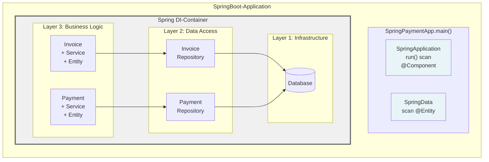
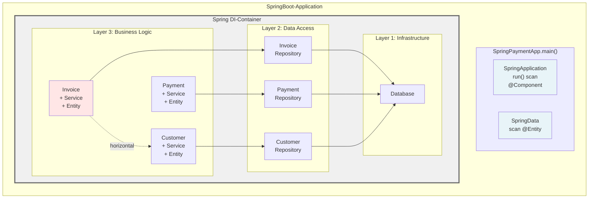
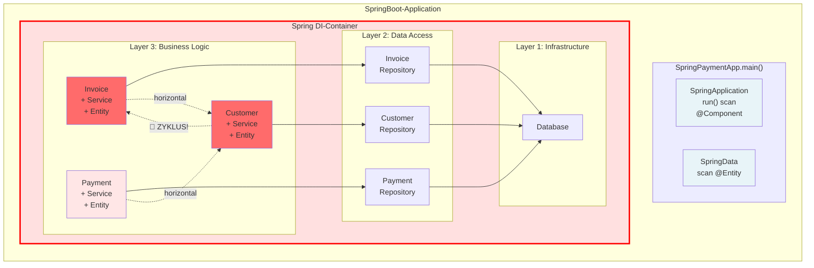
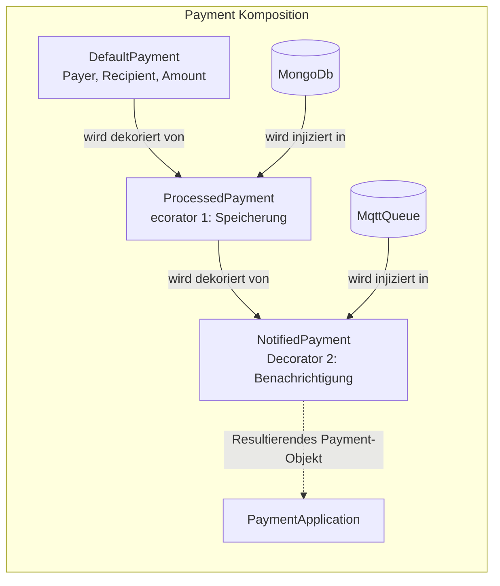
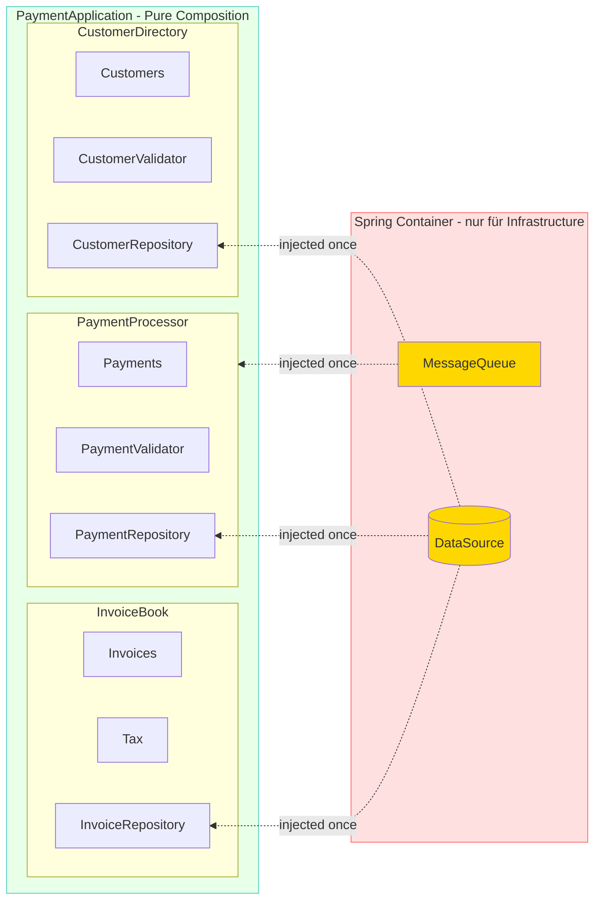

# A solid System Composition *"leaves Nobody behind…"*

**(Draft!!!)**

***- Eine reale Geschichte aus der Praxis -***

## 1. Einleitung

In der modernen objektorientierten Softwareentwicklung ist **Dependency Injection** (DI) längst ein **etabliertes Konzept**. Die Grundidee ist simpel und elegant: Objekte sollen ihre Abhängigkeiten nicht selbst erstellen, sondern von außen erhalten. Doch während die Technik selbst wertvoll ist, haben viele Frameworks und **DI-Container** das ursprüngliche Konzept in ein **Anti-Pattern** verwandelt.

### 1.1 Probleme mit DI-Containern

Betrachten wir eine Spring-Boot Payment-Application mit der üblichen Verwendung von DI-Container.  
Mittels Annotations wie `@Component`, `@Service`, `@Repository` und `@Controller` kann Spring automatisch Klassen erkennen, instanziieren und in den Container aufnehmen, ohne dass sie explizit konfiguriert werden müssen.  

Wir bauen sie schrittweise auf und beobachten, welche Probleme mit wachsenden Anforderungen entstehen können.

#### Anforderung 1: (Rechnungen und Zahlungen verarbeiten)

Die Applikation soll zunächst Rechnungen (`Invoice`) erstellen und dazu Zahlungen (`Payment`) verarbeiten können.



```java
// Die App verwaltet keine expliziten Dependencies  
@SpringBootApplication  
public class SpringPaymentApp {

    public static void main(String[] args) {  
        // ...starts scanning classpath to provide 'Magic' on:  
        // @Component, @Service, @Controller, @Repository und @Entity  
        SpringApplication.run(SpringPaymentApp.class, args);  
    }  
}

@Service  
public class InvoiceService {

    @Autowired  
    private InvoiceRepository invoiceRepo;  
      
    public Invoice create(Customer customer, List<Item> items) {  
        // Business Logic  
    }  
}

@Service  
public class PaymentService {

    @Autowired  
    private PaymentRepository paymentRepo;  
      
    public void process(Payment payment) {  
        // Business Logic  
    }  
}
```

**Problem:** An dieser Stelle ist es bereits unklar, wie die Objekte wirklich zusammenhängen.    

Das Objekt der Klasse `SpringPaymentApp` sowie die Komponente `SpringData` für Zugriffe auf die Datenbank schwebt isoliert "herum" und der DI-Container verwaltet alles im Hintergrund.

#### Anforderung 2: (Customer hinzufügen)

Nun sollen zusätzlich noch Kunden verwaltet werden und beim Erstellen einer Rechnung muss ein Kunde validiert werden.



```java
@Service  
public class InvoiceService {

    @Autowired  
    private InvoiceRepository invoiceRepo;

    @Autowired  
    private CustomerService customerService;  // ⚠️ Horizontale Dependency!  
      
    public Invoice create(Customer customer, List<Item> items) {  
        customerService.validate(customer);  // Braucht CustomerService  
        // Business Logic  
    }  
}

@Service  
public class CustomerService {

    @Autowired   
    private CustomerRepository customerRepo;  
      
    public void validate(Customer customer) {  
        // Validation Logic  
    }  
}
```

**(Kein) Problem:** Die neu entstandene horizontale Abhängigkeit innerhalb des Business-Logic-Layers verkompliziert lediglich die Beziehungen in diesem Modul.

#### Anforderung 3: Kunden sollen ihre offenen Rechnungen sehen können.

Ein Junior-Entwickler nimmt sich der Sache an. Für Ihn war es logisch die Klasse `CustomerService` muss jetzt `InvoiceService` kennen.



```java
@SpringBootApplication  
public class SpringPaymentApp {  
    // Container versteckt den Zyklus komplett!  
    public static void main(String[] args) {  
        // ...starts scanning classpath to provide 'Magic' on:  
        // @Component, @Service, @Controller, @Repository und @Entity  
        SpringApplication.run(SpringPaymentApp.class, args);  
    }  
}

@Service  
public class InvoiceService {

    @Autowired private InvoiceRepository invoiceRepo;  
    @Autowired private CustomerService customerService;  // → Customer  
      
    public Invoice create(Customer customer, List<Item> items) {  
        customerService.validate(customer);  
        // Business Logic  
    }  
}

@Service  
public class PaymentService {

    @Autowired  
    private PaymentRepository paymentRepo;

    @Autowired  
    private CustomerService customerService;  // → Customer  
      
    public void process(Payment payment) {  
        // Business Logic  
        customerService.updateBalance(payment.getCustomer());  
        // ... more Business Logic  
    }  
}

@Service  
public class CustomerService {

    @Autowired  
    private InvoiceService invoiceService;  // 🔴 → Invoice (ZYKLUS!)

    @Autowired  
    private CustomerRepository customerRepo;  
      
    public List<Invoice> getOpenInvoices(Customer customer) {  
        return invoiceService.findOpenByCustomer(customer);  // Braucht InvoiceService  
    }  
      
    public void validate(Customer customer) {  
        // Validation Logic  
    }  
}
```

**Problem:** Zyklische Abhängigkeit - 💥 Das System bricht - und die Integrationstests laufen nicht mehr

### 1.2 Die Lösungen mit DI-Containern

Ein erfahrener Mid-Level-Entwickler aus dem Team, der bereits einige Jahre mit Spring arbeitete und die Dokumentation für DI-Container gelesen hatte, löste das Problem mittels einer `@Lazy` Annotation aus dem Spring-Framework.

```java
// Spring erstellt Proxies und initialisiert lazy  
@Service  
@Lazy  // Spring's "Lösung" für Zyklen  
public class CustomerService {

    @Autowired  
    private InvoiceService invoiceService;  // Wird als Proxy injiziert

    @Autowired  
    private CustomerRepository customerRepo;  
    // ...  
}
```

Diese „Lösung“ ändert jedoch nichts daran, dass die Architektur weiterhin eine *zyklische Abhängigkeit* aufweist.  
Der Junior-Entwickler lernte auf diese Weise zwar, wie man mit dem Problem umgeht, aber nicht, wie man es richtig behebt oder vermeidet.

Im Rahmen eines Code-Reviews bemerkte ein Senior-Entwickler die Schwachstelle und lehnte den Pull-Request ab. Der Senior hatte dabei die Modul-Prinzipien (von Robert C. Martin) im Hinterkopf und schlug stattdessen vor, die *zyklische Abhängigkeit* durch eine neue Klasse wie z. B. `CustomerInvoiceService` aufzulösen, welche die Funktionalität von `InvoiceService` und `CustomerRepository` kombiniert.

```java
@Service  
public class CustomerService {

    // KEINE Abhängigkeit zu Invoices...

    @Autowired  
    private CustomerRepository customerRepo;  
    // ...  
}

// kombiniert customer und Invoices  
@Service  
public class CustomerInvoiceService {

    @Autowired  
    private InvoiceService invoiceService;

    @Autowired   
    private CustomerRepository customerRepo;  
    // ...  
}
```

Der Senior begründete seinen Vorschlag gegenüber dem Team mit dem **Single Responsibility Principle** (SRP). Weil die ursprüngliche Klasse `CustomerService` zwei Verantwortlichkeiten enthielt – Verwalten von *Kunden* sowie *Rechnungen*.  
Er war über die Richtigkeit der Lösung basierend auf seiner *subjektiven* Interpretation vom SRP (nach Robert C. Martin): 

> *"There should never be more than one reason for a class to change"*

überzeugt. Und fügte hinzu, dass mehrere Verantwortlichkeiten innerhalb eines Software-Moduls zu einem zerbrechlichen Design führen. *(Dies stellte jedoch auch eine **schlechte Komposition** dar, da sie Business- und Repository-Logik vermischte.)*

Das Team nahm es stillschweigend an, denn der Senior wusste es ja besser und er hatte ja auch die Bücher von Robert C. Martin gelesen.

Der Mid-Level-Entwickler lernte nun, dass er auch die Bücher von Robert C. Martin lesen sollte, wenn er zum Senior aufsteigen möchte.

Heutzutage ist der Senior-Entwickler (der Autor) sehr skeptisch gegenüber dieser eher subjektiven Interpretation von SRP von Robert C. Martin, aber das ist eine andere sehr lange Geschichte....

#### Zusammenfassung der resultierenden Probleme

**Diese schrittweise Entwicklung zeigt:**

1. **Unübersichtliche Abhängigkeiten** - SpringPaymentApp zeigt keine echten Dependencies. Wo ist die Objektstruktur?  
2. **Schwere Wartbarkeit** - Um zu verstehen, was `CustomerService` braucht, muss man:  
   * Alle `@Autowired` Felder durchsuchen  
   * Prüfen, ob `@Lazy` verwendet wird  
   * Verstehen, wie Spring die Proxies auflöst  
   * Wissen über Modul-Prinzipien (von Robert C. Martin) haben  
3. **Erzwungene Layer-Trennung** - Alle Klassen haben -Entity, -Service oder -Repository Suffix nur wegen der Layer  
4. **Zyklische Abhängigkeiten** - `InvoiceService` ⇄ `CustomerService` - Spring versteckt das Problem mit Proxies statt es zu lösen  
5. **Code Pollution** - Überall `@Service`, `@Repository`, `@Autowired`, `@Lazy` Annotations  
6. **Testbarkeit**: Tests können nicht einfach injiziert werden, nur mit [Spring-Mocks](https://filip-prochazka.com/blog/mockbean-is-an-anti-pattern) (wie `@MockBean` oder `@SpyBean`)

### Die DI-Container fördern Schichten

Die DI-Frameworks sind so konzipiert, dass sie Layer-Architektur aktiv fördern und sogar erzwingen:

* **Stereotype-Annotations** (@Service, @Repository, @Controller) - die explizit Layer definieren  
* **Scan-Mechanismen** (z.B. `com.example.service.*`, `com.example.entity.*`, `com.example.repository.*`), die nach Package-Strukturen suchen  
* **Best-Practice-Guides** der Frameworks (z. B. Spring [Pet Clinic](https://github.com/spring-petclinic/spring-framework-petclinic/tree/main/src/main/java/org/springframework/samples/petclinic)), die Layer-Trennung empfehlen  
* **Proxy-Mechanismen** für Transactions (`@Transactional`) - die Layer-Grenzen voraussetzen  
* **Dependency-Rules**, die nur "nach unten" zeigen dürfen - was Layer-Hierarchien erzwingt.

### Die Illusion der Entkopplung

Außerdem glauben viele Entwickler, dass DI-Container für "loose coupling" sorgen. Doch in Wirklichkeit:

* sind die Abhängigkeiten nur **versteckt**, nicht entkoppelt  
* wird die **Komplexität erhöht** statt reduziert  
* entsteht eine **Kopplung an den Framework-Container**  
* wird **echte Objekt-Komposition** durch Service-Lokalisierung ersetzt

## 2. Pure Komposition: Der objektorientierte Weg

**Die Lösung ist überraschend einfach:** Verzichte auf DI-Container und komponiere deine Objekte explizit mit dem new-Operator.

Kehren wir zurück zu unserer Rechnungsanwendung. So könnte eine solide, objektorientierte Komposition aussehen:

```java
// build the Root-Composition 
new PaymentApplication(  
	new InvoiceBook(
		new Invoices(),
		new Tax()
	),
	new NotifiedPayment(
		new ProcessedPayment(
			new DefaultPayment(
				new Payer("Alice"),
				new Recipient("Bob"),
				new Amount(100, new Currency("EUR"))
			 ),
			 new MongoDb()
		),
		new MqttQueue()
	),
	new CustomerDirectory(new MongoDb())
);
```

**Beachte:** bei der objektorientierten Komposition gibt es:
* keine Layers, keine Annotations, keine versteckten Abhängigkeiten 
* keine Objekte, die einfach herum-hängen bzw. "im Stich gelassen wurden..."  
* nur pure Objekt-Komposition durch explizite Constructor-Aufrufe.

**Visualisierung der soliden, objektorientierten Komposition:**



**Legende:**

* Das größte Rechteck ist `PaymentApplication`- die äußere Komposition und die **Composition Root**.  
* `Payment`-Objekt-Komposition (Decorator-Muster) visualisiert die Kette der `new`-Aufrufe.  
* Base ist die konkrete Komponente (`DefaultPayment`) mit den Kerndaten (`Payer`, `Recipient`, `Amount`).  
* und `NotifiedPayment` sind die konkreten Dekoratoren, die sich gegenseitig umschließen und zusätzliche Infrastructure-Komponenten (`MongoDb`, `MqttQueue`) injiziert bekommen.

Ein weiteres echtes Beispiel zeigt - Yegor Bugayenko in seinem rultor.com -Projekt, wie echte Objekt-Komposition aussieht.

Weil **keine Layer** in der Struktur mehr erzwungen werden, kann die Projektstruktur auf **Business Konzepte** (oder nach Features) ausgerichtet werden und nicht nach technischen Aspekten. Die dazugehörige Projektstruktur könnte nun so aussehen:  

```
org.example.payment/  
├──app/                         // Paket für Infrastuktur der Applikation
│   ├── Log                 	// <-- Logger   
│   ├── MongoDb                 // <-- DataSource   
│   ├── MqttQueue               // <-- MessageQueue   
│   ├── PaymentApplication.java // <-- Root-Komposition
│   └── ConsolePaymentApplication.java // <-- hier ist die 'main' Methode
├── amount/  
│   ├── Amount.java  
│   ├── Currency.java    
│   ├── Payer.java                 
│   └── Recipient.java  
├── customer/  
│   ├── Customer.java          
│   └── CustomerDirectory.java  
├── invoice/  
│   ├── Invoice.java   
│   ├── InvoiceBook.java       
│   ├── Invoices.java                   
│   ├── Item.java                   
│   └── Tax.java  
├── pay/  
│   ├── DefaultPayment.java    // <-- Konkrete Zahlung (Daten und Basisfunktion)               
│   ├── NotifiedPayment.java   // <-- Horizontaler Decorator: Ergänzt Event-Benachrichtigung       
│   └── ProcessedPayment.java  // <-- Horizontaler Decorator: Ergänzt eigentliche Verarbeitung/Speicherung  
└── Payment.java               // <-- Das "Component"-Interface des Decorator-Musters
```


### Vorteile der *expliziten* objektorientierten Herangehensweise

1. **Vollständige Transparenz**: Jeder kann sofort sehen, wie das System zusammengesetzt ist  
2. **Keine versteckten Abhängigkeiten**: Alle Dependencies sind explizit im Code sichtbar  
3. **Einfaches Refactoring**: IDE-Support funktioniert perfekt, da alles statisch typisiert ist  
4. **Testbarkeit**: Test-Doubles können einfach injiziert werden, ohne Mock-Frameworks  
5. **Keine Framework-Kopplung**: Der Code ist unabhängig von DI-Containern

### Das Komposition-Prinzip

Die Komposition sollte so nah wie möglich am Entry-Point der Applikation stattfinden. Diese **"Composition Root"** (Kompositions-Wurzel) ist verantwortlich für:

* Das Erstellen des kompletten Object-Graphs  
* Die Konfiguration aller Abhängigkeiten  
* Die Übergabe der fertigen Objekte an die Applikationslogik

Alle anderen Klassen nutzen ausschließlich **Constructor Injection** (Konstruktor-Injektion) und überlassen die Kontrolle für die Objekterstellung ihrem Consumer (bzw. den Entwicklern).

## 3. Umgang bei Framework-Verwendung

In der Praxis setzen viele Unternehmen auf Frameworks wie Spring oder Java EE CDI ein, die DI-Container mitbringen.  

Hier stellt sich die **Frage:** *Wie soll man damit umgehen?*

**Hier ein Beispiel für eine Jakarta EE Stack Anwendung**

```java
/**
 * Lunch the PaymentApplication - load once on web server start-up.
 */
@WebListener
public class WebPaymentApplication implements ServletContextListener {

	@Override
	public void contextInitialized(ServletContextEvent sce) {

            // ... read parameters form web.xml or properties from classpath...
            // ... initialize resources like: DataSource, MessageQueue etc....
            // ... more configuration

            // build the Root-Composition 
            PaymentApplication app = new PaymentApplication(  
                   // ... sub composition like above              
            );

            // storing instances in the servlet context at specific keys for lookups

            // store main application instance:
			sce.getServletContext().setAttribute(
					PaymentApplication.class.getSimpleName(),
					app
			);

             // store logger instance:
			sce.getServletContext().setAttribute(
					Log.class.getSimpleName(),
					new Log(System.getProperty("server.log.dir", Log.DFAULT_LOG_DIR))
			);

            // ... store more...
    }

	@Override
	public void contextDestroyed(ServletContextEvent sce) {
        // ...cleanup resources
	}

}

// lookup somewhere

/**
 * REST resource to serve.
 */
@Path("/payment")
public class PaymentResource {

    @Inject
    private ServletContext server;
	
    private PaymentApplication app;

    @PostConstruct
    public void init() {
		app = (PaymentApplication) server.getAttribute(PaymentApplication.class.getSimpleName());
    }

	// ... methods: GET, POST, DELET... 
}
``

```
org.example.payment/  
├──app/                         // Paket für Infrastuktur der Applikation
│   ├── Log                 	// <-- Logger   
│   ├── MongoDb                 // <-- DataSource   
│   ├── MqttQueue               // <-- MessageQueue   
│   ├── PaymentApplication.java // <-- Root-Komposition
│   └── WebPaymentApplication.java // <-- (in einer 'main', 'startup' oder init. Methode...) 
|
... wie oben...
```

### Die soliden Komposition mit Spring: Die Payment-Applikation

Kehren wir zu unserer Spring Payment-Applikation zurück. So könnte die Komposition mit Spring aussehen:

```java
@SpringBootApplication  
public class SpringPaymentApp {  
      
    public static void main(String[] args) {  
        SpringApplication.run(SpringPaymentApp.class, args);  
    }  
      
    // Einzige Stelle mit @Autowired - nur für Infrastructure  
    @Bean  
    @Primary  
    public PaymentApplication createApplication(  
        @Autowired DataSource dataSource,  
        @Autowired MessageQueue queue  
    ) {  
        // Explizite Komposition - keine versteckten Dependencies!  
        return new PaymentApplication(  
            new InvoiceBook(  
                new Invoices(  
                    new InvoiceRepository(dataSource)  
                ),  
                new Tax()  
            ),  
            new PaymentProcessor(  
                new Payments(  
                    new PaymentRepository(dataSource)  
                ),  
                queue,  
                new PaymentValidator()  
            ),  
            new CustomerDirectory(  
                new Customers(  
                    new CustomerRepository(dataSource)  
                ),  
                new CustomerValidator()  
            )  
        );  
    }  
}
```

**Visualisierung der soliden Komposition mit Spring:**



**Legende:**

* **Spring Container** (rot) - Verwaltet nur Infrastructure (`DataSource`, `MessageQueue`)  
* **PaymentApplication** (grün) - Pure Objekt-Komposition ohne Framework-Abhängigkeiten  
* Gestrichelte Linien - Einmalige Injection von Infrastructure beim App-Start  
* Keine `@Service`, `@Repository`, `@Autowired` in Business-Klassen!

### Die Business-Klassen bleiben framework-frei

```java
// Keine Annotations! Pure OOP  
public final class InvoiceBook {

    private final Invoices invoices;  
    private final Tax tax;  
      
    public InvoiceBook(Invoices invoices, Tax tax) {  
        this.invoices = invoices;  
        this.tax = tax;  
    }  
      
    public Invoice create(Customer customer, List<Item> items) {  
        // Business Logic  
        return new Invoice(customer, items, tax.calculate(items));  
    }  
}

// Keine Annotations! Pure OOP  
public final class PaymentProcessor {

    private final Payments payments;  
    private final MessageQueue queue;  
    private final PaymentValidator validator;  
      
    public PaymentProcessor(  
        Payments payments,   
        MessageQueue queue,   
        PaymentValidator validator  
    ) {  
        this.payments = payments;  
        this.queue = queue;  
        this.validator = validator;  
    }  
      
    public void process(Payment payment) {  
        validator.validate(payment);  
        payments.store(payment);  
        queue.publish(new PaymentEvent(payment));  
    }  
}

// Keine Annotations! Pure OOP  
public final class CustomerDirectory {

    private final Customers customers;  
    private final CustomerValidator validator;  
      
    public CustomerDirectory(Customers customers, CustomerValidator validator) {  
        this.customers = customers;  
        this.validator = validator;  
    }  
      
    public void register(Customer customer) {  
        validator.validate(customer);  
        customers.add(customer);  
    }  
}
```

### Kernprinzipien der richtigen Spring-Integration

1. **Container-Isolation**: Nur die `SpringPaymentApp`-Klasse darf `@Autowired` verwenden - ausschließlich für Infrastructure  
2. **Explizite Komposition**: Die gesamte Business-Objektstruktur wird manuell in der @Bean-Methode komponiert  
3. **Framework-Adaption**: Spring liefert nur primitive Infrastructure (`DataSource`, `MessageQueue`, `Config`, etc.)  
4. **Business-Logic-Freiheit**: Keine Business-Klasse (`InvoiceBook`, `aymentProcessor`, `CustomerDirectory`) kennt Spring  
5. **Keine Service-Layer**: Keine künstlichen -Service oder -Repository Klassen mit `@Service/@Repository`

### Vergleich: Vorher vs. Nachher

#### Vorher - Mit DI-Container überall:

```java
@Service  
public class InvoiceService {  
    @Autowired private InvoiceRepository repo;  
    @Autowired private CustomerService customerService;  
    // Spring überall, versteckte Dependencies  
}
```

#### Nachher - Pure Composition:

```java
public final class InvoiceBook {

    private final Invoices invoices;  
    private final Tax tax;  
      
    public InvoiceBook(Invoices invoices, Tax tax) {  
        this.invoices = invoices;  
        this.tax = tax;  
    }  
    // Keine Framework-Kopplung, explizite Dependencies  
}
```

### Die vorgeschlagene Projektstruktur

Ausrichtung von Package-Strukturen an Business-Konzepten statt technischen Layern.

```
com.example.payment/  
├── app/  
│   ├── SpringPaymentApp.java            // Einzige Stelle mit Spring-Annotations  
│   └── PaymentApplication.java          // Main Application Object  
├── customer/  
│   ├── Customer.java  
│   ├── CustomerDirectory.java
│   ├── CustomerRepository.java  
│   ├── CustomerValidator.java  
│   └── Customers.java  
├── invoice/  
│   ├── Invoice.java  
│   ├── Invoices.java         
│   ├── InvoiceBook.java          
│   ├── InvoiceRepository.java  
│   ├── Item.java                   
│   └── Tax.java  
└── pay/  
    ├── Payment.java  
    ├── PaymentEvent.java  
    ├── PaymentProcessor.java  
    ├── PaymentRepository.java  
    ├── PaymentValidator.java  
    └── Payments.java
```

### Beispiel: Vollständige Komposition im Main

```java
import org.springframework.boot.SpringApplication;  
import org.springframework.boot.autoconfigure.SpringBootApplication;  
import org.springframework.context.annotation.Bean;  
import org.springframework.context.annotation.Primary;  
import org.springframework.context.annotation.ComponentScan; // Hinzugefügt  
import org.springframework.beans.factory.annotation.Autowired;  
import org.springframework.beans.factory.annotation.Qualifier;  
import javax.sql.DataSource; // Beispiel für Infrastruktur-Interface

// HINWEIS: MessageQueue muss als Interface existieren und konfiguriert sein  
// PaymentApplication ist das Hauptobjekt der reinen Business-Logik

// Wir beschränken das Scannen explizit auf das "com.example.payment.*" Package,   
@SpringBootApplication  
@ComponentScan(basePackages = "com.example.payment.*")  
public class SpringPaymentApp {

    public static void main(String... args) {  
        SpringApplication.run(SpringPaymentApp.class, args);  
    }

    @Bean  
    @Primary // (optional)  
    public PaymentApplication createApplication(  
        @Autowired DataSource dataSource,  
        @Autowired @Qualifier("rabbitmq") MessageQueue queue  
    ) {  
        // Infrastructure - von Spring verwaltet  
        // Business Logic - explizit komponiert  
          
        InvoiceRepository invoiceRepo = new InvoiceRepository(dataSource);  
        PaymentRepository paymentRepo = new PaymentRepository(dataSource);  
        CustomerRepository customerRepo = new CustomerRepository(dataSource);  
          
        Invoices invoices = new Invoices(invoiceRepo);  
        Payments payments = new Payments(paymentRepo);  
        Customers customers = new Customers(customerRepo);  
          
        Tax tax = new Tax();  
        PaymentValidator paymentValidator = new PaymentValidator();  
        CustomerValidator customerValidator = new CustomerValidator();  
          
        InvoiceBook invoiceBook = new InvoiceBook(invoices, tax);  
        PaymentProcessor paymentProcessor = new PaymentProcessor(  
            payments,   
            queue,   
            paymentValidator  
        );  
        CustomerDirectory customerDirectory = new CustomerDirectory(  
            customers,   
            customerValidator  
        );  
          
        return new PaymentApplication(  
            invoiceBook,  
            paymentProcessor,  
            customerDirectory  
        );  
    }  
}
```

### **Die Vorteile zusammengefasst**

Die richtige System-Komposition "leaves nobody behind" – sie macht die Struktur für alle Entwickler sofort verständlich und nachvollziehbar.

* **Lesbarkeit**: Jeder kann die Systemstruktur sofort verstehen - kein Suchen nach @Autowired  
* **Wartbarkeit**: Änderungen sind lokal und überschaubar - keine versteckten Dependencies  
* **Testbarkeit**: [Test-Doubles](https://martinfowler.com/bliki/TestDouble.html) können einfach injiziert werden, ohne @MockBean  
* **Refactoring-Sicherheit**: Compiler und IDE unterstützen vollständig - keine Runtime-Überraschungen  
* **Keine zyklischen Dependencies**: Die explizite Komposition erzwingt einen gerichteten Graphen  
* **Framework-Unabhängigkeit**: Business-Code bleibt rein - nur eine Klasse kennt Spring  
* **Keine Layer-Zwänge**: Natürliche Objektkomposition statt künstlicher Service/Repository-Layer

## 4. Fazit

* Die richtige System-Komposition macht Dependencies explizit sichtbar und lässt niemanden im Unklaren darüber, wie das System strukturiert ist.
* DI-Container mögen in bestimmten Situationen ihren Platz haben, aber sie sollten niemals das grundlegende Prinzip der expliziten Objekt-Komposition ersetzen.
* Ein gut komponiertes System ist ein verständliches System – und Verständlichkeit ist die Grundlage für Wartbarkeit, Erweiterbarkeit und langfristigen Erfolg.

## 5. Quellen

**Primärquellen**

* Bugayenko Yegor: (2014). "Dependency Injection Containers are Code Polluters"  
  https://www.yegor256.com/2014/10/03/di-containers-are-evil.html  
  Grundlegende Kritik an DI-Containern und Demonstration echter Objekt-Komposition  
* Bugayenko Yegor: (2016).  "Java Annotations Are a Big Mistake"  
  https://www.yegor256.com/2016/04/12/java-annotations-are-evil.html  
  Grundlegende Kritik an Annotations und Demonstration zur Vermeidung mit Decorator Pattern  
* Robert Bräutigam: (2016).  Evil Annotations  
  https://javadevguy.wordpress.com/2016/01/13/evil-annotations/  
  Kategorisierung von Annotations (***harmless and evil***)  
* Robert Bräutigam: (2017). "Happy Packages"  
  https://www.google.com/search?q=https://javadevguy.wordpress.com/2017/12/18/happy-package/  
  Über die Ausrichtung von Package-Strukturen an Business-Konzepten statt technischen Layern.  
* Bugayenko Yegor: (2016). "Who Is an Object?"  
  https://www.yegor256.com/2016/07/14/who-is-object.html  
  Konzeptuelle Definition von Objekten als Repräsentanten von Daten  
* Bugayenko Yegor: (2015). "Don't Create Objects That End With -ER"  
  https://www.yegor256.com/2015/03/09/objects-end-with-er.html  
  Über deklaratives vs. imperatives Design in OOP  
* Robert C. Martin (Uncle Bob): "Component Principles"  
  The theoretical foundations and metrics for coupling (ADP, SDP, SAP) and cohesion (REP, CCP, CRP).  
  Source: Robert C. Martin, Agile Software Development, Principles, Patterns, and Practices. Prentice Hall, 2002

**Sekundärquellen**

* Wikipedia & Martin Fowler: TestDouble  
  https://en.wikipedia.org/wiki/Test_double  
  https://martinfowler.com/bliki/TestDouble.html  
  Konzeptuelle Definition von TestDouble

**Further Reading**

Umfassende Darstellung moderner OOP-Prinzipien

* Bugayenko Yegor: Elegant Objects, Volume 1 (2016)  
* Bugayenko Yegor: Elegant Objects, Volume 2 (2017)

**Projektbeispiele**

* Bugayenko Yegor: Rultor - Agents.java  
  Real-world Beispiel für Pure DI ohne Container  
  https://github.com/yegor256/rultor  
* Robert Braeutigam: Magic-less Dependency Injection with JayWire  
  JayWire is available on GitHub: https://github.com/vanillasource/jaywire Additional topics at GitHub Wiki: https://github.com/vanillasource/jaywire/wiki

**Verwandte Konzepte**

* SOLID Principles (insbesondere Dependency Inversion Principle)  
* Composition over Inheritance  
* Constructor Injection Pattern  
* Service Locator **Anti-Pattern**  
* Factory Pattern
