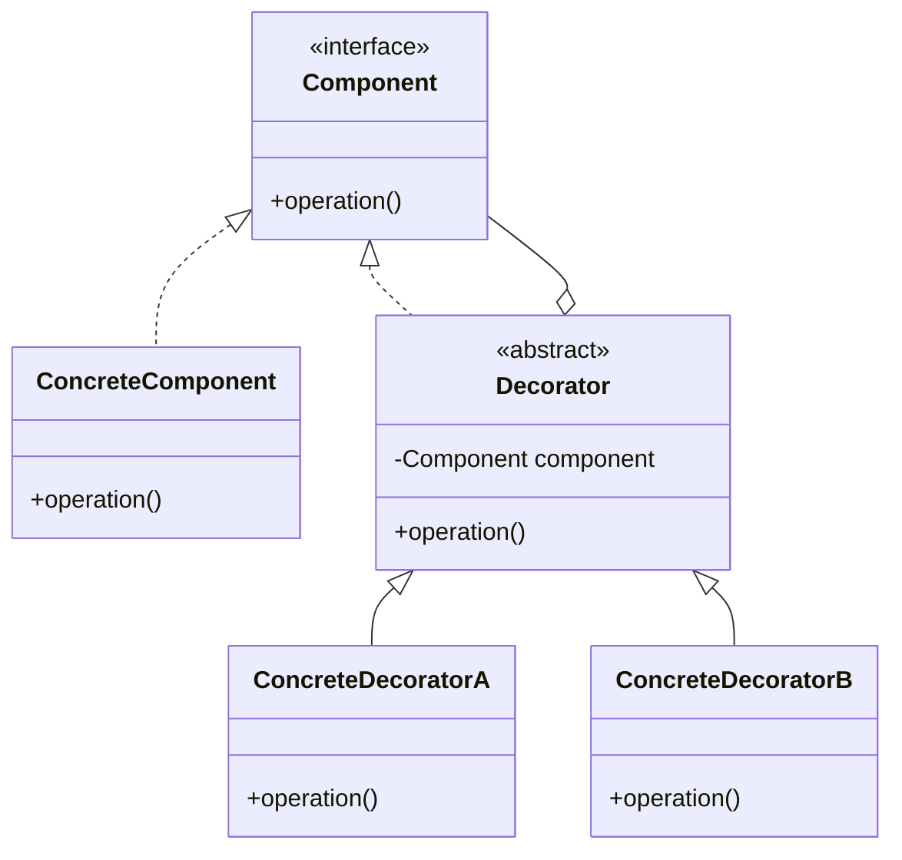

# Decorate it “All…” — Part 1 — **Decorator Pattern —** OOP — Java

> **The Decorator Pattern is one of the most elegant and powerful design patterns in object-oriented programming.**

It allows adding functionality to objects without changing their interface. Unlike many other patterns that often seem overly complex, the Decorator Pattern stands out for its simplicity and versatility.


> “Welcome to **Part 1** of my **5-part** blog series on how we can design and implement an object-oriented system from scratch.”


## 1. What is a Decorator?
---

A Decorator is a class that implements an interface while encapsulating an instance of the same interface. Through this composition, Decorators can add supplementary behavior without modifying the original implementation. The biggest advantage of Decorators lies in their composability — they make our code composable.

The following diagram visualizes the structure and roles in the Decorator Pattern.

A Decorator is a class that implements an interface while encapsulating an instance of the same interface. Through this composition, Decorators can add supplementary behavior without modifying the original implementation. The biggest advantage of Decorators lies in their composability – they make our code composable.

The following diagram visualizes the structure and roles in the Decorator Pattern.


**Explanation of the Roles:**

*   `Component` Interface or base class that defines the behavior.
*   `ConcreteComponent` Base class that implements the standard behavior.
*   `Decorator` Abstract class that implements the same interface as Component and holds a reference to a Component object (Delegation).
*   `ConcreteDecoratorA` and `ConcreteDecoratorB` Concrete Decorators that extend the behavior by overriding methods and delegating to the "inner" object.

### 1.1 Which Problems to solve with Decorators?

The Decorator Pattern is primarily a tool for adhering to two core principles of object-oriented design: the [**Single Responsibility Principle**](https://en.wikipedia.org/wiki/Single-responsibility_principle) **(SRP)** and the [**Open/Closed Principle**](https://en.wikipedia.org/wiki/Open%E2%80%93closed_principle) **(OCP)**. By solving problems related to these principles, Decorators significantly improve code quality, maintainability, and testability.

### 1.2 Violation of the Single Responsibility Principle (SRP)

**Problem:** When a single class attempts to handle both its fundamental **business logic** (what it does) and various **cross-cutting concerns** (how it’s managed, e.g., logging, validation, thread safety). This leads to a bloated, “God Object” that has multiple reasons to change.

### 1.3 Violation of the Open/Closed Principle (OCP)

**Problem:** OCP states that software entities should be **open for extension, but closed for modification**. Without Decorators, introducing a new requirement (e.g., adding validation, caching, or presentation formatting) often forces a modification of the original component class.

**Solution:** Decorators enable extension via composition rather than modification. To add new behavior, you simply write a new Decorator class and wrap the component, leaving the existing, tested code base untouched.

# 2. Decorating Approaches
----

### 2.1 Vertical or Horizontal

There are two fundamental approaches to Decorating: **Vertical** and **Horizontal**.

**2.1.1 Vertical Decorating**

Extends the same functionality by layering similar decorators.

```java

// base behavior to represent numbers
public interface Numbers {
    Iterable<Integer> values();
}
// concrete behavior that implements the standard behavior
public final class ArrayNumbers implements Numbers {
    private final List<Integer> list;
    public ArrayNumbers(Integer... values) {
        this.list = Arrays.asList(values);
    }
    @Override
    public Iterable<Integer> values() {
        return list;
    }
}
// ...behavior for only positive numbers 
public final class Positive implements Numbers {
    private final Numbers origin;
    public Positive(Numbers origin) {
        this.origin = origin;
    }
    @Override
    public Iterable<Integer> values() {
        List<Integer> out = new ArrayList<>();
        for (Integer i : origin.values()) {
            if (i != null && i > 0) {
                out.add(i);
            }
        }
        return out;
    }
}
// ...behavior for only odds...
public final class Odds implements Numbers {
    private final Numbers origin;
    public Odds(Numbers origin) {
        this.origin = origin;
    }
    @Override
    public Iterable<Integer> values() {
        List<Integer> out = new ArrayList<>(0);
        for (Integer i : origin.values()) {
            if (i != null && (i % 2) != 0) {
                out.add(i);
            }
        }
        return out;
    }
}
// ...only unique...
public final class Unique implements Numbers {
    private final Numbers origin;
    public Unique(Numbers origin) {
        this.origin = origin;
    }
    @Override
    public Iterable<Integer> values() {
        Set<Integer> out = new LinkedHashSet<>(0);
        for (Integer i : origin.values()) {
            if (i != null) {
                out.add(i);
            }
        }
        return out;
    }
}
// usage as vertical composition
Numbers numbers = new Sorted(  
    new Unique(  
        new Odds(  
            new Positive(  
                new ArrayNumbers(1, -2, 3, 0, 2)  
            )  
        )  
    )  
);
```

**Contract:** `Numbers.values()` returns a sequence of integers. Each decorator implements the same interface and exclusively modifies the result of the delegation—no mutation, no getters/setters.

**2.1.2 Horizontal Decorating**

Adds additional, possibly unrelated behaviors by composing multiple transformations in sequence.

```java

// base behavior
public interface Diff {
    Iterable<Integer> apply(Iterable<Integer> origin);  
}
// for horizontal composition
public final class Modified implements Numbers {
    private final Numbers origin;
    private final Diff[] diffs;
    public Modified(Numbers origin, Diff... diffs) {
        this.origin = origin;
        this.diffs = diffs;
    }
    @Override
    public Iterable<Integer> values() {
        Iterable<Integer> result = origin.values();
        for (Diff diff : diffs) {
            result = diff.apply(result);
        }
        return result;
    }
}
// usage of horizontal composition
Numbers numbers = new Modified(
    // input
    new ArrayNumbers(1, -2, 3, 0, 2), 
    // processing steps applied on input 
    new Positive(),  
    new Odds(),  
    new Unique(),  
    new Sorted()  
);
```

The `Diff` interface defines a transformation step for a **sequence** of integers. The `Modified` class enables horizontal composition: it takes an original `Numbers` object and applies a series of `Diff` transformations to its values, one after another. This allows you to **flexibly chain** multiple processing steps (such as filtering, mapping, or sorting) without creating deep decorator hierarchies.

You can combine any number of `Diff` implementations in a single `Modified` instance. Each `Diff` is applied in the order given, making the processing pipeline **explicit** and **easy to test**.

*   **Vertical Decorating** is simpler to implement and suitable for smaller objects with few methods.
*   As the number of Decorators grows, switching to **Horizontal Decorating** is recommended.

### 2.2 Validation

Instead of embedding validation logic directly into a class, we should use Validating Decorators:

```java
public interface Report {  
    void export(File file);  
}
public class NoNullReport implements Report {
    private final Report origin;
    NoNullReport(Report rep) {  
        this.origin = rep;  
    }
    @Override  
    public void export(File file) {  
        if (file == null) {  
            throw new IllegalArgumentException("File is NULL");  
        }  
        this.origin.export(file);  
    }  
}
public class NoWriteOverReport implements Report {
  
    private final Report origin;
    NoWriteOverReport(Report rep) {  
        this.origin = rep;  
    }
    @Override  
    public void export(File file) {  
        if (file.exists()) {  
            throw new IllegalArgumentException("File already exists");  
        }  
        this.origin.export(file);  
    }  
}
// usage
Report report = new NoNullReport(  
    new NoWriteOverReport(  
        new DefaultReport()  
    )  
);  
report.export(file);
```

This approach results in smaller objects, and **smaller objects mean higher maintainability**. The DefaultReport class remains small, regardless of how many validations are added in the future.

### 2.3 Synchronization — to be Thread-Safe

No class should need to be thread-safe; instead, all classes should provide synchronized Decorators.

```java
public interface Position {  
    void increment();  
}
public class SimplePosition implements Position {
    private int number = 0;
    @Override  
    public void increment() {  
        int before = this.number;  
        int after = before + 1;  
        this.number = after;  
    }  
}
public class SyncPosition implements Position {
    private final Position origin;
    public SyncPosition(Position pos) {  
        this.origin = pos;  
    }
    @Override  
    public synchronized void increment() {  
        this.origin.increment();  
    }  
}
// If thread-safety is needed
Position syncPosition = new SyncPosition(new SimplePosition());
// If not
Position position = new SimplePosition();
```

Making class functionality both extensive and thread-safe violates the Single Responsibility Principle.

### 2.4 Utility Classes

In many codebases, imperative Utility methods are found instead of Decorators. Classes like StringUtils, FileUtils, or IOUtils are typical examples of this approach. Utility classes only possess static methods and encapsulate no state. They lead to procedural code that is difficult to test and less maintainable.

Consider a Text interface:

```java
public interface Text {  
    String read();  
}
```

Imperative with Utility Methods **(Bad Design)**:

```java
Text text = new TextInFile(new File("/tmp/a.txt"));  
String content = text.read();
  
content = StringUtils.trim(content);  
content = StringUtils.toUpperCase(content);  
content = removeUnprintable(content);
```

Declarative with Decorators **(Good Design)**:

```java
Text text = new AllCapsText(  
    new TrimmedText(  
        new PrintableText(  
            new TextInFile(new File("/tmp/a.txt"))  
        )  
    )  
);  
String content = text.read();
```

In the declarative variant, a Text instance is first created through the composition of multiple Decorators, without anything being executed. Processing only begins when read() is called. This is a crucial difference from the imperative style.

### 2.5 Envelopes

Sometimes we need Decorators that merely aggregate other Decorators — so-called “[Decorating Envelopes](https://www.yegor256.com/2017/01/31/decorating-envelopes.html)”:

```java
// extends functionality inside a decorator class!!!
public class RsHtml implements Response {
   public RsHtml(final String text) {
        // delegate to a common constructor
        this(  
            new RsWithType(  
                new RsWithStatus(text, 200),  
                "text/html"  
            )  
        )  
    }
    // all Response methods are forwarded  
}
```

Instead of repeating the composition of Decorators everywhere, you use RsHtml. It is **very practical**, but the implementation is verbose, as all method calls must be forwarded.

### 2.6 Configurable Objects

Instead of configuring objects, create new objects with the desired behavior by composing them from smaller, immutable building blocks — such as decorators.

**Bad Example (Configurable):**

```java
public class Report {
    private boolean pretty;
    public void setPretty(boolean pretty) {
        this.pretty = pretty;
    }
    public String print() {
        if (pretty) {
            return "Pretty Report";
        }
        return "Plain Report";
    }
}
```

The behavior of `print()` depends on the internal state, which can change at any time.

**Good Example (Compositional, Immutable):**

```java

interface Report {
    String print();
}
final class PlainReport implements Report {
    @Override
    public String print() {
        return "Plain Report";
    }
}
final class PrettyReport implements Report {
    private final Report origin;
    public PrettyReport(Report origin) {
        this.origin = origin;
    }
    @Override
    public String print() {
        return "Pretty: " + origin.print();
    }
}
```

*   Each object has a single, well-defined behavior.
*   To change behavior, you compose a new object (e.g., wrap a `PlainReport` in a `PrettyReport`).

**Benefits**

*   **Immutability:** Objects never change after construction.
*   **Predictability:** Behavior is clear and fixed.
*   **Testability:** Each behavior can be tested in isolation.
*   **Extensibility:** New behaviors are added by creating new classes, not by adding configuration options.

**Summary**
Don’t make objects configurable. Instead, use composition and decorators to create objects with the exact behavior you need — immutable, predictable, and easy to test.

### 2.7 Model-View-Controller

In classic MVC architectures (Model-View-Controller), presentation logic is separated from domain logic. With the Decorator Pattern, however, presentation logic can be implemented as an extension of the model through composition.

**2.7.1 Classic MVC**

*   **Separation of Model and View:** The Model contains only the data and business logic. The View is a separate layer that “observes” the Model and renders its data.
*   **Controller:** Mediates between Model and View, receives user input, and updates the Model and/or View.
*   **Presentation Logic:** Resides in the View or the Controller. The Model knows nothing about its presentation.

**Typical:** View asks the Model for data (e.g.`user.getName()`) and renders it. **Example (classic MVC):**

```java
// Model
public class User {
    String name;
    public String getName() {
        return name;
    }
}
// View  
public class UserView {
    public void render(User user) {  
        System.out.println("<span>" + user.getName() + "</span>");  
    }
}
```

**2.7.2 Object-Oriented MVC (with Decorator)**

Presentation and Contoller Decorator for a Model.
**Example (OOP - MVC):**

```java
public interface User {  
    String name();  
}

public class SimpleUser implements User {
    private final String name;
    public SimpleUser(String name) {  
        this.name = name;  
    }
    @Override  
    public String name() {  
        return name;  
    }  
}

// Decorator for HTML presentation  
public class HtmlUser implements User {
    private final User origin;
    public HtmlUser(User origin) {  
        this.origin = origin;  
    }
    @Override  
    public String name() {  
        return "<span class='user'>" + origin.name() + "</span>";  
    }  
}

// Decorator for JSON formatting
public class JsonUser implements User {
    private final User origin;
    public JsonUser(User origin) {  
        this.origin = origin;  
    }
    @Override  
    public String name() {  
        return "{"user": "" + origin.name() + ""}";  
    }  
}

// Usage

// view
User user = new HtmlUser(  
    // controller  
    new JsonUser(  
        // model  
        new SimpleUser("Alice")  
    )  
); 
// result: <span class='user'>{"user": "Alice"}</span>
System.out.println(user.name());
```

**Impact on Maintainability**

*   **Modularity:** Presentation logic is cleanly encapsulated. New presentation forms (e.g., Markdown, XML) can be added as additional Decorators without changing existing classes.
*   **Open for Extension:** The Model remains unchanged; Decorators can be combined arbitrarily.
*   **No Inheritance Hierarchy:** No deep inheritance trees, but flat, independent Decorator classes.

**Impact on Testing Strategy**

*   **Isolated Tests:** Every Decorator can be tested independently. For example, HtmlUser can be tested with a Mock-User without knowing the implementation of SimpleUser.
*   **Testable Combinatorics:** The combination of different Decorators can be specifically tested to ensure they work together correctly.
*   **Mocking Unnecessary:** Since Decorators implement the interface, they can be used directly as Test Doubles.

**Example of a Unit Test (JUnit):**

```java
@Test  
void rendersHtmlUser() {  
    User user = new HtmlUser(() -> "Bob");  
    assertEquals("<span class='user'>Bob</span>", user.name());  
}
```

**Conclusion:**

With MVC Decoration, presentation logic becomes **modular**, **testable**, and arbitrarily **extensible**. The strict separation of Model and View is replaced by composition — this significantly **increases maintainability** and **simplifies testing**.

### 2.8 Transactional DataAccess

The database layer often suffers from the **Single Responsibility Principle (SRP) violation**, particularly in Data Access Objects (DAOs). A typical DAO often mixes two distinct responsibilities:

1.  **Data Manipulation Logic:** Executing SQL queries (`SELECT`, `UPDATE`, etc.) using `PreparedStatement`.
2.  **Transaction Management:** Controlling the connection lifecycle, including `setAutoCommit(false)`, `commit()`, and `rollback()`.

Mixing these concerns makes the class difficult to test (you need to mock the full transaction logic) and less flexible (you cannot easily compose operations into a larger transaction).

**Solution:** Use a Decorator to separate the responsibilities. The core component handles only the SQL execution, while the Decorator handles the transactional boundary.

**Example: Separating Product Stock Update (Logic) from Transaction Control (Decorator)**

**2.8.1 The Component Interface (The Capability):**

```java
import java.sql.SQLException;
// Base interface for a group of products as collections
public interface Products {
    /**
     * Updates the stock quantity for a given product.
     *
     * @param sku The product SKU.
     * @param delta The change in quantity (positive for increase, negative for decrease).
     * @throws SQLException If a database error occurs during the update.
     */
    void updateStock(String sku, int delta) throws SQLException;
}
```

**2.8.2 The Concrete Component (Pure Logic, No Transaction Control):**

This class only implements the necessary SQL logic. It assumes it is given an open `Connection` which will be committed or rolled back by an external entity (the Decorator).

```java
import java.sql.Connection;
import java.sql.PreparedStatement;
import java.sql.SQLException;

public class JdbcProducts implements Products {
    // The core component uses the connection provided to it.
    private final Connection connection;
    public JdbcProducts(Connection connection) {
        this.connection = connection;
    }
    @Override
    public void updateStock(String sku, int delta) throws SQLException {
        // Only implements the Data Manipulation (the 'what').
        // No commit/rollback logic here.
        String sql = "UPDATE product_stock SET quantity = quantity + ? WHERE sku = ?";
        try (PreparedStatement stmt = this.connection.prepareStatement(sql)) {
            stmt.setInt(1, delta);
            stmt.setString(2, sku);
            int rows = stmt.executeUpdate();
            if (rows == 0) {
                // Example of business validation logic (still acceptable in the component)
                throw new SQLException("Product with SKU " + sku + " not found.");
            }
        }
        // Connection is left open for the Decorator to manage.
    }
}
```

**2.8.3 The Transaction Decorator (Pure Transaction Control):**

This Decorator’s only responsibility is to manage the `Connection`'s transactional state, ensuring atomicity for the delegated operation.

```java
import java.sql.Connection;
import java.sql.SQLException;

public class TransactionalProducts implements Products {
    // The inner component (the logic)
    private final Products origin;
    // The connection instance whose transaction we manage
    private final Connection connection;
    public TransactionalProducts(Products origin, Connection connection) {
        this.origin = origin;
        this.connection = connection;
    }
    @Override
    public void updateStock(String sku, int delta) throws SQLException {
        boolean originalAutoCommit = this.connection.getAutoCommit();
        try {
            this.connection.setAutoCommit(false); // Start transaction
            this.origin.updateStock(sku, delta);  // Execute business logic
            this.connection.commit();             // Commit on success
        } catch (SQLException e) {
            this.connection.rollback();           // Rollback on failure
            throw e;
        } finally {
            // Ensure connection state is restored
            this.connection.setAutoCommit(originalAutoCommit);
            // In a real application, the connection might be closed here
            // or returned to a pool, depending on the architecture.
        }
    }
}
```

**Usage (Composition):** The client code composes the behavior.

```java
Connection conn = dataSource.getConnection(); // Assume we get a connection
Products coreLogic = new JdbcProducts(conn);
Products transactionalLogic = new TransactionalProducts(coreLogic, conn);
// The call now executes the update logic wrapped in a transaction.
transactionalLogic.updateStock("BOOK-001", -1);
```

By using the Decorator Pattern, the `JdbcProducts` class is dedicated to its single responsibility (SQL execution), and the `TransactionalProducts` Decorator is dedicated to its single responsibility (Transaction Management). This leads to modular, reusable, and highly testable code.

### 2.9 Aggregate Objects — Relations and Queries

**Problem:** Directly exposing internal, mutable collections (e.g., `tasks.getCollection().add(newTask)`) violates the encapsulation and integrity of the **Aggregate Root** (the root class of an entity group). The caller gains the ability to manipulate child objects externally and uncontrollably.

**Solution: Custom Collection Objects and Decorator Queries:**
Native collections (such as `List`, `Set`) must always be encapsulated within **Custom Collection Objects** (e.g., `Posts`, `Tasks`) that define the behavior for the group and prevent the [_"Naked Data"_](https://www.yegor256.com/2016/11/21/naked-data.html) anti-pattern.

In the Decorator context, we can decorate these Custom Collection Objects themselves to provide _filtered views_ or _relations_ to the base collection without modifying the original collection.

**Examples of Encapsulating Filters/Queries as Decorators:**

The `Posts` interface serves as the foundation for all collection and query objects. All operations that return a filtered view do so via a new Decorator.

```java
// Base interface for collections
interface Posts {
// Returns all elements (by default) 
    Iterable<Post> iterate();
    // Commands for modification run through the Aggregate Root
    Post add(Date date, String title); 
}
// 1. Decoration as Filter (Predicate-based Query)
public class FiltredPosts implements Posts {
    // Decorates the original Posts collection
    public FiltredPosts(Posts origin, Predicate<Post> filter){
      // ...
    }
    
    // Applies the filter during iteration (Decorator logic)
    public Iterable<Post> iterate(){
      // ...filters origin.iterate() by predicate...
    }
    
    // Commands (Mutation) are forwarded
    public Post add(Date date, String title){
        return origin.add(date, title);
    }
}
// 2. Decoration as Relation (Author-based Query/View)
public class AuthorPosts implements Posts {
    // Passed the base collection and the filtering condition (authorId)
    public AuthorPosts(Posts origin, String authorId){
        // ...
    }
    
    // Applies the author relation during iteration
    public Iterable<Post> iterate(){
        // ...filters origin.iterate() by authorId...
    }
    
    // Commands are forwarded
    public Post add(Date date, String title){
        return origin.add(date, title);
    }
}
// Usage: 
// Base Collection also a decorator (e.g., from the database)
Posts allPosts = new DatabasePosts();
// Decorated Views/Queries
Posts userPosts = new AuthorPosts(allPosts, "alice123");
Posts recentUserPosts = new FiltredPosts(userPosts, post -> isRecent(post));
```

The Custom Collection Object must function as the **Aggregate Root**. All additions, deletions, or modifications (Commands) must strictly occur via the Command methods of the Aggregate Root (`posts.add(newPost)`). This ensures referential integrity and consistent validation logic for the entire aggregate.

*   **Queries** are implemented as **Decorator objects** (such as `FiltredPosts` or `AuthorPosts`) that provide immutable views of the base collection.
*   **Mutations (Commands)** are always delegated to the base collection, which encapsulates the write operations.
*   The internal representation of the collection should never be visible outside the Aggregate Root.

# 3. Advance Techniques
----------------------

Delegation is the technical foundation of the Decorator Pattern. With large interfaces, the pure forwarding of many methods can lead to boilerplate. The following techniques reduce this effort without compromising the principles of “_True_” **Encapsulation**, **Immutability**, and **Composition** over Inheritance.

### **3.1 Abstract Envelope**

A **central Envelope** base class implements the interface completely and forwards all calls to origin. Concrete Decorators only override the methods they actually modify.

```java
public interface Document {
  
    String read();
  
    void write(String content);
  
    int pageCount();
  
    void print();
  
}
// Central Delegation Base Class  
public abstract class DocumentEnvelope implements Document {
    protected final Document origin;
    protected DocumentEnvelope(final Document origin) {  
        this.origin = origin;  
    }
    @Override
    public String read() {  
        return origin.read();  
    }
    @Override
    public void write(final String content) {  
        origin.write(content);  
    }
  
    @Override
    public int pageCount() {  
        return origin.pageCount();  
    }
    @Override
    public void print() {  
        origin.print();  
    }  
}
// Small, focused Decorator  
public final class LoggingDocument extends DocumentEnvelope {
    public LoggingDocument(final Document origin) {  
        super(origin);  
    }
    @Override
    public void print() {  
        System.out.println("print() called");  
        super.print(); // delegates to the Envelope  
    }  
}
```

**Advantage:** One-time boilerplate in the Envelope, minimal work per Decorator afterward. Fits directly with [_Decorating Envelopes_](https://www.yegor256.com/2017/01/31/decorating-envelopes.html).

### 3.2 **Recurring Chains — Mini‑Factory**

Common Decorator combinations are encapsulated in a Mini‑Factory/Envelope so that the wiring is not repeated everywhere.

```java
public class PermissionCheckedDocument extends DocumentEnvelope {
    private final Supplier<Boolean> allowed;
    public PermissionCheckedDocument(Document origin, 
                                      Supplier<Boolean> allowed) {  
        super(origin);  
        this.allowed = Objects.requireNonNull(allowed);  
    }
    @Override  
    public void write(final String content) {  
        if (!allowed.get()) {  
            throw new SecurityException("Write not allowed");  
        }  
        super.write(content);  
    }  
}
public class SecureLoggedDocument extends DocumentEnvelope {
    public SecureLoggedDocument(Document origin, 
                                      Supplier<Boolean> allowed) {  
        // Combines Permission-Check + Logging  
        super(new LoggingDocument(new PermissionCheckedDocument(origin, allowed)));  
    }  
}
// Usage:  
Document doc = new SecureLoggedDocument(  
    new FileDocument(  
            Path.of("doc.pdf")  
    ),  
    () -> currentUser().canWrite()  
);
doc.write("…");
```

**Advantage:** One class encapsulates the common combination, production code remains lean.

### 3.3 Default Methods — Interface (Java 8+)

If standard behavior is semantically meaningful, Default Methods can encapsulate delegation for common variations. The Decorator (or the object) implements only the methods that truly differ.

```java
@FunctionalInterface  
public interface Text {
    String read();
    default Text trimmed() {  
        return () -> read().trim();  
    }
    default Text upperCased() {  
        return () -> read().toUpperCase();  
    }
}
// Usage without new classes:  
Text t = new TextInFile(Path.of("/tmp/a.txt"))  
                        .trimmed()  
                        .upperCased();
String content = t.read();
```

**Note:** Default methods are part of the contract. Use them sparingly, only when they are functionally correct.

### 3.4 Single‑Method‑Interfaces (SAM)

With Single‑Abstract‑Method (SAM) Interfaces, delegation can be extremely lightweight.

```java

@FunctionalInterface  
public interface Text {  
    String read();  
}
// Universal, composable Decorator  
public class MappedText implements Text {
    private Text origin;  
    private Function<String, String> mapping;
    public MappedText(Text origin, Function<String, String> mapping) {  
        this.origin = origin;  
        this.mapping = mapping;  
    }
    @Override  
    public String read() {  
        return mapping.apply(origin.read());  
    }  
}
// Usage  
Text original = new TextInFile(Path.of("/tmp/a.txt"));  
Text upper = new MappedText(original, String::toUpperCase);  
Text trimmedUpper = new MappedText(upper, String::trim);  
String content = trimmedUpper.read();
// Or inline with Lambdas  
Text t = () -> original.read().trim().toUpperCase();
```

**Advantage:** Minimal code, maximum composition. Ideal for [Printers Instead of Getters](https://www.yegor256.com/2016/04/05/printers-instead-of-getters.html) and behavior-oriented APIs.

# 4. Fluent Interfaces vs. Decorators
---------------

[Fluent Interface](https://martinfowler.com/bliki/FluentInterface.html)s, are a very convenient way to communicate with objects. They make Facades easier to use but ruin the internal design and significantly complicate maintainability.

**Example of a Fluent Interface:**

```java
String html = new JdkRequest("https://www.google.com")  
    .method("GET")  
    .fetch()  
    .as(RestResponse.class)  
    .assertStatus(200)  
    .body();
```

This looks elegant and reads almost like natural language. But the internal design suffers massively:

**The Problems with Fluent Interfaces:**

**Large, Bloated Classes:** The JdkRequest class must contain the methods method(), fetch(), and many others. If new functionality is needed, the class must continually grow.

1.  **Difficult Extensibility:** Every new function means new methods in already large classes. This heavily violates the Single Responsibility Principle.
2.  **Maintenance Problems:** With 43 methods (as in Java’s Stream API), the class becomes a nightmare for maintainers.
3.  **Violation of OOP Principles:** Fluent Interfaces lead to poor cohesion and tight coupling.

**The Better Alternative with Decorators:**

```java
String html = new BodyOfResponse(  
    new ResponseAssertStatus(  
        new FetchedResponse(  
            new RequestWithMethod(  
                new JdkRequest("https://www.google.com"),  
                "GET"  
            )  
        ),  
        200  
    )  
).toString();
```

**Advantages of this Solution:**

1.  **Small, Focused Classes:** Each class has a single responsibility.
2.  **Easy Extensibility:** New functionality = new Decorator class, no change to existing classes.
3.  **Simplified Testing:** Small classes are easier to test.
4.  **Immutability:** All classes can be immutable.
5.  **Loose Coupling:** Decorators are independent of each other.

The disadvantage is that the syntax looks less like a domain-specific language (DSL), but this is a small price for the significantly better maintainability.

**The Conflict:**

There appears to be a conflict between usability and maintainability:

*   Fluent Interfaces are good for users but bad for developers.
*   Small objects are good for developers but harder to use.

However, this conflict only exists if one is accustomed to large classes and procedural programming.

> _For true OOP developers, a_ **_large number of small classes is an advantage_**_, not a disadvantage. —_ **(Yegor Bugayenko)**

**Pragmatic Checklist**

*   **Apply ISP:** Functionally decompose large interfaces (Readable/Writable/Printable…).
*   **Envelope Base Class:** Delegate centrally once, only override the delta per Decorator.
*   **Default Methods:** Only for stable, semantically correct standard logic.
*   **Mini-Factory/Envelopes:** Encapsulate recurring chains, no copy‑paste.
*   **SAM Interfaces:** Prefer for behavior-oriented, small contracts.

# 5. Limits and Drawbacks
---

Despite all its advantages, the Decorator Pattern also has limitations and drawbacks that one should be aware of:

### 5.1 Complexity and “Decorator Soup”

The biggest problem is the potential complexity resulting from many nested Decorators. Excessive use can create a confusing hierarchy that is difficult to understand. This is sometimes referred to as “Decorator Soup” — a convoluted class hierarchy.

```java
String result = new UpperCaseText(  
    new TrimmedText(  
        new EncodedText(  
            new ValidatedText(  
                new CachedText(  
                    new LoggedText(  
                        new TextInFile("data.txt")  
                    )  
                )  
            )  
        )  
    )  
).read();
```

With too many Decorators, it becomes difficult to maintain an overview.

### 5.2 Object Identity and Type Checking

A Decorator and its wrapped component are not identical, so type checks maybe fail. This can lead to unexpected behavior in code that relies on object identity, such as equality checks with ===.

```java
Text original = new SimpleText("Hello");  
Text decorated = new UpperCaseText(original);
// This fails:  
if (decorated instanceof SimpleText) {  
    // Will never be executed  
}
```

→ Design your system so that you never need to know the concrete type of an object. If you find yourself needing `instanceof`, it's a sign your abstraction may need improvement.

**Solution:
**Delegation helps avoid the need for `instanceof` checks by ensuring that all behavior is accessed through a common interface, and each decorator simply delegates calls to the next object in the chain. Here’s how this solves the problem:

```java

Text original = new SimpleText("Hello");
Text decorated = new UpperCaseText(original);
// Instead of:
if (decorated instanceof SimpleText) {
    // ...
}
// Just use:
System.out.println(decorated.read()); // Always works, regardless of the decorator chain
```

*   **Polymorphism:**
    When you use delegation, you interact with objects only through their interface (e.g., `Text`). You don’t care about the concrete type—just that the object fulfills the contract.
*   **No Type Checks Needed:**
    Since every decorator implements the same interface and delegates to the next, you never need to check for a specific implementation with `instanceof`. You just call the method you need.
*   **Extensibility:**
    New behaviors can be added by creating new decorators, without changing existing code or adding more type checks.

Delegation replaces the need for `instanceof` by letting you treat all objects uniformly through their interface. This leads to more flexible, maintainable, and truly object-oriented code.

### 5.3 Increased Number of Classes

Implementing Decorators for multiple features leads to many classes. This can make the codebase more extensive and harder to manage, especially with numerous Decorator combinations.

### 5.4 Performance Overhead

Each Decorator introduces one layer of method delegation, which can lead to a slight performance overhead. With deep Decorator chains, this can become measurable, although it is rarely a real problem in practice.

### 5.5 Instantiation Complexity

Decorators can complicate the component instantiation process, as one must not only instantiate the component but also wrap it in several Decorators.

### 5.6 Limitations in Interface Inheritance

The Decorator Pattern is based on interface inheritance and can therefore only extend the behavior of objects through interfaces or abstract classes. It cannot add new data fields to the original object.

### 5.7 The Problem with Test Data

An interesting aspect from the testing perspective: While the Builder Pattern (related to Decorators) works well for test data, the Object Mother Pattern can become problematic when there are many variations of the test data.

**Object Mother vs. Test Data Builder:**

The Object Mother Pattern is an attempt to provide complex test objects:

```java
// Object Mother approach  
Invoice invoice = TestInvoices.newDeerstalkerAndCapeInvoice();
```

**The problem and Solution:** Over the time, the _Object Mother_ becomes bloated, confusing, and difficult to maintain. A new factory method must be added for every new variation. A helpfull approach is _Test Data Builders_ (a form of Decorators):

```java
Invoice invoice = new InvoiceBuilder()  
    .withRecipient("Sherlock Holmes")  
    .withAddress("221b Baker Street")  
    .withItem(new ItemBuilder().withName("Deerstalker").build())  
    .build();
```

**Test Data Builders** make it easier to create test data inline without making tests brittle or creating much duplication. Tests are isolated from the aspects of the object structure that are irrelevant to the test.

# 6. When NOT to Use Decorators
---------

*   **For Simple Functionality:** If the functionality to be added is very simple, it may be easier to add it directly to the class rather than creating a new Decorator.
*   **For Third-Party Classes:** It is often difficult to apply the Decorator Pattern to third-party component classes.
*   **For Final Classes:** Many programming languages have the final keyword, which prevents further extension of a class.

# 7. Pragmatic Approach
----------------------

The solution lies in pragmatic use:

1.  **For small interfaces** (1–3 methods): Use Vertical Decorating.
2.  **For large interfaces:** Consider Horizontal Decorating or a Facade.
3.  **For only for tests**: Combine Object Mother with Test Data Builders
4.  **In production code:** Use Decorating Envelopes to encapsulate common combinations.

The Decorator Pattern is powerful, but like all patterns, it should be used with caution. The pattern can lead to a system of “many small objects” that all look alike to the maintainer — this can be a maintenance nightmare.

# 8. References
--------------

**Primary Sources (Yegor Bugayenko)**

1.  [Vertical and Horizontal Decorating (2015)](https://www.yegor256.com/2015/10/01/vertical-horizontal-decorating.html)
2.  [Composable Decorators vs. Imperative Utility Methods (2015)](https://www.yegor256.com/2015/02/26/composable-decorators.html)
3.  [Defensive Programming via Validating Decorators (2016)](https://www.yegor256.com/2016/01/26/defensive-programming.html)
4.  [Synchronized Decorators to Replace Thread-Safe Classes (2017)](https://www.yegor256.com/2017/01/17/synchronized-decorators.html)
5.  [Decorating Envelopes (2017)](https://www.yegor256.com/2017/01/31/decorating-envelopes.html)
6.  [OOP Alternative to Utility Classes (2014)](https://www.yegor256.com/2014/05/05/oop-alternative-to-utility-classes.html)
7.  [Object Behavior Must Not Be Configurable (2016)](https://www.yegor256.com/2016/04/19/object-must-not-be-configurable.html)
8.  [Printers Instead of Getters (2016)](https://www.yegor256.com/2016/04/05/printers-instead-of-getters.html)
9.  [MVC vs OOP (2016)](https://www.yegor256.com/2016/12/13/mvc-vs-oop.html)
10. [Encapsulation Covers Up Naked Data](https://www.yegor256.com/2016/11/21/naked-data.html)
11. [Fluent Interfaces Are Bad for Maintainability (2018)](https://www.yegor256.com/2018/03/13/fluent-interfaces.html)

**Secondary Sources**

1. [Test Data Builders: an alternative to the Object Mother pattern (2007) — Nat Pryce](http://www.natpryce.com/articles/000714.html)
2. [Fluent Interface — by Martin Fowler (2005)](https://martinfowler.com/bliki/FluentInterface.html)

**Technical References**

*   Design Patterns: Elements of Reusable Object-Oriented Software (Gang of Four)
*   Effective Java by Joshua Bloch
*   Growing Object-Oriented Software, Guided by Tests by Steve Freeman, Nat Pryce

**Further Reading**

*   Bugayenko, Y. (2016). _Elegant Objects, Volume 1_
*   Bugayenko, Y. (2017). _Elegant Objects, Volume 2_
*   Gang of Four: _Design Patterns: Elements of Reusable Object-Oriented Software_

**🙋‍♂️I’d love to hear your thoughts!
👉 Please feel free to comment or clap 👏 if you found this helpful.**
