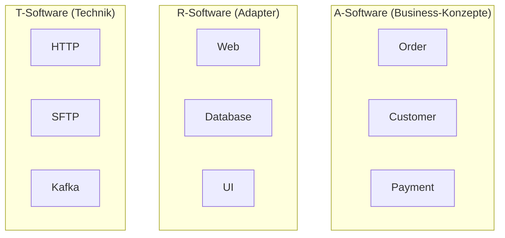
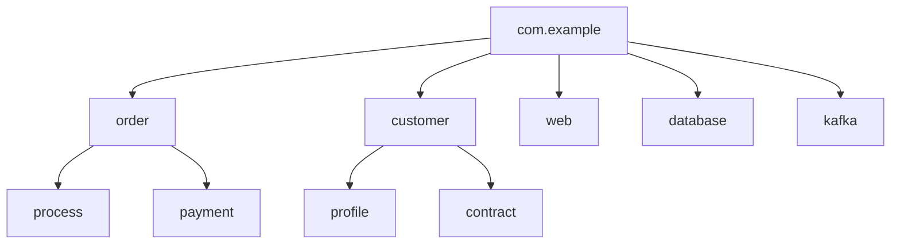

# Kontextgetriebenes Paketdesign – Schließen der mentalen Übersetzungslücke zwischen Architektur und Code

## 1. Problemanalyse und Zielsetzung

### 1.1 Problemanalyse

Die Diskrepanz zwischen Architekturdiagrammen und tatsächlichem Code ist eines der größten ungelösten Probleme der Softwareentwicklung.  
Studien zeigen, dass **82% aller Architekturdiagramme nicht mit der realen Code-Struktur übereinstimmen** (Brown, 2015).  

Diese **mentale Übersetzungslücke** kostet Teams wertvolle Zeit, führt zu Missverständnissen und erhöhten Wartungskosten.  
Sie manifestiert sich in drei Schlüsselbereichen:

1. **Terminologie-Chaos** (Brown, 2015):  
   * Inkonsistente (Paket-)namen durch mehrdeutige Terminologie  
   * Beispiel: *Service* kann bedeuten:  
     * Spring-Service (`@Service`)  
     * Business-Logik-Klasse  
     * Deployierbares Artefakt  

2. **Modell-Code-Lücke** (Brown, 2015):  
   * 82% der Diagramme stimmen nicht mit der Codestruktur überein  
   * Typisches Teamzitat: *"Our architecture diagrams don't match the code."*  

3. **Technologie-Fokus** (Hauer, 2020):  
   * Package-by-Layer-Ansätze erschweren Business-Feature-Entwicklung  
   * Traditionelle Paketstrukturen folgen technischen Schichten und reflektieren keine Business-Konzepte  
   * Folge: Hohe Kopplung und erschwerte Wartbarkeit  

### 1.2 Zielsetzung

**Hypothese**:  
Die Anwendung der **3 pragmatischen Regeln von Robert Bräutigam** zum Strukturieren von Paketen  
führt zu einem Paketdesign, das sowohl den **Paketdesign-Prinzipien von Robert C. Martin** (Kluth, 2010) entspricht  
als auch die **Übersetzungslücke zwischen Kontext-Diagrammen und Code-Struktur** schließt.

---

## 2. Theoretische Grundlagen

### 2.1 Abgrenzung der Terminologie nach OOP

Eine konsistente Terminologie ist die Basis für jedes Architektur- und Paketdesign.  
Unterscheidung nach objektorientierter Terminologie:  

- **Klassen**: kleinste, ausführbare Einheit von Verhalten und Daten  
- **Pakete**: Gruppierung von Klassen mit gemeinsamer Verantwortlichkeit  
- **Artefakte**: Deployierbare Einheiten (z. B. JAR, WAR, Docker-Image)  
- **Module**: Übergeordnete Strukturen, die mehrere Pakete umfassen können  

👉 **Konsistenzregel**: Ein Begriff muss im Code **immer dieselbe Bedeutung** haben, unabhängig vom Kontext.  

---

### 2.2 Abgleich der 3 Regeln (Bräutigam) mit Paketdesign-Prinzipien (Martin)

**Die 3 Regeln nach Bräutigam**:

1. Pakete sollten nie von Subpaketen abhängen  
2. Subpakete dürfen keine neuen Konzepte einführen, nur Details  
3. Pakete sollten Business-Konzepte widerspiegeln  

**Abgleich mit Martin-Prinzipien** (Martin, 2000):  

- **Acyclic Dependencies Principle (ADP)**  
  → unterstützt Regel 1: Vermeidung zirkulärer Abhängigkeiten  
- **Stable Dependencies Principle (SDP)**  
  → unterstützt Regel 2: Details hängen von Abstraktionen ab, nicht umgekehrt  
- **Common Closure Principle (CCP)**  
  → unterstützt Regel 3: Klassen, die gemeinsam geändert werden, gehören in dasselbe Paket  

👉 Ergebnis: Bräutigams Regeln sind eine pragmatische Konkretisierung der abstrakten Paketprinzipien von Martin.  

---

### 2.3 Erweiterte Betrachtung mit Ubiquitous Language (DDD, Evans 2003)

**Domain-Driven Design (DDD)** führt die Idee der *Ubiquitous Language* ein:  
Eine gemeinsame Sprache zwischen Fachdomäne und Entwicklern, die sich **im Code widerspiegelt**.  

- **Pakete als sprachliche Marker**:  
  Ein Paketname wie `order` oder `customer` spiegelt den Bounded Context wider  
- **Vermeidung technischer Namen**:  
  Statt `controller`, `repository` oder `impl` → sprechende Fachbegriffe wie `order.process`, `order.payment`  

👉 **Vorteil**: Architekturdiagramme und Code sprechen dieselbe Sprache → die Übersetzungslücke schrumpft.  

---

### 2.4 Erweiterte Betrachtung mit den 3 Software-Kategorien (Quasar, Siedersleben 2008)

Siedersleben unterscheidet drei Arten von Software (A/T/R), die sich klar in Paketstrukturen abbilden lassen:  

- **A-Software (Application)**  
  *Reine Business-Konzepte / Domäne*  
  *Beispiele*: `order`, `customer`, `payment`, `money`  

- **R-Software (Resources/Adapter)**  
  *Adapter, die A-Software mit technischer Infrastruktur verbinden*  
  *Beispiele*: `web`, `ui`, `database`, `rest`  

- **T-Software (Technical)**  
  *Technische, wiederverwendbare Bibliotheken, ohne Business- oder Adapter-Logik*  
  *Beispiele*: `http`, `sftp`, `kafka`  

👉 Klarheit entsteht durch die **strikte Trennung** dieser drei Kategorien in Paketen.  

---

## 3. Synthese

Die Synthese kombiniert drei Dimensionen:

1. **3 Regeln nach Bräutigam**  
   → verhindern falsche Abhängigkeiten und betonen Business-Konzepte  
2. **3 Kategorien nach Siedersleben (A/T/R)**  
   → liefern eine klare strukturelle Schichtung  
3. **Paketdesign-Prinzipien nach Martin**  
   → sichern Stabilität, Kohäsion und Verständlichkeit  

---

### 3.1 Grafische Darstellung der A/T/R-Kategorien



```
    O1 --> R1
    O2 --> R2
    O3 --> R3
    R1 --> T1
    R2 --> T2
    R3 --> T3
```
👉 Dieses Diagramm zeigt die klare Trennung:

A-Pakete enthalten die Business-Domäne.
R-Pakete verbinden die Domäne mit der Infrastruktur.
T-Pakete liefern technische Services, auf die Adapter aufbauen.

### 3.2 Beispiel einer resultierenden Paketstruktur



👉 Vorteile:

Business-Pakete (order, customer) stehen im Vordergrund.
Adapter-Pakete (web, database) sind klar abgetrennt.
Technische Pakete (kafka) liegen separat.

## 4. Validierung an Architekturen
Die Synthese lässt sich auf verschiedene Architekturparadigmen anwenden:

Domain-Driven Design (DDD)
Bounded Contexts = A-Software-Pakete
Ubiquitous Language im Code

Clean Architecture
A-Software = Entities + Use Cases
R-Software = Interface Adapters
T-Software = Frameworks & Drivers

Java EE / Jakarta EE Stack
Business-Pakete (EJBs, Entities) als A-Software
Technische Ressourcen (JPA, Servlets) als R- und T-Software

👉 Ergebnis: Die Synthese ist architekturunabhängig einsetzbar.

## 5. Verifikation durch Metriken
Zur objektiven Verifikation eignen sich die Martin-Metriken (1994):

Instability (I) = fan-out / (fan-in + fan-out)
Abstractness (A) = abstrakte Klassen / alle Klassen
Distance (D) = |A + I - 1|

👉 Erwartung bei Anwendung der Synthese:

A-Software: stabil, mittlere Abstraktion
R-Software: eher instabil, niedrige Abstraktion
T-Software: hoch abstrakt, stabil

Ein Vergleich von Architekturen (klassisch vs. Synthese) zeigt:
Bessere Werte für Kopplung/Kohäsion
Deutlich klarere Abgrenzung von Verantwortlichkeiten
Höhere Wartbarkeit und geringere mentale Übersetzungslücke

## 6. Fazit
Die Synthese aus den 3 Regeln (Bräutigam), den 3 Software-Kategorien (Siedersleben) und den Paketdesign-Prinzipien (Martin) liefert ein praktikables und validierbares Modell für Paketstrukturen.

Sie:
schließt die mentale Übersetzungslücke zwischen Diagrammen und Code
schafft Klarheit durch konsistente Terminologie
fördert fachliche Lesbarkeit durch Ubiquitous Language
validiert sich durch Messbarkeit mit Martin-Metriken

👉 Damit wird Paketdesign von einer zufälligen Ordnerstruktur zu einem architektonischen Werkzeug, das Verständlichkeit, Wartbarkeit und Teamkommunikation nachhaltig verbessert.

## 7. Zusammenfassung in einem Bild

```flowchart TB
    subgraph Business["A-Software (Business)"]
        A1[Order]
        A2[Customer]
        A3[Payment]
    end
    
    subgraph Adapter["R-Software (Adapter)"]
        R1[Web-API]
        R2[Database]
        R3[UI]
    end
    
    subgraph Technik["T-Software (Technik)"]
        T1[HTTP Lib]
        T2[SFTP Lib]
        T3[Kafka Client]
    end

```
Business --> Adapter
Adapter --> Technik

👉 Die Synthese ist in einem Schaubild zusammengefasst:
Oben: Fachliche Business-Konzepte
Mitte: Adapter zur Infrastruktur
Unten: Technische Bibliotheken
