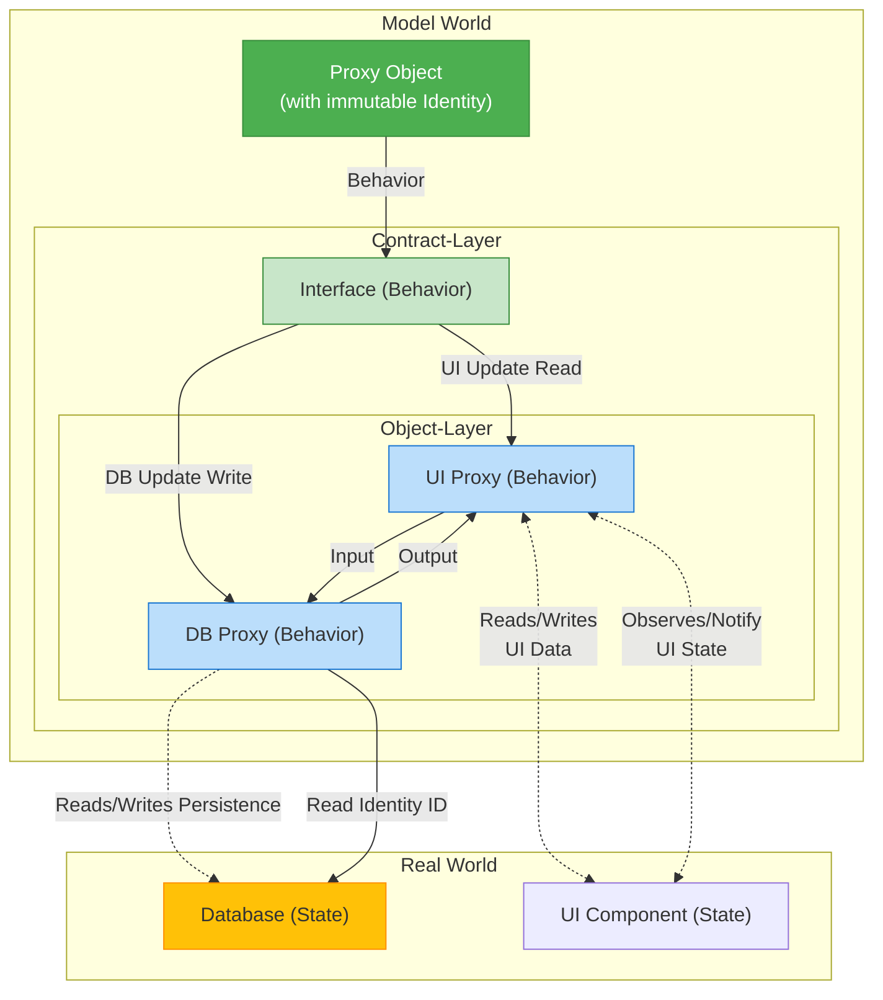

# **The Mechanics of Good Object**

Die zentrale These des Blogbeitrags von Yegor Bugayenko ist, dass **gute Objekte immer unveränderliche Proxies** (immutable) sein sollten. 
* Dies gilt auch dann, wenn sie *Entitäten* der realen Welt vertreten, die sich häufig ändern, wie z. B. ein Dokumententitel (mutable).

## **1. Das Problem: Zustand vs. Identität**

* Ein typisches Objekt besteht aus Identität, Zustand und Verhalten. 
* Ein Objekt ist dann **veränderlich** (mutable), wenn seine interne gekapselte Information (der Zustand) nach der Erstellung geändert werden kann.

**Kritik:** 
- Wenn eine Eigenschaft (z. B. der Titel eines Dokuments) häufig geändert wird, sollte sie nicht Teil des **internen Zustands** des Objekts sein.

### **Java-Beispiel 1: Das veränderliche (schlechte) Objekt**

Dieses Objekt ist schlecht, da es seine interne Identität (die Speicheradresse) beibehält, obwohl sich sein Zustand ändert.
```java
class Document {  
    private int id;  
    private String title;

    public DocumentOne(int id, String title) {  
        this.id = id;  
        this.title = title;  
    }

    // Changes the object's internal state  
    public void setTitle(String newTitle) {  
        this.title = newTitle;  
    }

    // ... Getters and toString()  
}

// Usage: The same object (identity) with new state  
DocumentOne doc = new DocumentOne(50, "Alter Titel");  
doc.setTitle("Neuer Titel"); // State changes, identity remains
```

## **2. Der Unveränderliche Wert (Value Object)**

Beim konventionellen unveränderlichen Design wird bei jeder Änderung ein **neues** Objekt erstellt. Der Zustand wird zur Identität.

### **Java-Beispiel 2: Das unveränderliche Wertobjekt (Ineffizient bei häufigen Änderungen)**
```java
@Immutable  
class Document {  
    private final int id;  
    private final String title; // Part of the internal state

    public Document(int id, String title) {  
        this.id = id;  
        this.title = title;  
    }

    // Returns a new object on change (Wither)  
    public DocumentTwo withTitle(String newTitle) {  
        return new DocumentTwo(this.id, newTitle);  
    }

    // ... printer methods like id() or title() and equals/hashCode (based on id AND title)  
}

// Usage: Two distinct objects (identities)  
DocumentTwo first = new DocumentTwo(50, "Titel A");  
DocumentTwo second = first.withTitle("Titel B"); // Creates a new object
```

**Kritik:** 
- Wenn ein Dokument sehr groß ist, ist es ineffizient, bei jeder kleinen Änderung (wie einem Titel-Update) die gesamte Datenstruktur zu klonen.

## **3. Die Lösung: Unveränderliches Proxy-Objekt**

Die Lösung liegt darin, zu erkennen, dass der Titel nicht Teil des **Objektzustands** ist, sondern Teil der **realen Entität** (z. B. einer Datei oder einer Datenbankzeile), die das Objekt **repräsentiert**.

Ein gutes unveränderliches Objekt sollte nur seine **Identität** intern kapseln (z. B. die ID oder den Speicherort) und **Verhalten** bereitstellen, um die externe, veränderliche Welt zu manipulieren. Das Objekt fungiert als **Proxy**.

### **Java-Beispiel 3: Das unveränderliche Proxy-Objekt (Der empfohlene Ansatz)**

Das Objekt selbst ist unveränderlich (nur die ID ist final), aber seine Methoden manipulieren eine externe, veränderliche Ressource (hier simuliert durch ExternalStorage).

```java
@Immutable  
class Document {  

    private final ExternalStorage externalStorage = new ExternalStorage();
     
    // The ONLY internal state is the identity to the real world  
    private final int id;

    public Document(int id) {  
        this.id = id;  
    }

    // BEHAVIOR: Reads the title from the external world  
    public String title() {  
        return externalStorage.readTitle(this.id);  
    }

    // BEHAVIOR: Writes the title to the external world  
    public void title(String text) {  
        // Manipulates the external entity, not the object itself  
        externalStorage.writeTitle(this.id, text);  
    }

    // equals() and hashCode() are based ONLY on the ID (the identity)  
    @Override  
    public boolean equals(Object doc) {  
        return doc instanceof Document  
            && Document.class.cast(doc).id == this.id;  
    }  
}

// Simulates the external, mutable storage (database, file, etc.)  
class ExternalStorage {  
    private static final Map<Integer, String> storage = new HashMap<>(0);  
    public static String readTitle(int id) {  
        return storage.getOrDefault(id, "Titel nicht gefunden");  
    }  
    public static void writeTitle(int id, String title) {  
        storage.put(id, title);  
    }  
}

// Usage: The object (identity) remains constant, only the behavior changes the external world  
DocumentThree doc = new DocumentThree(50);  
doc.title("Titel A"); // External storage is changed  
doc.title("Titel B"); // External storage is changed  
// doc is still the SAME object
```

## **Fazit: Animator von Daten**

Die Schlussfolgerung ist, dass die Rolle eines Objekts darin besteht, ein **Animator von Daten** zu sein.

* Die Daten selbst (im Speicher, in einer Datei, in einer Datenbank) sind **tot** und **veränderlich**.  
* Das Objekt ist **lebendig** und **unveränderlich** und nutzt seine Identität (ID) als Schlüssel, um auf diese externen, veränderlichen Daten zuzugreifen und sie zu manipulieren.

**Ein gutes Objekt ist ein unveränderlicher Animator von veränderlichen Daten.**

- ***Object ==  Proxy***
- ***State ∧ Behavior E Object***
- ***State != Behavior***
- ***State == Data***
- ***Behavior == Animation***
- ***Object => Data Animator***



### Erklärung der einzelnen Aussagen

**1. Object == Proxy**
- **Analogie:** Ein Objekt kann wie ein Proxy behandelt werden.
- **Bedeutung:** Ein Proxy ist ein Platzhalter oder eine Stellvertretung für ein anderes Objekt.
- Diese Aussage deutet an, dass man in manchen Kontexten nicht direkt mit dem eigentlichen Objekt arbeitet, sondern über einen Proxy, der Operationen abfängt und modifiziert.
- Dies ist ein häufiges Entwurfsmuster in der Softwareentwicklung, um das Verhalten zu steuern, zu validieren oder zu protokollieren.

**2. State ∧ Behavior E Object**
- **Analogie:** Zustand (State) und Verhalten (Behavior) sind Bestandteile (E) eines Objekts.
- **Bedeutung:** Dies ist eine grundlegende Definition der objektorientierten Programmierung.
- Ein Objekt bündelt Daten (seinen Zustand) und die Methoden, die auf diese Daten operieren (sein Verhalten).

**3. State != Behavior**
- **Analogie:** Zustand (State) und Verhalten (Behavior) sind nicht dasselbe.
- **Bedeutung:** Der Zustand eines Objekts beschreibt seine Eigenschaften oder seine aktuellen Werte (z. B. Auto.Geschwindigkeit = 100). 
- Das Verhalten beschreibt die Aktionen, die das Objekt ausführen kann (z. B. Auto.beschleunigen()). 
- Das Verhalten kann den Zustand verändern, aber die beiden sind konzeptionell unterschiedliche Dinge.

**4. State == Data**
- **Analogie:** Der Zustand eines Objekts ist gleich seinen Daten.
- **Bedeutung:** Der Zustand wird durch die in den Feldern oder Attributen des Objekts gespeicherten Werte repräsentiert.
- In diesem Sinne ist der Zustand einfach die Sammlung der Daten, die das Objekt zu einem bestimmten Zeitpunkt enthält.

**5. Behavior == Animation**
- **Analogie:** Verhalten ist gleich Animation.
- **Bedeutung:** Dies ist eine spezifischere Interpretation des Begriffs "Verhalten" in einem visuellen oder grafischen Kontext.
- Insbesondere im Bereich der Computergrafik und Datenvisualisierung wird das Verhalten eines Objekts oft durch seine Animation beschrieben – wie es sich im Laufe der Zeit verändert, bewegt oder reagiert.
- Beispiele sind "Behavioral Animation", bei der Charaktere sich auf Basis von Regeln bewegen, oder Animationen in Benutzeroberflächen.

**6. Object => Data Animator**
- **Analogie:** Ein Objekt impliziert einen Daten-Animator.
- **Bedeutung:** Diese Aussage fasst die vorherigen Punkte zusammen und interpretiert sie im Kontext der Datenvisualisierung.
- Wenn ein Object einen State (Data) und ein Behavior (Animation) hat, dann ist ein Objekt im Wesentlichen ein Data Animator.
- Die **Daten** (State) definieren, was visualisiert werden soll.
- Der **Animator** (Behavior) sorgt dafür, dass die Darstellung der Daten sich verändert oder bewegt.
