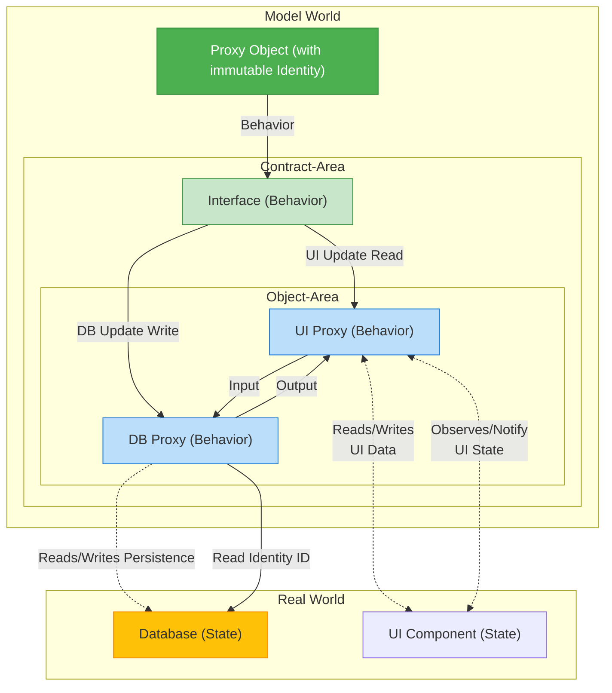

# **The Mechanics of Good Object**

Die zentrale These der Blogbeiträge von Yegor Bugayenko und Mihai A. 🇷🇴🇩🇪🇬🇧🇫🇷 ist, dass **gute Objekte immer unveränderliche Proxies** sein sollten, **die Daten** nicht mappen sondern **animieren**. 

Dies gilt auch dann, wenn sie *Entitäten* der realen Welt vertreten, die sich häufig ändern, wie z. B. ein Dokumententitel (mutable).

## **1. Das Problem: Zustand vs. Identität**

* Ein typisches Objekt besteht aus Identität, Zustand und Verhalten. 
* Ein Objekt ist dann **veränderlich** (mutable), wenn seine interne gekapselte Information (der Zustand) nach der Erstellung geändert werden kann.

**Forderung:** 
- Wenn eine Eigenschaft (z. B. der Titel eines Dokuments) häufig geändert wird, sollte sie nicht Teil des **internen Zustands** des Objekts sein.

### **Beispiel 1: Das veränderliche (schlechte) Objekt**

Dieses Objekt ist schlecht, da es seine interne Identität (die Speicheradresse) beibehält, obwohl sich sein Zustand ändert.
```java
public class Document {

    private int id;  
    private String title;

    public Document(int id, String title) {  
        this.id = id;  
        this.title = title;  
    }

    // Changes the object's internal state  
    public void setTitle(String newTitle) {  
        this.title = newTitle;  
    }

    // ... Getters and toString()  
}

// Usage: The same object (identity) with new state  
Document doc = new Document(50, "Alter Titel");  
doc.setTitle("Neuer Titel"); // State changes, identity remains
```

## **2. Der Unveränderliche Wert (Value Object)**

Beim konventionellen unveränderlichen Design wird bei jeder Änderung ein **neues** Objekt erstellt. Der Zustand wird zur Identität.

### **Beispiel 2: Das unveränderliche Wertobjekt (Ineffizient bei häufigen Änderungen)**
```java

public class Document {

    private final int id;  
    private final String title; // Part of the internal state

    public Document(int id, String title) {  
        this.id = id;  
        this.title = title;  
    }

    // Returns a new object on change (Wither)  
    public Document withTitle(String newTitle) {  
        return new Document(this.id, newTitle);  
    }

    // ... printer methods like id() or title() and equals/hashCode (based on id AND title)  
}

// Usage: Two distinct objects (identities)  
Document first = new Document(50, "Titel A");  
Document second = first.withTitle("Titel B"); // Creates a new object
```

**Forderung:** 
- Wenn ein Dokument sehr groß ist, ist es ineffizient, bei jeder kleinen Änderung (wie einem Titel-Update) die gesamte Datenstruktur zu klonen.

## **3. Die Lösung: Unveränderliches Proxy-Objekt**

Die Lösung liegt darin, zu erkennen, dass der Titel nicht Teil des **Objektzustands** ist, sondern Teil der **realen Entität** (z. B. einer Datei oder einer Datenbankzeile), die das Objekt **repräsentiert**.

Ein gutes unveränderliches Objekt sollte nur seine **Identität** intern kapseln (z. B. die ID oder den Speicherort) und **Verhalten** bereitstellen, um die externe, veränderliche Welt zu manipulieren. Das Objekt fungiert als **Proxy**.

### **Beispiel 3: Das unveränderliche Proxy-Objekt (Der empfohlene Ansatz)**

Das Objekt selbst ist unveränderlich (nur die ID ist final), aber seine Methoden manipulieren eine externe, veränderliche Ressource (hier simuliert durch ExternalStorage).

```java
 
public class Document {  

    private final ExternalStorage externalStorage = new ExternalStorage();
     
    // The ONLY internal state is the identity to the real world  
    private final int id;

    public Document(int id) {  
        this.id = id;  
    }

    // BEHAVIOR: Reads the title from the external world  
    public String title() {  
        return externalStorage.readTitle(this.id);  
    }

    // BEHAVIOR: Writes the title to the external world  
    public void title(String text) {  
        // Manipulates the external entity, not the object itself  
        externalStorage.writeTitle(this.id, text);  
    }

    // equals() and hashCode() are based ONLY on the ID (the identity)  
    @Override  
    public boolean equals(Object doc) {  
        return doc instanceof Document  
            && Document.class.cast(doc).id == this.id;  
    }  
}

// Simulates the external, mutable storage (database, file, etc.)  
public class ExternalStorage {

    private static final Map<Integer, String> storage = new HashMap<>(0);
  
    public static String readTitle(int id) {  
        return storage.getOrDefault(id, "Titel nicht gefunden");  
    }

    public static void writeTitle(int id, String title) {  
        storage.put(id, title);  
    }  
}

// Usage: The object (identity) remains constant, only the behavior changes the external world  
Document doc = new Document(50);  
doc.title("Titel A"); // External storage is changed  
doc.title("Titel B"); // External storage is changed  
// doc is still the SAME object
```

### 3.1 Horizontale Zerlegung mit Interfaces und Decorator Pattern
Technische Aspekte ```(Caching, Logging, UI-Benachrichtigung)``` werden horizontal als Decorator um die Schnittstellen gewickelt.

**Beispiel 3.1: Das unveränderliche Proxy-Objekt (Kernstruktur)***
```java
import java.util.Map;
import java.util.HashMap;

// 1. Vertical Interface (Domain behavior)
public interface Document {
    String title();
    void title(String text);
}

// 2. Interface for the technical layer (Persistence behavior)
public interface DocumentStorage {
    String readTitle(int id);
    void writeTitle(int id, String title);
}

// 3. The Immutable Proxy Object (Encapsulates only the ID)

public class MyDocument implements Document {

    private final DocumentStorage externalStorage;
    private final int id;

    public MyDocument(int id, DocumentStorage storage) {  
        this.id = id;  
        this.externalStorage = storage;
    }

    @Override
    public String title() {  
        return this.externalStorage.readTitle(this.id);  
    }

    @Override
    public void title(String text) {  
        this.externalStorage.writeTitle(this.id, text);  
    }

    // equals() and hashCode() are based ONLY on the ID (the identity)
    @Override  
    public boolean equals(Object doc) {  
        return doc instanceof MyDocument && MyDocument.class.cast(doc).id == this.id;  
    }  
}

// 4. The base implementation of the storage
public class SimpleExternalStorage implements DocumentStorage {
  
    private static final Map<Integer, String> storage = new HashMap<>(0);  
    
    @Override
    public String readTitle(int id) {  
        System.out.println("-> DB: Reading title from the database.");
        return storage.getOrDefault(id, "Title not found");  
    }  
    
    @Override
    public void writeTitle(int id, String title) {  
        System.out.println("-> DB: Writing title to the database.");
        storage.put(id, title);  
    }  
}
```

#### **3.1.1 Horizontaler Decorator: Caching für die Persistenz (DB-Aspekt)**

Der ```CachedDocumentStorage``` umschließt den Basisspeicher ```(SimpleExternalStorage)``` und fügt die Caching-Logik hinzu.

```java
// CachedDocumentStorage.java
public class CachedDocumentStorage implements DocumentStorage {

    private final DocumentStorage origin; // The wrapped storage
    private final Map<Integer, String> cache = new HashMap<>(0);

    public CachedDocumentStorage(DocumentStorage origin) {
        this.origin = origin;
    }

    @Override
    public String readTitle(int id) {
        if (cache.containsKey(id)) {
            System.out.println("-> CACHE: Title retrieved from cache.");
            return cache.get(id);
        }
        // Only delegate to original logic on a cache miss
        String title = this.origin.readTitle(id);
        cache.put(id, title);
        return title;
    }

    @Override
    public void writeTitle(int id, String title) {
        this.origin.writeTitle(id, title);
        cache.put(id, title); // Update the cache
    }
}
```

#### **3.1.2. Horizontaler Decorator: UI-Verhalten (View-Aspekt)***
**a) Beobachtbarkeit (Event-Auslösung):**
```java
public class ObservableDocument implements Document {

    private final Document origin; // The wrapped domain object

    public ObservableDocument(Document origin) {
        this.origin = origin;
    }
    
    @Override
    public String title() {
        // Pure read operations are delegated directly
        return this.origin.title();
    }

    @Override
    public void title(String text) {

        // First, execute the technical logic (UI notification event)
        System.out.println("-> EVENT: Notifying all listeners about title update.");
        
        // Then, delegate the domain logic (persistence update)
        this.origin.title(text);
    }
}
```

**b) Präsentation (Echte UI-Interaktion):**
* Der PresentableDocument ist der finale Decorator, der die simulierte UI-Komponente injiziert.

```java
// Simulates a simple UI component that can display changes
public class FakeUIComponent {

    public void displayTitleUpdate(String newTitle) {
        System.out.println("-> FAKE UI: Updating title display to: " + newTitle);
    }
    
}

// The final decorator that controls presentation
public class PresentableDocument implements Document {

    private final Document origin;
    private final FakeUIComponent uiComponent;

    public PresentableDocument(Document origin, FakeUIComponent uiComponent) {
        this.origin = origin;
        this.uiComponent = uiComponent;
    }

    @Override
    public String title() {
        // First, read the title (goes through all decorators back to storage)
        String currentTitle = this.origin.title();
        this.uiComponent.displayTitleUpdate(currentTitle); // Display title
        return currentTitle;
    }

    @Override
    public void title(String text) {
        // First, delegate the change to the Observable layer (triggers event, writes to DB/Cache)
        this.origin.title(text);
        // After the change, update the UI immediately
        this.uiComponent.displayTitleUpdate(text);
    }
}
```

### 3.2 Typsichere Verwendung (Kombination)
* Der Client kombiniert die Aspekte über Interfaces.

```java
// 1. The base storage (DB connection)
DocumentStorage dbStorage = new SimpleExternalStorage(); 

// 2. Horizontally add Caching
DocumentStorage cachedStorage = new CachedDocumentStorage(dbStorage);

// 3. The immutable Proxy Object uses the cache
Document documentProxy = new MyDocument(50, cachedStorage); 

// 4. Horizontally add UI behavior (Observability)
Document observableDocument = new ObservableDocument(documentProxy);

// 5. Add the final presentation layer (with UI component)
FakeUIComponent ui = new FakeUIComponent();
Document finalDocument = new PresentableDocument(observableDocument, ui);

System.out.println("\n--- First Call: Writes to DB, Cache, and fires UI Event ---");
finalDocument.title("New, cached Title"); 

System.out.println("\n--- Second Call: Reads from Cache (no DB access) and updates UI ---");
finalDocument.title(); 
```

## **Fazit: Objekt == Proxy == Animator von Daten**

Ein gutes Objekt sollte ein Proxy für die [effektive Animation](https://observablehq.com/blog/effective-animation) von Daten sein.

* Die Daten selbst (im Speicher, in einer Datei, in einer Datenbank) sind **tot** und **veränderlich**.  
* Das Objekt ist **lebendig** und **unveränderlich** und nutzt seine Identität (ID) als Schlüssel, um auf diese externen, veränderlichen Daten zuzugreifen und sie zu manipulieren.



### Erklärung der einzelnen Aussagen

**1. Object == Proxy**
- **Analogie:** Ein Objekt kann wie ein Proxy behandelt werden.
- **Bedeutung:** Ein Proxy ist ein Platzhalter oder eine Stellvertretung für ein anderes Objekt.
- Diese Aussage deutet an, dass man in manchen Kontexten nicht direkt mit dem eigentlichen Objekt arbeitet, sondern über einen Proxy, der Operationen abfängt und modifiziert.
- Dies ist ein häufiges Entwurfsmuster in der Softwareentwicklung, um das Verhalten zu steuern, zu validieren oder zu protokollieren.

**2. State ∧ Behavior E Object**
- **Analogie:** Zustand (State) und Verhalten (Behavior) sind Bestandteile (E) eines Objekts.
- **Bedeutung:** Dies ist eine grundlegende Definition der objektorientierten Programmierung.
- Ein Objekt bündelt Daten (seinen Zustand) und die Methoden, die auf diese Daten operieren (sein Verhalten).

**3. State != Behavior**
- **Analogie:** Zustand (State) und Verhalten (Behavior) sind nicht dasselbe.
- **Bedeutung:** Der Zustand eines Objekts beschreibt seine Eigenschaften oder seine aktuellen Werte (z. B. Auto.Geschwindigkeit = 100). 
- Das Verhalten beschreibt die Aktionen, die das Objekt ausführen kann (z. B. Auto.beschleunigen()). 
- Das Verhalten kann den Zustand verändern, aber die beiden sind konzeptionell unterschiedliche Dinge.

**4. State == Data**
- **Analogie:** Der Zustand eines Objekts ist gleich seinen Daten.
- **Bedeutung:** Der Zustand wird durch die in den Feldern oder Attributen des Objekts gespeicherten Werte repräsentiert.
- In diesem Sinne ist der Zustand einfach die Sammlung der Daten, die das Objekt zu einem bestimmten Zeitpunkt enthält.

**5. Behavior == Animation**
- **Analogie:** Verhalten ist gleich Animation.
- **Bedeutung:** Dies ist eine spezifischere Interpretation des Begriffs "Verhalten" in einem visuellen oder grafischen Kontext.
- Insbesondere im Bereich der Computergrafik und Datenvisualisierung wird das Verhalten eines Objekts oft durch seine Animation beschrieben – wie es sich im Laufe der Zeit verändert, bewegt oder reagiert.
- Beispiele sind "Behavioral Animation", bei der Charaktere sich auf Basis von Regeln bewegen, oder Animationen in Benutzeroberflächen.

**6. Object => Data Animator**
- **Analogie:** Ein Objekt impliziert einen Daten-Animator.
- **Bedeutung:** Diese Aussage fasst die vorherigen Punkte zusammen und interpretiert sie im Kontext der Datenvisualisierung.
- Wenn ein Object einen State (Data) und ein Behavior (Animation) hat, dann ist ein Objekt im Wesentlichen ein Data Animator.
- Die **Daten** (State) definieren, was visualisiert werden soll.
- Der **Animator** (Behavior) sorgt dafür, dass die Darstellung der Daten sich verändert oder bewegt.

**Ein gutes Objekt ist ein unveränderlicher Animator von veränderlichen Daten.**

# Quellen:

**How an Immutable Object Can Have State and Behavior?**
- https://www.yegor256.com/2014/12/09/immutable-object-state-and-behavior.html

**Data Should Be Animated, Not Mapped**
- https://amihaiemil.com/2017/09/01/data-should-be-animated-not-represented.html

**Gradients of Immutability**
- https://www.yegor256.com/2016/09/07/gradients-of-immutability.html

**Objects Should Be Immutable**
- https://www.yegor256.com/2014/06/09/objects-should-be-immutable.html

**Immutable Objects Are Not Dumb**
- https://www.yegor256.com/2014/12/22/immutable-objects-not-dumb.html

