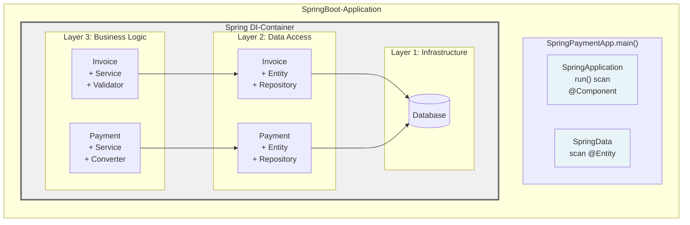
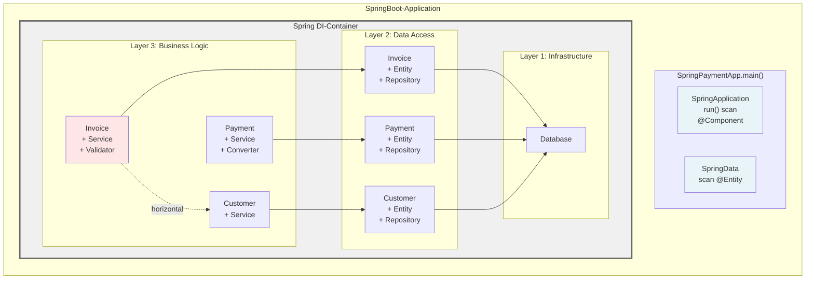
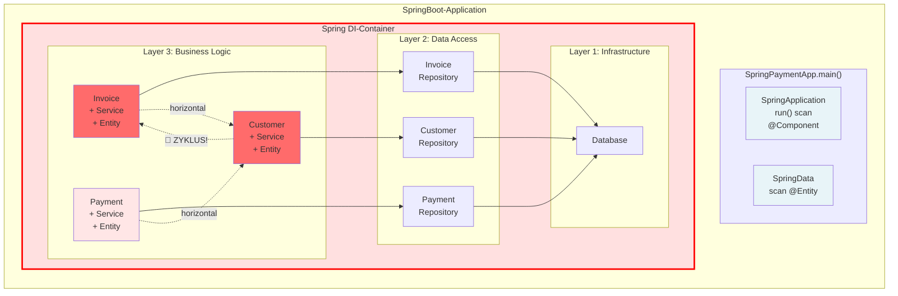
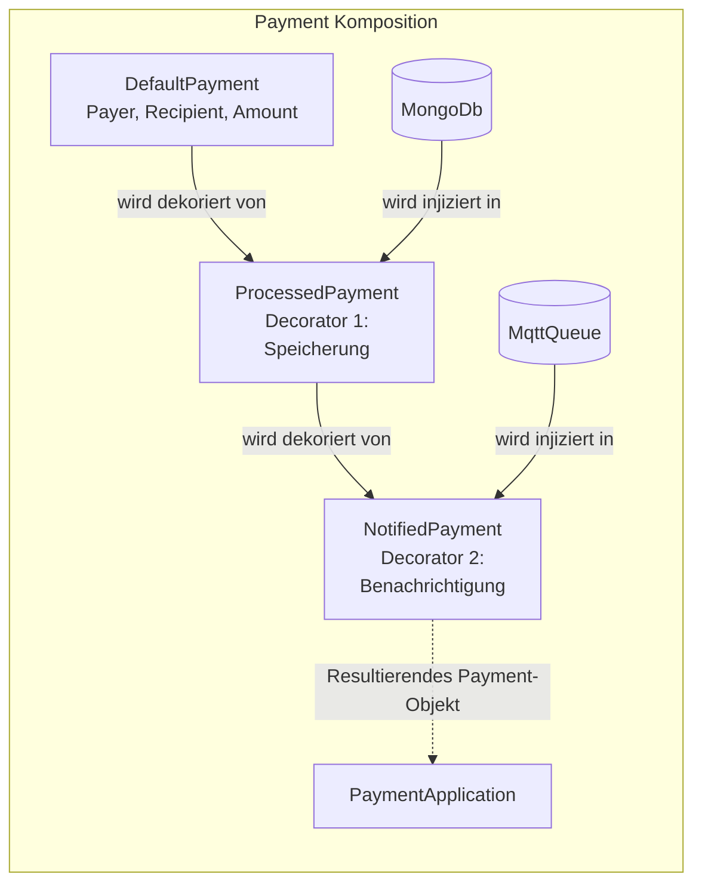
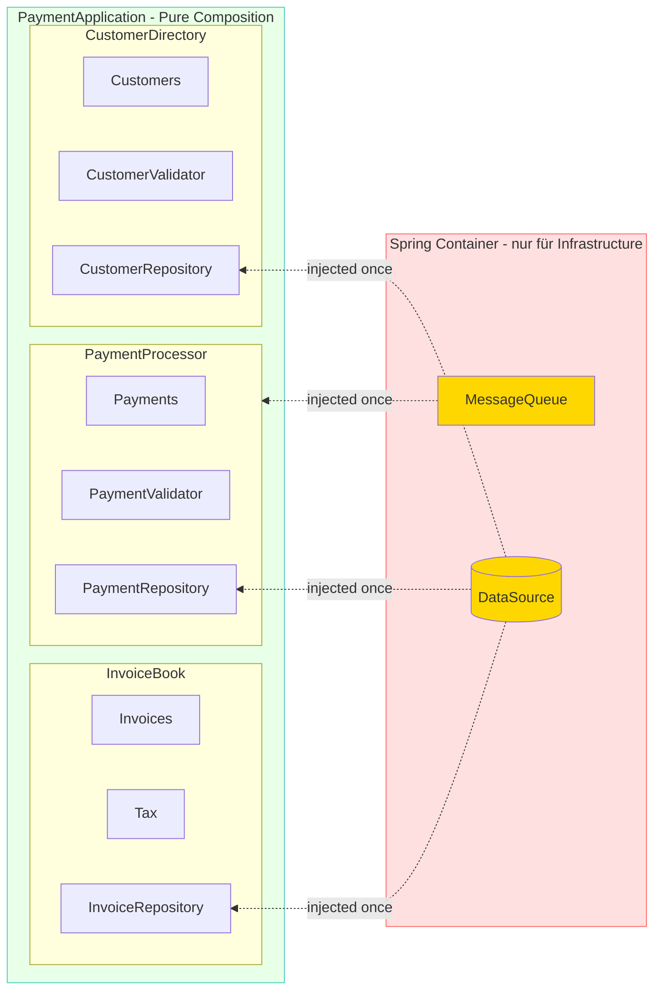

# A solid System Composition *"injects less and leaves Nobody in blind..."*

DE: **Eine solide System Komposition *"injiziert wenig und lässt Keinen blind..."***

**(Draft!!!)**


***- Eine reale Geschichte aus der Praxis -***

## 1. Einleitung

In der modernen objektorientierten Softwareentwicklung ist **Dependency Injection** (DI) längst ein **etabliertes Konzept**. Die Grundidee ist simpel und elegant: Objekte sollen ihre Abhängigkeiten nicht selbst erstellen, sondern von außen erhalten. Doch während die Technik selbst wertvoll ist, haben viele Frameworks mittels sogenannter **DI-Container** das ursprüngliche Konzept in ein **Anti-Pattern** verwandelt.

Der Begriff "Container" beschreibt metaphorisch einen intelligenten, zentralen Behälter, der die Kontrolle über die Objekt-Erstellung und deren Abhängigkeiten invertiert und verwaltet, anstatt dies dem Anwendungscode selbst zu überlassen.

### 1.1 Probleme mit DI-Containern

Mittels Annotations wie `@Component`, `@Service`, `@Repository` und `@Controller` kann beispielsweise das Framework *Spring* automatisch Klassen erkennen, instanziieren und in den Container aufnehmen, ohne dass sie explizit konfiguriert werden müssen.

**Die Kontrolle über die Objekterzeugung wird den Entwicklern genommen.** Die DI-Container übernehmen dadurch die komplette Verantwortung für die Lebensdauer und die Konstruktion aller als Komponenten markierten Objekte.

**Folgen:**

* **Der Fokus verschiebt sich:** Der Entwickler kümmert sich nicht mehr um die saubere Komposition seiner Objekte, sondern um die korrekte Platzierung von Annotations (wie `@Component`, `@Service`, `@Autowired)`. Die Konfiguration des Containers wird wichtiger als das Design der Objekthierarchie.

* **Unsichtbare Komposition von Objekten im Code:** Das gesamte System wird im Hintergrund des Frameworks magisch verdrahtet. Es gibt keine einzige, sichtbare Stelle im Code, die den kompletten Objektgraphen aufbaut. Der Entwickler verliert das Verständnis dafür, wann und wie seine Business-Objekte tatsächlich initialisiert werden.

* **Verlust der OOP-Prinzipien:** In der reinen objektorientierten Programmierung (OOP) ist der `new`-Operator der Schlüssel zur Kontrolle. Durch das Verstecken der Objekterzeugung durch den Container wird die zentrale Rolle des Konstruktors in der Objekthierarchie geschwächt.


Im folgenden betrachten wir eine *Spring-Boot* Payment-Application mit der üblichen Verwendung von DI-Container.  

Ein Team aus drei Personen (Junior-, Mid- und Senior-Entwickler) baut es schrittweise auf und wir beobachten, welche Probleme mit den wachsenden Anforderungen entstehen können.

#### Anforderung 1: (Rechnungen und Zahlungen verarbeiten)

Die Applikation soll zunächst Rechnungen (`Invoice`) erstellen und dazu Zahlungen (`Payment`) verarbeiten können.

> Der Senior schlug vor auf das alte Bewährte (Spring) zu setzen, der Mid-Level-Entwickler übernahm aus einem bereits bestehenden Projekt die Struktur und der Junior begann mit der Implementierung.

**Design** (vom Senior-Entwickler)



**Projektstruktur** (vom Mid-Entwickler)

```
com.example.payment/
├── business/  						// Nusiness Logik-Layer
│   ├── InvoiceService.java  		// mit `@Service`-Annotation
│   └── PaymentService.java  		// mit `@Service`-Annotation
├── data/  							// Daten-Layer
│   ├── Invoice.java  				// mit JPA `@Entity`-Annotation
│   ├── Payment.java         		// mit JPA `@Entity`-Annotation
│   ├── InvoiceRepository.java		// `@Repository`-Annotation
│   └── PaymentRepository.java     	// `@Repository`-Annotation
└──  SpringPaymentApp.java 			// Hauptklassen mit `@SpringBoot`-Annotation und `main()` Methode
```

**Implementierung** (vom Junior-Entwickler)

```java
// Die App verwaltet keine expliziten Dependencies  
@SpringBootApplication  
public class SpringPaymentApp {

    public static void main(String[] args) {  
        // ...starts scanning classpath to provide 'Magic' on:  
        // @Component, @Service, @Controller, @Repository und @Entity  
        SpringApplication.run(SpringPaymentApp.class, args);  
    }  
}

@Service  
public class InvoiceService {

    @Autowired  
    private InvoiceRepository invoiceRepo;  
      
    public Invoice create(Customer customer, List<Item> items) {  
        // Business Logic  
    }  
}

@Service  
public class PaymentService {

    @Autowired  
    private PaymentRepository paymentRepo;  
      
    public void process(Payment payment) {  
        // Business Logic  
    }  
}
```


**Problem:** An dieser Stelle ist es bereits unklar, wie die Objekte wirklich zusammenhängen.    

Das Objekt der Klasse `SpringPaymentApp` sowie die Komponente `SpringData` für Zugriffe auf die Datenbank schweben isoliert "herum" und der DI-Container verwaltet alles im Hintergrund.

#### Anforderung 2: (Customer hinzufügen)

Nun sollen zusätzlich noch Kunden verwaltet werden und beim Erstellen einer Rechnung muss ein Kunde validiert werden.

> Der Junior trieb die Implementierung weiter voran.



```java
@Service  
public class InvoiceService {

    @Autowired  
    private InvoiceRepository invoiceRepo;

    @Autowired  
    private CustomerService customerService;  // ⚠️ Horizontale Dependency!  
      
    public Invoice create(Customer customer, List<Item> items) {  
        customerService.validate(customer);  // Braucht CustomerService  
        // Business Logic  
    }  
}

@Service  
public class CustomerService {

    @Autowired   
    private CustomerRepository customerRepo;  
      
    public void validate(Customer customer) {  
        // Validation Logic  
    }  
}
```

**(Kein) Problem:** Es ist noch kein Drama, aber hier beginnt die Schieflag: Die neu entstandene horizontale Abhängigkeit innerhalb des Business-Logic-Layers verkompliziert lediglich die Beziehungen in diesem Modul.

#### Anforderung 3: Kunden sollen ihre offenen Rechnungen sehen können.

> Der Junior übernahm diese Aufgabe ebenfalls. Für ihn war es logisch, dass die Klasse `CustomerService` nun `InvoiceService` kennen musste.



```java
@SpringBootApplication  
public class SpringPaymentApp {
  
    // Container versteckt den Zyklus komplett!  
    public static void main(String[] args) {  
        // ...starts scanning classpath to provide 'Magic' on:  
        // @Component, @Service, @Controller, @Repository und @Entity  
        SpringApplication.run(SpringPaymentApp.class, args);  
    }  
}

@Service  
public class InvoiceService {

    @Autowired
	private InvoiceRepository invoiceRepo;
  
    @Autowired
	private CustomerService customerService;  // → Customer  
      
    public Invoice create(Customer customer, List<Item> items) {
		// Business Logic  
        customerService.validate(customer);  
        // ... more Business Logic
    }  
}

@Service  
public class PaymentService {

    @Autowired  
    private PaymentRepository paymentRepo;

    @Autowired  
    private CustomerService customerService;  // → Customer  
      
    public void process(Payment payment) {  
        // Business Logic  
        customerService.updateBalance(payment.getCustomer());  
        // ... more Business Logic  
    }  
}

@Service  
public class CustomerService {

    @Autowired  
    private InvoiceService invoiceService;  // 🔴 → Invoice (ZYKLUS!)

    @Autowired  
    private CustomerRepository customerRepo;  
      
    public List<Invoice> getOpenInvoices(Customer customer) {  
        return invoiceService.findOpenByCustomer(customer);  // Braucht InvoiceService  
    }  
      
    public void validate(Customer customer) {  
        // Validation Logic  
    }  
}
```

**Problem:** - Das System bricht 💥 - Der DI-Container versteckt den Designfehler der zyklischen Abhängigkeit.

> Die Integrationstests schlugen fehl und die Suche nach einer Lösung des Fehlers begann...

### 1.2 Die Lösungen mit DI-Containern

> Der erfahrener Mid-Level-Entwickler aus dem Team, der bereits einige Jahre mit Spring arbeitete und die Dokumentation für DI-Container gelesen hatte, löste das Problem sehr schnell mittels einer `@Lazy` Annotation aus dem Spring-Framework.

```java
// Spring erstellt Proxies und initialisiert lazy  
@Service  
@Lazy  // Spring's "Lösung" für Zyklen  
public class CustomerService {

    @Autowired  
    private InvoiceService invoiceService;  // Wird als Proxy injiziert

    @Autowired  
    private CustomerRepository customerRepo;  
    // ...  
}
```

Die Integrationstests verliefen wieder reibungslos. Der Junior-Entwickler war erleichtert, und es blieb ihm noch Zeit für einen Kaffee, um die Lösung gemeinsam mit dem Middle-Entwickler zu besprechen.

Der Junior-Entwickler lernte dabei, wie man mit dem Problem umgeht, aber nicht, wie man es richtig behebt oder vermeidet.

Diese ‚Lösung‘ änderte jedoch nichts daran, dass die Architektur weiterhin eine zyklische Abhängigkeit aufwies, denn die korrekte Behebung erforderte ein tieferliegendes Verständnis der Architekturprinzipien.

> Im Rahmen eines Code-Reviews bemerkte jedoch ein Senior-Entwickler die Schwachstelle und lehnte den Pull-Request ab. Der Senior hatte dabei die Modul-Prinzipien (von Robert C. Martin) im Hinterkopf und schlug stattdessen vor, die *zyklische Abhängigkeit* durch eine neue Klasse wie z. B. `CustomerInvoiceService` aufzulösen, welche die Funktionalität von `InvoiceService` und `CustomerRepository` kombiniert.

```java
@Service  
public class CustomerService {

    // KEINE Abhängigkeit zu Invoices...

    @Autowired  
    private CustomerRepository customerRepo;  
    // ...  
}

// kombiniert customer und Invoices  
@Service  
public class CustomerInvoiceService {

    @Autowired  
    private InvoiceService invoiceService;

    @Autowired   
    private CustomerRepository customerRepo;  
    // ...  
}
```
Der Senior begründete seinen Vorschlag gegenüber dem Team mit dem Single Responsibility Principle (SRP), da die ursprüngliche Klasse CustomerService zwei Verantwortlichkeiten vereinte: die Verwaltung von Kunden sowie von Rechnungen.

Er war von der Richtigkeit der Lösung überzeugt und stützte sich dabei auf die Interpretation des SRP nach Robert C. Martin: "Each software module should have one and only one responsibility". Er fügte hinzu, dass mehrere Verantwortlichkeiten innerhalb eines Moduls zwangsläufig zu einem zerbrechlichen Design führten.

Das Team nahm dies stillschweigend an; schließlich wusste es der Senior besser und hatte zudem die Bücher von Robert C. Martin gelesen. Der Mid-Level-Entwickler lernte daraus, dass auch er diese Bücher lesen müsse, wenn er jemals zum Senior aufsteigen wolle.

Allerdings entsprach die finale Lösung nicht der oben genannten Definition des SRP, da die neue Service-Klasse weiterhin Business- und Repository-Logik vermischte – ein Problem, das durch die erzwungene Schichtenarchitektur des DI-Containers zusätzlich gefördert wurde.

Der Senior (Autor) steht dieser Interpretation des Single Responsibility Principle (SRP) mittlerweile kritisch gegenüber. Sie führt oft zu künstlich aufgeblähten Service-Klassen, anstatt eine kohärente und sinnvolle Komposition zu fördern. Wie sich diese Erkenntnis über die Jahre entwickelt hat und welche Fallstricke dabei vermieden wurden, ist allerdings eine andere, längere Geschichte, die in einem separaten Artikel ausführlich behandelt wird.

### 1.3 Die resultierenden Probleme

**Diese schrittweise Entwicklung zeigt:**
1. **Unübersichtliche Abhängigkeiten** - SpringPaymentApp zeigt keine echten Dependencies. Wo ist die Objektstruktur?  
2. **Schwere Wartbarkeit** - Um zu verstehen, was `CustomerService` braucht, muss man:  
   * Alle `@Autowired` Felder durchsuchen  
   * Prüfen, ob `@Lazy` verwendet wird  
   * Verstehen, wie Spring die Proxies auflöst  
   * Wissen über Modul-Prinzipien (von Robert C. Martin) haben  
3. **Erzwungene Layer-Trennung** - Alle Klassen haben -Entity, -Service oder -Repository Suffix nur wegen der Layer  
4. **Zyklische Abhängigkeiten** - `InvoiceService` ⇄ `CustomerService` - Spring versteckt das Problem mit Proxies statt es zu lösen  
5. **Code Pollution** - Überall `@Service`, `@Repository`, `@Autowired`, `@Lazy` Annotations  
6. **Testbarkeit**: Tests können nicht einfach injiziert werden, nur mit [Spring-Mocks](https://filip-prochazka.com/blog/mockbean-is-an-anti-pattern) (wie `@MockBean` oder `@SpyBean`)

**Die DI-Container fördern Schichten:** Die DI-Frameworks sind so konzipiert, dass sie Layer-Architektur aktiv fördern:  
* **Stereotype-Annotations** (@Service, @Repository, @Controller) - die explizit Layer definieren  
* **Scan-Mechanismen** (z.B. `com.example.service.*`, `com.example.entity.*`, `com.example.repository.*`), die nach Package-Strukturen suchen  
* **Best-Practice-Guides** der Frameworks (z. B. Spring [Pet Clinic](https://github.com/spring-petclinic/spring-framework-petclinic/tree/main/src/main/java/org/springframework/samples/petclinic)), die Layer-Trennung empfehlen  
* **Proxy-Mechanismen** für Transactions (`@Transactional`) - die Layer-Grenzen voraussetzen  
* **Dependency-Rules**, die nur "nach unten" zeigen dürfen - was Layer-Hierarchien erzwingt.

**Die Illusion der Entkopplung:** Außerdem glauben viele Entwickler, dass DI-Container für "loose coupling" sorgen. Doch in Wirklichkeit:
* sind die Abhängigkeiten nur **versteckt**, nicht entkoppelt
* wird die **Komplexität erhöht** statt reduziert
* entsteht eine **Kopplung an den Framework-Container**
* wird **echte Objekt-Komposition** durch Service-Lokalisierung ersetzt


### 1.4 Das Komposition-Prinzip

Der Begriff **Komposition** beschreibt in der objektorientierten Programmierung die Praxis, komplexe Objekte aus einfacheren Objekten zusammenzusetzen — ausschließlich über den Konstruktor.

Das klingt trivial, hat aber eine weitreichende Konsequenz: Jede Abhängigkeit eines Objekts ist sichtbar. Es gibt keine versteckten `@Autowired`-Felder, keinen Container, der im Hintergrund Proxies verdrahtet, und keine Annotationen, die dem Framework erklären, was eigentlich der Entwickler wissen sollte.

Das Prinzip folgt einer einfachen Regel:
> Ein Objekt bekommt alles, was es braucht, beim Erzeugen — oder es bekommt es gar nicht.

Diese Regel hat drei direkte Auswirkungen auf das Design:

**Konstruktoren werden ehrlich.** Die Signatur eines Konstruktors dokumentiert die tatsächlichen Abhängigkeiten eines Objekts vollständig. Wer `new InvoiceBook(invoices, tax, customerDirectory)` liest, weiß sofort: dieses Objekt braucht genau diese drei Dinge — nicht mehr, nicht weniger.

**Zyklen werden unmöglich.** Zyklische Abhängigkeiten wie `InvoiceService` ⇄ `CustomerService` können bei expliziter Komposition gar nicht erst entstehen — denn `new A(new B(new A(...)))` lässt sich schlicht nicht kompilieren. Der Compiler übernimmt die Rolle des Architektur-Wächters.

Die ***Composition Root*** wird zur einzigen Wahrheit. Alle Objekte des Systems werden an einem einzigen Ort erzeugt und verdrahtet — der Composition Root, typischerweise direkt in oder neben `main()`. Wer verstehen will, wie das System aufgebaut ist, liest genau diese eine Stelle.

Was auf den ersten Blick wie eine Einschränkung wirkt — "ich muss alles selbst mit new bauen" — ist in der Praxis eine Befreiung: Das System bleibt lesbar, testbar und erweiterbar, ohne dass man das Framework verstehen muss, um die Anwendung zu verstehen.

## 2. Pure Komposition: Der objektorientierte Weg

**Die Lösung ist überraschend einfach:** Verzichte auf DI-Container und komponiere deine Objekte explizit mit dem `new`-Operator.
So könnte eine solide, objektorientierte Komposition bei der gleichen Rechnungsanwendung aussehen:

```java
// build the Root-Composition 
new PaymentApplication(  
	new InvoiceBook(
		new Invoices(),
		new Tax()
	),
	new NotifiedPayment(
		new ProcessedPayment(
			new DefaultPayment(
				new Payer("Alice"),
				new Recipient("Bob"),
				new Amount(100, new Currency("EUR"))
			 ),
			 new MongoDb()
		),
		new MqttQueue()
	),
	new CustomerDirectory(new MongoDb())
);
```

**Beachte:** bei der objektorientierten Komposition gibt es:
* keine Layers, keine Annotations, keine versteckten Abhängigkeiten 
* keine Objekte, die einfach herum-hängen bzw. "im Stich gelassen wurden..."  
* nur pure Objekt-Komposition durch explizite Constructor-Aufrufe.

**Visualisierung der soliden, objektorientierten Komposition:**



**Legende:**

* Das größte Rechteck ist `PaymentApplication`- die äußere Komposition und die **Composition Root**.  
* `Payment`-Objekt-Komposition (Decorator-Muster) visualisiert die Kette der `new`-Aufrufe.  
* Base ist die konkrete Komponente (`DefaultPayment`) mit den Kerndaten (`Payer`, `Recipient`, `Amount`).  
* und `NotifiedPayment` sind die konkreten Dekoratoren, die sich gegenseitig umschließen und zusätzliche Infrastructure-Komponenten (`MongoDb`, `MqttQueue`) injiziert bekommen.

Ein weiteres echtes Beispiel zeigt - [Yegor Bugayenko](https://www.yegor256.com/) in seinem [rultor.com](https://www.rultor.com/)-Projekt, wie eine pure Objekt-Komposition in der Klasse [Agents.java](https://github.com/yegor256/rultor/blob/1.34/src/main/java/com/rultor/agents/Agents.java) aussehen kann.

Weil **keine Layer** in der Struktur mehr erzwungen werden, kann die Projektstruktur komplett auf **Business Konzepte** (oder nach Features) ausgerichtet werden und nicht nach technischen Aspekten. Die dazugehörige Projektstruktur könnte nun so aussehen:  

```
org.example.payment/  
├──app/                         // Paket für Infrastuktur der Applikation
│   ├── Log                 	// <-- Logger   
│   ├── MongoDb                 // <-- DataSource   
│   ├── MqttQueue               // <-- MessageQueue   
│   ├── PaymentApplication.java // <-- Root-Komposition
│   └── ConsolePaymentApplication.java // <-- hier ist die 'main' Methode
├── amount/  
│   ├── Amount.java  
│   ├── Currency.java    
│   ├── Payer.java                 
│   └── Recipient.java  
├── customer/  
│   ├── Customer.java          
│   └── CustomerDirectory.java  
├── invoice/  
│   ├── Invoice.java   
│   ├── InvoiceBook.java       
│   ├── Invoices.java                   
│   ├── Item.java                   
│   └── Tax.java  
├── pay/  
│   ├── DefaultPayment.java    // <-- Konkrete Zahlung (Daten und Basisfunktion)               
│   ├── NotifiedPayment.java   // <-- Horizontaler Decorator: Ergänzt Event-Benachrichtigung       
│   └── ProcessedPayment.java  // <-- Horizontaler Decorator: Ergänzt eigentliche Verarbeitung/Speicherung  
└── Payment.java               // <-- Das "Component"-Interface des Decorator-Musters
```

### Vorteile der *expliziten* objektorientierten Herangehensweise

1. **Vollständige Transparenz**: Jeder kann sofort sehen, wie das System zusammengesetzt ist  
2. **Keine versteckten Abhängigkeiten**: Alle Dependencies sind explizit im Code sichtbar  
3. **Einfaches Refactoring**: IDE-Support funktioniert perfekt, da alles statisch typisiert ist  
4. **Testbarkeit**: Test-Doubles können einfach injiziert werden, ohne Mock-Frameworks  
5. **Keine Framework-Kopplung**: Der Code ist unabhängig von DI-Containern


## 3. Framework-Anpassung: Trennung von Business und Infrastructure

In der Praxis setzen viele Unternehmen Frameworks wie Spring oder Java EE CDI ein, die DI-Container mitbringen.  

Hier stellt sich die **Frage:** *Wie soll man damit umgehen?*

### 3.1 Integration in Jakarta EE Stack mit und ohne CDI

```java
/**
 * Lunch the Payment application - load once on server startup.
 */
@WebListener
public class WebPaymentApplication implements ServletContextListener {

	@Override
	public void contextInitialized(ServletContextEvent sce) {

            // ... read parameters form web.xml or properties from classpath...
            // ... initialize resources like: DataSource, MessageQueue etc....
            // ... more configuration

            // build the Root-Composition 
            PaymentApplication app = new PaymentApplication(  
                   // ... sub composition like above              
            );

            // storing instances in the servlet context at specific keys for lookups

            // store main application instance:
			sce.getServletContext().setAttribute(
					PaymentApplication.class.getSimpleName(),
					app
			);

             // store logger instance:
			sce.getServletContext().setAttribute(
					Log.class.getSimpleName(),
					new Log(System.getProperty("server.log.dir", Log.DFAULT_LOG_DIR))
			);

            // ... store more...
    }

	@Override
	public void contextDestroyed(ServletContextEvent sce) {
        // ...cleanup resources
	}

}

// lookup somewhere

/**
 * REST resource to serve.
 */
@Path("/payment")
public class PaymentResource {

    @Inject
    private ServletContext server;
	
    private PaymentApplication app;

    @PostConstruct
    public void init() {
		app = (PaymentApplication) server.getAttribute(PaymentApplication.class.getSimpleName());
    }

	// ...REST Http methods: GET, POST, DELET... 
}
```

**Projektstruktur der Jakarta EE Stack Anwendung**

```
org.example.payment/  
├──app/                         // Paket für Infrastuktur der Applikation
│   ├── Log                 	// <-- Logger   
│   ├── MongoDb                 // <-- DataSource   
│   ├── MqttQueue               // <-- MessageQueue   
│   ├── PaymentApplication.java // <-- Root-Komposition
│   └── WebPaymentApplication.java // <-- (in einer 'main', 'startup' oder init. Methode...) 
|
... wie oben...

```
### 3.2 Integration in Spring

Kehren wir zu unserer Spring Payment-Applikation zurück. So könnte die Komposition mit Spring aussehen:

```java
@SpringBootApplication  
public class SpringPaymentApp {  
      
    public static void main(String[] args) {  
        SpringApplication.run(SpringPaymentApp.class, args);  
    }  
      
    // Einzige Stelle mit @Autowired - nur für Infrastructure  
    @Bean  
    @Primary  
    public PaymentApplication createApplication(  
        @Autowired DataSource dataSource,  
        @Autowired MessageQueue queue  
    ) {  
        // Explizite Komposition - keine versteckten Dependencies!  
        return new PaymentApplication(  
            new InvoiceBook(  
                new Invoices(  
                    new InvoiceRepository(dataSource)  
                ),  
                new Tax()  
            ),  
            new PaymentProcessor(  
                new Payments(  
                    new PaymentRepository(dataSource)  
                ),  
                queue,  
                new PaymentValidator()  
            ),  
            new CustomerDirectory(  
                new Customers(  
                    new CustomerRepository(dataSource)  
                ),  
                new CustomerValidator()  
            )  
        );  
    }  
}
```

**Visualisierung der soliden Komposition mit Spring:**



**Legende:**

* **Spring Container** (rot) - Verwaltet nur Infrastructure (`DataSource`, `MessageQueue`)  
* **PaymentApplication** (grün) - Pure Objekt-Komposition ohne Framework-Abhängigkeiten  
* Gestrichelte Linien - Einmalige Injection von Infrastructure beim App-Start  
* Keine `@Service`, `@Repository`, `@Autowired` in Business-Klassen!

**Die Business-Klassen bleiben framework-frei**

```java
// Keine Annotations! Pure OOP  
public final class InvoiceBook {

    private final Invoices invoices;  
    private final Tax tax;  
      
    public InvoiceBook(Invoices invoices, Tax tax) {  
        this.invoices = invoices;  
        this.tax = tax;  
    }  
      
    public Invoice create(Customer customer, List<Item> items) {  
        // Business Logic  
        return new Invoice(customer, items, tax.calculate(items));  
    }  
}

// Keine Annotations! Pure OOP  
public final class PaymentProcessor {

    private final Payments payments;  
    private final MessageQueue queue;  
    private final PaymentValidator validator;  
      
    public PaymentProcessor(  
        Payments payments,   
        MessageQueue queue,   
        PaymentValidator validator  
    ) {  
        this.payments = payments;  
        this.queue = queue;  
        this.validator = validator;  
    }  
      
    public void process(Payment payment) {  
        validator.validate(payment);  
        payments.store(payment);  
        queue.publish(new PaymentEvent(payment));  
    }  
}

// Keine Annotations! Pure OOP  
public final class CustomerDirectory {

    private final Customers customers;
    private final CustomerValidator validator;

    public CustomerDirectory(Customers customers, CustomerValidator validator) {
        this.customers = customers;
        this.validator = validator;
    }  
      
    public void register(Customer customer) {  
        validator.validate(customer);  
        customers.add(customer);  
    }
}
```

**Kernprinzipien der Integration (mit Spring)**

1. **Container-Isolation**: Nur die `SpringPaymentApp`-Klasse darf `@Autowired` verwenden - ausschließlich für Infrastructure  
2. **Explizite Komposition**: Die gesamte Business-Objektstruktur wird manuell in der @Bean-Methode komponiert  
3. **Framework-Adaption**: Spring liefert nur primitive Infrastructure (`DataSource`, `MessageQueue`, `Config`, etc.)  
4. **Business-Logic-Freiheit**: Keine Business-Klasse (`InvoiceBook`, `aymentProcessor`, `CustomerDirectory`) kennt Spring  
5. **Keine Service-Layer**: Keine künstlichen -Service oder -Repository Klassen mit `@Service/@Repository`

### Vergleich: Vorher vs. Nachher

#### Vorher - Mit DI-Container überall:

```java
@Service  
public class InvoiceService {

    @Autowired
	private InvoiceRepository repo;
  
    @Autowired
	private CustomerService customerService;  
    // Spring überall, versteckte Dependencies  
}
```

#### Nachher - Pure Composition:

```java
public final class InvoiceBook {

    private final Invoices invoices;  
    private final Tax tax;  
      
    public InvoiceBook(Invoices invoices, Tax tax) {  
        this.invoices = invoices;  
        this.tax = tax;  
    }  
    // Keine Framework-Kopplung, explizite Dependencies  
}
```

**Projektstruktur der Spring Anwendung**

Die Ausrichtung der Package-Strukturer an Business-Konzepten statt technischen Layern.

```
com.example.payment/  
├── app/  
│   ├── SpringPaymentApp.java            // Einzige Stelle mit Spring-Annotations  
│   └── PaymentApplication.java          // Main Application Object  
├── customer/  
│   ├── Customer.java  
│   ├── CustomerDirectory.java
│   ├── CustomerRepository.java  
│   ├── CustomerValidator.java  
│   └── Customers.java  
├── invoice/  
│   ├── Invoice.java  
│   ├── Invoices.java         
│   ├── InvoiceBook.java          
│   ├── InvoiceRepository.java  
│   ├── Item.java                   
│   └── Tax.java  
└── pay/  
    ├── Payment.java  
    ├── PaymentEvent.java  
    ├── PaymentProcessor.java  
    ├── PaymentRepository.java  
    ├── PaymentValidator.java  
    └── Payments.java
```

### Beispiel: Vollständige Komposition im Main

```java
import org.springframework.boot.SpringApplication;  
import org.springframework.boot.autoconfigure.SpringBootApplication;  
import org.springframework.context.annotation.Bean;  
import org.springframework.context.annotation.Primary;  
import org.springframework.context.annotation.ComponentScan; // Hinzugefügt  
import org.springframework.beans.factory.annotation.Autowired;  
import org.springframework.beans.factory.annotation.Qualifier;  
import javax.sql.DataSource; // Beispiel für Infrastruktur-Interface

// HINWEIS: MessageQueue muss als Interface existieren und konfiguriert sein  
// PaymentApplication ist das Hauptobjekt der reinen Business-Logik

// Wir beschränken das Scannen explizit auf das "com.example.payment.*" Package,   
@SpringBootApplication  
@ComponentScan(basePackages = "com.example.payment.*")  
public class SpringPaymentApp {

    public static void main(String... args) {  
        SpringApplication.run(SpringPaymentApp.class, args);  
    }

    @Bean  
    @Primary // (optional)  
    public PaymentApplication createApplication(  
        @Autowired DataSource dataSource,  
        @Autowired @Qualifier("rabbitmq") MessageQueue queue  
    ) {  
        // Infrastructure - von Spring verwaltet  
        // Business Logic - explizit komponiert  
          
        InvoiceRepository invoiceRepo = new InvoiceRepository(dataSource);  
        PaymentRepository paymentRepo = new PaymentRepository(dataSource);  
        CustomerRepository customerRepo = new CustomerRepository(dataSource);  
          
        Invoices invoices = new Invoices(invoiceRepo);  
        Payments payments = new Payments(paymentRepo);  
        Customers customers = new Customers(customerRepo);  
          
        Tax tax = new Tax();  
        PaymentValidator paymentValidator = new PaymentValidator();  
        CustomerValidator customerValidator = new CustomerValidator();  
          
        InvoiceBook invoiceBook = new InvoiceBook(invoices, tax);  
        PaymentProcessor paymentProcessor = new PaymentProcessor(  
            payments,   
            queue,   
            paymentValidator  
        );  
        CustomerDirectory customerDirectory = new CustomerDirectory(  
            customers,   
            customerValidator  
        );  
          
        return new PaymentApplication(  
            invoiceBook,  
            paymentProcessor,  
            customerDirectory  
        );  
    }  
}
```

### Explizite Tests

Mit diesem expliziten Ansatz können **Unit-Tests** sehr *einfach* mithilfe sogenannter [Test-Doubles](https://martinfowler.com/bliki/TestDouble.html) erstellt werden.
Da alle beteiligten Klassen reine Objekte sind und Konstruktor-Injection verwenden, können die Tests deutlich schneller ausgeführt werden. Es entfällt die Notwendigkeit, den gesamten `ApplicationContext` zu starten (kein `@SpringBootTest` erforderlich). Man benötigt weder `@MockBean` noch muss man auf Reflection-Overhead zurückgreifen, was die Testausführung beschleunigt und die **Test-Suite** *robuster* macht.

**Beispiel: `InvoiceBook` testen mit JUnit 5 + Mockito**.

```java
import org.junit.jupiter.api.Test;
import org.mockito.Mockito;
import java.util.List;
import static org.mockito.Mockito.*;
import static org.junit.jupiter.api.Assertions.*;

class InvoiceBookTest {

    @Test
    void createInvoice_calculateTaxCorrectly_saveInvoice() {
        // Arrange – Test-Doubles
        Invoices mockInvoices = mock(Invoices.class);
        Tax taxStub = items -> items.stream()
                                    .mapToDouble(Item::getNettoPrice)
                                    .sum() * 0.19; // 19 % MwSt Stub

        InvoiceBook invoiceBook = new InvoiceBook(mockInvoices, taxStub);

        Customer customer = new Customer("Max Mustermann");
        List<Item> items = List.of(
            new Item("Laptop", 1000.0),
            new Item("Maus", 50.0)
        );

        // Act
        Invoice invoice = invoiceBook.create(customer, items);

        // Assert
        assertEquals(1050.0, invoice.getNettoTotal());
        assertEquals(199.5, invoice.getTaxAmount());
        assertEquals(1249.5, invoice.getGrossTotal());

		// save to persist
        verify(mockInvoices).save(invoice); 
    }
}
```

### Zum Vergleich mit `@SpringBootTest`:

Im folgenden ein Vergleich wie derselbe Test in einem klassischen Spring-Projekt aussieht. 

```java
@SpringBootTest
@AutoConfigureMockMvc
class InvoiceServiceSpringTest {

    @Autowired
    InvoiceService invoiceService; // Der echte Service mit @Service

    @MockBean
    InvoiceRepository invoiceRepository;

    @MockBean
    CustomerService customerService;

    @MockBean
    TaxCalculator taxCalculator; // falls der irgendwie gemanagt wird

    @Test
    void createInvoice_calculateTaxCorrectly_saveInvoice() {
        when(customerService.validate(any())).thenReturn(true);
        when(taxCalculator.calculate(any())).thenReturn(199.5);

        // Act + Assert ...
    }
}
```

### Die Nachteile sind sofort sichtbar:

Die folgen den Punkte zeigen die typischen Probleme, wenn bei Tests unnötigerweise der gesamte Spring `ApplicationContext` geladen wird, anstatt isolierte *Unit-Tests* durchzuführen:
* **Lange Ausführungszeiten:** Das Laden des vollständigen ApplicationContext führt zu erheblichen Ladezeiten. Die Testausführung dauert dadurch Sekunden statt der angestrebten Millisekunden.
* **Fragilität durch @MockBean:** Die Nutzung von @MockBean zum Ersetzen spezifischer Komponenten innerhalb des Contexts macht die Test-Suite fragil (brüchig). Dies kann bei der parallelen oder sequenziellen Ausführung mehrerer Tests zu inkonsistentem und unerwartetem Verhalten führen (Test-Isolation wird verletzt).
* **Keine reine "Unit"-Prüfung:** Der Test prüft implizit die Konfiguration des Dependency-Injection-(DI)-Containers (inklusive internen Mechanismen wie Proxies, `@Lazy`-Initialisierung und *Aspect-Oriented Programming* (AOP)) und nicht ausschließlich die isolierte Geschäftseinheit (die "Unit").
* **Unerwartete Testausfälle:** Änderungen an der DI-Konfiguration, beispielsweise das Hinzufügen oder Entfernen von `@Primary`- oder `@Qualifier`-Annotationen, führen unerwartet zu Fehlern in eigentlich unabhängigen Tests.


### **Die Vorteile zusammengefasst**

Die solide System-Komposition macht Dependencies explizit sichtbar und lässt niemanden im Unklaren darüber, wie das System strukturiert ist.
  
* **Lesbarkeit**: Jeder kann die Systemstruktur sofort verstehen - kein Suchen nach @Autowired  
* **Wartbarkeit**: Änderungen sind lokal und überschaubar - keine versteckten Dependencies  
* **Testbarkeit**: [Test-Doubles](https://martinfowler.com/bliki/TestDouble.html) können einfach injiziert werden, ohne `@MockBean` 
* **Refactoring-Sicherheit**: Compiler und IDE unterstützen vollständig - keine Runtime-Überraschungen  
* **Keine zyklischen Dependencies**: Die explizite Komposition erzwingt einen gerichteten Graphen  
* **Framework-Unabhängigkeit**: Business-Code bleibt rein - nur eine Klasse kennt Spring  
* **Keine Layer-Zwänge**: Natürliche Objektkomposition statt künstlicher Service/Repository-Layer

Die Effizienzsteigerung durch explizite Komposition ist signifikant. Projekte mit einer großen Anzahl von Spring-Tests (>200 Tests, 2–3 Minuten Laufzeit) können durch diesen Wechsel typischerweise auf unter 20 Sekunden beschleunigt werden, was einen klaren Vorteil in der Entwicklungsgeschwindigkeit darstellt.

## 4. Modulare Composition: Umgang mit großen Systemen

Die explizite Komposition (Pure DI) bietet immense Vorteile in Bezug auf Transparenz und Wartbarkeit, aber bei großen Systemen mit Hunderten von Business-Objekten wird die zentrale `Composition Root` (z.B. die `@Bean`-Methode in Spring) sehr schnell unübersichtlich und unhandlich.

Hier kommt das Prinzip der **Modularen Komposition** ins Spiel. Anstatt alle Objekte in einer einzigen Klasse zu instanziieren, delegiert die zentrale `Composition Root` die Verantwortung an kleinere, spezialisierte Kompositions-Klassen, die jeweils nur die Objekte eines bestimmten Business-Moduls kennen.

**Das Prinzip der Modularen Komposition**

1. **Zentrale Composition Root (Hauptanwendung):** Instanziiert nur die Haupt-Module der Anwendung (z.B. `PaymentModule`, `InvoiceModule`, `CustomerModule`).

2. **Modul-Kompositions-Klassen:** Jedes Modul erhält eine eigene Klasse (z.B. InvoiceModuleAssembler), deren einzige Verantwortung es ist, die Objekte innerhalb dieses Moduls (z.B. `InvoiceBook`, `Invoices`, `Tax`) zu komponieren und die benötigten Infrastructure-Dependencies von außen entgegenzunehmen.

3. **Interfaces für Modul-Grenzen:** Module sollten nur über klar definierte Interfaces kommunizieren, um die Abhängigkeiten zwischen den Modulen gering zu halten (Loose Coupling).

**Beispiel: Modulare Komposition für die Payment-Applikation**

Wir definieren zunächst die Assembler-Klassen (auch `Factories` oder `Composers` genannt).

### 4.1 Modul-Assembler-Klassen

Diese Klassen kapseln die Logik zur Komposition eines einzelnen Business-Moduls. Sie nehmen nur die Infrastruktur (DataSource) und ggf. Abhängigkeiten zu anderen Modulen entgegen.

**Invoice-Modul-Assembler:**

```java
// Kapselt die gesamte Komposition des Rechnungs-Moduls
public final class InvoiceModule {

    public static InvoiceBook assemble(
        DataSource dataSource,
        CustomerDirectory customerDirectory // Abhängigkeit zu einem anderen Modul
    ) {
        // Business Logic - Explizite Komposition
        InvoiceRepository invoiceRepo = new InvoiceRepository(dataSource);
        Invoices invoices = new Invoices(invoiceRepo);
        Tax tax = new Tax();
        
        return new InvoiceBook(invoices, tax, customerDirectory); // Jetzt mit Customer
    }
}
```
**Payment-Modul-Assembler:**

```java
// Kapselt die Komposition des Zahlungs-Moduls
public final class PaymentModule {

    public static PaymentProcessor assemble(
        DataSource dataSource,
        MessageQueue queue,
        CustomerDirectory customerDirectory // Abhängigkeit zu einem anderen Modul
    ) {
        // Business Logic - Explizite Komposition
        PaymentRepository paymentRepo = new PaymentRepository(dataSource);
        Payments payments = new Payments(paymentRepo);
        PaymentValidator paymentValidator = new PaymentValidator(customerDirectory);
        
        return new PaymentProcessor(
            payments,
            queue,
            paymentValidator
        );
    }
}
```


### 4.2 Die neue zentrale Composition Root

Die Hauptanwendung wird nun deutlich schlanker, da sie nur noch die Assembler aufruft. Der `SpringPaymentApp` delegiert die Komplexität an die Module.

```java
@SpringBootApplication  
@ComponentScan(basePackages = "com.example.payment.*")  
public class SpringPaymentApp {

    public static void main(String... args) {  
        SpringApplication.run(SpringPaymentApp.class, args);  
    }

    @Bean  
    @Primary  
    public PaymentApplication createApplication(  
        @Autowired DataSource dataSource,  
        @Autowired @Qualifier("rabbitmq") MessageQueue queue  
    ) {  
        // 1. Unabhängige Module komponieren
        // CustomerDirectory benötigt nur Infrastructure
        CustomerDirectory customerDirectory = new CustomerDirectory(  
            new Customers(new CustomerRepository(dataSource)),  
            new CustomerValidator()  
        );

        // 2. Module komponieren, die das CustomerDirectory benötigen
        InvoiceBook invoiceBook = InvoiceModule.assemble(
            dataSource, 
            customerDirectory // Injection der Customer-Abhängigkeit
        );
        
        PaymentProcessor paymentProcessor = PaymentModule.assemble(  
            dataSource,   
            queue,   
            customerDirectory // Injection der Customer-Abhängigkeit
        );
          
        // 3. Zusammenfassung zur finalen Applikation
        return new PaymentApplication(  
            invoiceBook,  
            paymentProcessor,  
            customerDirectory  
        );  
    }  
}
```

**Vorteile der Modularen Komposition**

* **Skalierbarkeit:** Die zentrale Komposition bleibt schlank, da sie nur die Modul-Assembler referenziert. Neue Module werden einfach auf der obersten Ebene hinzugefügt.
* **Verbesserte Lesbarkeit:** Jeder Assembler ist eine lokale Composition Root für sein spezifisches Business-Modul. Entwickler müssen nur den Assembler des jeweiligen Moduls verstehen.
* **Stärkere Kapselung:** Business-Objekte wie InvoiceBook kennen jetzt nur ihre direkten, notwendigen Abhängigkeiten (z.B. Invoices und Tax), und nicht mehr die gesamte Infrastruktur-Kette (z.B. DataSource). Die Modul-Assembler übernehmen die Verknüpfung der Infrastructure-Elemente.
* **Erzwungene Architektur-Grenzen:** Die Modul-Assembler erzwingen statisch, welche Abhängigkeiten in das Modul gelangen dürfen. Es ist unmöglich, aus Versehen eine Datenbank-Abhängigkeit in eine Business-Klasse zu injizieren, die sie nicht braucht.

Dies ist der Schlüssel, um die Vorteile der **Pure Composition** auch in sehr großen, monolithischen oder verteilten Systemen beizubehalten, ohne dass die **Composition Root** zu einem unübersichtlichen Monolithen wird.

Ein **Real-World-Beispiel** als empirischer Beweis ist [Self-XDSD](https://github.com/self-xdsd). Es handelt sich um ein großes, produktives Business-System, welches genau diesen Ansatz verfolgt und seit 2019 in Production betrieben wird. Der Source Code enthält über 50.000 Zeilen Java-Code, 5 Module, Projectmanagement, Todos, echte Zahlungen (inkl. Crypto), Web-Dashboard und unterstützt mehrere Plattformen (GitHub, GitLab, Bitbucket). Auch Self-XDSD nutzt Spring Boot als Infrastruktur, wie es an dieser Start-Klasse: [SelfWebApplication.java](https://github.com/self-xdsd/self-web/blob/master/src/main/java/com/selfxdsd/selfweb/SelfWebApplication.java) ersichtlich ist.

Um es herunterzuladen und im Test-Modus zu starten, können folgende Git- und Maven-Befehle verwendet werden, um sich selbst von der sauberen und schnellen Funktionsweise zu überzeugen:

```
git clone https://github.com/self-xdsd
```

```
./mvnw test
```

## 5. Argumente gegen die Pure Komposition

Kein Ansatz ist ohne Schwächen. Die folgenden Einwände gegen Pure Komposition sind legitim und verdienen eine ehrliche Antwort.

**"Pure DI skaliert nicht — die Composition Root wird zum Monolithen."**
Das ist der häufigste und stärkste Einwand. Bei hundert Klassen wird ein einzelner new-Baum tatsächlich unlesbar. Die Antwort darauf ist jedoch nicht der DI-Container, sondern die modulare Komposition (siehe Abschnitt 4): Modul-Assembler kapseln die Komplexität, ohne sie zu verstecken. Die Composition Root bleibt schlank, weil sie nur noch Assembler aufruft — nicht weil ein Framework die Verdrahtung übernimmt.

**"DI-Container gehören zum Industriestandard — Teams kennen sie."**
Das stimmt. Spring, Quarkus und CDI sind weit verbreitet, und viele Entwickler haben jahrelange Erfahrung damit. Einen bewährten Standard zugunsten eines unbekannten Ansatzes aufzugeben, ist ein reales Risiko für Teams und Projekte. Dieser Einwand ist besonders dann berechtigt, wenn ein Team neu zusammengesetzt wird oder Fluktuation hoch ist. Pure Komposition erfordert ein tieferes Verständnis von OOP-Prinzipien — und dieses Wissen muss erst aufgebaut werden.

**"Frameworks wie Spring bieten mehr als nur DI — AOP, Transactions, Security."**
Richtig. Spring ist kein reiner DI-Container, sondern ein vollständiges Ökosystem. `@Transactional`, Spring Security oder Spring Batch lösen echte, komplexe Probleme. Dieser Artikel kritisiert nicht Spring als Ganzes, sondern die Praxis, den DI-Container als primäres Designwerkzeug zu verwenden. Infrastruktur-Features eines Frameworks zu nutzen ist legitim — solange die Objekt-Komposition dadurch nicht dem Framework überlassen wird. Abschnitt 4 zeigt, wie beides koexistieren kann.

**"Zyklische Abhängigkeiten sind selten — das ist ein konstruiertes Problem."**
Zyklen sind in gut gepflegten Projekten selten. Aber sie sind ein Symptom, kein Sonderfall: Dieselbe Unklarheit über Abhängigkeiten, die Zyklen erzeugt, erzeugt auch horizontale Kopplungen, aufgeblähte Service-Klassen und schwer testbare Komponenten. Die Frage ist nicht, wie oft Zyklen auftreten — sondern ob das System so aufgebaut ist, dass sie strukturell unmöglich sind.

**"Konstruktor-Injection ist auch mit DI-Containern möglich."**
Das ist korrekt, und es ist sogar die empfohlene Praxis in modernem Spring-Code. Konstruktor-Injection mit einem DI-Container ist besser als Field-Injection — aber es löst das Grundproblem nicht: Der Objektgraph bleibt unsichtbar, die Kontrolle liegt beim Container, und die Composition Root existiert weiterhin nicht als lesbare Stelle im Code. Konstruktor-Injection ist eine notwendige, aber keine hinreichende Bedingung für saubere Komposition.

## 6. Zusammenfassung und Fazit

Die Geschichte des Teams — Junior, Mid und Senior — ist keine Ausnahme. Sie ist der Normalfall in Projekten, die auf DI-Container setzen. Der Junior lernt, wie man Annotationen setzt. Der Mid lernt, wie man `@Lazy` verwendet. Der Senior lernt, wie man Zyklen mit SRP-Argumenten wegdiskutiert. Keiner von ihnen lernt, wie man Objekte wirklich komponiert. Das ist kein Vorwurf an die Entwickler. Es ist ein strukturelles Problem: Wer einem Framework die Kontrolle über die Objekterzeugung übergibt, gibt auch die Gelegenheit auf, sauberes Design zu üben.

**Pure Komposition kehrt diese Kontrolle zurück.** Nicht durch ein neues Framework, nicht durch neue Annotationen — sondern durch den konsequenten Verzicht darauf. Ein Konstruktor, der alle Abhängigkeiten offenlegt. Eine *Composition Root*, die den gesamten Objektgraphen sichtbar macht. Ein System, das jeder Entwickler verstehen kann, ohne das Framework zu kennen.

*"injects less and leaves nobody behind"* heißt, wer weniger injiziert, lässt niemanden im Dunkeln stehen: nicht den Junior, der das System zum ersten Mal liest, nicht den Senior, der es Jahre später wartet und nicht den Compiler, der Zyklen schon zur Build-Zeit erkennt.

**DI-Container haben ihren Platz** — als Infrastruktur-Werkzeug, das sparsam und bewusst eingesetzt werden sollte. Aber sie sollten niemals das Fundament sein, auf dem ein System aufgebaut wird. 

> Das Fundament ist die Komposition. Alles andere ist Werkzeug.

* **Die solide System-Komposition "injects less and leaves nobody behind..."** -> macht die Code-Struktur für alle Entwickler sofort verständlich und nachvollziehbar.
* DI-Container mögen in bestimmten Situationen ihren Platz haben, aber sie sollten niemals das grundlegende Prinzip der expliziten Objekt-Komposition ersetzen.
* Ein explizit komponiertes System ist ein verständliches System und Verständlichkeit ist die Grundlage für Wartbarkeit, Erweiterbarkeit und langfristigen Erfolg.

## 7. Quellen

**Primärquellen**
* Mark Seemann (2011): [Composition Root Pattern](https://blog.ploeh.dk/2011/07/28/CompositionRoot/)
  Definiton und Zweck von Wurzel-Komposition
* Mark Seemann (2012): [When to use a DI Container](https://blog.ploeh.dk/2012/11/06/WhentouseaDIContainer/)
  DI-Containern und Demonstration echter Objekt-Komposition
* Martin Fowler (2006): [TestDouble](https://martinfowler.com/bliki/TestDouble.html)
  Konzeptuelle Definition von **TestDouble**
* Bugayenko Yegor (2014). ["Dependency Injection Containers are Code Polluters"](https://www.yegor256.com/2014/10/03/di-containers-are-evil.html)  
  Grundlegende Kritik an DI-Containern und Demonstration echter Objekt-Komposition
* Bugayenko Yegor (2016): ["Java Annotations Are a Big Mistake"](https://www.yegor256.com/2016/04/12/java-annotations-are-evil.html)   
  Grundlegende Kritik an Annotations und Demonstration zur Vermeidung mit Decorator Pattern
* Bugayenko Yegor (2016): ["Who Is an Object?"](https://www.yegor256.com/2016/07/14/who-is-object.html  )  
  Konzeptuelle Definition von Objekten als Repräsentanten von Daten
* Bugayenko Yegor (2015): ["Don't Create Objects That End With -ER"](https://www.yegor256.com/2015/03/09/objects-end-with-er.html)  
  Über deklaratives vs. imperatives Design in OOP
* Robert Bräutigam (2016): [Evil Annotations](https://javadevguy.wordpress.com/2016/01/13/evil-annotations/)  
  Kategorisierung von Annotations (***harmless vs. evil***)
* Robert Bräutigam (2017): ["Happy Packages"](https://www.google.com/search?q=https://javadevguy.wordpress.com/2017/12/18/happy-package/)  
  Über die Ausrichtung von Package-Strukturen an Business-Konzepten statt technischen Layern.  
* Robert C. Martin (Uncle Bob): "Component Principles"  
  The theoretical *foundations* and **metrics* for **coupling** (ADP, SDP, SAP) and **cohesion** (REP, CCP, CRP).  
  Source: Robert C. Martin, Agile Software Development, Principles, Patterns, and Practices. Prentice Hall, 2002

**Projektbeispiele**

* Bugayenko Yegor: [Rultor - Agents.java](https://github.com/yegor256/rultor)  
  **Real-world Beispiel** für Pure DI ohne Container
* Robert Braeutigam (2016): [Magic-less Dependency Injection with JayWire](https://javadevguy.wordpress.com/2016/06/27/magic-less-dependency-injection-with-jaywire/)  
  **Source Code of *JayWire*** on [GitHub](https://github.com/vanillasource/jaywire) - Additional topics at [GitHub Wiki](https://github.com/vanillasource/jaywire/wiki)
* Mihai A. 🇷🇴🇩🇪🇬🇧🇫🇷: [Self-XDSD](https://github.com/self-xdsd).  
  **Real-World-Beispiel** (Open-Source-Projekt) mit einer Modulare Komposition

**Verwandte Konzepte**

* SOLID Principles (insbesondere Dependency Inversion Principle)  
* Composition over Inheritance  
* Constructor Injection Pattern  
* Service Locator **Anti-Pattern**  
* Factory Pattern
