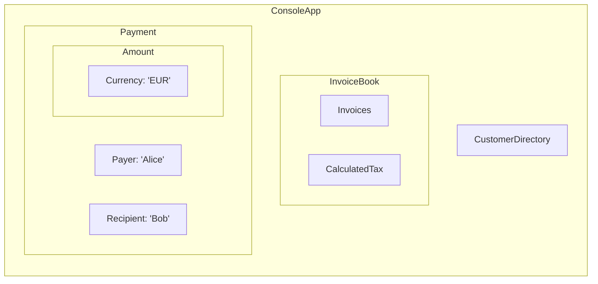

# Formale OOP-Regeln für App-Komposition

**(Concept!!!)**


## DEFINITIONEN

- **Kompositionshierarchie**: Die gesamte Anwendung ist als Baum von Kompositionen aufgebaut, rekursiv verschachtelt von außen (App) nach innen (atomare Komponenten).
- **Komposition**: Jedes Objekt existiert ausschließlich als Teil einer expliziten Objekt-Komposition, die durch eine Abstraktion z .B. `App.java` initiiert wird.
- **Einstiegspunkt**: der Anwendung im Paket `app` implementiert die Abstraktion `MainApp.java` im Wurzel-Namespace als Einstiegspunkt der Anwendung.
- **Domänenobjekt**: Ein objektorientiertes Element, das ein reales Ding der Fachdomäne repräsentiert (kein technischer „-er“/„-Manager“/„-Service“, außer tatsächlich in der Domäne vorhanden).
MainApp: Einstiegspunkt der Anwendung im Paket app; implementiert die Abstraktion App.java im Wurzel-Namespace.
- **Visualisierung**: Rechteck-Nesting: Die App ist das äußerste Rechteck, alle weiteren Objekte liegen als Rechtecke vollständig darin geschachtelt.

---

## AXIOME

1. **Existenzaxiom der Einstiegskomposition**
   - ∃! Einstiegsklasse (z.B. `ConsoleApp`), welche `App` implementiert und die äußere Komposition bildet.

2. **Totalitätsaxiom der Komposition**
   - ∀ Objekt o: o ∈ App-Komposition ⇔ o ist Teil (direkt oder indirekt) der Kompositionshierarchie, die von der Einstiegsklasse aufgebaut wird.

3. **Rekursionsaxiom der Unterkomposition**
   - ∀ Kompositum c: c ist selbst wieder eine Komposition aus weiteren Domänenobjekten oder atomaren Komponenten.

4. **Domänenaxiom der Benennung**
   - ∀ Klasse K: Name(K) entspricht einem realen, eigenständigen Ding der Domäne.  
     (Kein „-er“, „-Manager“, „-Service“, „-Controller“ etc., außer es handelt sich um ein reales Domänenobjekt.)

5. **Sichtbarkeitsaxiom**
   - ∄ Objekt außerhalb der expliziten Kompositionsstruktur der App.  
     (Keine Singletons, keine globalen Instanzen, keine magischen Framework-Container.)

---

## BEISPIEL-STRUKTUR (Java, gemäß OOP-Naming und Paketregeln)

```
App.java                  # Abstraktion für die Anwendung
app/                      # Package für Details der App-Abstraktion
├── ConsoleApp.java       # Einstiegspunkt, implementiert App, äußere Komposition
│       └── (in einer 'main' oder 'startup' Methode:)
│           new ConsoleApp(
│               new InvoiceBook(
│                   new Invoices(),
│                   new CalculatedTax()
│               ),
│               new Payment(
│                   new Payer("Alice"),
│                   new Recipient("Bob"),
│                   new Amount(100, new Currency("EUR"))
│               ),
│               new CustomerDirectory(...)
│           )
```

**Visualisierung:**  
- Das größte Rechteck ist `ConsoleApp`.
    - Darin: Rechtecke für `InvoiceBook`, `Payment`, `CustomerDirectory`, usw.
        - Weiter verschachtelt: `Invoices`, `CalculatedTax`, `Payer`, `Recipient`, `Amount`, etc.



**Legende:**  
- Das größte Rechteck ist `ConsoleApp`.
    - Enthält die Rechtecke `InvoiceBook`, `Payment`, `CustomerDirectory`.
    - `InvoiceBook` enthält `Invoices` und `CalculatedTax`.
    - `Payment` enthält wiederum `Payer`, `Recipient`, sowie das verschachtelte Rechteck `Amount`, das `Currency` umfasst.

---

**Hinweis:**  
Alle Objekte sind reale Domänenobjekte gemäß OOP-Naming.  
Es gibt keine „technischen“ Verwaltungsobjekte wie Loader, Printer, Manager, Service etc., außer wenn dies ein echtes Ding im Problemraum ist (z.B. `Manager` im HR-System = Chef).
