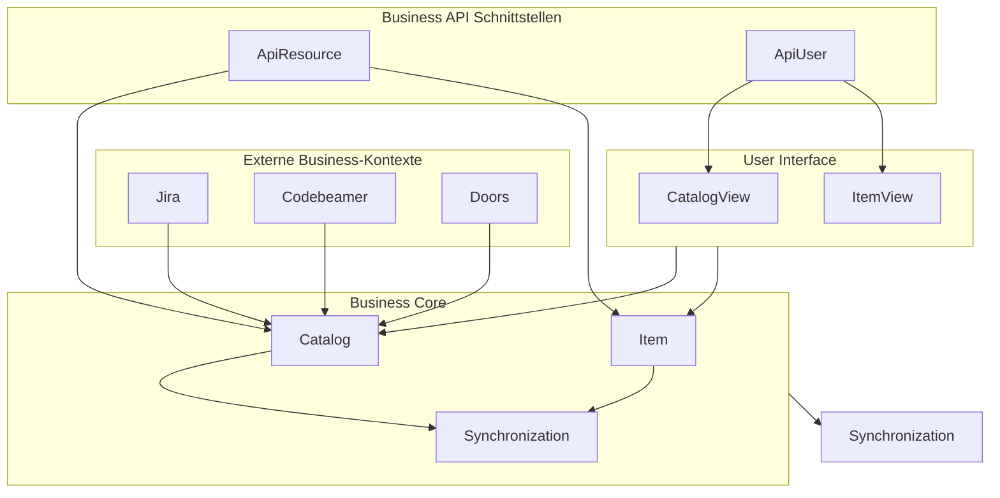

# Kontextgetriebene Paketierung in Softwareprojekten

Fast jeder Entwickler beginnt damit, Packages lediglich als ein Werkzeug zur Organisation von Klassen zu nutzen – meist so, wie es in dem Moment logisch erscheint.  
Doch eine Packaging-Strategie kann weitaus mächtiger sein: Sie kann Wissen enthalten, Orientierung bieten und die langfristige Wartbarkeit der Software erheblich verbessern.

Dieses Blogpost zeigt drei zentrale Regeln und beleuchtet typische Corner Cases aus der Praxis, die beim Einsatz in realen Projekten auftauchen.  
Dazu werden Varianten für **Jakarta EE**-basierte Systeme vorgestellt.

---

## Die drei Regeln

### Regel 1: Packages sollten niemals von ihren Sub-Packages abhängen
Ein Package darf nicht von seinen eigenen Sub-Packages abhängig sein.  
Beispiel: `com.example.customer` sollte nicht von `com.example.customer.bill` abhängen.

Damit bleibt die Hierarchie stabil und die Abhängigkeiten zeigen nach „unten“, nicht nach „oben“.  
Was **nicht** gemeint ist: Packages auf der gleichen Ebene („Siblings“) dürfen sich durchaus gegenseitig referenzieren, wenn sie fachlich verbunden sind.

---

### Regel 2: Sub-Packages führen keine neuen Konzepte ein
Sub-Packages dienen der **Detaillierung** eines bestehenden Konzepts, nicht der Einführung neuer.  
Ein Beispiel:  
- `com.example.billing` (Business-Konzept „Billing“)  
- `com.example.billing.rule` (Details: Geschäftsregeln des Billings)

Falsch wäre:  
- `com.example.billing.rule` enthält plötzlich ein Konzept „Notification“, das nichts mit Billing zu tun hat.  
- oder ein Sub-Package `util`, das kein Business-Konzept darstellt.

---

### Regel 3: Packages spiegeln Business-Konzepte wider
Packages sollten **Business-Terminologie** und **fachliche Konzepte** reflektieren.  
Dadurch wird die Software auch für Fachfremde nachvollziehbar.

Beispiel:  
- `com.example.api.user` (für die Business-Interaktion menschlicher Benutzer)  
- `com.example.api.resource` (für externe Systeme, die Business-Daten konsumieren)  
- `com.example.api.service` (für Dienste, die Business-Logik triggern)

---

## Praktische Corner Cases

### Corner Case 1: Technishe Abhängkeiten und Konfiguration
Im Kontext des Deloyments sind technishen Abhängkeiten und Konfiguration der gesamten Applikation ein Business-Konzept/-Need.

Durch die Einführung eines `app`-Pakets wird das Deloyment und Konfiguration als Business-Konzept und  kein **technisches Hilfspaket**.  
Es dient ausschließlich für:
- **Application-Startup** (Bootstrapping)  
- **Dependency Injection** (z. B. CDI, Spring, Guice)  
- **Konfiguration** (Properties, technische Bindung an Frameworks)  

👉 Fachliche Logik gehört **niemals** in `app`.  
Das Paket ist vergleichbar mit der „Infrastruktur-Schicht“ in DDD und bleibt bewusst **technisch isoliert**.

---

### Corner Case 2: Abhängigkeiten zwischen Sub-Packages
Wenn zwei Sub-Packages derselben Ebene voneinander abhängen, ist das erlaubt, sofern es fachlich Sinn ergibt.  
Beispiel:  
- `com.example.customer.address` ↔ `com.example.customer.contact`

Beide gehören zum übergeordneten Konzept „Customer“ und dürfen zusammenarbeiten.

---

### Corner Case 3: API als eigenes Business-Konzept
Wenn das Business fordert, dass eine Applikation Daten als Ressourcen bereitstellt oder externe Interaktionen ermöglicht, entsteht eine **API** als Business-Konzept.  

Die Sub-Pakete der API können z. B. sein:  
- `api.user` (Interaktion durch Menschen, z. B. UI/Frontend)  
- `api.resource` (bereitgestellte Daten-Ressourcen, z. B. JSON via JAX-RS)  
- `api.service` (externe Services, die Business-Logik triggern)  

Hier ist die API also nicht nur ein technischer Layer, sondern ein **vollwertiges Business-Konzept**.

---

### Corner Case 4: Technische Utilities
Utilities und technische Hilfsklassen sollten **kein eigenes Business-Konzept** sein.  
Sie gehören entweder klar zu einem bestehenden Business-Konzept oder werden durch objektorientierte Patterns (z. B. **Decorator**) eingebunden.  

Falsch wäre: ein generisches `com.example.util`-Paket.  
Richtig wäre: technische Helfer lokal in dem Business-Paket ablegen, wo sie fachlich Sinn ergeben.

---

### Corner Case 5: Tasks sind kein eigenes Business-Konzept
Hintergrundaufgaben (oder Cron Tasks) sind fachlich motivierte Prozesse bezogen auf die fachlichen Objekte, aber **kein eigenständiges Business-Konzept** wie z. B. `catalog` oder `item`.  
Sie befinden sich direkt im **Root** eines **Business-Kontext** und werden dort als fachliche Prozesse verankert:

```
com.test.catalog
├── ItemCleanupTask.java ← Fachlicher Task als direkt im Root vom fachlichen Haupkontext
├── ItemSyncTask.java ← Fachlicher Task als direkt im Root vom fachlichen Haupkontext 
├── Catalog.java
├── Item.java
└── Synchronization.java
```

Oder als Betrachtung fachlicher Deteils zu einem Bussines-Objekt 

```
com.test.catalog
├── item/ <- Fachliche Deteils zum ← Bussines-Objekt Item 
│ ├── ItemSyncTask.java ← Fachlicher Task als Detail direkt im Root vom fachlichen Subkontext
│ ├── ItemCleanupTask.java ← Fachlicher Task als Detail direkt im Root vom fachlichen Subkontext
├── Catalog.java
├── Item.java ← Bussines-Objekt/-Interface  
└── Synchronization.java
```

---
## Paketstruktur für Framework basierte Architektur (Jakarta EE oder Spring)

### Variante A: Mehrere Einstiegspunkte ohne zentrales `api`-Paket

Hier sind die Einstiegspunkte direkt im jeweiligen Sub-Kontext untergebracht:

```
com.test.catalog
├── app/ ← Startup, DI, Config
│ ├── CatalogApplication.java (handle or register hooks on Startup event, prepare all **jakarta.inject.*** CDI injections/producers)
│ ├── CatalogResourceApplication.java (enable JAX-RS @ApplicationPath)
│ └── CatalogFacesConfig.java (enable or configure JSF)
├── jira/  <- Fachliche Deteils zum Item bezüglich eines externen Business-Kontextes 
│ ├── Jira.java
│ ├── IssueItem.java
│ └── StorySync.java
├── codebeamer/  <- Fachliche Deteils zum Item bezüglich eines externen Business-Kontextes  
│ ├── Codebeamer.java
│ ├── RequirementItem.java
│ └── RequirementSync.java
├── doors/ <- Fachliche Deteils zum Item Konzept bezüglich eines externen Business-Kontextes 
│ ├── Doors.java
│ ├── DocumentItem.java
│ └── DocumentSync.java
├── catalog/ <- Fachliche Deteils zum Catalog Konzept 
│ ├── CatalogView.java
│ ├── CatalogApi.java ← JAX-RS Einstiegspunkt
│ ├── CatalogResource.java ← JSON-B Wrapper
│ ├── CatalogEdit.java
│ └── CatalogList.java
├── item/ <- Fachliche Deteils zum Item Konzept 
│ ├── ItemView.java
│ ├── IssueItemView.java
│ ├── RequirementItemView.java
│ ├── DocumentItemView.java
│ ├── ItemSyncTask.java ← Fachlicher Task direkt im Root
│ ├── ItemCleanupTask.java ← Fachlicher Task direkt im Root
│ ├── ItemApi.java
│ ├── ItemResource.java
│ └── ItemList.java
├── Catalog.java
├── Item.java
└── Synchronization.java
```

---
### Variante B: Einheitliches `api`-Paket für alle Einstiegspunkte

Hier werden alle Schnittstellen in einem dedizierten `api`-Paket gesammelt, das selbst ein Business-Konzept darstellt.  
Tasks bleiben jedoch im Root, da sie **fachliche Prozesse** sind und kein API-Subkonzept.

```
com.test.catalog
├── api/
│ ├── user/ 
│ │ ├── catalog/ <- Fachlicher Begriff im Menu
│ │ │ ├── CatalogView.java
│ │ │ ├── CatalogForm.java
│ │ │ └── CatalogTable.java
│ │ ├── item/ <- Fachlicher Begriff im Menu
│ │ │ ├── ItemView.java
│ │ │ ├── IssueItemView.java
│ │ │ ├── RequirementItemView.java
│ │ │ ├── DocumentItemView.java
│ │ │ ├── ItemForm.java
│ │ │ └── ItemTable.java
│ │ ├── DataTable.java
│ │ ├── DataForm.java
│ │ └── CatalogMenu.java
│ ├── resource/
│ │ ├── CatalogApi.java
│ │ ├── CatalogResource.java
│ │ ├── ItemApi.java
│ │ └── ItemResource.java
│ └── service/
│ └── ExternalServiceApi.java
├── app/ ← Startup, DI, Config
│ ├── CatalogApplication.java (handle or register hooks on Startup event, prepare all **jakarta.inject.*** CDI injections/producers)
│ ├── CatalogResourceApplication.java (enable JAX-RS @ApplicationPath)
│ └── CatalogFacesConfig.java (enable or configure JSF)
├── jira/ <- Fachliche Deteils zum Item Konzept bezüglich eines externen Business-Kontextes 
│ ├── Jira.java
│ ├── IssueItem.java
│ └── StorySync.java
├── codebeamer/ <- Fachliche Deteils zum Item Konzept bezüglich eines externen Business-Kontextes 
│ ├── Codebeamer.java
│ ├── RequirementItem.java
│ └── RequirementSync.java
├── doors/ <- Fachliche Deteils zum Item Konzept bezüglich eines externen Business-Kontextes 
│ ├── Doors.java
│ ├── DocumentItem.java
│ └── DocumentSync.java
├── ItemCleanupTask.java ← Fachlicher Task im Root
├── ItemSyncTask.java ← Fachlicher Task im Root
├── Catalog.java
├── Item.java
└── Synchronization.java
```

---
## Paketstruktur für Clean- und DDD-Architektur (Implementierung mit Jakarta EE oder Spring)

---
### Single Artefak Project
(In einem Single Artefakt Projekt bleibt alles in einem Deployment-Artefakt, aber mit klarer fachlicher Struktur.)
```
com.test.catalog
├── app/
│ ├── CatalogApplication.java
│ ├── CatalogConfig.java
│ └── DependencyProvider.java
├── jira/
│ ├── Jira.java
│ ├── IssueItem.java
│ └── StorySync.java
├── codebeamer/
│ ├── Codebeamer.java
│ ├── RequirementItem.java
│ └── RequirementSync.java
├── doors/
│ ├── Doors.java
│ ├── DocumentItem.java
│ └── DocumentSync.java
├── catalog/
│ ├── CatalogView.java
│ ├── CatalogApi.java
│ ├── CatalogResource.java
│ └── CatalogList.java
├── item/
│ ├── ItemView.java
│ ├── IssueItemView.java
│ ├── RequirementItemView.java
│ ├── DocumentItemView.java
│ └── ItemList.java
├── ItemCleanupTask.java
├── ItemSyncTask.java
├── Catalog.java
├── Item.java
└── Synchronization.java
```

---
### Multi Artefakt Project

(In einem Multi-Artefakt Projekt werden die Business-Kontexte in separate Module aufgeteilt, die einzeln versioniert und ggf. deployt werden können, aber die Regeln bleiben gleich.)

```
catalog-core (Modul)
├── com.test.catalog.core
│ ├── Catalog.java
│ ├── Item.java
│ └── Synchronization.java
```

```
catalog-jira (Modul)
├── com.test.catalog.jira
│ ├── Jira.java
│ ├── IssueItem.java
│ └── StorySync.java
```

```
catalog-codebeamer (Modul)
├── com.test.catalog.codebeamer
│ ├── Codebeamer.java
│ ├── RequirementItem.java
│ └── RequirementSync.java
```

```
catalog-doors (Modul)
├── com.test.catalog.doors
│ ├── Doors.java
│ ├── DocumentItem.java
│ └── DocumentSync.java
```

catalog-api (Modul) ← wenn Business API verlangt
├── com.test.catalog.api
│ ├── CatalogApi.java
│ └── ItemApi.java
```

catalog-ui (Modul) ← wenn Business UI verlangt
├── com.test.catalog.ui
│ ├── catalog/
│ │ ├── CatalogView.java
│ │ ├── CatalogForm.java
│ │ └── CatalogTable.java
│ ├── item/
│ │ ├── ItemView.java
│ │ ├── IssueItemView.java
│ │ ├── RequirementItemView.java
│ │ └── DocumentItemView.java
```

```
catalog-root (Modul)
├── com.test.catalog
│ ├── ItemCleanupTask.java
│ ├── ItemSyncTask.java
│ └── (optional) Synchronization.java
```

**Visualisierung: Modul-Abhängigkeiten**


**Erläuterung: Modul-Abhängigkeiten**

Core (Business Core) enthält die fundamentalen Domänenobjekte: Catalog, Item, Synchronization. Diese sollten keine Abhängigkeit auf Module außerhalb des Cores haben (Regel 1 & 3).

- Externe Business-Kontexte wie Jira, Codebeamer, Doors dürfen vom Core abhängig sein — z. B. wenn Sync-Logik benötigt wird. Nicht umgekehrt.
- UI-Module (z. B. CatalogView, ItemView) sind fachliche Darstellungskonzepte, erlauben Abhängigkeit auf Core, aber nicht umgekehrt.
- API-Module (z. B. ApiResource, ApiUser) erlauben ebenfalls Abhängigkeit auf Core, da API Schnittstellen oft Daten oder Aktionen aus dem Core exposen.
- Es wird nicht vorgesehen, dass UI Module auf externe Kontexte wie Jira direkt zugreifen, sofern das Business es nicht verlangt. Wenn UI z. B. Daten von Jira darstellen muss, dann geschieht das über eine fachlich benannte API bzw. über Sync-Klassen im Jira Paket.


| Regel                                                                    | Anwendung im Beispiel                                                                                                         |
| ------------------------------------------------------------------------ | ------------------------------------------------------------------------------------------------------------------------------- |
| *Regel 1*: Kein Paket sollte von seinen Sub-Paketen abhängen             | Core hat keine Abhängigkeit zu UI oder API, nur umgekehrt. Subpakete (z. B. UI, API) hängen auf Core.                           |
| *Regel 2*: Sub-Pakete führen keine neuen Konzepte ein                    | UI, API, Externe Kontexte sind bestehende Business-Konzepte, Sub-Pakete gliedern nur Details (View, Resource etc.).             |
| *Regel 3*: Pakete spiegeln Business-Konzepte, keine technischen Begriffe | Namen wie `Jira`, `Item`, `Catalog`, `ApiUser`, `CatalogView` sind fachlich. Kein `infrastructure`, kein `task` Paketname, etc. |


---

## Fazit

Eine gute Packaging-Strategie geht über reine Ordnung hinaus.  
Sie **transportiert Wissen, verdeutlicht Business-Konzepte** und schützt vor wachsender Komplexität.  

- Das `app`-Paket bleibt **rein technisch**.  
- APIs sind **fachliche Einstiegspunkte**.  
- Tasks gehören **in den Root**, da sie keine eigenständigen Business-Konzepte sind.  
- Sub-Packages sind **Detailierungen**, keine neuen Konzepte.  

So entsteht eine **kontextgetriebene, fachlich nachvollziehbare** Architektur.  
