1. Formale Definition einer Paket-Hierarchie
*es sei Gegeben:*
n[0]: Höchste Abstraktionsgrenze der Anwendung (com.company.<app>).
m: Anzahl aller Abstraktionen innerhalb der Grenze n[0].
Hierarchieebenen: n[0] bis n[m], wobei jede Ebene eine Abstraktion mit dem gleichen Name repräsentiert.


# Pakete nach Abstraktionsgrad

Pakete sind nach ihrem Abstraktionsgrad organisiert und benannt.  
Die Pakete folgen streng ihren Abstraktionen, welche die Architektur-Hierarchie abbildet.


**Definitionen**
Definitionen


Start: n[0] = 0 höchste Ebene der Anwendung.
Ende: n[m] = m wobei m = Summe aller Abstraktionen innerhalb von Abstraktionsgrenze n = m.
- b[n] = Namespace auf Ebene der Abstraktionsgrenze n[0] (z. B. com.company.[context-boundary])
- a[n+1] = Abstraktion auf Ebene n+1, z. B. Interface, abstrakte Klasse oder Domain-Konzept
- p[n+1] = Package, das ausschließlich Implementierungen der Korrespondierenen Abstraktion *a[n+1]* enthält

```
Beziehung,Notation,Beispiel,Bedeutung
Boundary → Abstraction,b[n] → a[n+1],Das Paket b[n] enthält die Abstraktion a[n+1],com.example.billing → Bill.java
Abstraction → Package,a[n] → p[n],Die Abstraktion a[n] definiert das Paket p[n],Bill.java → com.example.billing.bill
Detaillierung,a[n] ⊲ a[n+1],a[n+1] ist eine Spezialisierung/Implementierung von a[n],Bill ⊲ TaxedBill
Aggregation,a[n] → a[m],a[n] enthält/verwaltet a[m] (keine Detaillierung!), Billing → Bill
```


**Hinweis:**

Die Paketstruktur folgt der Abstraktionshierarchie: jedes Package p[n+1] implementiert die Abstraktion a[n+1] innerhalb des Namespace b[n].

Benennung ist konsistent: Pakete und Abstraktionen haben den gleichen Namen, um Abstraktionsgrad und Kontext sofort erkennbar zu machen.


**Axiome / Regeln**
*Existenzregel für Abstraktionen*
**Jede Abstraktion a[n] darf im globalen Namespace oder in einem höheren Paket-Level existieren.**
```
a[n] ∈ {n[0], n[0].*}
```
*Existenzregel für Implementierungspakete*
**Ein Package p[n] darf nur existieren, wenn eine gleichnamige Abstraktion a[n] entweder im globalen Namespace oder in einem höheren Level existiert.**
```
∃ a[n] : a[n] ∈ {n[0], n[0].*} ⇒ p[n] darf existieren
```
*Inhaltsregel für Implementierungspakete*
**Jedes p[n] darf ausschließlich Implementierungen, Spezialisierungen oder Detail-Aspekte von a[n] enthalten.**
*Formal:*
```
∀ c ∈ p[n] : c ⊑ a[n]
wobei ⊑ für „ist Spezialisierung / Implementierung von" steht.
```

```
ich möchte eine OOP Package Design Regel Formalisieren
```
Formales Packaging-Gesetz
Definitionen
a[n] = Abstraktion auf Ebene n
(z. B. Interface, abstrakte Klasse oder Domain-Konzept)
p[n] = Package, das ausschließlich Implementierungen von a[n] enthält
Root = com.company.<app> = globales Root-Package für die gesamte Anwendung


**Formales Packaging-Gesetz**
*Definitionen*
a[n] = Abstraktion auf Ebene n
p[n] = Package, das ausschließlich Implementierungen von a[n] enthält

*Axiome*

com.company.<app> = globales Root-Package.
Jede Abstraktion a[n] darf im lokalen Root-Package existieren.
Jedes Package p[n] darf nur existieren, wenn eine gleichnamige Abstraktion a[n] im lokalen Root oder auf einer höheren a[n-1] existiert.
p[n] enthält ausschließlich Implementierungen, Spezialisierungen oder Detail-Aspekte von a[n].

```mermaid
graph TD
    %% Root-Namespace
    s0["s[0] = com.example"]

    %% Abstraktion Ebene 0 (Aggregator)
    s0 --> a0_billing["a[0] = Billing.java"]
    s0 --> a0_bill["a[0] = Bill.java"]
    s0 --> a0_rule["a[0] = Rule.java"]
    s0 --> a0_tax["a[0] = Tax.java"]

    %% Aggregationsbeziehung
    a0_billing -->|"aggregiert"| a0_bill

    %% Pakete Ebene 1
    a0_bill --> p1_bill["p[1] = com.example.billing.bill"]
    a0_rule --> p1_rule["p[1] = com.example.billing.rule"]
    a0_tax --> p1_tax["p[1] = com.example.billing.tax"]

    %% Implementierungen in p[1]
    p1_bill --> StoredBill["StoredBill.java"]
    p1_bill --> TaxedBill["TaxedBill.java"]
    p1_bill --> PaidBill["PaidBill.java"]

    p1_rule --> Unit["Unit.java"]
    p1_rule --> StoredRule["StoredRule.java"]
    p1_rule --> TimedRule["TimedRule.java"]
    p1_rule --> ConfirmedRule["ConfirmedRule.java"]

    p1_tax --> UKTax["UKTax.java"]
    p1_tax --> EUTax["EUTax.java"]

    %% Detaillierungsrelationen
    a0_bill -->|⊲ 1.1| StoredBill
    a0_bill -->|⊲ 1.1| TaxedBill
    a0_bill -->|⊲ 1.1| PaidBill

    a0_rule -->|⊲ 1.2| Unit
    a0_rule -->|⊲ 1.1| StoredRule
    a0_rule -->|⊲ 1.4| TimedRule
    a0_rule -->|⊲ 1.4| ConfirmedRule

    a0_tax -->|⊲ 1.1| UKTax
    a0_tax -->|⊲ 1.1| EUTax

    %% Strukturelle Beziehung: Bill → Tax (1.3)
    a0_bill -->|⊲ 1.3| a0_tax

    %% Stile
    classDef aggregate fill:#f96,stroke:#333;
    classDef abstract fill:#f9f,stroke:#333;
    classDef package fill:#bbf,stroke:#333;
    classDef impl fill:#9f9,stroke:#333;

    class a0_billing aggregate;
    class a0_bill,a0_rule,a0_tax abstract;
    class p1_bill,p1_rule,p1_tax package;
    class StoredBill,TaxedBill,PaidBill,Unit,StoredRule,TimedRule,ConfirmedRule,UKTax,EUTax impl;

    %% Legende
    linkStyle 0 stroke:#f66,stroke-width:2px,stroke-dasharray: 5 5;
    linkStyle 1,2,3,4,5,6,7,8,9 stroke-width:2px;  %%
```





*Schablone*

- Ersetze <app> durch deinen App-Namen (z. B. todo).
- Kopiere den Block a[N] und p[N], wenn du weitere Abstraktionen/Detailpakete einfügen willst.
- Die Indizes [N], [N.M], [N.M.K] kannst du beliebig erweitern, um tiefere Verschachtelungen darzustellen.

@startuml
title Generisches Packaging-Gesetz: Abstraktionen (a) & Detailpakete (p)
@enduml

Existenzregel:
Ein <package-for-abstraction> darf nur dann vorkommen, wenn eine gleichnamige <abstraction> im selben Kontext existiert.
Namensregel:
p[N] muss denselben Index wie a[N] tragen.
Rekursion:
Sowohl <sub-abstraction-list> als auch <package-for-abstraction-list> sind beliebig tief verschachtelbar.


```mermaid
```

**Semantische Regeln**

1. Existenzregel:
Ein <package-for-abstraction> darf nur dann vorkommen, wenn eine gleichnamige <abstraction> im selben Kontext existiert.

2. Namensregel:
p[N] muss denselben Index wie a[N] tragen.

3. Rekursion:
Sowohl <sub-abstraction-list> als auch <package-for-abstraction-list> sind beliebig tief verschachtelbar.

4. Anti-Pattern-Regel (ergänzt als semantische Einschränkung, nicht BNF):
Innerhalb von p[N] dürfen keine Klassen mit Suffixen wie *Service, *Repository, *Manager, *Access, *Validator existieren.

```
<root>          ::= "com.company." <app> "." <abstraction-list>

<app>           ::= <identifier>

<abstraction-list> 
                 ::= <abstraction> | <abstraction> <abstraction-list>

<abstraction>   ::= "a[" <id> "]"
                     [ <sub-abstraction-list> ]
                     [ <package-for-abstraction> ]

<sub-abstraction-list>
                 ::= <abstraction> | <abstraction> <sub-abstraction-list>

<package-for-abstraction>
                 ::= "p[" <id> "]"
                     "(" "Implementierungen von a[" <id> "]" ")"
                     [ <sub-abstraction-list> ]
                     [ <package-for-abstraction-list> ]

<package-for-abstraction-list>
                 ::= <package-for-abstraction> | <package-for-abstraction> <package-for-abstraction-list>

<id>            ::= <number> [ "." <number> [ "." <number> ... ] ]

<identifier>    ::= <letter> { <letter> | <digit> }
<number>        ::= <digit> { <digit> }
<letter>        ::= "A" | "B" | ... | "Z" | "a" | "b" | ... | "z"
<digit>         ::= "0" | "1" | ... | "9"
```


# Kontextgetriebene Paketierung in Softwareprojekten


@startuml
title Generisches Packaging-Gesetz: Abstraktionen (a) & Detailpakete (p)

' Root-Package
package "com.company.<app>" {

  ' Root-Abstraktion (Beispiel: App, Task, User, Policy, Project)
  package "a[N]" as aN {
    ' Optionale Sub-Abstraktionen
    package "a[N.1]" as aN1
    package "a[N.2]" as aN2
  }

  ' Detailpaket p[N] legitimiert durch Abstraktion a[N]
  package "p[N] (Implementierungen von a[N])" as pN {
    package "a[N.M]" as aNM
    package "p[N.M] (Implementierungen von a[N.M])" as pNM {
      package "a[N.M.K]" as aNMK
      package "p[N.M.K] (Implementierungen von a[N.M.K])" as pNMK
    }
  }
}

' Existenz-Regeln: Abstraktion legitimiert Detailpaket
aN -[thickness=2,dashed]-> pN
aNM -[thickness=2,dashed]-> pNM
aNMK -[thickness=2,dashed]-> pNMK

note right of pN
  Regel:
  1. Jedes p[X] existiert nur,
     wenn a[X] existiert.
  2. p[X] enthält nur Details
     von a[X].
end note

@enduml


Fast jeder Entwickler beginnt damit, Packages lediglich als ein Werkzeug zur Organisation von Klassen zu nutzen – meist so, wie es in dem Moment logisch erscheint.  Doch eine *Packaging-Strategie* kann weitaus mächtiger sein: Sie kann *Wissen* enthalten, *Orientierung* bieten und die langfristige *Wartbarkeit* der Software erheblich verbessern.

Dieses Blogpost beleuchtet drei zentrale Regeln von Robert Bräutingm für eine Bisness-Contept getriebene Paketierung in Softwareprojekten und vertieft praktische Aspekt, welche beim Einsatz in realen Projekten auftreten können.

Dazu werden Varianten von Paketstrukturen für **Jakarta EE** sowie Clean-Architektur und DDD basierte Projekte vorgestellt.

Als Ausgangspunkt der Betrachtung statischer Code-Strukturen wie *Pakete" eines Softwaresystems, wird das **C4-Modell** für die grundlegende Terminologie und Abstraktion verwendet. 

---

## Die drei Regeln

### Regel 1: Packages sollten niemals von ihren Sub-Packages abhängen
Ein Package darf nicht von seinen eigenen Sub-Packages abhängig sein.

Beispiel: `com.example.customer` sollte nicht von `com.example.customer.bill` abhängen.

Damit bleibt die Hierarchie stabil und die Abhängigkeiten zeigen nach „unten“, nicht nach „oben“.  
Was **nicht** gemeint ist: Packages auf der gleichen Ebene („Siblings“) dürfen sich durchaus gegenseitig referenzieren, wenn sie fachlich verbunden sind.

---

### Regel 2: Sub-Packages führen keine neuen Konzepte ein
Sub-Packages dienen der **Detaillierung** eines bestehenden Konzepts, nicht der Einführung neuer.

Ein Beispiel:  
- `com.example.billing` (Business-Konzept „Billing“)  
- `com.example.billing.rule` (Details: Geschäftsregeln des Billings)
- `com.example.billing.rule.unit` (Details: Einheiten einer Rule)

**Details** - sind Geschäftsregeln und beziehen sich immer auf Geschäftobjekte aus dem lokalen Kontext  

```
com.example.billing
├── app/  <- fachliche Deteils - Geschäftsregeln für das Setup-/Monitoring-/Logging-Aspekte
│ ├── MonitoredBillingApp.java  
│ ├── LoggedBillingApp.java  
│ └── BillingApp.java  <- realisiert App (startup, injections, Configuration, Properites)
├── user/  <- fachliche Details für Benuzter-oberflächen
│ ├── menu/ <- Navigation-Aspekt auf der Benuzteroberflächenl - 
│ │   └──LockedMenu.java <- dekoriert Menu
│ ├── Admin.java <- dekoriert User
│ └── Menu.java (interface)
├── resouce/  <- fachliche Details von Benuzteroberflächen
│ ├── BillResouce.java 
│ └── BillingResouces.java realisiert die REST Service API
├── bill/  <- fachliche Deteils - Geschäftsregeln eines Geschäftobjekts (Bill) aus dem Business-Kontext
│ ├── StoredBill.java  <- dekoriert Bill
│ ├── TaxedBill.java  
│ └── PaidBill.java  
├── rule/ <- fachliche Details
│ ├── unit/ <- fachliche Details - Geschäftsregeln eines Geschäftobjekts (Unit) 
│ │   └──ISO.java <- realisiert Unit
│ ├── StoredRule.java
│ ├── TimedRule.java
│ ├── ConfirmedRule.java
│ └── Unit.java <- Geschäftobjekt im Sub-Kontext
├── tax/  <- fachliche Details - Geschäftsregeln eines Geschäftobjekts (Tax) aus dem Business-Kontext
│ ├── UKTax.java  <- dekoriert Tax
│ └── EUTax.java  
├── App.java (interface) <- Setup-/Monitoring-/Logging-Aspekte als Geschäft-Konzept
├── User.java (interface) <- UI-Aspekte als Geschäft-Konzept
├── Resouce.java (interface) <- REST-Service-Aspekte als Geschäft-Konzept
├── Rule.java (interface)
├── Tax.java (interface)
├── Bill.java (interface)
└── Billing.java (interface) aggrigate Bill
```

Falsch wäre:  
- com.example.billing.rule` enthält plötzlich ein Konzept „Notification“, das nichts mit Billing zu tun hat bzw. zu keinem der Geschäftobjekte im "billing" Paket eine Beziehung hat.  
- oder ein Sub-Package `util`, das kein Business-Konzept darstellt, sondern nur nüzliche Klassen z. B. für ISO Einheiten sammelt.


**Validierung**
```
boolean validatePackageRules(String rootPackage) {
    return validatePackageRulesRecursive(rootPackage, rootPackage, 0);
}

private boolean validatePackageRulesRecursive(String currentPackage, String rootPackage, int level) {
    // 1. Finde alle Abstraktionen im aktuellen Paket
    List<Class<?>> abstractions = findAbstractions(currentPackage);

    for (Class<?> abstraction : abstractions) {
        String abstractionName = abstraction.getSimpleName();

        // Regel: Namen immer in Singularform
        if (abstractionName.endsWith("s")) {
            return false; // Pluralform verboten
        }

        String expectedPackageName = abstractionName.toLowerCase();
        String expectedPackagePath = currentPackage + "." + expectedPackageName;

        // Regel 1: Paket muss existieren und Implementierungen enthalten
        if (!packageExists(expectedPackagePath)) {
            return false; // Verstoß gegen Existenzregel
        }

        List<Class<?>> implementations = findClassesInPackage(expectedPackagePath);
        if (implementations.isEmpty()) {
            return false; // Verstoß: Paket existiert, aber keine Implementierungen
        }

        for (Class<?> impl : implementations) {
            if (!isSubtypeOf(impl, abstraction)) {
                return false; // Verstoß: Klasse im Paket ist keine Implementierung der Abstraktion
            }
        }

        // Regel 2: Paketname muss dem Abstraktionsnamen entsprechen
        if (!getPackageName(expectedPackagePath).equals(expectedPackageName)) {
            return false; // Verstoß gegen Namensregel
        }

        // Rekursive Validierung für Sub-Abstraktionen
        if (!validatePackageRulesRecursive(expectedPackagePath, rootPackage, level + 1)) {
            return false;
        }
    }

    // Basis-Fall: Keine weiteren Abstraktionen gefunden
    return true;
}
```


---

### Regel 3: Packages spiegeln Business-Konzepte wider

Packages sollten **Business-Terminologie** und **fachliche Konzepte** reflektieren, und nicht die technischen.  
Dadurch wird die Software auch für Fachfremde nachvollziehbar.

Die Business-Konzepte hängen jedoch stark von der Perspektive des Betrachters ab.

Während vom Kunden in erster Linie seine Geschäftsprozesse als Business-Konzepte angesehen werden,
sieht meist der Endnutzer 'user' die Benuzteroberfläche als für Ihn relevantes Business-Konzept.
Beispiel 1:
- `com.example.billing.user` (Business-Konzept für Interaktion menschlicher Benutzer)
Beispiel 2:
- `com.example.billing.api.user`  (Business-Konzept für Interaktion menschlicher Benutzer)  
- `com.example.billing.api.resource` (Business-Konzept für externe Systeme, die Business-Daten konsumieren)  
- `com.example.billing.api.service` (Business-Konzept für Dienste, die Business-Logik ausführen)

Auch das Deployment sowie die Verwaltug von Abhängigkeiten und Konfigurationen können jenach Berachterperspektive ein Business-Konzpt sein. 
Ein Paket wie `app` oder 'config' ist meist in einem Bibliothekenartigen Codestruktur nicht notwendig, im Gegensatz zu Business-Applikationen ist es oft notwendig, um auch dem technischen *Übel* Herr zu werden.

---

## Praktische Aspekte

### Aspekt 0: Analyse der Business-Konzepte (C4)

Die 4 Sichten im C4 Modell beinhalten Anhaltspunkte zur Identifikation von Business-Konzepten und zugehötigen Paketen:
- Kontext-Diagramme – Ebene 1: ... Umfang eines Systems seine Beziehungen zu *Benutzern* und *anderen Systemen*.
- Container-Diagramme – Ebene 2: ... separat betreibbare *Artifakte* als Laufzeitgrenzen um Komponenten.
- Komponenten-Diagramme – Ebene 3: ... Aspekte wie *Pakete* von Komponenten, deren Verantwortlichkeiten mit Implementierungsdetails.
- Quelltext-Diagramme – Ebene 4: ... Details über den Entwurf der Architekturelemente, die auf Code abgebildet werden können.

Zudem veranschaulichen Deployment Diagramme, wie Instanzen von Softwaresystemen und/oder Containern im statischen Modell in der Infrastruktur innerhalb einer gegebenen Bereitstellungsumgebung (z. B. Produktion, Staging, Entwicklung usw.) bereitgestellt werden. 

1. *Identifikation von Elenenten und Zielgruppen* [C4 System-Context Diagram (https://c4model.com/diagrams/system-context)]
2. *Identifikation von Applikation Schittellen* [C4 Container Diagram (https://c4model.com/diagrams/container)]
3. *Identifikation von Business-Konzepten* [C4 Component Diagram ((https://c4model.com/diagrams/component)]
4. *Identifikation von Abhängkeiten und Konfigurationen* [C4 Deployment Diagram (https://c4model.com/diagrams/deployment)]

---
### Aspekt 1: Abhängigkeiten zwischen Sub-Packages
Wenn zwei Sub-Packages derselben Ebene voneinander abhängen, ist das erlaubt, sofern es fachlich Sinn ergibt.  
Beispiel:  
- `com.example.customer.address` ↔ `com.example.customer.contact`

Beide gehören zum übergeordneten Konzept *Customer* und dürfen zusammenarbeiten, so lange sie keine zirkulär Abhängingkeiten aufweisen

**Valide Abhängigkeit:** customer.address und customer.contact sind Sub-Packages derselben Ebene unter customer. Beide Sub-Packages gehören zum selben Überkonzept *Customer*.


| Regel / Sonderfall                                        | Erfüllt? | Begründung                                                                                                                         |
| --------------------------------------------------------- | -------- | ---------------------------------------------------------------------------------------------------------------------------------- |
| **Regel 1: Kein Paket darf von Sub-Package abhängen**     | ✅        | `customer.address` hängt von `customer.contact` — aber kein übergeordnetes Paket hängt davon ab. Es ist innerhalb derselben Ebene. |
| **Regel 2: Sub-Packages führen keine neuen Konzepte ein** | ✅        | Beide sind Teil des Konzeptes „Customer“. Es werden keine völlig neuen Domänenbegriffe eingeführt.                                 |
| **Regel 3: Pakete spiegeln Business-Konzepte**            | ✅        | „Address“ und „Contact“ sind fachlich verständliche Begriffe im Kontext „Customer“, kein technisches Layer-Wording.                |


**Zirkuläre Abhängigkeit:** customer.address hängt von customer.contact ab und umgekehrt.


*Warum ist diese Struktur problematisch?*

- Verletzung von Regel 1: Pakete sollten nicht von ihren eigenen Sub‑Paketen abhängen. Diese zirkuläre Abhängigkeit führt zu einer instabilen Hierarchie.
- Verletzung von Regel 2: Sub‑Pakete sollten keine neuen Konzepte einführen. Die gegenseitige Abhängigkeit zwischen address und contact kann zu einer Vermischung von Verantwortlichkeiten führen.
- Verletzung von Regel 3: Pakete sollten Business‑Konzepte widerspiegeln. Die zirkuläre Struktur erschwert das Verständnis der fachlichen Zusammenhänge.

**Mögliche Lösungen**

- Refactoring: Überprüfen, ob die Verantwortlichkeiten klar getrennt sind und ob eine der Abhängigkeiten entfernt oder umgestaltet werden kann.
- Verwendung von Schnittstellen: Einführen von Schnittstellen oder abstrakten Klassen, um die direkte Abhängigkeit zwischen den Paketen zu vermeiden.
- Neuorganisation der Pakete: Erstellen eines neuen Pakets, das die gemeinsamen Konzepte oder Schnittstellen enthält, um die Abhängigkeiten zu entflechten.

---
### Aspekt 2: Technische Hilfsklassen Utilities
Utilities und technische Hilfsklassen sollten **kein eigenes Business-Konzept** sein.  
Sie gehören entweder klar zu einem bestehenden Business-Konzept oder werden durch objektorientierte Patterns (z. B. **Decorator**) realisiert.  

Falsch wäre: ein generisches `com.example.util`-Paket.  
Richtig wäre: technische Helfer lokal in dem Business-Paket ablegen, wo sie fachlich Sinn ergeben.

### Aspekt 3: Applikation Schnittstellen - API als eigenes Business-Konzept

Eine Applikation, die Schnittstellen z. B. für Ressourcen oder Interaktionen anbietet, impliziert die (**API**) als ein Business-Konzept der Applikation.

Die Detailausprägungen bzw. die Sub-Pakete welche von einer 'api' ausgehen, können z. B. sein: 
- `api.user` (Interaktion durch Menschen, z. B. UI/Frontend)  
- `api.resource` (bereitgestellte Daten-Ressourcen, z. B. JSON via JAX-RS)  
- `api.service` (externe Services, die Business-Logik triggern)  

Hier ist die API also nicht nur ein technischer Layer, sondern ein **vollwertiges Business-Konzept**.

---

### Aspekt 4: Technishe Abhängkeiten und Konfiguration

Ein Paket wie `app` oder 'config' ist meist in einem Bibliothekenartigen Code nicht notwendig, im Gegensatz zu Business-Applikationen ist es meist notwendig um dem technischen *Übel* Herr zu werden.

Im Kontext des Deloyments sind technishen Abhängkeiten und Konfiguration der gesamten Applikation ein Business-Konzept/-Need.

Durch die Einführung eines `app`-Pakets wird das Deloyment und Konfiguration als Business-Konzept und  kein **technisches Hilfspaket**.  
Es dient ausschließlich für:
- **Application-Startup** (Bootstrapping)  
- **Dependency Injection** (z. B. CDI, Spring, Guice)  
- **Konfiguration** (Properties, technische Bindung an Frameworks)  

👉 Fachliche Logik gehört **niemals** in `app`.  
Das Paket ist vergleichbar mit der „Infrastruktur-Schicht“ in DDD und bleibt bewusst **technisch isoliert**.
---

### Aspekt 5: Tasks sind kein eigenes Business-Konzept
Hintergrundaufgaben (oder Cron Tasks) sind fachlich motivierte Prozesse bezogen auf die fachlichen Objekte, aber **kein eigenständiges Business-Konzept** wie z. B. `catalog` oder `item`.  
Sie befinden sich direkt im **Root** eines **Business-Kontext** und werden dort als fachliche Prozesse verankert:

```
com.test.catalog
├── ItemCleanupTask.java ← Fachlicher Task als direkt im Root vom fachlichen Haupkontext
├── ItemSyncTask.java ← Fachlicher Task als direkt im Root vom fachlichen Haupkontext 
├── Catalog.java
├── Item.java
└── Synchronization.java
```

Oder als Betrachtung fachlicher Deteils zu einem Bussines-Objekt 

```
com.test.catalog
├── item/ <- Fachliche Deteils zum ← Bussines-Objekt Item 
│ ├── ItemSyncTask.java ← Fachlicher Task als Detail direkt im Root vom fachlichen Subkontext
│ ├── ItemCleanupTask.java ← Fachlicher Task als Detail direkt im Root vom fachlichen Subkontext
├── Catalog.java
├── Item.java ← Bussines-Objekt/-Interface  
└── Synchronization.java
```

---
## Paketstruktur für Framework basierte Architektur (Jakarta EE oder Spring)

### Variante A: Mehrere Einstiegspunkte ohne zentrales `api`-Paket

Hier sind die Einstiegspunkte direkt im jeweiligen Sub-Kontext untergebracht:

```
com.test.catalog
├── app/ ← Startup, DI, Config
│ ├── CatalogApplication.java (handle or register hooks on Startup event, prepare all **jakarta.inject.*** CDI injections/producers)
│ ├── CatalogResourceApplication.java (enable JAX-RS @ApplicationPath)
│ └── CatalogFacesConfig.java (enable or configure JSF)
├── jira/  <- Fachliche Deteils zum Item bezüglich eines externen Business-Kontextes 
│ ├── Jira.java
│ ├── IssueItem.java
│ └── StorySync.java
├── codebeamer/  <- Fachliche Deteils zum Item bezüglich eines externen Business-Kontextes  
│ ├── Codebeamer.java
│ ├── RequirementItem.java
│ └── RequirementSync.java
├── doors/ <- Fachliche Deteils zum Item Konzept bezüglich eines externen Business-Kontextes 
│ ├── Doors.java
│ ├── DocumentItem.java
│ └── DocumentSync.java
├── catalog/ <- Fachliche Deteils zum Catalog Konzept 
│ ├── CatalogView.java
│ ├── CatalogApi.java ← JAX-RS Einstiegspunkt
│ ├── CatalogResource.java ← JSON-B Wrapper
│ ├── CatalogEdit.java
│ └── CatalogList.java
├── item/ <- Fachliche Deteils zum Item Konzept 
│ ├── ItemView.java
│ ├── IssueItemView.java
│ ├── RequirementItemView.java
│ ├── DocumentItemView.java
│ ├── ItemSyncTask.java ← Fachlicher Task direkt im Root
│ ├── ItemCleanupTask.java ← Fachlicher Task direkt im Root
│ ├── ItemApi.java
│ ├── ItemResource.java
│ └── ItemList.java
├── Catalog.java
├── Item.java
└── Synchronization.java
```

---
### Variante B: Einheitliches `api`-Paket für alle Einstiegspunkte

Hier werden alle Schnittstellen in einem dedizierten `api`-Paket gesammelt, das selbst ein Business-Konzept darstellt.  
Tasks bleiben jedoch im Root, da sie **fachliche Prozesse** sind und kein API-Subkonzept.

```
com.test.catalog
├── api/
│ ├── user/ 
│ │ ├── catalog/ <- Fachlicher Begriff im Menu
│ │ │ ├── CatalogView.java
│ │ │ ├── CatalogForm.java
│ │ │ └── CatalogTable.java
│ │ ├── item/ <- Fachlicher Begriff im Menu
│ │ │ ├── ItemView.java
│ │ │ ├── IssueItemView.java
│ │ │ ├── RequirementItemView.java
│ │ │ ├── DocumentItemView.java
│ │ │ ├── ItemForm.java
│ │ │ └── ItemTable.java
│ │ ├── DataTable.java
│ │ ├── DataForm.java
│ │ └── CatalogMenu.java
│ ├── resource/
│ │ ├── CatalogApi.java
│ │ ├── CatalogResource.java
│ │ ├── ItemApi.java
│ │ └── ItemResource.java
│ └── service/
│ └── ExternalServiceApi.java
├── app/ ← Startup, DI, Config
│ ├── CatalogApplication.java (handle or register hooks on Startup event, prepare all **jakarta.inject.*** CDI injections/producers)
│ ├── CatalogResourceApplication.java (enable JAX-RS @ApplicationPath)
│ └── CatalogFacesConfig.java (enable or configure JSF)
├── jira/ <- Fachliche Deteils zum Item Konzept bezüglich eines externen Business-Kontextes 
│ ├── Jira.java
│ ├── IssueItem.java
│ └── StorySync.java
├── codebeamer/ <- Fachliche Deteils zum Item Konzept bezüglich eines externen Business-Kontextes 
│ ├── Codebeamer.java
│ ├── RequirementItem.java
│ └── RequirementSync.java
├── doors/ <- Fachliche Deteils zum Item Konzept bezüglich eines externen Business-Kontextes 
│ ├── Doors.java
│ ├── DocumentItem.java
│ └── DocumentSync.java
├── ItemCleanupTask.java ← Fachlicher Task im Root
├── ItemSyncTask.java ← Fachlicher Task im Root
├── Catalog.java
├── Item.java
└── Synchronization.java
```

---
## Paketstruktur für Clean- und DDD-Architektur (Implementierung mit Jakarta EE oder Spring)

---
### Single Artefak Project
(In einem Single Artefakt Projekt bleibt alles in einem Deployment-Artefakt, aber mit klarer fachlicher Struktur.)
```
com.test.catalog
├── app/
│ ├── CatalogApplication.java
│ ├── CatalogConfig.java
│ └── DependencyProvider.java
├── jira/
│ ├── Jira.java
│ ├── IssueItem.java
│ └── StorySync.java
├── codebeamer/
│ ├── Codebeamer.java
│ ├── RequirementItem.java
│ └── RequirementSync.java
├── doors/
│ ├── Doors.java
│ ├── DocumentItem.java
│ └── DocumentSync.java
├── catalog/
│ ├── CatalogView.java
│ ├── CatalogApi.java
│ ├── CatalogResource.java
│ └── CatalogList.java
├── item/
│ ├── ItemView.java
│ ├── IssueItemView.java
│ ├── RequirementItemView.java
│ ├── DocumentItemView.java
│ └── ItemList.java
├── ItemCleanupTask.java
├── ItemSyncTask.java
├── Catalog.java
├── Item.java
└── Synchronization.java
```

---
### Multi Artefakt Project

(In einem Multi-Artefakt Projekt werden die Business-Kontexte in separate Module aufgeteilt, die einzeln versioniert und ggf. deployt werden können, aber die Regeln bleiben gleich.)

```
catalog-core (Modul)
├── com.test.catalog.core
│ ├── Catalog.java
│ ├── Item.java
│ └── Synchronization.java
```

```
catalog-jira (Modul)
├── com.test.catalog.jira
│ ├── Jira.java
│ ├── IssueItem.java
│ └── StorySync.java
```

```
catalog-codebeamer (Modul)
├── com.test.catalog.codebeamer
│ ├── Codebeamer.java
│ ├── RequirementItem.java
│ └── RequirementSync.java
```

```
catalog-doors (Modul)
├── com.test.catalog.doors
│ ├── Doors.java
│ ├── DocumentItem.java
│ └── DocumentSync.java
```

```
catalog-api (Modul) ← wenn Business API verlangt
├── com.test.catalog.api
│ ├── CatalogApi.java
│ └── ItemApi.java
```

```
catalog-ui (Modul) ← wenn Business UI verlangt
├── com.test.catalog.ui
│ ├── catalog/
│ │ ├── CatalogView.java
│ │ ├── CatalogForm.java
│ │ └── CatalogTable.java
│ ├── item/
│ │ ├── ItemView.java
│ │ ├── IssueItemView.java
│ │ ├── RequirementItemView.java
│ │ └── DocumentItemView.java
```

```
catalog-root (Modul)
├── com.test.catalog
│ ├── ItemCleanupTask.java
│ ├── ItemSyncTask.java
│ └── (optional) Synchronization.java
```

**Visualisierung: Modul-Abhängigkeiten**


**Erläuterung: Modul-Abhängigkeiten**

Core (Business Core) enthält die fundamentalen Domänenobjekte: Catalog, Item, Synchronization. Diese sollten keine Abhängigkeit auf Module außerhalb des Cores haben (Regel 1 & 3).

- Externe Business-Kontexte wie Jira, Codebeamer, Doors dürfen vom Core abhängig sein — z. B. wenn Sync-Logik benötigt wird. Nicht umgekehrt.
- UI-Module (z. B. CatalogView, ItemView) sind fachliche Darstellungskonzepte, erlauben Abhängigkeit auf Core, aber nicht umgekehrt.
- API-Module (z. B. ApiResource, ApiUser) erlauben ebenfalls Abhängigkeit auf Core, da API Schnittstellen oft Daten oder Aktionen aus dem Core exposen.
- Es wird nicht vorgesehen, dass UI Module auf externe Kontexte wie Jira direkt zugreifen, sofern das Business es nicht verlangt. Wenn UI z. B. Daten von Jira darstellen muss, dann geschieht das über eine fachlich benannte API bzw. über Sync-Klassen im Jira Paket.


| Regel                                                                    | Anwendung im Beispiel                                                                                                         |
| ------------------------------------------------------------------------ | ------------------------------------------------------------------------------------------------------------------------------- |
| *Regel 1*: Kein Paket sollte von seinen Sub-Paketen abhängen             | Core hat keine Abhängigkeit zu UI oder API, nur umgekehrt. Subpakete (z. B. UI, API) hängen auf Core.                           |
| *Regel 2*: Sub-Pakete führen keine neuen Konzepte ein                    | UI, API, Externe Kontexte sind bestehende Business-Konzepte, Sub-Pakete gliedern nur Details (View, Resource etc.).             |
| *Regel 3*: Pakete spiegeln Business-Konzepte, keine technischen Begriffe | Namen wie `Jira`, `Item`, `Catalog`, `ApiUser`, `CatalogView` sind fachlich. Kein `infrastructure`, kein `task` Paketname, etc. |


---

## Fazit

Eine gute Packaging-Strategie geht über reine Ordnung hinaus.  
Sie **transportiert Wissen, verdeutlicht Business-Konzepte** und schützt vor wachsender Komplexität.  

- Das `app`-Paket bleibt **rein technisch**.  
- APIs sind **fachliche Einstiegspunkte**.  
- Tasks gehören **in den Root**, da sie keine eigenständigen Business-Konzepte sind.  
- Sub-Packages sind **Detailierungen**, keine neuen Konzepte.  

So entsteht eine **kontextgetriebene, fachlich nachvollziehbare** Architektur.  
