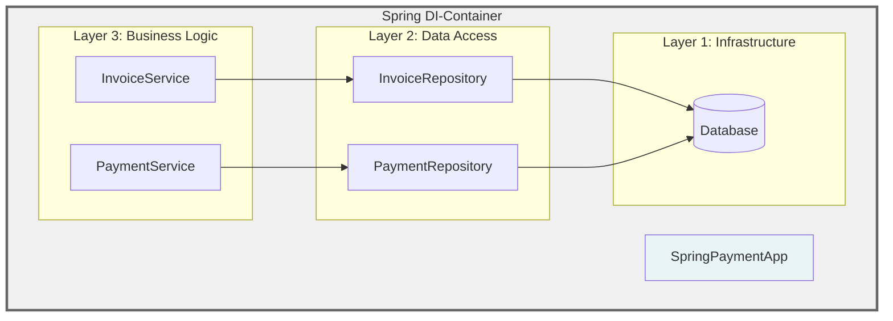
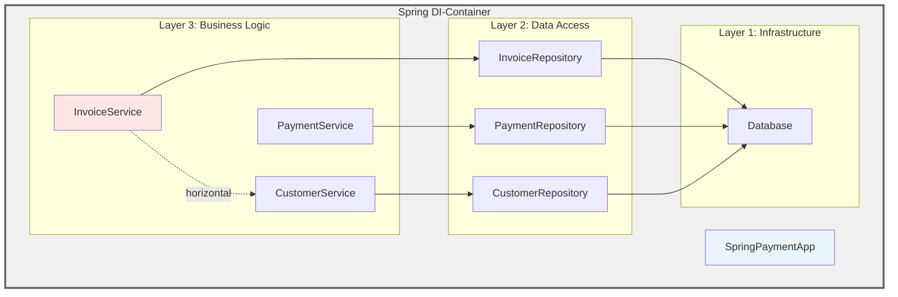
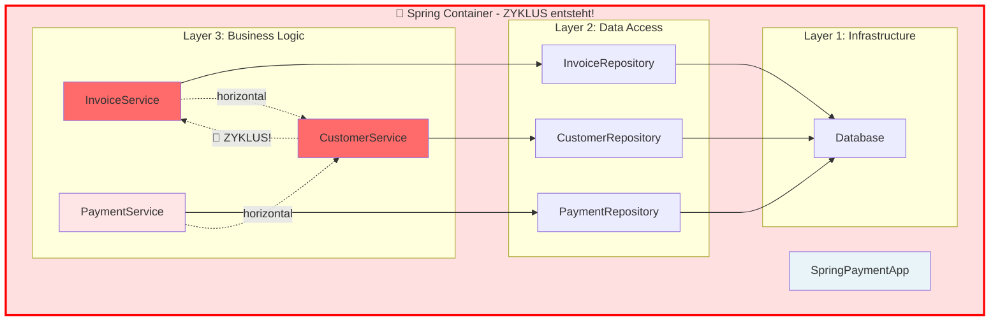
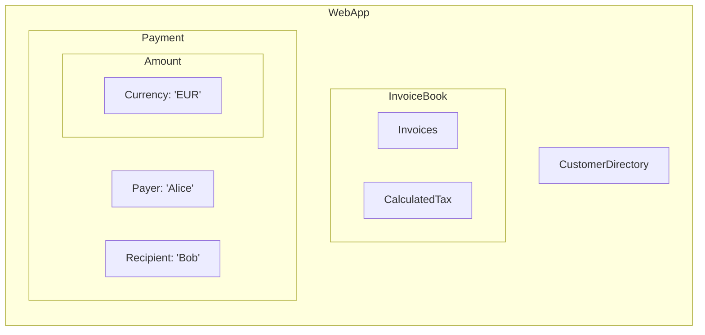

# The right System Composition *"leaves Nobody behind…"*

## 1. Einleitung und das Problem mit DI-Containern

In der modernen objektorientierten Softwareentwicklung ist Dependency Injection (DI) längst ein etabliertes Konzept. Die Grundidee ist simpel und elegant: Objekte sollen ihre Abhängigkeiten nicht selbst erstellen, sondern von außen erhalten. Doch während die Technik selbst wertvoll ist, haben viele Frameworks und DI-Container das ursprüngliche Konzept in ein Anti-Pattern verwandelt.

### Die Probleme mit DI-Containern

Betrachten wir eine **Spring-Boot** *Payment-Applikation* mit der üblichen Verwendung von **DI-Container**.  
Wir bauen sie schrittweise auf und beobachten, welche Probleme mit wachsenden Anforderungen entstehen können.

#### Anforderung 1: 
Die Applikation soll Rechnungen (```Invoice```) erstellen und Zahlungen (```Payment```) verarbeiten können.



```java
@SpringBootApplication
public class SpringPaymentApp {

    // Die App verwaltet keine expliziten Dependencies...
    public static void main(String[] args) {
        SpringApplication.run(SpringPaymentApp.class, args);
    }
}

@Service
public class InvoiceService {

    @Inject
    private InvoiceRepository invoiceRepo;
    
    public Invoice create(Customer customer, List<Item> items) {
        // Business Logic
    }
}

@Service
public class PaymentService {

    @Inject
    private PaymentRepository paymentRepo;
    
    public void process(Payment payment) {
        // Business Logic
    }
}
```

**Problem:** An dieser Stelle bereits ist es unklar, wie die Objekte wirklich zusammenhängen.  
Das Objekt der Klasse ```SpringPaymentApp``` schwebt isoliert "herum" und der DI-Container verwaltet alles im Hintergrund.

---

#### Anforderung 2: (Customer hinzufügen)** 
Nun sollen noch zusätlich Kunden verwaltet werden und beim Erstellen einer Rechnung muss ein Kunde validiert werden.



```java
@Component
public class SpringPaymentApp {

    @Inject private InvoiceService invoiceService;
    @Inject private PaymentService paymentService;
    @Inject private CustomerService customerService;
    // Noch mehr versteckte Dependencies
}

@Service
public class InvoiceService {

    @Inject
    private InvoiceRepository invoiceRepo;

    @Inject
    private CustomerService customerService;  // ⚠️ Horizontale Dependency!
    
    public Invoice create(Customer customer, List<Item> items) {
        customerService.validate(customer);  // Braucht CustomerService
        // Business Logic
    }
}

@Service
public class CustomerService {

    @Inject 
    rivate CustomerRepository customerRepo;
    
    public void validate(Customer customer) {
        // Validation Logic
    }
}
```

**Kein weiteres Problem:** Die neu entstandene horizontale Abhängigkeit innerhalb des Business-Logic-Layers, verkompliziert den ```Application``` Layer.

---

#### Anforderung 3:
Jetzt sollen Kunden ihre offenen Rechnungen sehen können. Die Klasse `CustomerService` muss jetzt `InvoiceService` kennen.



```java
@Component
public class SpringPaymentApp {

    @Inject private InvoiceService invoiceService;
    @Inject private PaymentService paymentService;
    @Inject private CustomerService customerService;
    // Container versteckt den Zyklus komplett!
}

@Service
public class InvoiceService {

    @Inject private InvoiceRepository invoiceRepo;
    @Inject private CustomerService customerService;  // → Customer
    
    public Invoice create(Customer customer, List<Item> items) {
        customerService.validate(customer);
        // Business Logic
    }
}

@Service
public class PaymentService {

    @Inject private PaymentRepository paymentRepo;
    @Inject private CustomerService customerService;  // → Customer
    
    public void process(Payment payment) {
        customerService.updateBalance(payment.getCustomer());
        // Business Logic
    }
}

@Service
public class CustomerService {

    @Inject
    private CustomerRepository customerRepo;

    @Inject
    private InvoiceService invoiceService;  // 🔴 → Invoice (ZYKLUS!)
    
    public List<Invoice> getOpenInvoices(Customer customer) {
        return invoiceService.findOpenByCustomer(customer);  // Braucht InvoiceService
    }
    
    public void validate(Customer customer) {
        // Validation Logic
    }
}
```

**Problem:** Zyklische Abhängigkeit -💥 Das System bricht

Das Problem wird durch einen erharenen Senior Entwickler "gelöst" der viele Jahre mit Spring abreitet und die Dokumentation für DI-Container gelesen hatte.

```java
// Spring erstellt Proxies und initialisiert lazy
@Service
@Lazy  // Spring's "Lösung" für Zyklen
public class CustomerService {

    @Inject
    private InvoiceService invoiceService;  // Wird als Proxy injiziert
    // ...
}
```

---

#### Zusammenfassung der resultierenden Probleme

**Diese schrittweise Entwicklung zeigt:**

1. **Unübersichtliche Abhängigkeiten** - `SpringPaymentApp` zeigt keine echten Dependencies. Wo ist die Objektstruktur?
   
2. **Schwere Wartbarkeit** - Um zu verstehen was `CustomerService` braucht, muss man:
   - Alle `@Inject` Felder durchsuchen
   - Prüfen ob `@Lazy` verwendet wird
   - Verstehen wie Spring die Proxies auflöst
   
3. **Erzwungene Layer-Trennung** - Alle Klassen haben `-Service` oder `-Repository` Suffix nur wegen der Layer

5. **Zyklische Abhängigkeiten** - `InvoiceService` ⇄ `CustomerService` - Spring versteckt das Problem mit Proxies statt es zu lösen

7. **Code Pollution** - Überall `@Service`, `@Repository`, `@Inject`, `@Lazy` Annotations

9. **Testbarkeit**: Tests können nicht durch einfach injiziert werden, nur mit Mock-Frameworks oder [Spring-Mocks](https://filip-prochazka.com/blog/mockbean-is-an-anti-pattern) wie (`@MockBean` oder @SpyBean) 

Die DI-Frameworks sind so konzipiert, dass sie Layer-Architektur aktiv fördern und sogar erzwingen:
DI-Container fördern Layer-Architektur durch:
- **Stereotype-Annotations** (`@Service`, `@Repository`, `@Controller`) - die explizit Layer definieren
- **Scan-Mechanismen**, die nach Package-Strukturen suchen (z.B. `com.example.service.*`, `com.example.repository.*`)
- **Best-Practice-Guides** der Frameworks, die Layer-Trennung empfehlen
- **Proxy-Mechanismen** für Transactions (`@Transactional`) - die Layer-Grenzen voraussetzen
- **Dependency-Rules**, die nur "nach unten" zeigen dürfen - was Layer-Hierarchien erzwingt

### Die Illusion der Entkopplung

Zudem glauben viele Entwickler , dass DI-Container für "loose coupling" sorgen. Doch in Wirklichkeit:
- sind die Abhängigkeiten nur **versteckt**, nicht entkoppelt
- wird die **Komplexität erhöht** statt reduziert
- entsteht eine **Kopplung an den Framework-Container**
- wird **echte Objekt-Komposition** durch Service-Lokalisierung ersetzt

Der eigentliche Wert liegt in der **Dependency Injection** selbst – nicht im *Container*.

## 2. Der richtige Weg: Pure Composition

Die Lösung ist überraschend einfach: Verzichte auf DI-Container und komponiere deine Objekte explizit mit dem `new`-Operator.

### Die richtige Komposition:

Kehren wir zurück zu unserer Rechnungsanwendung. So sollte die richtige Komposition aussehen:

```java
app/                      # Package für Details der App-Abstraktion
├── WebApp.java           # Einstiegspunkt, implementiert App
│       └── (in einer 'main' oder 'startup' Methode:)
│           new WebApp(
│               new InvoiceBook(
│                   new Invoices(),
│                   new CalculatedTax()
│               ),
│               new Payment(
│                   new Payer("Alice"),
│                   new Recipient("Bob"),
│                   new Amount(100, new Currency("EUR"))
│               ),
│               new CustomerDirectory(...)
│           )
│           
App.java                  # Abstraktion für die Anwendung
```




**Legende:**
- Das größte Rechteck ist `WebApp` - die äußere Komposition
- Darin: Rechtecke für `InvoiceBook`, `Payment`, `CustomerDirectory`
- Weiter verschachtelt: `Invoices`, `CalculatedTax`, `Payer`, `Recipient`, `Amount`, `Currency`

Beachte: **Keine Layers, keine Annotations, keine versteckten Abhängigkeiten** – nur pure Objekt-Komposition durch explizite Constructor-Aufrufe. Zudem gibt es keinen Objekt der einfach herum hängt bzw. "im Stich gelassen wurde..."

Ein weiteres echtes Beispiel zeigt - Yegor Bugayenko in seinem [rultor.com]-Projekt, wie echte Objekt-Komposition aussieht.

### Vorteile der *explizieten* Herangehensweise

1. **Vollständige Transparenz**: Jeder kann sofort sehen, wie das System zusammengesetzt ist
2. **Keine versteckten Abhängigkeiten**: Alle Dependencies sind explizit im Code sichtbar
3. **Einfaches Refactoring**: IDE-Support funktioniert perfekt, da alles statisch typisiert ist
4. **Testbarkeit**: Test-Doubles können einfach injiziert werden, ohne Mock-Frameworks
5. **Keine Framework-Kopplung**: Der Code ist unabhängig von DI-Containern

### Das Composition-Prinzip

Die Komposition sollte so nah wie möglich am Entry-Point der Applikation stattfinden. Diese "Composition Root" ist verantwortlich für:

- Das Erstellen des kompletten Object-Graphs
- Die Konfiguration aller Abhängigkeiten
- Die Übergabe der fertigen Objekte an die Applikationslogik

Alle anderen Klassen nutzen ausschließlich *Constructor Injection* und überlassen die Kontrolle für die Objekterstellung ihren Consumern-Klassen (bzw. den Entwicklern).

## 3. Richtiger Umgang bei Framework-Verwendung

In der Praxis setzen jedoch viele Unternehmen Frameworks wie Spring oder Java EE CDI ein, die DI-Container mitbringen.  
*Wie sollen dann die *Teams* damit umgeht?*

### Die One-Class-Regel

Wenn du einen DI-Container verwenden musst (oder willst), dann beschränke seine Nutzung auf **genau eine Stelle** in deinem Code:

```java
@ApplicationScoped
public class MainApplication {
    
    @Inject
    private DatabaseConnection db;
    
    @Inject
    private MessageQueue queue;
    
    @Inject
    private ExternalApiClient api;
    
    @Produces
    @ApplicationScoped
    public Application createApplication() {
        return new Application(
            new DataService(
                new TransactionalDB(db),
                new CachedDB(
                    new TransactionalDB(db)
                )
            ),
            new MessageProcessor(
                queue,
                new ErrorHandler(
                    new LoggingErrorHandler(),
                    new NotificationErrorHandler(api)
                )
            ),
            new ReportGenerator(
                new PdfRenderer(),
                new CsvRenderer()
            )
        );
    }
}
```

### Kernprinzipien

1. **Container-Isolation**: Nur die MainApplication-Klasse darf `@Inject` verwenden
2. **Explizite Komposition**: Die gesamte Objektstruktur wird manuell komponiert
3. **Framework-Adaption**: Der Container liefert nur primitive Dependencies (DB-Connection, Config, etc.)
4. **Business-Logic-Freiheit**: Keine Business-Klasse kennt den DI-Container

Jegliche DI-Container sollten auf die Composition Root beschränkt sein. Der Rest der Applikation verwendet pure Constructor Injection.

### Migration bestehender Systeme

Bei Legacy-Code mit verstreutem `@Inject`:

1. Erstelle eine zentrale MainApplication-Klasse
2. Verschiebe schrittweise die Objekterstellung dorthin
3. Entferne `@Inject` aus Business-Klassen
4. Mache Constructor-Dependencies explizit

## 4. Fazit mit Beispiel-Struktur

Die richtige System-Komposition "leaves nobody behind" – sie macht die Struktur für alle Entwickler sofort verständlich und nachvollziehbar.

### Ideale Projektstruktur

```

com.example.payment/
├── app/
│   └── Main.java                    // Entry Point
├── config/
│   └── MainApplication.java         // Einzige Stelle mit DI-Container
├── domain/
│   ├── User.java                    // Pure Business Objects
│   ├── Order.java
│   └── Payment.java
├── services/
│   ├── UserService.java             // Constructor Injection
│   ├── OrderService.java
│   └── PaymentService.java
└── infrastructure/
│   ├── database/
│   │   ├── PostgresConnection.java
│   │   └── TransactionalDB.java
│   └── messaging/
│       └── RabbitMQQueue.java
```

### Beispiel einer Service-Klasse

```java
public final class OrderService {

    private final UserService users;
    private final PaymentService payments;
    private final OrderRepository repository;
    private final EventPublisher events;
    
    // Constructor Injection - keine Annotations!
    public OrderService(
        UserService users, PaymentService payments,
        OrderRepository repository, EventPublisher events) {
         // Injections
        this.users = users;
        this.payments = payments;
        this.repository = repository;
        this.events = events;
    }
    
    public Order placeOrder(User user, List<Item> items) {
        // Business Logic
    }
}
```

### Komposition im Main

```java
public final class Main {

    public static void main(String... args) {

        // Infrastructure
        PostgresDB database = new PostgresDB(
            "jdbc:postgresql://localhost/mydb"
        );
        RabbitMQ queue = new RabbitMQ("localhost:5672");
        RedisCache cache = new RedisCache("localhost:6379");
        
        // Repositories
        CachedUserRepository userRepo = new CachedUserRepository(
            new PostgresUserRepository(database),
            cache
        );

        PostgresOrderRepository orderRepo = new PostgresOrderRepository(database);
        
        // Services
        PaymentService paymentService = new PaymentService(
            new StripePaymentGateway(),
            new PaymentLogger()
        );
        
        UserService userService = new UserService(
            userRepo,
            new EmailValidator(),
            new PasswordHasher()
        );
        
        OrderService orderService = new OrderService(
            userService,
            paymentService,
            orderRepo,
            new EventPublisher(queue)
        );
        
        // Application
        Application app = new Application(
            orderService,
            userService,
            new WebServer(8080)
        );
        
        app.start();
    }
}
```

### Die Vorteile zusammengefasst

- **Lesbarkeit**: Jeder kann die Systemstruktur sofort verstehen  
- **Wartbarkeit**: Änderungen sind lokal und überschaubar  
- **Testbarkeit**: Dependencies sind explizit und austauschbar  
- **Refactoring-Sicherheit**: Compiler und IDE unterstützen vollständig  
- **Keine zyklischen Dependencies**: Die Komposition erzwingt einen gerichteten Graphen  
- **Framework-Unabhängigkeit**: Business-Code bleibt rein  

## 5. Quellen

### Primärquellen

1. Bugayenko, Y. (2014). **"Dependency Injection Containers are Code Polluters"**  
   https://www.yegor256.com/2014/10/03/di-containers-are-evil.html  
   _Grundlegende Kritik an DI-Containern und Demonstration echter Objekt-Komposition_

2. Bugayenko, Y. (2015). **"Don't Create Objects That End With -ER"**  
   https://www.yegor256.com/2015/03/09/objects-end-with-er.html  
   _Über deklaratives vs. imperatives Design in OOP_

3. Bugayenko, Y. (2016). **"Who Is an Object?"**  
   https://www.yegor256.com/2016/07/14/who-is-object.html  
   _Konzeptuelle Definition von Objekten als Repräsentanten von Daten_

4. Bugayenko, Y. **"Elegant Objects" (Vol. 1 & 2)**  
   _Umfassende Darstellung moderner OOP-Prinzipien_

### Weiterführende Literatur

5. van Deursen, S. & Seemann, M. **"Dependency Injection Principles, Patterns, and Practices"**  
   https://freecontent.manning.com/dependency-injection-in-net-2nd-edition-understanding-the-composition-root/  
   _Detaillierte Erklärung des Composition Root Patterns_

6. **"Design Patterns Explained – Dependency Injection"** (Stackify)  
   https://stackify.com/dependency-injection/  
   _Einführung in DI-Patterns und deren Anwendung_

7. **"Java Dependency Injection - DI Design Pattern"** (DigitalOcean)  
   https://www.digitalocean.com/community/tutorials/java-dependency-injection-design-pattern-example-tutorial  
   _Praktische Beispiele für DI in Java_

### Projektbeispiele

8. **Rultor - Agents.java**  
   https://github.com/yegor256/rultor  
   _Real-world Beispiel für Pure DI ohne Container_

### Verwandte Konzepte

- **SOLID Principles** (insbesondere Dependency Inversion Principle)
- **Composition over Inheritance**
- **Constructor Injection Pattern**
- **Service Locator Anti-Pattern**
- **Factory Pattern**

---

**Fazit**: Die richtige System-Komposition macht Dependencies explizit sichtbar und lässt niemanden im Unklaren darüber, wie das System strukturiert ist. DI-Container mögen in bestimmten Situationen ihren Platz haben, aber sie sollten niemals das grundlegende Prinzip der expliziten Objekt-Komposition ersetzen. Ein gut komponiertes System ist ein verständliches System – und Verständlichkeit ist die Grundlage für Wartbarkeit, Erweiterbarkeit und langfristigen Erfolg.
