# The right System Composition *"leaves Nobody behind…"*

**(Draft!!!)**

## 1. Einleitung

In der modernen objektorientierten Softwareentwicklung ist Dependency Injection (DI) längst ein etabliertes Konzept. Die Grundidee ist simpel und elegant: Objekte sollen ihre Abhängigkeiten nicht selbst erstellen, sondern von außen erhalten. Doch während die Technik selbst wertvoll ist, haben viele Frameworks und DI-Container das ursprüngliche Konzept in ein Anti-Pattern verwandelt.

### 1.1 Die Probleme mit DI-Containern

Betrachten wir eine **Spring-Boot** *Payment-Application* mit der üblichen Verwendung von **DI-Container**.  
Mittels Annotations wie ```@Component```, ```@Service```, ```@Repository``` und ```@Controller``` kann Spring automatisch Klassen erkennen, instanziieren und in den Container aufnehmen, ohne dass sie explizit konfiguriert werden müssen.

Wir bauen sie schrittweise auf und beobachten, welche Probleme mit wachsenden Anforderungen entstehen können.)

#### Anforderung 1: 
Die Applikation soll Rechnungen (```Invoice```) erstellen und Zahlungen (```Payment```) verarbeiten können.


```java
// Die App verwaltet keine expliziten Dependencies
@SpringBootApplication
public class SpringPaymentApp {

    public static void main(String[] args) {
        // ...starts scanning classpath to provide 'Magic' for:
        // @Component, @Service, @Controller, @Repository und @Entity
        SpringApplication.run(SpringPaymentApp.class, args);
    }
}

@Service
public class InvoiceService {

    @Autowired
    private InvoiceRepository invoiceRepo;
    
    public Invoice create(Customer customer, List<Item> items) {
        // Business Logic
    }
}

@Service
public class PaymentService {

    @Autowired
    private PaymentRepository paymentRepo;
    
    public void process(Payment payment) {
        // Business Logic
    }
}
```

**Problem:** An dieser Stelle bereits ist es unklar, wie die Objekte wirklich zusammenhängen.  
Das Objekt der Klasse ```SpringPaymentApp``` schwebt isoliert "herum" sowie die Zugriffe auf die Datenbank und der DI-Container verwaltet alles im Hintergrundm.

---

#### Anforderung 2: (Customer hinzufügen)
Nun sollen noch zusätlich Kunden verwaltet werden und beim Erstellen einer Rechnung muss ein Kunde validiert werden.


```java
@Service
public class InvoiceService {

    @Autowired
    private InvoiceRepository invoiceRepo;

    @Autowired
    private CustomerService customerService;  // ⚠️ Horizontale Dependency!
    
    public Invoice create(Customer customer, List<Item> items) {
        customerService.validate(customer);  // Braucht CustomerService
        // Business Logic
    }
}

@Service
public class CustomerService {

    @Autowired 
    private CustomerRepository customerRepo;
    
    public void validate(Customer customer) {
        // Validation Logic
    }
}
```

**Kein weiteres Problem:** Die neu entstandene horizontale Abhängigkeit innerhalb des Business-Logic-Layers, verkompliziert den ```Application``` Layer.

---

#### Anforderung 3:
Jetzt sollen Kunden ihre offenen Rechnungen sehen können. Die Klasse `CustomerService` muss jetzt `InvoiceService` kennen.

```mermaid
graph LR

    subgraph Spring["SpringBoot-Application"]

        subgraph Magic["SpringPaymentApp.main()"]
            App["SpringApplication<br>run() scan<br/>@Compontent"]
            ORM["SpringData<br>scan @Entity"]
        end

        subgraph Container["Spring ID-Container"]
    
            subgraph L3["Layer 3: Business Logic"]
                Invoice["Invoice<br/>+ Service<br/>+ Entity"]
                Payment["Payment<br/>+ Service<br/>+ Entity"]
                Customer["Customer<br/>+ Service<br/>+ Entity"]
            end
            
            subgraph L2["Layer 2: Data Access"]
                InvoiceRepo[Invoice<br/>Repository]
                PaymentRepo[Payment<br/>Repository]
                CustomerRepo[Customer<br/>Repository]
            end
            
            subgraph L1["Layer 1: Infrastructure"]
                DB[Database]
            end

        end

    end

    Invoice --> InvoiceRepo
    Invoice -.->|horizontal| Customer
    
    Payment --> PaymentRepo
    Payment -.->|horizontal| Customer
    
    Customer --> CustomerRepo
    Customer -.->|🔴 ZYKLUS!| Invoice
    
    InvoiceRepo --> DB
    PaymentRepo --> DB
    CustomerRepo --> DB

    style Invoice fill:#ff6b6b
    style Customer fill:#ff6b6b
    style Payment fill:#ffe6e6
    style App fill:#e8f4f8
    style ORM fill:#e8f4f8
    style Container fill:#ffe0e0,stroke:#ff0000,stroke-width:3px
    style Magic fill:#ececff,stroke:#9370db
```



```java
@Component
public class SpringPaymentApp {
    // Container versteckt den Zyklus komplett!
    
}

@Service
public class InvoiceService {

    @Autowired private InvoiceRepository invoiceRepo;
    @Autowired private CustomerService customerService;  // → Customer
    
    public Invoice create(Customer customer, List<Item> items) {
        customerService.validate(customer);
        // Business Logic
    }
}

@Service
public class PaymentService {

    @Autowired
    private PaymentRepository paymentRepo;

    @Autowired
    private CustomerService customerService;  // → Customer
    
    public void process(Payment payment) {
        // Business Logic
        customerService.updateBalance(payment.getCustomer());
        //... more Business Logic
    }
}

@Service
public class CustomerService {

    @Autowired
    private InvoiceService invoiceService;  // 🔴 → Invoice (ZYKLUS!)

    @Autowired
    private CustomerRepository customerRepo;
    
    public List<Invoice> getOpenInvoices(Customer customer) {
        return invoiceService.findOpenByCustomer(customer);  // Braucht InvoiceService
    }
    
    public void validate(Customer customer) {
        // Validation Logic
    }
}
```

**Problem:** Zyklische Abhängigkeit -💥 Das System bricht

### 1.2 Die Lösungen mit DI-Containern 

**Die Lösung aus der Praxis als eine Reale Geschichte.**

Ein erfahrener Mid-Level-Entwickler, der bereits einige Jahre mit Spring abreitet und die Dokumentation für DI-Container gelesen hatte, wird wahrscheinlich das Problem mittels einer ```@Lazy``` Annotation aus dem Spring-Framework lösen. 

```java
// Spring erstellt Proxies und initialisiert lazy
@Service
@Lazy  // Spring's "Lösung" für Zyklen
public class CustomerService {

    @Autowired
    private InvoiceService invoiceService;  // Wird als Proxy injiziert

    @Autowired
    private CustomerRepository customerRepo;
    // ...
}
```

Diese Vorgehensweise kaschiert jedoch nur die Tatsache, dass die Architektur eine zyklische Abhängigkeit enthält. Ein Junior-Entwickler lernt auf diese Weise zwar, wie man mit dem Problem umgeht, aber nicht, wie man es richtig behebt oder vermeidet. 

Im Rahmen eines Code-Reviews wurde ein Senior-Entwickler die Schwachstelle bemerken und den Pull-Request ablehnen. Der Senior wird dabei wahrscheinlich die Modul-Prinzipien (von Robert C. Martin) im Hinterkopf haben und stattdessen vorschlagen, die zyklische Abhängigkeit durch eine neue Klasse wie ```CustomerInvoiceService``` aufzulösen, die die Funktionalität von ```InvoiceService``` und ```CustomerRepository``` kombiniert. 

```java
@Service
public class CustomerInvoiceService {

    @Autowired
    private InvoiceService invoiceService;

    @Autowired
    private CustomerService customerService;
    // ...
}
```

Der Senior begründete seinen Vorschlag gegenüber dem Team mit dem **Single Responsibility Prinzip** (SRP). Weil die ursprüngliche Klasse ```CustomerService``` zwei Verantwortlichkeiten, Verwalten von Kunden sowie Rechnungen, enthielt, war er über die Richtigkeit seiner Lösung gemäß SRP (nach Robert C. Martin) *"There should never be more than one reason for a class to change"* überzeugt. Und hügte hinzu, dass mehrere Verantwortlichkeiten innerhalb eines Software-Moduls zu einer zu zerbrechlichem Design führen. Das Team nahm es stillschweigend an, denn er wüsste es ja besser und hat ja auch die Bücher von Robert C. Martin gelesen. Der Mid-Level-Entwickler lernte nun das er auch die Bücher von Robert C. Martin lesen sollte, wenn er zum Senior aufsteigen möchte.

Heutzutage ist (der Author) bzw, der Senior Entwickler sehr skeptische gegenüber der Interpretation von SRP von Robert C. Martin, aber das ist eine andere Geschichte....

---

#### Zusammenfassung der resultierenden Probleme

**Diese schrittweise Entwicklung zeigt:**

1. **Unübersichtliche Abhängigkeiten** - `SpringPaymentApp` zeigt keine echten Dependencies. Wo ist die Objektstruktur?
   
2. **Schwere Wartbarkeit** - Um zu verstehen was `CustomerService` braucht, muss man:
   - Alle `@Autowired` Felder durchsuchen
   - Prüfen ob `@Lazy` verwendet wird
   - Verstehen wie Spring die Proxies auflöst
   - Wissen über Modul Prinzipien (von Robert C. Martin)
     
3. **Erzwungene Layer-Trennung** - Alle Klassen haben `-Entity`, `-Service` oder `-Repository` Suffix nur wegen der Layer

5. **Zyklische Abhängigkeiten** - `InvoiceService` ⇄ `CustomerService` - Spring versteckt das Problem mit Proxies statt es zu lösen

7. **Code Pollution** - Überall `@Service`, `@Repository`, `@Autowired`, `@Lazy` Annotations

9. **Testbarkeit**: Tests können nicht durch einfach injiziert werden, nur mit [Spring-Mocks](https://filip-prochazka.com/blog/mockbean-is-an-anti-pattern) wie (`@MockBean` oder `@SpyBean`)

### Die DI-Container fördern Schichten

Die DI-Frameworks sind so konzipiert, dass sie Layer-Architektur aktiv fördern und sogar erzwingen:
- **Stereotype-Annotations** (`@Service`, `@Repository`, `@Controller`) - die explizit Layer definieren
- **Scan-Mechanismen**, die nach Package-Strukturen suchen (z.B. `com.example.service.*`, `com.example.entity.*`, `com.example.repository.*`)
- **Best-Practice-Guides** der Frameworks (z. B. Spring [Pet Clinic](https://github.com/spring-petclinic/spring-framework-petclinic/tree/main/src/main/java/org/springframework/samples/petclinic)), die Layer-Trennung empfehlen
- **Proxy-Mechanismen** für Transactions (`@Transactional`) - die Layer-Grenzen voraussetzen
- **Dependency-Rules**, die nur "nach unten" zeigen dürfen - was Layer-Hierarchien erzwingt.

### Die Illusion der Entkopplung

Außerdem glauben viele Entwickler, dass DI-Container für "loose coupling" sorgen. Doch in Wirklichkeit:
- sind die Abhängigkeiten nur **versteckt**, nicht entkoppelt
- wird die **Komplexität erhöht** statt reduziert
- entsteht eine **Kopplung an den Framework-Container**
- wird **echte Objekt-Komposition** durch Service-Lokalisierung ersetzt


## 2. Der richtige, objekt orientierte Weg: Pure Composition

**Die Lösung ist überraschend einfach:** Verzichte auf DI-Container und komponiere deine Objekte explizit mit dem `new`-Operator.

Kehren wir zurück zu unserer Rechnungsanwendung. So sollte die richtige, objekt orientierte Komposition aussehen:

```java

Payment

├──app/                        # Package für Details der App-Abstraktion
│   └── WebApp.java           # Einstiegspunkt, implementiert App
│           └── (in einer 'main' oder 'startup' Methode:)
│           new WebApp(
│               new InvoiceBook(
│                   new Invoices(),
│                   new Tax()
│               ),
│               new Payment(
│                   new Payer("Alice"),
│                   new Recipient("Bob"),
│                   new Amount(100, new Currency("EUR"))
│               ),
│               new CustomerDirectory(...)
│           );
├── amount/
│   ├── Amount.java
│   ├── Currency.java    
│   ├── Payment.java     
│   ├── Payer.java               
│   └── Recipient.java
├── customer/
│   ├── Customer.java        
│   └── CustomerDirectory.java
└── invoice/
    ├── Invoice.java 
    ├── InvoiceBook.java     
    ├── Invoices.java                 
    └── Tax.java

```


**Legende:**
- Das größte Rechteck ist `WebApp` - die äußere Komposition
- Darin: Rechtecke für `InvoiceBook`, `Payment`, `CustomerDirectory`
- Weiter verschachtelt: `Invoices`, `Tax`, `Payer`, `Recipient`, `Amount`, `Currency`

**Beachte:** 
- Keine Layers, keine Annotations, keine versteckten Abhängigkeiten nur pure Objekt-Komposition durch explizite Constructor-Aufrufe.
- Zudem gibt es keinen Objekt der einfach herum hängt bzw. "im Stich gelassen wurde..."

Ein weiteres echtes Beispiel zeigt - Yegor Bugayenko in seinem [rultor.com]-Projekt, wie echte Objekt-Komposition aussieht.

### Vorteile der *explizieten* objekt orientieren Herangehensweise

1. **Vollständige Transparenz**: Jeder kann sofort sehen, wie das System zusammengesetzt ist
2. **Keine versteckten Abhängigkeiten**: Alle Dependencies sind explizit im Code sichtbar
3. **Einfaches Refactoring**: IDE-Support funktioniert perfekt, da alles statisch typisiert ist
4. **Testbarkeit**: Test-Doubles können einfach injiziert werden, ohne Mock-Frameworks
5. **Keine Framework-Kopplung**: Der Code ist unabhängig von DI-Containern

### Das Composition-Prinzip

Die Komposition sollte so nah wie möglich am Entry-Point der Applikation stattfinden. Diese "Composition Root" ist verantwortlich für:

- Das Erstellen des kompletten Object-Graphs
- Die Konfiguration aller Abhängigkeiten
- Die Übergabe der fertigen Objekte an die Applikationslogik

Alle anderen Klassen nutzen ausschließlich *Constructor Injection* und überlassen die Kontrolle für die Objekterstellung ihren Consumer (bzw. den Entwicklern).

## 3. Richtiger Umgang bei Framework-Verwendung

In der Praxis setzen viele Unternehmen auf Frameworks wie Spring oder Java EE CDI ein, die DI-Container mitbringen. Hier stellt sich die Frage: *Wie soll man damit umgehen?*

### Die richtige Komposition mit Spring: Die Payment-Applikation

Kehren wir zur Payment-Applikation zurück. So sollte die richtige Komposition mit Spring aussehen:

```java
@SpringBootApplication
public class SpringPaymentApp {
    
    public static void main(String[] args) {
        SpringApplication.run(SpringPaymentApp.class, args);
    }
    
    // Einzige Stelle mit @Autowired - nur für Infrastructure
    @Bean
    @Primary
    public PaymentApplication createApplication(
        @Autowired DataSource dataSource,
        @Autowired MessageQueue queue
    ) {
        // Explizite Komposition - keine versteckten Dependencies!
        return new PaymentApplication(
            new InvoiceBook(
                new Invoices(
                    new InvoiceRepository(dataSource)
                ),
                new Tax()
            ),
            new PaymentProcessor(
                new Payments(
                    new PaymentRepository(dataSource)
                ),
                queue,
                new PaymentValidator()
            ),
            new CustomerDirectory(
                new Customers(
                    new CustomerRepository(dataSource)
                ),
                new CustomerValidator()
            )
        );
    }
}
```

**Visualisierung der richtigen Spring-Komposition:**

```mermaid
flowchart RL

    subgraph Spring["Spring Container - nur für Infrastructure"]
        DataSource[(DataSource)]
        Queue[MessageQueue]
    end
    
    subgraph App["PaymentApplication - Pure Composition"]
        direction TB
        subgraph InvoiceBook [InvoiceBook]
            direction TB
            Invoices[Invoices]
            Tax[Tax]
            InvoiceRepo[InvoiceRepository]
        end

        subgraph Payment [PaymentProcessor]
            direction TB
            Payments[Payments]
            PaymentValidator[PaymentValidator]
            PaymentRepo[PaymentRepository]
        end

        subgraph Customer [CustomerDirectory]
            direction TB
            Customers[Customers]
            CustomerValidator[CustomerValidator]
            CustomerRepo[CustomerRepository]
        end
    end
    
    DataSource -.->|injected once| InvoiceRepo
    DataSource -.->|injected once| PaymentRepo
    DataSource -.->|injected once| CustomerRepo
    Queue -.->|injected once| Payment

    style Spring fill:#ffe0e0,stroke:#ff6b6b
    style App fill:#e8ffe8,stroke:#4ecdc4
    style DataSource fill:#ffd700
    style Queue fill:#ffd700
```



**Legende:**
- **Spring Container** (rot) - Verwaltet nur Infrastructure (DataSource, MessageQueue)
- **PaymentApplication** (grün) - Pure Objekt-Komposition ohne Framework-Abhängigkeiten
- Gestrichelte Linien - Einmalige Injection von Infrastructure beim App-Start
- Keine `@Service`, `@Repository`, `@Autowired` in Business-Klassen!

### Die Business-Klassen bleiben framework-frei

```java
// Keine Annotations! Pure OOP
public final class InvoiceBook {

    private final Invoices invoices;
    private final Tax tax;
    
    public InvoiceBook(Invoices invoices, Tax tax) {
        this.invoices = invoices;
        this.tax = tax;
    }
    
    public Invoice create(Customer customer, List<Item> items) {
        // Business Logic
        return new Invoice(customer, items, tax.calculate(items));
    }
}

// Keine Annotations! Pure OOP
public final class PaymentProcessor {

    private final Payments payments;
    private final MessageQueue queue;
    private final PaymentValidator validator;
    
    public PaymentProcessor(
        Payments payments, 
        MessageQueue queue, 
        PaymentValidator validator
    ) {
        this.payments = payments;
        this.queue = queue;
        this.validator = validator;
    }
    
    public void process(Payment payment) {
        validator.validate(payment);
        payments.store(payment);
        queue.publish(new PaymentEvent(payment));
    }
}

// Keine Annotations! Pure OOP
public final class CustomerDirectory {

    private final Customers customers;
    private final CustomerValidator validator;
    
    public CustomerDirectory(Customers customers, CustomerValidator validator) {
        this.customers = customers;
        this.validator = validator;
    }
    
    public void register(Customer customer) {
        validator.validate(customer);
        customers.add(customer);
    }
}
```

### Kernprinzipien der richtigen Spring-Integration

1. **Container-Isolation**: Nur die `SpringPaymentApp`-Klasse darf `@Autowired` verwenden - ausschließlich für Infrastructure
2. **Explizite Komposition**: Die gesamte Business-Objektstruktur wird manuell in der `@Bean`-Methode komponiert
3. **Framework-Adaption**: Spring liefert nur primitive Infrastructure (DataSource, MessageQueue, Config, etc.)
4. **Business-Logic-Freiheit**: Keine Business-Klasse (`InvoiceBook`, `PaymentProcessor`, `CustomerDirectory`) kennt Spring
5. **Keine Service-Layer**: Keine künstlichen `-Service` oder `-Repository` Klassen mit `@Service`/`@Repository`

### Vergleich: Vorher vs. Nacher

#### Vorher - Mit DI-Container überall:
```java
@Service
public class InvoiceService {
    @Autowired private InvoiceRepository repo;
    @Autowired private CustomerService customerService;
    // Spring überall, versteckte Dependencies
}
```

#### Nacher - Pure Composition:
```java
public final class InvoiceBook {

    private final Invoices invoices;
    private final Tax tax;
    
    public InvoiceBook(Invoices invoices, Tax tax) {
        this.invoices = invoices;
        this.tax = tax;
    }
    // Keine Framework-Kopplung, explizite Dependencies
}
```

### Die vorgeschlagene Projektstruktur

```
com.example.payment/
├── app/
│   ├── SpringPaymentApplication.java    // Einzige Stelle mit Spring-Annotations
│   └── PaymentApplication.java          // Main Application Object
├── customer/
│   ├── Customer.java
│   ├── CustomerRepository.java
│   ├── CustomerValidator.java
│   └── Customers.java
├── invoice/
│   ├── Invoice.java
│   ├── Invoices.java       
│   ├── InvoiceBook.java        
│   ├── InvoiceRepository.java
│   └── Tax.java
├── pay/
│   ├── Payment.java
│   ├── PaymentProcessor.java
│   ├── PaymentRepository.java
│   ├── PaymentValidator.java
│   └── Payments.java
```

### Beispiel: Vollständige Komposition im Main

```java
@SpringBootApplication
public class SpringPaymentApplication {

    public static void main(String... args) {
        SpringApplication.run(SpringPaymentApp.class, args);
    }

    @Bean
    // @Primary // (optional)
    public PaymentApplication createApplication(
        @Autowired DataSource dataSource,
        @Autowired @Qualifier("rabbitmq") MessageQueue queue
    ) {
        // Infrastructure - von Spring verwaltet
        // Business Logic - explizit komponiert
        
        InvoiceRepository invoiceRepo = new InvoiceRepository(dataSource);
        PaymentRepository paymentRepo = new PaymentRepository(dataSource);
        CustomerRepository customerRepo = new CustomerRepository(dataSource);
        
        Invoices invoices = new Invoices(invoiceRepo);
        Payments payments = new Payments(paymentRepo);
        Customers customers = new Customers(customerRepo);
        
        Tax tax = new Tax();
        PaymentValidator paymentValidator = new PaymentValidator();
        CustomerValidator customerValidator = new CustomerValidator();
        
        InvoiceBook invoiceBook = new InvoiceBook(invoices, tax);
        PaymentProcessor paymentProcessor = new PaymentProcessor(
            payments, 
            queue, 
            paymentValidator
        );
        CustomerDirectory customerDirectory = new CustomerDirectory(
            customers, 
            customerValidator
        );
        
        return new PaymentApplication(
            invoiceBook,
            paymentProcessor,
            customerDirectory
        );
    }
}
```


### Die Vorteile zusammengefasst

Die richtige System-Komposition "leaves nobody behind" – sie macht die Struktur für alle Entwickler sofort verständlich und nachvollziehbar.

* **Lesbarkeit**: Jeder kann die Systemstruktur sofort verstehen - kein Suchen nach `@Autowired`  
* **Wartbarkeit**: Änderungen sind lokal und überschaubar - keine versteckten Dependencies  
* **Testbarkeit**: Test-Doubles können einfach injiziert werden, ohne `@MockBean`  
* **Refactoring-Sicherheit**: Compiler und IDE unterstützen vollständig - keine Runtime-Überraschungen  
* **Keine zyklischen Dependencies**: Die explizite Komposition erzwingt einen gerichteten Graphen  
* **Framework-Unabhängigkeit**: Business-Code bleibt rein - nur eine Klasse kennt Spring  
* **Keine Layer-Zwänge**: Natürliche Objektkomposition statt künstlicher Service/Repository-Layer

---

# 4. Fazit

Die richtige System-Komposition macht Dependencies explizit sichtbar und lässt niemanden im Unklaren darüber, wie das System strukturiert ist. DI-Container mögen in bestimmten Situationen ihren Platz haben, aber sie sollten niemals das grundlegende Prinzip der expliziten Objekt-Komposition ersetzen. Ein gut komponiertes System ist ein verständliches System – und Verständlichkeit ist die Grundlage für Wartbarkeit, Erweiterbarkeit und langfristigen Erfolg.

# 5. Quellen

**Primärquellen**

* Bugayenko, Y. (2014). "Dependency Injection Containers are Code Polluters"
https://www.yegor256.com/2014/10/03/di-containers-are-evil.html
Grundlegende Kritik an DI-Containern und Demonstration echter Objekt-Komposition

* Bugayenko, Y. (2015). "Don't Create Objects That End With -ER"
https://www.yegor256.com/2015/03/09/objects-end-with-er.html
Über deklaratives vs. imperatives Design in OOP

* Bugayenko, Y. (2016). "Who Is an Object?"
https://www.yegor256.com/2016/07/14/who-is-object.html
Konzeptuelle Definition von Objekten als Repräsentanten von Daten

* Bugayenko, Y. "Elegant Objects" (Vol. 1 & 2)
Umfassende Darstellung moderner OOP-Prinzipien

## Projektbeispiele

Rultor - Agents.java
https://github.com/yegor256/rultor
Real-world Beispiel für Pure DI ohne Container

##  Verwandte Konzepte

SOLID Principles (insbesondere Dependency Inversion Principle)
Composition over Inheritance
Constructor Injection Pattern
Service Locator Anti-Pattern
Factory Pattern
