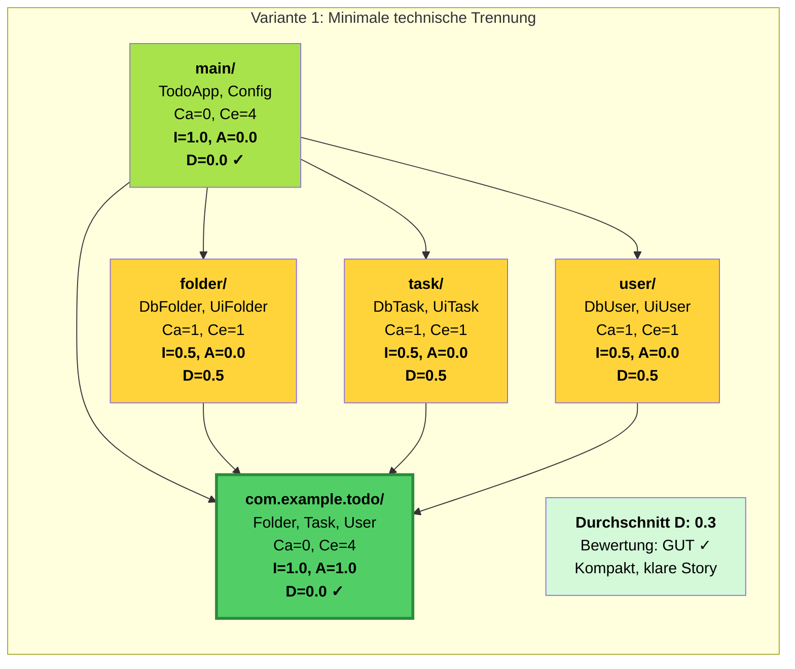
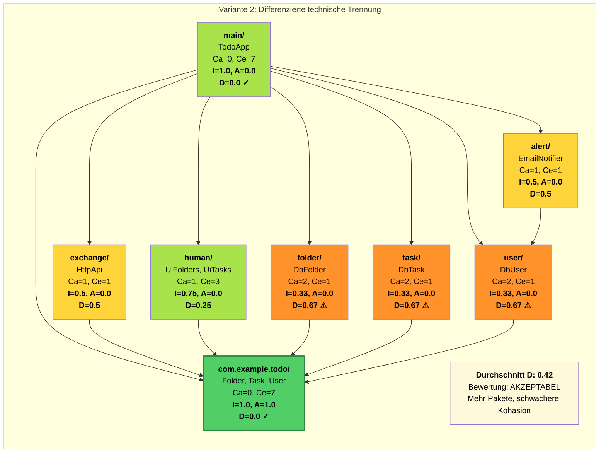
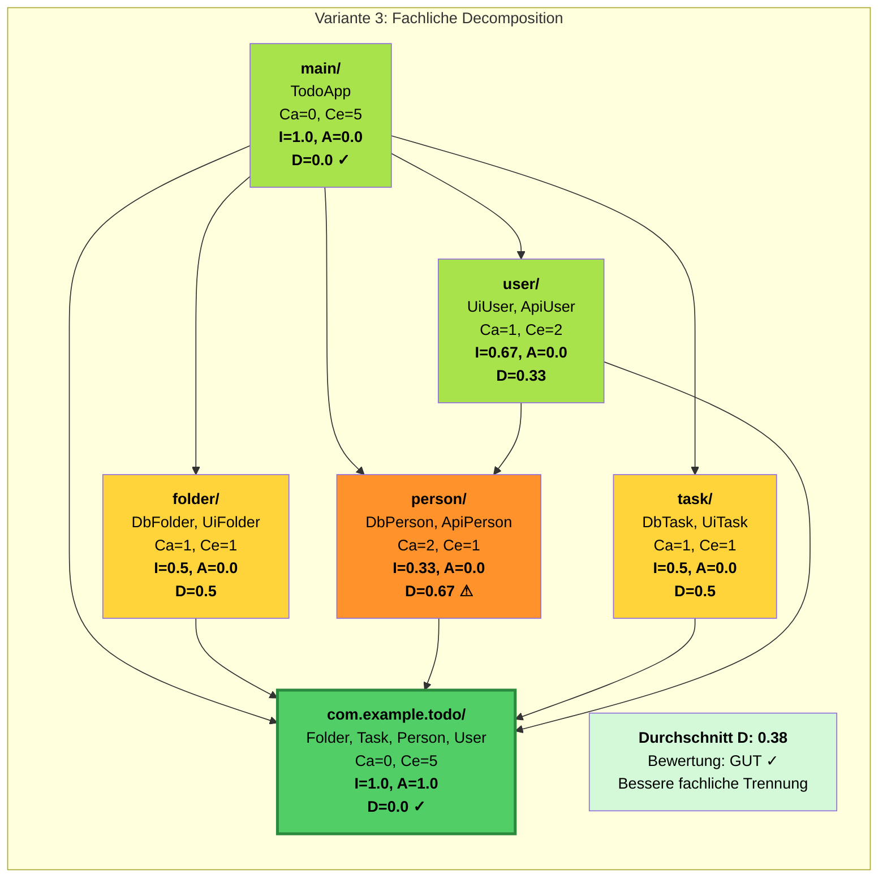
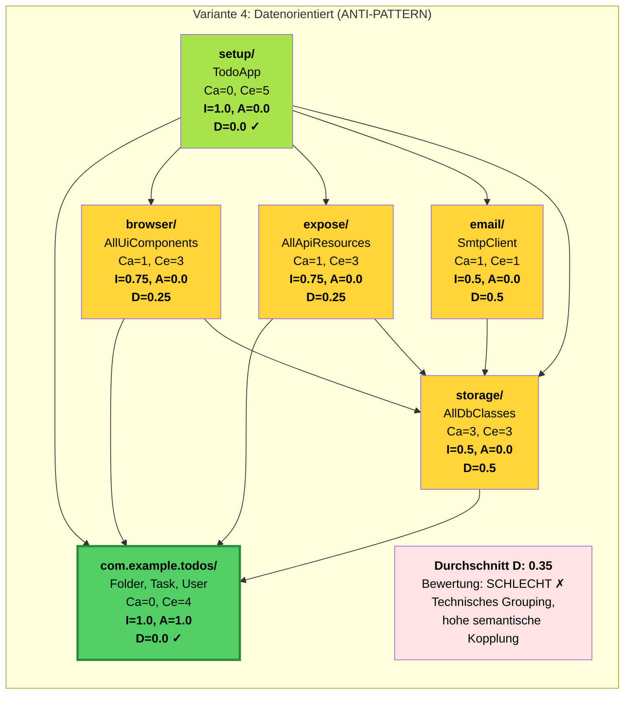
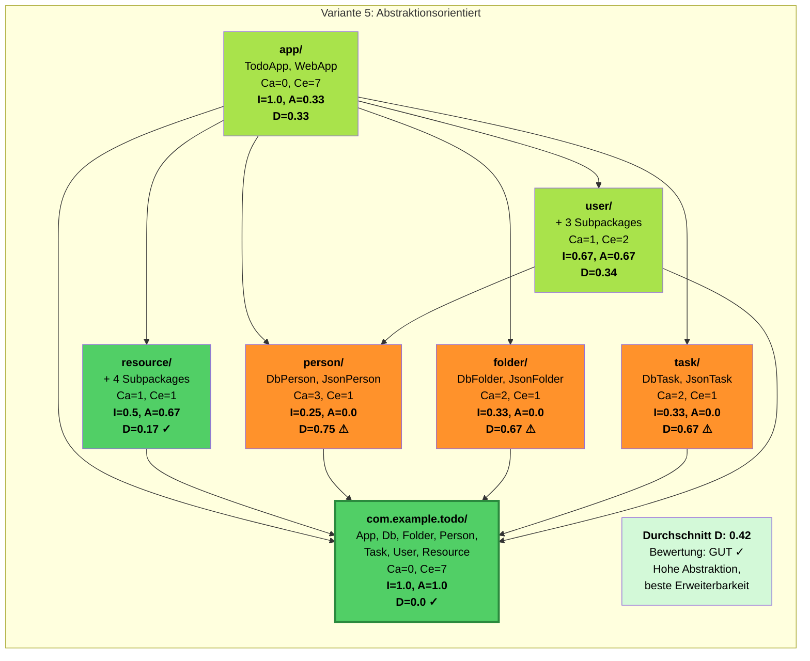
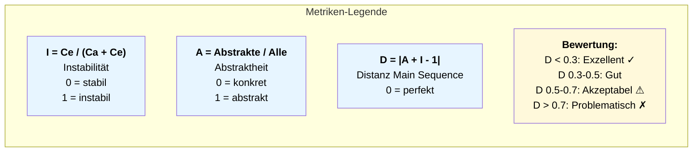
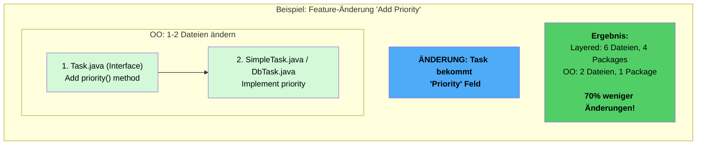
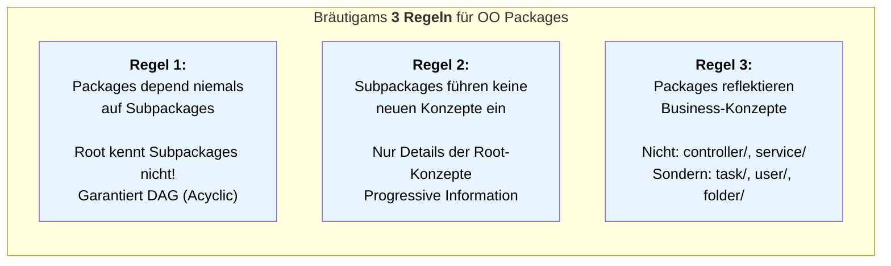
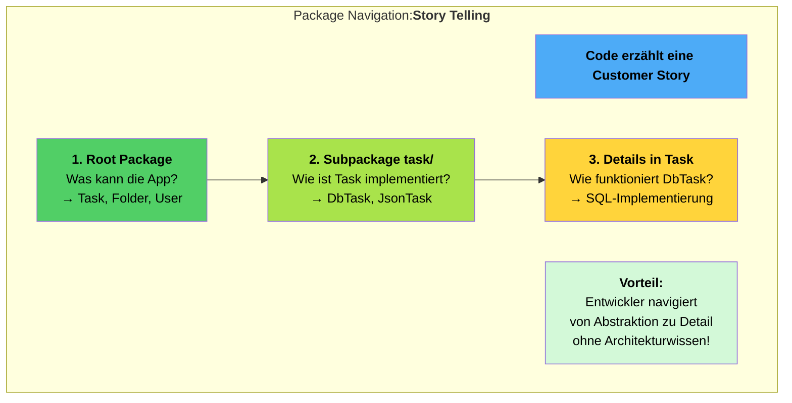

# Structure your Code like a "Pro…"

*"with 3 [Happy Packaging](https://javadevguy.wordpress.com/2017/12/18/happy-packaging/) Rules…"* 

1. Packages should never depend on sub-packages.  
2. Sub-packages should not introduce new concepts, just more details.  
3. Packages should reflect business-concepts, not technical ones.

*"… so that your code tells a customer story and achieves the [next level of readability](https://www.informatik-aktuell.de/entwicklung/programmiersprachen/next-level-lesbarkeit.html).*

---

## 1. Terminologie und Abgrenzung

**Guter Code** ist nicht nur fehlerfrei, sondern auch wartbar, wiederverwendbar und vor allem **leicht verständlich**. 
Der **Schlüssel** dazu liegt in einer domänenorientierten Paketstruktur, die den Prinzipien des **objektorientierten Paket-Designs** (OOPD) folgt.

In diesem Zusammenhang darf ein **Paket** nicht als ein Ordner für die Gruppierung zusammengehöriger Klassen verstanden werden, wie es bei einer *'Layered Architecture'* oft der Fall ist. 
--> Vielmehr stellt es eine **logische, modulare Einheit** dar, die die **technische Realisierung** fachlicher Konzepte **kapselt**.

Die **Abgrenzung** des objektorientierten Paket-Designs zur **"Layered Architecture"** ist der entscheidende Punkt. 
Die bekannten Vertreter wie Clean Architecture oder die oft in Domain-Driven Design (DDD) vorgeschlagenen Paketstrukturen, organisieren den Code nach technischen Schichten (``Domain``, ``Application``, ``Infrastructure``, ``Presentation``). 
Obwohl diese Ansätze durch die **Trennung von Aspekten in Paket-Schichten** die Wartbarkeit und Weiterentwicklung fördern sollen, bewirken sie in der Praxis oft das Gegenteil und **widersprechen dem Single Responsibility Principle (SRP)**.  

Robert Bräutigam beschreibt in seinen Blog-Artikeln die Kernprobleme:

**Datenorientierte Abstraktionen durch Daten-Grenzen:**  
Die ständige Übertragung von Daten über Schichtgrenzen hinweg (``User -> UserDTO -> UserViewModel``) erzeugt unnötigen Code und lässt die ursprüngliche, fachliche Abstraktion zerfallen. Jede Schicht muss die Daten für ihren eigenen Zweck transformieren, was zu starren und wartungsaufwändigen Systemen führt.

**Technische Kommunikation über die Architektur:**  
Eine geschichtete Architektur beschreibt die technischen Abhängigkeiten, nicht die fachlichen. Ein neuer Entwickler muss erst die gesamte Architektur verstehen, bevor er sich in die fachliche Logik einarbeiten kann.  

**Semantische Kopplung:**  
Dieser kritischste Art von Kopplung wird die oft durch Getter verursacht. Wenn ein Objekt zu viel über die internen Details (private fields) eines anderen Objekts weiß, sind beide Klassen semantisch gekoppelt. Änderungen im Detailobjekt propagieren dann unsichtbar durch die gesamte Anwendung.

* **Subjektive Interpretation des „Single Responsibility Principle“:**  

Die Definition von SRP nach Clean Architecture:

> "Eine Klasse sollte nur einen Grund zur Änderung haben"

ist sehr subjektiv und oft zu weit ausgelegt. Indem die Daten von der Business-Logik getrennt und über Schichtgrenzen hinweg transportiert werden, entzieht man den Objekten jegliche Verantwortung. Dies führt zu unnötigen Paket-Schichten und prozeduralem Code, der um Datentransferobjekte (DTOs) herum aufgebaut ist.


Robert Bräutigam definiert das **SRP** pragmatischer und objektiver durch die Prinzipien der **Kopplung (Coupling)** und **Kohäsion (Cohesion)**:

> **SRP = Maximiere Kohäsion und minimiere Kopplung.**

* **Kohäsion (Cohesion):** Bezieht sich auf die Abhängigkeiten innerhalb eines Objekts. Eine hohe Kohäsion bedeutet, dass Methoden (Verhalten) und Felder (Daten) eines Objekts stark aufeinander bezogen sind (physische Abhängigkeit).  
* **Kopplung (Coupling):** Bezieht sich auf die Abhängigkeiten zwischen Objekten. Eine niedrige Kopplung minimiert, dass Änderungen in einem Objekt weitreichende Auswirkungen auf andere haben.

Ein **Paket** ist im Sinne des *Single Responsibility Principle* eine **logische Kapsel und Vertrauensgrenze**.

* Es definiert eine **klare Schnittstelle** (API) nach außen und schützt die interne Komplexität – die Implementierungsdetails – nach innen.  
* Man spricht hier oft von **Component-Based Design**, wo Pakete und Module direkt die **Domänenkonzepte** widerspiegeln.

Die logische Rolle eines Pakets folgt den OOD-Prinzipien der Modularität (Modularity) und dem Geheimnisprinzip (Information Hiding).

**Modularität:**  
Software wird in unabhängige, klar abgegrenzte Module (Pakete) strukturiert. Jedes Paket bildet eine logische Einheit, die ein fachliches Konzept kapselt.

**Geheimnisprinzip:**  
Jedes Modul (Paket) verbirgt seine Implementierungsdetails und stellt nur eine klar definierte Schnittstelle nach außen bereit.

**Kapselung der Implementierungsdetails:**  
Ein Modul soll die Implementierungsdetails (z. B. Datenbankzugriff, externe API-Aufrufe oder komplexe Algorithmen) vor der Außenwelt verbergen. Die Klassen innerhalb des Moduls arbeiten zusammen, um eine einzige, abstrakte Geschäftslogik (Business Concept) zu erfüllen.

**Fokus auf Geschäftskonzepte:**  
Im Idealfall repräsentiert das Paket als Modul ein abstraktes Geschäftskonzept wie z. B.:
- Bestellverwaltung (`Orders`)
- Kundenstamm (`Customer`, `Customerbase`)
- Zahlungsabwicklung (`Bill`, `Billing`)
- externe API-Integration (`Jira`, `Issue`)

und **nicht** eine technische Schicht wie z. B.:
- `Entity`, `Model`, `Service`, `Repository`, `Controller`, `JiraClient`, `JiraModel`, `JiraAdapter`

sowie **auch nicht** technische Schichten wie:
- `Domain`, `Application`, `Infrastructure`, `Presentation`

| Merkmal | Layered Architecture (Schichten) | Objektorientiertes Paket (Modul) |
| :---- | :---- | :---- |
| Gruppierung | **Vertikal nach technischen Aufgaben** (z.B. ``UI, Business Logic, Data Access``). | **Horizontal nach logischen, geschäftlichen Konzepten** (z.B. ``Customer, Order, Inventory``). |
| Kapselung | **Eher schwach**; Implementierungsdetails (z.B. ``Datenbank``) liegen meist in der untersten Schicht (``Data``). | **Stark**; die Implementierungsdetails (z.B. welche Datenbank genutzt wird) bleiben innerhalb des Pakets. |
| Ziel | **Trennung** der technischen Verantwortlichkeiten. | **Kapselung** der fachlichen Konzepte und deren Realisierung. |

---

## **2. Paket-Design Prinzipien**

Um eine perfekte Balance zwischen Wiederverwendbarkeit und Änderungsfreundlichkeit zu finden, helfen die **Paket-Design-Prinzipien** (nach Robert C. Martin).

### **Prinzipien für Kohäsion (Innere Organisation)**

| Prinzip | Kurzfassung | Ziel |
| :---- | :---- | :---- |
| **Reuse-Release Equivalency Principle (REP)** | Die Einheit der Wiederverwendung ist die Einheit der Veröffentlichung. | Alles, was zusammen wiederverwendet wird, sollte in einem Paket gebündelt werden und eine gemeinsame Versionsnummer erhalten. |
| **Common Closure Principle (CCP)** | Klassen, die sich zusammen ändern, gehören zusammen. | Minimiert die Auswirkungen von Änderungen. Wenn eine Änderung ansteht, sollte diese nur ein oder sehr wenige Pakete betreffen (Änderungen sollten in den Paketen eingeschlossen sein). |
| **Common Reuse Principle (CRP)** | Klassen in einem Paket sollten zusammen wiederverwendet werden. | Vermeidet unnötige Abhängigkeiten. Wenn du eine Klasse aus einem Paket nutzt, solltest du die meisten anderen Klassen in diesem Paket ebenfalls nutzen (oder zumindest bereit sein, von ihren Abhängigkeiten betroffen zu sein). |

**Bemerkung:** 
* **REP** und **CCP** fördern größere Pakete für **einfache Wartung**;
* **CRP** fördert kleinere, fokussiertere Pakete für **einfache Wiederverwendung**.
* Das **perfekte Design** liegt in der **Mitte**.

### **Prinzipien für Kopplung (Abhängigkeits-Kontrolle)**

Diese Prinzipien steuern die Beziehungen zwischen Paketen in einem großen Projekt.

| Prinzip | Kurzfassung | Ziel |
| :---- | :---- | :---- |
| **Acyclic Dependencies Principle (ADP)** | Die Abhängigkeitsstruktur der Pakete muss ein Directed Acyclic Graph (DAG) sein. | Zyklen (zirkuläre Abhängigkeiten) zwischen Paketen sind verboten! Sie machen Releases schwierig und führen zum "Morning-After-Syndrome". |
| **Stable Dependencies Principle (SDP)** | Abhängigkeiten sollen in Richtung der **Stabilität** zeigen. | Ein Paket sollte nur von Paketen abhängen, die stabiler sind als es selbst. Stabile Pakete sind schwer zu ändern und haben viele eingehende Abhängigkeiten. |
| **Stable Abstractions Principle (SAP)** | Stabile Pakete sollten **abstrakt** sein. Instabile Pakete sollten **konkret** sein. | Stabile (schwer zu ändernde) Pakete sollten durch Interfaces und abstrakte Klassen leicht erweiterbar sein (Open-Closed Principle auf Paket-Ebene). |

---

## **3. Metriken: Messbare Code-Qualität**

Wie können wir "Stabilität" und "Abstraktion" messen? Mit zwei einfachen Metriken!

### Instabilität (I)
Gibt an, wie leicht sich ein Paket ändern lässt.

- **Formel:**  
  I = C_e / (C_a + C_e)

- **C_e:** Anzahl der ausgehenden Abhängigkeiten  
  *(Wie viele andere Pakete werden von diesem Paket verwendet?)*

- **C_a:** Anzahl der eingehenden Abhängigkeiten  
  *(Wie viele andere Pakete verwenden dieses Paket?)*

**Interpretation:**  
- I = 0 → maximal stabil (viele Pakete hängen davon ab, es selbst hängt von wenigen ab)
- I = 1 → maximal instabil (hängt von vielen ab, aber niemand hängt davon ab)

### Abstraktheit (A)
Zeigt den Anteil abstrakter Klassen (Interfaces) im Paket.

- **Formel:**  
  A = Anzahl abstrakter Klassen und Interfaces / Gesamtanzahl der Klassen im Paket

**Interpretation:**  
- A = 0 → komplett konkret (schwer zu ändern, schwer zu erweitern)
- A = 1 → komplett abstrakt (leicht zu erweitern)

### Die Hauptsequenz (A-I-Plot)
Ideale Pakete liegen auf oder nahe der Hauptsequenz:  
A + I = 1

- **Ideale Lage 1 (Oben links):**  
  A = 1, I = 0  
  *Maximal stabil und abstrakt (Kern-Interfaces, Frameworks)*

- **Ideale Lage 2 (Unten rechts):**  
  A = 0, I = 1  
  *Maximal instabil und konkret (Implementierungen, die sich oft ändern)*

- **Problemfall:**  
  A = 0, I = 0  
  *Stabil und konkret – schwer zu ändern und schwer zu erweitern.*

Mit diesen Metriken kannst du die Architekturqualität eines Pakets objektiv bewerten und gezielt verbessern.

### **Beispiel für Berechnung:**

**Annahme**  
Im Paket `todo` gibt es 1 Interface (`Task.java`). Im Unterpaket `task` existieren 4 konkrete Klassen:
```
com.example.todo/
├── exchange/
├── folder/
├── task/
│   ├── DbTask.java
│   ├── JsonTask.java
│   ├── NotifiedTask.java
│   └── InMemTask.java
├── main/
├── Task.java
```
**Metriken**

- **Abstraktheit (A):**
  - 1 Interface (`Task.java`)
  - 4 konkrete Klassen
  - Gesamt: 5 Klassen
  - A = 1 / 5 = 0,2

- **Instabilität (I):**
  - Das Paket `task` hängt von keinem anderen Paket ab → C_e = 0
  - 4 andere Pakete nutzen `task` (z. B. `main`, `folder`, `exchange`, `user`) → C_a = 4
  - I = 0 / (4 + 0) = 0 / 4 = 0

- **Hauptsequenz:**  
  A + I = 0,2 + 0 = 0,2

**Interpretation:**  
Das Paket ist konkret und maximal stabil. Es liegt deutlich unterhalb der Hauptsequenz (ideal: 1).

---

## **4. Der Weg zum Profi: Storytelling-Ansatz**

Um wirklich wie ein Profi *Pakete und Code* zu strukturieren, müssen wir aufhören, nur Code zu schreiben, der *funktioniert*, und anfangen, Code zu schreiben, der eine **Geschichte** erzählt. Die Fähigkeit, Information über die Fachlichkeit (Domain) effizient an den Leser zu übermitteln, kann in 5 Stufen betrachtet werden.

| Level | Fokus | Beschreibung |
| :---- | :---- | :---- |
| **Level 0: Funktioniert** | Prozedural | Code kompiliert und erfüllt die Aufgabe. Lange, prozedurale Methoden, tiefe Schachtelung, Logikfehler. **Konsequenz:** Der Leser muss den gesamten technischen Ablauf mental simulieren. |
| **Level 1: Aussehen** | Syntax (Clean Code) | Kurze Methoden, sinnvolle Namen, konsistente Formatierung. Die Szene ist gut gelichtet. **Problem:** Der Code ist *lesbar*, aber *informationsarm*. Wissen ist im Code "verteilt", was die Wartbarkeit vernichtet (z. B. leere ``PetType`` Klasse). |
| **Level 2: Lokalisiert** | Kontext & Muster | Der Dialog ist im Kontext. Klassen fassen den gesamten Kontext für ein Stück Code. **Technik:** Verlagere den Kontext von außen in die Klasse (z. B. ``Vets.toApiFormat()``). Methoden können private werden. |
| **Level 3: Anforderungsrelevant** | Domain & Absicht | Klassen erzählen etwas über die Anforderungen der Applikation, nicht nur über Implementationsdetails wie Frameworks (``DTO, Service, Controller``). **Ziel:** Objekte werden eng auf die Bedürfnisse der Applikation zugeschnitten, um die Informationsdichte zu maximieren. |
| **Level 4: Organisiert** | Hierarchie & Fluss | Information wird **progressiv** dargestellt. Die obersten Pakete enthalten die wichtigsten fachlichen Konzepte, Unterpakete mehr Details. **Ergebnis:** Der Leser kann sich schrittweise einen Überblick verschaffen und findet Features entlang der fachlichen Konzepte. |

Der Übergang von **Level 3** (Anforderungsrelevant) zu **Level 4** (Organisiert) erfordert einen bewussten Bruch mit der Gewohnheit des **technischen Grouping** (z. B.`` model/``, ``service/``, ``web/)``. Der Profi folgt stattdessen einem klaren Navigationspfad, der dem Leser hilft, Änderungen effizient zu lokalisieren.

**Startpunkt der Story (Der Anfang!):**

* Das Root-Package muss die wichtigsten, abstraktesten Konzepte enthalten (z. B. Interfaces/Abstract/Classes).  
* Unterpakete werden immer ausgehend von Abstraktionen im nächsthöheren Package angelegt (z. B. ``User -> user/``).

**Technisches Grouping (Vermeiden!):**

* **Beispiel (Spring Petclinic):** ``model/``, ``repository/``, ``service/``, ``web/``.  
* **Problem:** Der Entwickler muss die gesamte Architektur (z. B. "Layered Architecture") kennen, um zu wissen, wo er eine Änderung anwendet. Das Wissen ist **verteilt**.

**Fachliches Packaging (Das Ziel!):**

* **Beispiel (Besser):** ``pet/``, ``owner/``, ``visit/``.  
* **Vorteil:** Man wählt direkt den **fachlichen Kontext** der Änderung aus und geht dann in die Details. Das Wissen ist **lokalisiert**.

---

## **5. Drei - Pragmatische Regeln**

Um diesen fachlichen, progressiven Informationsfluss zu gewährleisten, beachte die folgenden drei Regeln von Robert Bräutigam, die die theoretischen Prinzipien (ADP, SDP) in die Praxis umsetzen:

**Regel 1: Pakete sollten niemals von Unterpaketen abhängen.**

Dies ist die wichtigste Regel, um den ``Directed Acyclic Graph (DAG)`` zu gewährleisten und das ``Acyclic Dependencies Principle (ADP)`` zu erfüllen.
* Das **Root-Package** ist der **Startpunkt der Story**. Es muss die wichtigsten, abstraktesten Konzepte enthalten (z. B. Interfaces), ohne die Implementierungs-Details in den Sub-Packages zu kennen.  
* **Konsequenz:** Änderungen in einem Sub-Package können das übergeordnete Package nicht versehentlich beeinflussen. Dies **eliminiert zirkuläre Abhängigkeiten**.

**Regel 2: Unterpakete sollten keine neuen Konzepte einführen.**

Das gesamte logische Feature-Set der Applikation muss bereits im übergeordneten Package erkennbar sein, meist in Form von Interfaces oder abstrakten Klassen.
* **Unterpakete** dienen nur dazu, **mehr Details** (Implementierungen, Spezialisierungen) der im Eltern-Package definierten Konzepte zu liefern.  
* **Konsequenz:** Der Leser muss nicht in alle Sub-Packages abtauchen, um sicherzustellen, dass er kein wichtiges Feature verpasst hat. Er kann sich progressiv und sicher durch die Hierarchie arbeiten.

**Regel 3: Pakete sollten Geschäfts-Konzepte, nicht technische Konzepte reflektieren.**

Benutze in Paketnamen die Sprache der Fachlichkeit (der Domain), nicht die des Frameworks oder eines Architekturmusters.

| Technisch (Schlecht) | Fachlich (Besser) |
| :---- | :---- |
| ``controller/``,  ``adapter/``,  ``web/``,  ``ui/``,  ``api/`` | ``checkout/``, ``expose/``, ``exchange/``, ``human/``, ``page/``, ``site/``, ``display/``, ``control/`` |
| ``service/``, ``usecase/``, ``consumer/``, ``producer/``, ``job/`` | ``billing/``, ``payment/``, ``audit/``, ``alert/``, ``task/``, ``notification/``|
| ``entity/``, ``model/``, ``value/``, ``db/``, ``aggregate/``, ``repository/`` | ``bill/``, ``order/``, ``car/``, ``customer/``, ``account/``, ``store/``, ``storage/``, ``base/`` |
| ``common/``, ``util/``, ``client/``, ``client.http/``, ``lib/``, ``logger/``, ``security/`` | ``tax/``, ``rule/``, ``unit/``, ``unit.iso/``, ``jira/``, ``jira.http/``,   ``log/``, ``text/``, ``text.regex/``,  ``some-concept-need-security.sha2/`` |
| ``config/``, ``properties/``, ``injections/`` | root compostition: ``com.company.todolist.todo/``, ``game/`` oder abstrakt: ``com.company.todo.app/`` eher technisch: ``boot``, ``startup/``, ``setup/``, ``main/``, ``launch/``|

**Vorteil:**

* Die Paket-Struktur bildet eine **Navigationshilfe** für den Leser, die den Geschäftsanforderungen folgt.  
* Wenn eine geschäftliche Änderung ansteht, weist der Paketname direkt auf den Ort der Änderung hin.

---

## **6. Praktische Anwendung**

Die Pakete eines objektorientierten Systems basieren auf klaren OOPD-Prinzipien. Es gibt keine Schichten im traditionellen Sinne von Clean Architecture oder DDD. Stattdessen werden Pakete hierarchisch nach fachlichen Konzepten organisiert. Die Abhängigkeiten fließen von spezifischen Details zu allgemeinen Abstraktionen, wodurch eine saubere und nachvollziehbare Struktur entsteht. Die drei Regeln von Robert Bräutigam sind ein pragmatischer Ansatz für eine OOP-konforme Paketstruktur, welche im Folgenden anhand einer Todo-Anwendung veranschaulicht werden.

Bevor jedoch die ersten Zeilen Code entstehen, ist es notwendig, das fachliche Konzept und die damit verbundenen Anforderungen genau zu verstehen und festzuhalten.

### **6.1. Fachliche Analyse und Entwurf**

* **Fachlichkeit identifizieren und befragen**, wie das Konzept in der realen Welt funktioniert und welche Geschäftsregeln gelten.  
* **Domänenmodell erstellen**, das die Fachlogik mit relevanten Objekt-Entitäten, die zu diesem Konzept gehören, abbildet.  
* **Schnittstellen bestimmen:** wie die Anwendung mit der Außenwelt interagieren soll (UI, Persistenz und API-Schnittstellen).  
* **Deployment festlegen:** Initialisierung, Integration von Konfiguration, Security etc.

**Fallbeispiel: Todo-Anwendung**

***Kurzbeschreibung:** Diese Anwendung bietet Benutzern die Möglichkeit, persönliche Aufgaben über eine Weboberfläche in Ordnern zu organisieren. Optional werden Benutzer automatisch von der Anwendung über ihre Aufgaben benachrichtigt. Um die Integration in andere Anwendungen zu ermöglichen, stellt das System zusätzlich eine externe API bereit.*

#### **6.1.1. Benutzerverwaltung**

* **Identifizierung und Authentifizierung:** Die Anwendung muss in der Lage sein, Benutzer zu identifizieren und zu verwalten.  
* **Personalisierung:** Die Aufgaben und Ordner müssen bestimmten Benutzern zugeordnet werden können.

#### **6.1.2. Aufgaben- und Ordnerverwaltung**

* **Aufgaben:** Benutzer müssen in der Lage sein, einzelne Aufgaben zu erstellen, zu bearbeiten, zu löschen und zu verwalten.  
* **Ordner:** Benutzer müssen Aufgaben in Ordnern organisieren können (Ordner zu erstellen, zu bearbeiten und zu löschen).  
* **Beziehungen:** Eine Aufgabe muss einem Ordner und einem Benutzer zugeordnet werden. Ein Ordner muss einem Benutzer zugeordnet werden.

#### **6.1.3. Benachrichtigungsfunktion**

* **Optionalität:** Die Anwendung muss die Möglichkeit bieten, Benutzer optional und automatisch über ihre Aufgaben zu benachrichtigen.  
* **Mechanismus:** Es muss einen Mechanismus zur automatischen Benachrichtigung geben, der auf den Aufgaben basiert.

#### **6.1.4. Integration mit externen Systemen**

* **API-Bereitstellung:** Die Anwendung muss eine externe API bereitstellen, um die Integration mit anderen Anwendungen zu ermöglichen.  
* **Zugriff auf Funktionalität:** Die API sollte den Zugriff auf die Kernfunktionen der Todo-Anwendung ermöglichen (z. B. das Erstellen, Lesen, Aktualisieren und Löschen von Aufgaben und Ordnern).

#### **6.1.5. Benutzeroberfläche**

* **Weboberfläche:** Die Anwendung muss eine Weboberfläche bereitstellen, über die Benutzer mit der Anwendung interagieren können.  
* **Interaktion:** Über die Weboberfläche sollten Benutzer in der Lage sein, Aufgaben und Ordner zu verwalten und die Benachrichtigungsoptionen zu konfigurieren.

### **6.2. Implementierung der Kernlogik**

Das **Herzstück** jeder Anwendung ist das **Root-Paket** (``com.example.todo``), das als die stabile, fachliche API der gesamten Anwendung dient.
**Technische Aspekte** wie: Initialisierung ``app/``, Konfiguration ``config/``, Persistenz ``db/``, humane ``ui/`` und maschinelle Schnittstellen ``api/``, **sind Implementierungsdetails** und werden ganz nach dem Motto:

* “Model the problem, not the technology! …hide implementation details, like the fact that you are using MVC.”

Somit werden **Details nicht als eigenständige Pakete abgebildet**, sondern in den fachlichen Paketen als konkrete Implementierung verborgen, folge der Paketstruktur von Variante 1.

### 6.2.1. **Paketstruktur: Variante 1**

**Layer 0: Root Package**
* **Frage:** Was macht die App?
```
com.example.todo/  
```
* **Inhalt:** 3 Dateien geben einen Überblick, 100 % der Features sind sichtbar.
```
com.example.todo/  
├── Folder.java  
├── Task.java  
└── User.java
```
**Resultat** für den Leser: Der Leser weiß jetzt, dass die App "```Task```(s) in ```Folder```(s) für ```User```(s) verwaltet."

**Layer 1: Subpackages**
* **Frage:** Wie ist es implementiert?
```
com.example.todo/  
├── folder/  
├── task/  
├── main/  
├── user/  
├── Folder.java  
├── Task.java  
└── User.java
```
* **Inhalt:** 3–4 Klassen pro Konzept, verschiedene Implementierungen.
```
├── task/   
│ ├── DbTask.java
│ ├── JsonTask.java
│ ├── NotifiedTask.java   
│ └── InMemTask.java
├── Task.java 
```
**Resultat für den Leser:** Der Leser weiß jetzt, dass "Task In-Memory-, DB- und JSON-Varianten" hat.

**Layer 2: Klassen-Details**
* **Frage:** Wie funktioniert ```DbTask```?
* **Inhalt:** SQL Queries und Connection Handling.

```java
public final class DbTask implements Task {
    private final String id;
    private final Connection conn;
    private final boolean completed;
    
    public DbTask(Connection conn, String id) {
        this.id = id;
        this.conn = conn;
        this.completed = false;
    }
    // Select * From Task...
   }
```
**Resultat für den Leser:** Der Leser weiß jetzt, dass "```DbTask``` direkt mit SQL spricht."

* ```folder/``` - Datenbank, Benutzeroberflächen und Austausch über Http.
* ```task/``` - Datenbank, Benutzeroberflächen und Austausch über Http.
* ```user/``` - Datenbank, Benutzeroberflächen, Austausch über Http, Emailversand und Autorisierung.
* ```main/``` - Einsteigspunkt, Initialisierung und Konfiguration der gesamten Anwendung.



### 6.2.2. **Paketstruktur: Variante 2**

Eine **differenziertere Trennung** der **technischen Aspekte** als Pakete beeinflusst die Lesefreundlichkeit eher **negativ**, siehe Variante 2.
```
com.example.todo/  
├── alert/    
├── exchange/  
├── folder/  
├── human/  
├── main/  
├── task/  
├── user/  
├── Folder.java  
├── Task.java  
└── User.java
```

- ```folder/, task/, user/``` - konkrete Realisierungen z. B. für die Kommunikation mit der **realen** Datenbank.
- ```alert/``` - automatische Benachrichtigung bei bestimmten Ereignissen.
- ```human/``` - Benutzeroberflächen mit grafischen Steuerelementen.  
- ```exchange/``` - Austausch über Http.
- ```main/``` - Einsteigspunkt für Initialisierung und Konfiguration der gesamten Anwendung.
  


### 6.2.3. **Paketstruktur: Variante 3**
Eine differenziertere Trennung (**Decomposition**) der fachlichen Aspekte als Pakete beeinflusst die Lesefreundlichkeit eher **positiv**, siehe Variante 3. (z. B. durch **Decomposition vom** User Aspekten UI und Person wird zu Person und User = UI)
```
com.example.todo/
├── folder/
├── person/
├── main/
├── task/
├── user/
├── Folder.java
├── Task.java
├── Person.java
└── User.java
```

- ```folder/``` - Datenbank, Benutzeroberflächen und Austausch über Http.
- ```task/``` - Datenbank, Benutzeroberflächen und Austausch über Http.
- ```person/``` - Datenbank, Benutzeroberflächen, Austausch über Http.
- ```user/``` - Benutzeroberflächen, Austausch über Http, Emailversand und Autorisierung.
- ```main/``` - Einsteigspunkt, Initialisierung und Konfiguration der gesamten Anwendung.

---



### 6.2.4. **Paketstruktur: Variante 4**

Eine **datenorientierte Trennung** der **technischen** Aspekte als Pakete beeinträchtigt nun definitiv **negativ** die Lesefreundlichkeit, siehe Variante 4 und vergleiche mit Paketstrukturen von den Varianten 1, 2 und 3.
```
com.example.todos/  
├── browser/ (Alle Details für grafische Steuerelemente)  
├── expose/ (Alle Details für Austausch über Http)  
├── email/ (Hilfsklassen für Kommunikation mit Emailserver)  
├── storage/ (Alle Details für Kommunikation mit Datenbank)  
├── setup/  
├── Folder.java  
├── Task.java  
└── User.java
```

* ```storage/``` - alle Realisierungen für die Kommunikation mit der realen Datenbank
* ```email/``` - alle Hilfsklassen für Kommunikation mit Emailserver
* ```browser/``` - alle Benutzeroberflächen mit grafischen Steuerelementen.
* ```expose/``` - Austausch von allen Resourcen über Http
* ```setup/``` - Einsteigspunkt für Initialisierung und Konfiguration der gesamten Anwendung.



### 6.2.5. **Paketstruktur: Variante 5**

Eine **abstraktionsorientierte Trennung** der fachlichen und der technischen Aspekte als Pakete kann die **Lesefreundlichkeit eher positiv** beeinflussen, siehe Variante 5.

```
com.example.todo/  
├── app/   
├── exchange/   
│ ├── envelop/   
│ ├── message  
│ ├── resource/   
│ ├── service/   
│ ├── Envelop.java   
│ ├── Message.java   
│ ├── Resource.java   
│ └── Service.java   
├── person/   
├── folder/   
├── task/   
├── user/  
│ ├── control/  
│ ├── layout/   
│ ├── page/   
│ ├── Control.java   
│ ├── Layout.java   
│ └── Page.java  
├── App.java  
├── Db.java  
├── Folder.java  
├── Person.java  
├── Task.java  
└── User.java
```

Die zwangsläufig zu realisierenden technischen Aspekte wie Initialisierung, Integration von Konfiguration, UI, Persistenz und API-Schnittstellen werden ebenfalls als eine Abstraktion im Root-Paket abgebildet, um die Lesbarkeit und Wartbarkeit zu maximieren.

* **App** - **abstrahiert** die Anwendung selbst. - Einsteigspunkt, Init.. und Konfig... der **gesamten** Anwendung.
* **Db** - **abstrahiert** Persistenz in der Anwendung. - Kommunikation mit der realen Datenbank.
* **User** - **abstrahiert** benutzerspezifische Steuer- und Layoutelemente.
* **Resource** - **abstrahiert** Austausch von **Ressourcen**.
* **Message** - **abstrahiert** die optionale Funktionalität für Benachrichtigungen.



**Metriken-Legende**


### 6.2.6. **Vergleich und Zusammenfassung**

**Ranking nach Durchschnitt D:**
* Variante 1: 0.30 (Beste Balance)
* Variante 4: 0.35 (Metrisch ok, konzeptionell schlecht!)
* Variante 3: 0.38 (Gute fachliche Struktur)
* Variante 2: 0.42 (Zu fragmentiert)
* Variante 5: 0.42 (Hohe Abstraktion, komplex)
  
**Zentrale Erkenntnis:**
* Variante 4 hat gute Metriken, verletzt aber Regel 3 (fachliche Namen)!
* Metriken allein reichen nicht.
* Semantische Kopplung nicht messbar.
* Fachliche Klarheit > technische Metriken.
  
**Empfehlung:**
* Variante 1 oder 3
* Balance zwischen Metriken und fachlicher Klarheit

---

## 7. **Fullstack-Beispiel**

Das Endbeispiel (Fullstack-Anwendung) demonstriert, wie das Root-Paket (```com.example.todo/```) als stabile API dient und
alle **Implementierungsdetails** in den **fachlich** organisierten Unterpaketen **gekapselt** sind. **Ziel** ist es, 
durch Komposition und Kapselung **lose gekoppelte, wartbare** und vor allem **fachlich klare Strukturen zu schaffen**.

```
com.example.todo/  
├── app/  
│ ├── ConsoleApp.java  
│ ├── ResourceApp.java  
│ ├── TodoApp.java  
│ ├── TodoDb.java  
│ └── WebApp.java  
├── exchange/   
│ ├── envelop/  
│ │ ├── WrappedRequest.java  
│ │ └── WrappedResponse.java  
│ ├── media   
│ │ └── TodoHype.java  
│ ├── resource/   
│ │ └── TodoResource.java   
│ ├── service/   
│ │ └── TodoService.java  
│ ├── Envelop.java   
│ ├── Media.java   
│ └── Served.java   
├── folder/   
│ ├── DbFolder.java  
│ └── JsonFolder.java  
├── person/   
│ ├── DbPerson.java  
│ ├── JsonPerson.java  
│ └── NotifiedPerson.java  
├── task/   
│ ├── DbTask.java   
│ └── JsonTask.java  
├── user/  
│ ├── control/   
│ │ ├── Action.java  
│ │ ├── Button.java  
│ │ ├── Dialog.java  
│ │ ├── Form.java  
│ │ ├── Image.java  
│ │ ├── Menu.java  
│ │ ├── Text.java  
│ │ ├── Label.java  
│ │ ├── Table.java  
│ │ └── Tree.java  
│ ├── layout/  
│ │ ├── Color.java  
│ │ ├── Border.java  
│ │ ├── Box.java  
│ │ └── Grid.java  
│ ├── page/   
│ │ ├── MainMenu.java  
│ │ ├── FolderTree.java  
│ │ ├── TaskTable.java  
│ │ ├── TaskDialog.java  
│ │ └── TodoForm.java  
│ ├── Control.java  
│ ├── Layout.java  
│ ├── Page.java   
│ ├── DbUser.java   
│ └── WebUser.java  
├── App.java   
├── Db.java  
├── Message.java   
├── Folder.java  
├── Person.java
├── Task.java  
└── User.java
```
Als Kern-Abstraktionen aus den Geschäftsanforderungen werden die Entitäten **Folder, Task, Person, Message** und **User** als Interfaces direkt im Root-Paket abgelegt, ergänzt durch technische Abstraktionen wie **App, Db,** sowie **Served**. Die Unterpakete beziehen sich dabei ausschließlich auf die Abstraktionen im nächsthöheren Package und kapseln die Implementierungsdetails. Gleichermaßen wird dadurch eine strikte Abhängigkeitsumkehr gewährleistet (Inversion of Control). Das Root-Paket bleibt somit unabhängig von den Implementierungsdetails.

### **7.1. Initialisierung, Dependency Injection und Konfiguration (app/)**

* **Fachliche Begründung:** Die ```App``` ist die höchste Abstraktion der Anwendung. Die Initialisierung, Konfiguration und der Aufbau des Objektdiagramms **(DI)** sind Implementierungsdetails der App-Abstraktion und gehören daher in das Unterpaket app/.  
* **Paketname:** ```app/```. Dieser Name ist fachlich-abstrakt und beschreibt den Kern der Anwendung.  
* **Inhalt:** Das Paket enthält die konkreten Implementierungen des ```App.java```-Interfaces, wie ```TodoApp.java```, ```ConsoleApp.java``` oder ```WebApp.java```.  
* **DI-Container:** Um die Konstruktion des Objektdiagramms transparent und nachvollziehbar zu halten, wird auf externe DI-Container verzichtet. Die Abhängigkeitsinjektion und Konfiguration erfolgen an einem einzigen Ort in den App.java-Implementierungen.

### **7.2. Benutzeroberfläche und seine Unterpakete (user/)**

* **Fachliche Begründung:** Die Benutzeroberfläche **(UI)** ist aus Endanwender-Sicht ein zentrales Business-Konzept **("Wie interagiere ich mit meinen Aufgaben?")**. Die Abstraktionen ```User.java```, ```Page.java``` und ```Control.java``` definieren die Schnittstelle der UI, während das Unterpaket ```user/``` deren Implementierungsdetails kapselt.  
* **Paketname:** ```user/```. Das Paket ist dem fachlichen Konzept "User" gewidmet und implementiert dessen UI-Interaktion.
* **Inhalt:** Das Unterpaket enthält die Implementierung von WebUser.java. Es beinhaltet auch interne, UI-spezifische Unterpakete wie control/ (Wiederverwendbare UI-Steuerelemente) und ```page/``` (Vollständige Seitenansichten), die die technischen Details der gewählten UI-Technologie (z. B. HTML/CSS/JS, Frameworks) vollständig kapseln.

### **7.3. Datenbank-Persistenz (Decorator-Muster)**

* **Fachliche Begründung:** Die Persistenz ist ein internes Detail zur Realisierung der fachlichen Konzepte (```Folder, Task, Person```). Statt eines technischen ```db/```-Pakets wird das Decorator-Entwurfsmuster verwendet, um die Objekte mit Persistenzverhalten zu erweitern. Das Db.java-Interface im Root-Paket abstrahiert den Datenbankzugriff.
* **Paketierung:** Die Persistenzlogik wird direkt in die fachlichen Pakete (```folder/, task/, person/, user/```) integriert.
* **Beispiel:** ```DbFolder.java``` **(Decorator):** Eine Klasse, die das Folder-Interface implementiert und ein anderes Folder-Objekt dekoriert, um es persistent zu machen. Sie injiziert die Db-Abstraktion. Die Details der Datenbankimplementierung (JDBC, ORM) sind innerhalb dieser Klasse gekapselt.

### **7.4. API-Schnittstelle und seine Unterpakete (exchange/)**

* **Fachliche Begründung:** Die API ist das fachliche Konzept des Informationsaustauschs mit externen Systemen. Sie ist durch das Resource.java-Interface im Root-Paket abstrahiert. Das Unterpaket ```resource/``` realisiert diese Schnittstelle und fasst alle technischen Details der API-Bereitstellung zusammen (z. B. JAX-RS, SOAP).
* **Paketname:** ```exchange/```. Dieser Name ist fachlich und beschreibt den Informationsaustausch zwischen den externen Anwendungen.
* **Inhalt:** Es enthält Implementierungen von ```Resource.java``` (z. B. ```TodoResource.java``` für JAX-RS), Message.java und Service.java, sowie technische Unterpakete wie ```envelop/``` und ```media/``` zur Kapselung von I/O-Objekten und Formaten (z. B. HATEOAS).

### **7.5. Hilfsklassen - Vermeidung von (util/)**

* **Fachliche Begründung:** In einer strikt objektorientierten Welt existieren keine statischen Utility-Klassen. Logik sollte immer in einem Objekt gekapselt und über Komposition oder das Decorator-Muster wiederverwendet werden.
* **Vermeidung von util/-Paketen:** Pakete wie ```util/``` oder ```helper/``` sind zu technisch und **verstoßen gegen Regel 3**.
* **Lösung:** Package-private Hilfsklassen innerhalb der fachlichen Pakete oder eigenständige Objekte (z. B. ```JsonPerson.java``` mit eigener JSON-Logik), die per Komposition eingebunden werden. Dies fördert die Einhaltung des SRP und die Testbarkeit.

---

## **8. Fazit: Der Profi als Architekt**

Der wahre **"Profi"** zeichnet sich dadurch aus, dass er:

* **Stets die Fachlichkeit reflektiert:** Er verwendet ausschließlich die Sprache der Domäne in der Paketstruktur, um eine Navigationshilfe zu schaffen, die direkt der Geschäftslogik folgt (Regel 3).  
* **Die OOPD-Prinzipien und Messverfahren kennt:** Er nutzt die Komponentenprinzipien (REP, CCP, CRP, ADP, SDP, SAP) und **Metriken (A und I) zur Quantifizierung der Code-Qualitä**t und zur Identifizierung von Problemfällen in der Architektur.  
* **Pragmatisch nach Regeln handelt, misst und gegebenenfalls anpasst:** Er setzt die drei goldenen Regeln (keine Abhängigkeit zu Sub-Packages, progressive Detaillierung, fachliche Namen) als pragmatische Leitlinien ein, um Zyklen zu verhindern (Regel 1) und eine progressive Story zu gewährleisten (Regel 2).

Gutes Packaging ist eine architektonische Entscheidung, die den Grundstein für den langfristigen Erfolg deines Projekts legt.

---

## **9. Quellen und weiterführende Links**

Dieser Artikel basiert auf den etablierten Komponentenprinzipien von Robert C. Martin und den pragmatischen Regeln für objektorientiertes Packaging, wie sie von Robert Bräutigam zusammengefasst wurden.

**Primärquellen:**

* **Robert Bräutigam (2017):** **"Happy Packaging!"**  
  * Die drei goldenen Regeln.  
  * *Link:* https://javadevguy.wordpress.com/2017/12/18/happy-packaging/  
* **Robert Bräutigam (2017):** **"Next Level Lesbarkeit!"**  
  * Die Philosophie des "Customer Story"-Codings.  
  * *Link:* https://www.informatik-aktuell.de/entwicklung/programmiersprachen/next-level-lesbarkeit.html  
* **Robert Bräutigam (2018):** **"Best way to naming classes and packages in Java"**  
  * Zitat: “Model the problem, not the technology! Find suitable abstractions straight from the business requirements and hide implementation details, like the fact that you are using MVC.”  
  * *Link:* https://softwareengineering.stackexchange.com/a/372121  
* **Robert C. Martin (Uncle Bob):** **"Component Principles"**  
  * Die theoretischen Grundlagen und Metriken für Kopplung (ADP, SDP, SAP) und Kohäsion (REP, CCP, CRP).  
  * *Quelle:* Robert C. Martin, *Agile Software Development, Principles, Patterns, and Practices*. Prentice Hall, 2002.

---

**Beispiel für Änderung "Add Priority"**

| Architekturansatz         | Anzahl geänderter Dateien | Anzahl geänderter Pakete | Änderungsaufwand | Beispiel für Änderung "Add Priority" |
|--------------------------|--------------------------|-------------------------|------------------|--------------------------------------|
| **Layered Architecture** | 5–6                      | 4                       | Hoch             | Task (Domain), TaskDTO (Application), TaskMapper (Application), TaskService (Application), TaskController (Presentation), TaskEntity (Infrastructure) |
| **OO Package Design**    | 1–2                      | 1                       | Niedrig          | Task.java (Interface): Add priority() method<br>SimpleTask.java / DbTask.java: Implement priority |

**Ergebnis:**  
- Layered: 6 Dateien, 4 Pakete müssen angepasst werden  
- OO: 2 Dateien, 1 Paket muss angepasst werden  
- **→ 70% weniger Änderungen bei OO Package Design!**


## 10. Anhänge

### 10.1 OO vs Layered Architecture 
```mermaid
graph TB
    subgraph "TRADITIONAL: Layered Architecture (Clean Architecture / DDD)"
        direction TB
        
        TRAD_TITLE["<b>❌ TECHNISCHE SCHICHTEN</b><br/>Horizontal nach Technik"]
        
        PRES["<b>Presentation Layer</b><br/>Controllers, Views, DTOs<br/>TaskController, FolderController<br/>UserController"]
        
        APP["<b>Application Layer</b><br/>Use Cases, Services<br/>TaskService, FolderService<br/>UserService"]
        
        DOMAIN["<b>Domain Layer</b><br/>Entities, Value Objects<br/>Task, Folder, User"]
        
        INFRA["<b>Infrastructure Layer</b><br/>Repositories, DB Access<br/>TaskRepository, FolderRepository<br/>UserRepository"]
        
        PRES -->|Dependency| APP
        APP -->|Dependency| DOMAIN
        INFRA -->|Implements| DOMAIN
        
        PROBLEM["<b>Probleme:</b><br/>❌ Domain nur 1/4 der App<br/>❌ Änderungen propagieren durch alle Schichten<br/>❌ DTOs überall (Data Boundaries)<br/>❌ Technisches Wissen erforderlich<br/>❌ Schwache Kohäsion<br/>❌ Hohe semantische Kopplung"]
        
        style TRAD_TITLE fill:#ff6b6b,color:#fff
        style PRES fill:#ffe3e3,color:#000
        style APP fill:#ffe3e3,color:#000
        style DOMAIN fill:#ffe3e3,color:#000
        style INFRA fill:#ffe3e3,color:#000
        style PROBLEM fill:#ff6b6b,color:#fff
    end
  ```
  ```mermaid
graph TB  
    subgraph "OBJECT-ORIENTED: Hierarchical Package Structure"
        direction TB
        
        OO_TITLE["<b>✅ FACHLICHE HIERARCHIE</b><br/>Vertikal nach Business-Konzepten"]
        
        ROOT["<b>com.example.todo/</b><br/>(Root Package)<br/><br/><b>Abstrakte Konzepte:</b><br/>Task.java (Interface)<br/>Folder.java (Interface)<br/>User.java (Interface)<br/>App.java (Interface)<br/>Db.java (Interface)<br/><br/><b>Rolle: Stabile API</b>"]
        
        TASK_PKG["<b>task/</b><br/>(Subpackage)<br/><br/><b>Implementierungen:</b><br/>SimpleTask.java<br/>DbTask.java<br/>JsonTask.java<br/><br/><b>Alle Aspekte von Task:</b><br/>✓ Business Logic<br/>✓ Persistence<br/>✓ Serialization"]
        
        FOLDER_PKG["<b>folder/</b><br/>(Subpackage)<br/><br/><b>Implementierungen:</b><br/>SimpleFolder.java<br/>DbFolder.java<br/>JsonFolder.java<br/><br/><b>Alle Aspekte von Folder:</b><br/>✓ Business Logic<br/>✓ Persistence<br/>✓ Serialization"]
        
        USER_PKG["<b>user/</b><br/>(Subpackage)<br/><br/><b>Implementierungen:</b><br/>SimpleUser.java<br/>DbUser.java<br/>WebUser.java<br/><br/><b>Alle Aspekte von User:</b><br/>✓ Business Logic<br/>✓ Persistence<br/>✓ UI Components"]
        
        APP_PKG["<b>app/</b><br/>(Subpackage)<br/><br/><b>Implementierungen:</b><br/>TodoApp.java<br/>WebApp.java<br/>ConsoleApp.java<br/><br/><b>Aspekte:</b><br/>✓ Initialization<br/>✓ Configuration<br/>✓ Dependency Injection"]
        
        TASK_PKG -.->|implements| ROOT
        FOLDER_PKG -.->|implements| ROOT
        USER_PKG -.->|implements| ROOT
        APP_PKG -.->|implements| ROOT
        
        APP_PKG -->|uses| TASK_PKG
        APP_PKG -->|uses| FOLDER_PKG
        APP_PKG -->|uses| USER_PKG
        
        BENEFIT["<b>Vorteile:</b><br/>✅ Keine technischen Schichten<br/>✅ Änderungen lokalisiert in einem Package<br/>✅ Keine DTOs nötig<br/>✅ Fachliches Wissen führt direkt zum Code<br/>✅ Hohe Kohäsion<br/>✅ Niedrige Kopplung"]
        
        style OO_TITLE fill:#51cf66,color:#000
        style ROOT fill:#51cf66,color:#000
        style TASK_PKG fill:#a9e34b,color:#000
        style FOLDER_PKG fill:#a9e34b,color:#000
        style USER_PKG fill:#a9e34b,color:#000
        style APP_PKG fill:#a9e34b,color:#000
        style BENEFIT fill:#51cf66,color:#000
    end
```

```mermaid
graph TB    
    subgraph "Dependency Flow: Details → Abstractions"
        direction BT
        
        FLOW_TITLE["<b>ABHÄNGIGKEITSFLUSS</b><br/>Von spezifisch zu allgemein"]
        
        CONCRETE["<b>Konkrete Details</b><br/>(Subpackages)<br/><br/>DbTask, WebUser<br/>JsonFolder, TodoApp<br/><br/>INSTABIL<br/>Ändern sich häufig"]
        
        ABSTRACT["<b>Abstrakte Konzepte</b><br/>(Root Package)<br/><br/>Task, User, Folder<br/>App, Db<br/><br/>STABIL<br/>Ändern sich selten"]
        
        CONCRETE -.->|depends on| ABSTRACT
        
        ARROW["<b>⬆ Dependency Inversion</b><br/>Details hängen von Abstraktionen ab<br/>NICHT umgekehrt!"]
        
        style FLOW_TITLE fill:#4dabf7,color:#000
        style CONCRETE fill:#ffd43b,color:#000
        style ABSTRACT fill:#51cf66,color:#000
        style ARROW fill:#e7f5ff,color:#000
    end
 ```

```mermaid
graph TB     
    subgraph "Beispiel: Feature-Änderung 'Add Priority'"
        direction TB
        
        CHANGE_TITLE["<b>ÄNDERUNG: Task<br/> bekommt 'Priority' Feld</b>"]
        
        subgraph "Layered: 5-6 Dateien ändern"
            L1["1 Task (Domain)"]
            L2["2 TaskDTO (Application)"]
            L3["3 TaskMapper (Application)"]
            L4["4 TaskService (Application)"]
            L5["5 TaskController (Presentation)"]
            L6["6 TaskEntity (Infrastructure)"]
            
            L1 --> L2 --> L3 --> L4 --> L5 --> L6
            
            style L1 fill:#ffe3e3,color:#000
            style L2 fill:#ffe3e3,color:#000
            style L3 fill:#ffe3e3,color:#000
            style L4 fill:#ffe3e3,color:#000
            style L5 fill:#ffe3e3,color:#000
            style L6 fill:#ffe3e3,color:#000
        end

        RESULT["<b>Ergebnis:</b><br/>Layered: 6 Dateien, 4 Packages"]
        
        style CHANGE_TITLE fill:#4dabf7,color:#000
        style RESULT fill:#51cf66,color:#000
    end
```







```mermaid
graph TB      
    subgraph "Vergleich: Paket-Organisation"
        direction TB
        
        COMP_TITLE["<b>PAKET-ORGANISATION IM VERGLEICH</b>"]
        
        LAYERED_ORG["<b>Layered Architecture:</b><br/><br/>Horizontal (technisch):<br/>Presentation ⟷ Application ⟷ Domain ⟷ Infrastructure<br/><br/>Entwickler denkt:<br/>'Wo ist die Service-Schicht?'<br/>'Wo ist das Repository?'<br/><br/>❌ Technisches Wissen nötig"]
        
        OO_ORG["<b>OO Package Design:</b><br/><br/>Vertikal (fachlich):<br/>Root (Abstraktion)<br/>↓<br/>task/, user/, folder/ (Details)<br/><br/>Entwickler denkt:<br/>'Ich ändere Task'<br/>→ Gehe zu task/<br/><br/>✅ Fachliches Wissen genügt"]
        
        style COMP_TITLE fill:#4dabf7,color:#000
        style LAYERED_ORG fill:#ffe3e3,color:#000
        style OO_ORG fill:#d3f9d8,color:#000
    end
  ```

## 10.2 Dependencies Principles

```mermaid
%% Acyclic Dependencies Principle (ADP)
graph TB
    subgraph "BAD: Cyclic Dependencies - Morning After Syndrome"
        A1[Package A]
        B1[Package B]
        C1[Package C]
        D1[Package D]
        
        A1 -->|depends on| B1
        B1 -->|depends on| C1
        C1 -->|depends on| D1
        D1 -->|depends on| A1
        
        style A1 fill:#ff6b6b
        style B1 fill:#ff6b6b
        style C1 fill:#ff6b6b
        style D1 fill:#ff6b6b
    end
    
    subgraph "GOOD: Acyclic Dependencies - DAG Structure"
        A2[Package A]
        B2[Package B]
        C2[Package C]
        D2[Package D]
        E2[Package E]
        
        A2 -->|depends on| B2
        A2 -->|depends on| C2
        B2 -->|depends on| D2
        C2 -->|depends on| D2
        D2 -->|depends on| E2
        
        style A2 fill:#51cf66
        style B2 fill:#51cf66
        style C2 fill:#51cf66
        style D2 fill:#51cf66
        style E2 fill:#51cf66
    end
    
    subgraph "Breaking Cycles with DIP"
        X1[Package X]
        Y1[Package Y]
        I1[Interface Package]
        
        X1 -->|depends on| I1
        Y1 -->|depends on| I1
        Y1 -.->|implements| I1
        
        style I1 fill:#4dabf7
        style X1 fill:#51cf66
        style Y1 fill:#51cf66
    end
```

```mermaid
graph LR
    subgraph "BAD: Unstable depends on Stable"
        S1[Stable Package<br/>I = 0.2<br/>Changes rarely]
        U1[Unstable Package<br/>I = 0.9<br/>Changes often]
        
        S1 -->|Wrong direction!| U1
        
        style S1 fill:#ff6b6b
        style U1 fill:#ffd43b
    end
    
    subgraph "GOOD: Stable Dependencies"
        U2[Unstable Package<br/>I = 0.9<br/>Easy to change]
        M2[Medium Stable<br/>I = 0.5]
        S2[Stable Package<br/>I = 0.1<br/>Hard to change]
        
        U2 -->|Correct!| M2
        M2 -->|Correct!| S2
        
        style U2 fill:#ffd43b
        style M2 fill:#a9e34b
        style S2 fill:#51cf66
    end
    
    subgraph "Stability Metrics"
        direction TB
        P1["Package P<br/>Ca = 5 (incoming)<br/>Ce = 1 (outgoing)<br/>I = Ce/(Ca+Ce) = 0.17<br/>STABLE"]
        P2["Package Q<br/>Ca = 1 (incoming)<br/>Ce = 5 (outgoing)<br/>I = Ce/(Ca+Ce) = 0.83<br/>UNSTABLE"]
        
        style P1 fill:#51cf66
        style P2 fill:#ffd43b
    end
    
    subgraph "Real Example"
        UI[UI Package<br/>I = 0.8<br/>Changes often]
        BL[Business Logic<br/>I = 0.5<br/>Moderate change]
        DB[Data Access<br/>I = 0.3<br/>Stable]
        CORE[Core Interfaces<br/>I = 0.1<br/>Very stable]
        
        UI --> BL
        UI --> CORE
        BL --> CORE
        DB --> CORE
        
        style UI fill:#ffd43b
        style BL fill:#a9e34b
        style DB fill:#74c0fc
        style CORE fill:#51cf66
    end
  ```
