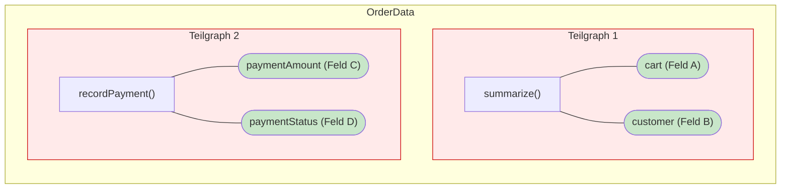

# Single Responsibility Principle objektiv messen 

**State: Draft!!!**

Das Single Responsibility Principle (SRP) ist das erste der fünf SOLID-Prinzipien, die Robert C. Martin (‚Uncle Bob‘) zu Beginn der 2000er-Jahre etablierte. Trotz seiner scheinbaren Einfachheit gehört es in der Praxis zu den am schwierigsten umzusetzenden Entwurfsprinzipien der objektorientierten Programmierung. Die ursprüngliche Definition lautet:

> „A class should have only one reason to change."

Der Zweck des SRP ist es, Software modular, wartbar und verständlich zu halten. Eine Klasse, die nur für eine Sache verantwortlich ist, ist leichter zu testen, einfacher zu ändern und klarer in ihrer Absicht. SRP ist damit nicht nur ein Designprinzip – es ist ein Qualitätsmerkmal, das langfristig über die Gesundheit einer Codebasis entscheidet.

## Gegenstand der Betrachtung und Zielsetzung

Im Mittelpunkt dieser Betrachtung steht das **Single Responsibility Principle** (SRP) sowie die Herausforderung, dessen Einhaltung auf Klassenebene objektiv zu bewerten. Als Vergleichsobjekte dienen zwei verbreitete Entwurfsansätze: das moderne Service-Pattern nach Domain-Driven Design (DDD) und das Decorator-Pattern nach Object-Oriented-Design (OOD). Beide Konzepte werden zur Analyse innerhalb einer Bestellverwaltungsdomäne in Java implementiert.

Durch eine objektive Untersuchung des SRP soll ein tieferes Verständnis für dessen Anwendung im Entwickleralltag vermittelt werden. Dabei folgt dieser Ansatz der Formalisierung von Robert Bräutigam, welcher das SRP über die messbaren Metriken Kohäsion und Kopplung messbar macht:
`SRP ≡ max(COHESION) ∧ min(COUPLING)`

Die Operationalisierung erfolgt dabei über zwei zentrale Kennzahlen: Die **Kohäsion** wird mittels *Lack of Cohesion of Methods - Version 4* **(LCOM4)**  über eine Graphenanalyse ermittelt (idealer Zielwert: 1), während die **Kopplung** mithilfe von *Coupling Between Objects* **(CBO)** durch das Zählen externer Abhängigkeiten bestimmt wird (Zielwert: minimal). Beide Metriken werden anhand von Beispielklassen explizit hergeleitet und in einer abschließenden Gegenüberstellung konsolidiert.

---

## 1. Das Problem: SRP ist nicht messbar

Wegen der Unklarheiten rund um den Begriff ‚Grund‘ hat Robert C. Martin seine Ausführungen später weiter präzisiert. Daraus haben sich mit der Zeit mehrere Definitionen entwickelt:

> **(1)** „Jedes Softwaremodul sollte genau eine Aufgabe haben."

> **(2)** „Jedes Softwaremodul sollte genau einen Grund für eine Änderung haben."

> **(3)** „Sammelt die Dinge zusammen, die sich aus denselben Gründen verändern."

> **(4)** „Derselbe Grund' bedeutet, dass er vom selben Geschäftsmann stammt."

**Das Kernproblem:** Alle diese Definitionen sind aufgrund ihrer subjektiven Formulierungen in der Praxis schwer greifbar.

Denn was bedeutet eigentlich „eine Aufgabe“? Ist beispielsweise ein OrderService, der Bestellungen sowohl validiert als auch persistiert, mit einer oder zwei Aufgaben behaftet? 

Ein „Grund“ wiederum ist retrospektiv leicht zu finden, lässt sich jedoch prospektiv kaum definieren; jede kleinste Anforderungsänderung könnte theoretisch als neuer Grund interpretiert werden.

Auch die Definition (3) ist als Heuristik zwar theoretisch wertvoll, zum Zeitpunkt der Implementierung jedoch kaum prüfbar. Man müsste die zukünftige Entwicklung des Produkts antizipieren, um heute bereits zu wissen, welche Teile sich morgen gemeinsam ändern werden. 

Ebenso unpraktikabel für den Code-Alltag ist der Verweis auf den „Geschäftsmann“ (4): Dieser mag bei der strategischen Domänenmodellierung hilfreich sein, ist jedoch als konkretes Programmierkriterium unbrauchbar.

Solche Diskussionen bleiben stets kontextabhängig und arten in Code-Reviews regelmäßig in „Glaubenskriege“ aus.

---

## 2. Die Formalisierung von Kohäsion und Kopplung

Die eher philosophisch und soziologisch geprägten Definitionen des SRP bieten aufgrund ihrer Subjektivität kaum eine klare Handlungsgrundlage für die Softwareentwicklung. Begriffe wie Verantwortung, Änderungsgrund oder Akteursorientierung erweisen sich für die praktische Umsetzung als zu vage und führen in der Konsequenz häufig zu einer unnötigen Codefragmentierung. Robert Bräutigam schlägt stattdessen eine pragmatische Definition vor:

```
SRP ≡ max(COHESION) ∧ min(COUPLING)
```

Durch die Gleichsetzung mit Kohäsion und Kopplung wandelt sich das SRP von einer Designphilosophie zu einer Strukturmetrik. Während „Verantwortlichkeit“ diskutabel sein mag, lassen sich Kohäsion (z. B. über den LCOM-Wert) und Kopplung (Abhängigkeitsgraph) im Code objektiv nachweisen. Diese Formel hat entscheidende Vorteile: Sie ist **messbar**, **designagnostisch** und die Berechnung kann **werkzeugunterstützt** erfolgen.

**Kohäsion** beschreibt Abhängigkeiten *innerhalb* eines Objekts: Methoden und Felder beziehen sich aufeinander. Je stärker sie verbunden sind, desto kohäsiver ist die Klasse – und desto eher tut sie tatsächlich nur eine Sache.

**Kopplung** beschreibt Abhängigkeiten *zwischen* Objekten. Je mehr externe Klassen eine Klasse kennen muss, desto höher ist das Risiko, dass eine Änderung anderswo auch hier Anpassungen erfordert.

Es gibt zwei Arten von Abhängigkeiten: **physikalische** (direkte Methodenaufrufe, Feldtypen – durch statische Analyse messbar) und **semantische** (implizites Wissen über die Struktur eines anderen Objekts, meist über `Getter-`Methoden). 

Die Semantische Kopplung ist tückischer, weil sie für den Compiler unsichtbar ist und die Änderungen propagieren durch sie auf subtile Weise. Ruft beispielsweise eine Klasse die Sequenz `user.getAddress().getCity().getZipCode()` auf, ist diese Klasse semantisch an die Struktur des `User`-Objekts gekoppelt. Deshalb ist jede `Read/Getter`-Methode ein potenzieller Einstiegspunkt für die semantische Kopplung.


---

## 3. Messverfahren: LCOM4 und CBO

### LCOM4 – Kohäsion messen

Zur Berechnung von LCOM4 wird die interne Struktur einer Klasse als Graph modelliert. Hierbei stellt jede Methode einen Knoten dar. Eine Verbindung zwischen ihnen entsteht immer dann, wenn sie auf dasselbe Instanzfeld zugreifen oder eine direkte Aufrufbeziehung besteht. Falls keine Verbindungen zwischen den Methoden existieren, entstehen Teilgraphen für jede einzelne Methode. Der **LCOM4-Wert entspricht** schließlich der **Anzahl der isolierten Teilgraphen** innerhalb dieser Struktur.

| LCOM4 | Interpretation |
|---|---|
| **1** | Maximale Kohäsion – alle Methoden sind verbunden |
| **> 1** | Die Klasse zerfällt – sollte in *n* Klassen aufgeteilt werden |

Wie die Graphenanalyse in der Praxis funktioniert, verdeutlicht die Klasse `OrderData`.

```java
// LCOM4 = 2 — zwei unabhängige Teilgraphen ❌
public class OrderData {

    private Cart cart;             // Feld A
    private Customer customer;     // Feld B
    private int paymentAmount;     // Feld C
    private String paymentStatus;  // Feld D

    // Gruppe 1: nutzt A und B
    public String summarize() {
        return customer.getName() + ": " + cart.itemCount() + " items"; // → A, B
    }

    // Gruppe 2: nutzt C und D — keine Verbindung zu Gruppe 1
    public void recordPayment(int amount) {
        this.paymentAmount = amount;   // → C
        this.paymentStatus = "PAID";   // → D
    }
}

// summarize()      → Teilgraph {A, B}
// recordPayment()  → Teilgraph {C, D}
// Keine gemeinsamen Felder → LCOM4 = 2 ❌
// Lösung: aufteilen in OrderIdentity und OrderPayment
```


Die Klasse hält vier Felder, deren Methoden sich in zwei vollständig unabhängige Gruppen teilen, weil sie keinerlei gemeinsame Daten nutzen. Während `summarize()` auf Warenkorb und Kunde zugreift, verarbeitet `recordPayment()` ausschließlich zahlungsrelevante Felder. Die resultierende Zustand der Trennung (Disjunktion) der Teilgraphen führt zu einem LCOM4 von 2. Dieser Wert macht deutlich, dass die Klasse zwei unterschiedliche Verantwortlichkeiten vermischt und z.B. in `OrderIdentity` sowie `OrderPayment` aufgeteilt werden sollte.

### CBO – Kopplung messen

Die *Coupling Between Objects*, Chidamber & Kemerer 1994) misst die Anzahl der externen Typen, zu denen eine Klasse eine direkte Abhängigkeit unterhält. Erfasst werden dabei Referenzen in:
* Feldtypen, 
* Methodenparametern und 
* Rückgabetypen sowie 
* direkte Aufrufe der Methoden. 

*Primitive* und *Wrapper* Datentypen (wie `int` oder `String`) bleiben bei dieser Zählung unberücksichtigt, da sie als Basis-Software keine Kopplung im Sinne der Objektorientierung darstellen.

| CBO | Interpretation |
|---|---|
| **0–5** | Geringe Kopplung – wartungsfreundlich |
| **6–10** | Moderat – beobachtenswert |
| **> 10** | Hoch – Redesign empfohlen |

```java
// CBO = 5 ❌ — konkrete Typen in Feldern und Signaturen
public class ReportService {
    private final ReportRepository repository; // CBO +1
    private final PdfExporter pdfExporter;     // CBO +1

    public Report generateReport(DataQuery q) { // DataQuery → CBO +1, Report → CBO +1
        List<DataRow> rows = repository.fetch(q); // DataRow → CBO +1
        return pdfExporter.export(rows);
    }
}
// Gezählte Typen: ReportRepository, PdfExporter, DataQuery, Report, DataRow → CBO = 5
```

Als Abhilfe zur CBO-Reduktion kann die Abhängigkeitsumkehr angewand werden. Statt auf konkrete Klassen zu zeigen, bindet sich eine Klasse an stabile Interfaces. 

Das folgende Beispiel zeigt denselben ReportService einmal mit konkreten Typen (CBO = 5) und einmal hinter Interfaces (CBO = 2) – die Funktionalität bleibt identisch, die Kopplung halbiert sich:

```java
// CBO = 2 ✅ — Abhängigkeitsumkehr hinter stabile Interfaces
public class ReportService {
    private final ReportRepository repository; // Interface → CBO +1
    private final Exporter exporter;           // Interface → CBO +1

    public void generateReport(Query q) {      // Query ist dasselbe Interface
        exporter.export(repository.fetch(q));
    }
}
// Konkrete Typen hinter Interfaces verborgen → CBO sinkt von 5 auf 2
```

Durch die verwendung von Interfaces kann z.B. der CBO-Wert von 5 auf 2 gesenkt werden.

---

## 4. Beispiele: DDD-Service vs. OOD-Decorator

Mit LCOM4 und CBO als Werkzeugen wird in folgendem dieselbe Domäne mit vier verschiedenen Entwurfsansätzen gemässen um die Unterschiede zu verdeutlichen.

**Anwendungsfall**

Als Anwendungsfall soll eine Bestellvorgang von einem Online-Shop dienen, welcher drei Kernoperationen : **Anlegen**, **Bezahlen** und **Stornieren** für Bestellungen benötigt.

Beim **Anlegen** einer Bestellung reserviert das System die bestellten Artikel im Lager und legt die Bestellung persistent ab. Beim **Bezahlen** wird der Betrag über ein externes Zahlungssystem eingezogen und die Bestellung als bezahlt markiert; der Kunde erhält eine Bestätigungs-E-Mail. Beim **Stornieren** werden die reservierten Artikel wieder freigegeben und die Bestellung als storniert markiert; der Kunde erhält eine Stornierungs-E-Mail. Alle drei Operationen werden zusätzlich für Revisionszwecke in einem Audit-Log protokolliert.

Daraus ergeben sich folgende **beteiligte Komponenten**:

| Komponente | Rolle |
|---|---|
| `Cart` | Eingabe: die zu bestellenden Artikel |
| `Customer` | Eingabe: der bestellende Kunde |
| `OrderRepository` | Persistenz: Bestellung speichern und Status aktualisieren |
| `InventoryApi` | Lagerverwaltung: Artikel reservieren und freigeben |
| `PaymentApi` | Zahlung: Betrag einziehen |
| `Email` | Benachrichtigung: Bestätigung und Stornierung versenden |
| `Audit` | Protokollierung: alle Operationen im Audit-Log festhalten |

Genau diese sieben Komponenten tauchen in beiden Implementierungen wieder auf – die Frage ist allein, wie die Verantwortlichkeiten auf Klassen verteilt werden.

---

### 4.1 Service Pattern (DDD)

```java
public class OrderService {
    private final OrderRepository orderRepository;   // Feld 1
    private final InventoryApi inventoryService; // Feld 2
    private final PaymentApi paymentGateway;     // Feld 3
    private final Email emailNotifier;       // Feld 4
    private final Audit auditLogger;           // Feld 5

    public Order createOrder(Cart cart, Customer customer) {
        inventoryService.reserve(cart);              // → Feld 2
        Order order = new Order(cart, customer);
        orderRepository.save(order);                 // → Feld 1
        auditLogger.log("Order created: " + order.getId()); // → Feld 5
        return order;
    }

    public void processPayment(Order order) {
        paymentGateway.charge(order);                // → Feld 3
        order.markAsPaid();
        orderRepository.save(order);                 // → Feld 1
        emailNotifier.sendConfirmation(order);       // → Feld 4
        auditLogger.log("Payment processed: " + order.getId()); // → Feld 5
    }

    public void cancelOrder(Order order) {
        inventoryService.release(order);             // → Feld 2
        order.cancel();
        orderRepository.save(order);                 // → Feld 1
        emailNotifier.sendCancellation(order);       // → Feld 4
        auditLogger.log("Order cancelled: " + order.getId()); // → Feld 5
    }
}
```

**LCOM4-Herleitung:** Welche Methode nutzt welche Felder?

| Methode | Felder |
|---|---|
| `createOrder` | 1 (repo), 2 (inv), 5 (logger) |
| `processPayment` | 1 (repo), 3 (gateway), 4 (notifier), 5 (logger) |
| `cancelOrder` | 1 (repo), 2 (inv), 4 (notifier), 5 (logger) |

Alle drei Methoden teilen Feld 1 (`orderRepository`) und Feld 5 (`auditLogger`) – sie sind damit über einen gemeinsamen Knoten verbunden. Der Graph hat **einen** Teilgraphen: LCOM4 = 1.

Das klingt zunächst nach Kohäsion – ist es aber nicht. Die Verbindung entsteht nur durch technische Querschnittsfelder (Persistenz, Logging), nicht durch fachliche Zusammengehörigkeit. Jede Methode bedient einen völlig anderen Belang. LCOM4 entlarvt dies nicht direkt, aber CBO zeigt das Ausmaß:

| Metrik | Wert | Befund |
|---|---|---|
| CBO | **5** | Alle 5 Felder sind externe Abhängigkeiten – jede Methode zieht andere |
| LCOM4 | **1** | Technisch verbunden über repo und logger – nicht fachlich kohäsiv |

**Analyse:** Der `OrderService` ist kein Beispiel für Kohäsion – er ist ein Beispiel für **erzwungene Verbindung durch Querschnittsfelder**. Die drei Methoden haben keine inhärente fachliche Zusammengehörigkeit; sie sind zufällig in derselben Klasse gelandet, weil sie zur Domäne „Bestellung" gehören. Das eigentliche Problem zeigt sich an CBO = 5 und daran, dass jede einzelne Methode für einen Test alle 5 Mocks benötigt. **SRP ist verletzt – LCOM4 allein reicht nicht zur Diagnose.**

**Verwendung:**

```java
OrderService service = new OrderService(
    orderRepository,
    inventoryApi,
    paymentApi,
    email,
    audit);

// Bestellung anlegen
Order order = service.createOrder(cart, customer);

// Bezahlen — service kennt alle 5 Abhängigkeiten, auch wenn nur 3 gebraucht werden
service.processPayment(order);

// Stornieren — service kennt alle 5 Abhängigkeiten, auch wenn nur 3 gebraucht werden
service.cancelOrder(order);
```

---

### 4.2 Service Pattern (DDD) – aufgespalten

Der naheliegende Refactoring-Schritt: den `OrderService` in drei kleinere Services aufteilen – einen pro Operation. Damit sinkt CBO pro Klasse, und jede Klasse hat nur die Methode, die sie wirklich braucht.

```java
// Verantwortlichkeit: Bestellung anlegen
public class OrderService {
    private final OrderRepository orderRepository;   // Feld 1
    private final InventoryApi inventoryApi;         // Feld 2
    private final Audit audit;                       // Feld 3

    public Order createOrder(Cart cart, Customer customer) {
        inventoryApi.reserve(cart);                  // → Feld 2
        Order order = new Order(cart, customer);
        orderRepository.save(order);                 // → Feld 1
        audit.log("Order created: " + order.getId()); // → Feld 3
        return order;
    }
}

// Verantwortlichkeit: Zahlung abwickeln
public class OrderPaymentService {
    private final OrderRepository orderRepository;   // Feld 1
    private final PaymentApi paymentApi;             // Feld 2
    private final Email email;                       // Feld 3
    private final Audit audit;                       // Feld 4

    public void processPayment(Order order) {
        paymentApi.charge(order);                    // → Feld 2
        order.markAsPaid();
        orderRepository.save(order);                 // → Feld 1
        email.sendConfirmation(order);               // → Feld 3
        audit.log("Payment processed: " + order.getId()); // → Feld 4
    }
}

// Verantwortlichkeit: Bestellung stornieren
public class OrderCancelService {
    private final OrderRepository orderRepository;   // Feld 1
    private final InventoryApi inventoryApi;         // Feld 2
    private final Email email;                       // Feld 3
    private final Audit audit;                       // Feld 4

    public void cancelOrder(Order order) {
        inventoryApi.release(order);                 // → Feld 2
        order.cancel();
        orderRepository.save(order);                 // → Feld 1
        email.sendCancellation(order);               // → Feld 3
        audit.log("Order cancelled: " + order.getId()); // → Feld 4
    }
}
```

**LCOM4-Herleitung:** Jeder Service hat genau eine Methode – LCOM4 = 1 per Definition. Das ist kein Zeichen von Kohäsion, sondern eine Trivialität: Eine Klasse mit einer einzigen Methode kann nicht zerfallen.

| Klasse | Felder | CBO | LCOM4 |
|---|---|---|---|
| `OrderService` | repo, inventoryApi, audit | **3** | **1** – trivial |
| `OrderPaymentService` | repo, paymentApi, email, audit | **4** | **1** – trivial |
| `OrderCancelService` | repo, inventoryApi, email, audit | **4** | **1** – trivial |

**Analyse:** Die Aufspaltung senkt CBO von 5 auf 3–4 und macht jede Klasse kleiner – das ist eine Verbesserung. Aber das Grundproblem bleibt: `audit` und `orderRepository` erscheinen in allen drei Klassen. Jede Änderung an der Logging-Strategie oder am Repository-Interface betrifft weiterhin drei Klassen. Die Querschnittsbelange (Logging, Persistenz) sind nicht isoliert, sondern nur auf mehrere Klassen verteilt. **SRP ist besser, aber nicht erfüllt.**

**Verwendung:**

```java
OrderService createSvc         = new OrderService(orderRepository, inventoryApi, audit);
OrderPaymentService paymentSvc = new OrderPaymentService(orderRepository, paymentApi, email, audit);
OrderCancelService cancelSvc   = new OrderCancelService(orderRepository, inventoryApi, email, audit);

Order order = createSvc.createOrder(cart, customer);
paymentSvc.processPayment(order);
cancelSvc.cancelOrder(order);
```

---

### 4.3 Vertikaler Decorator-Pattern (OOD)

Das Decorator-Pattern separiert Verantwortlichkeiten über Komposition. Jede Klasse trägt genau eine Verantwortlichkeit; Querschnittsbelange entstehen durch Umhüllen, nicht durch Anhäufen von Feldern. Das Interface heißt `Order` – fachlicher Begriff, kein `*Service`-Suffix.

Im neuen Interface entfällt `PaymentApi` als Methodenparameter: `process()` ist eine reine Verhaltensaufforderung an das Objekt. Das `PaymentApi` wird stattdessen in die zuständige Klasse `PaidOrder` injiziert – so bleibt die Abhängigkeit dort, wo sie hingehört, und die Dekoratoren bleiben davon unberührt.

```java
public interface Order {
    void process();
    void cancel();
    String getId();
}
```

```java
// Kern: Persistenz — Repository eingekapselt, ID im Konstruktor
public final class StoredOrder implements Order {
    private final String id;             // Feld 1
    private final Cart cart;             // Feld 2
    private final OrderRepository repo;  // Feld 3

    public StoredOrder(String id, Cart cart, OrderRepository repo) {
        this.id = id; this.cart = cart; this.repo = repo;
    }

    @Override
    public String getId() {
        return this.id;                              // → Feld 1
    }

    @Override
    public void process() {
        repo.updateStatus(this.id, "PROCESSING");    // → Feld 3, 1
    }

    @Override
    public void cancel() {
        repo.updateStatus(this.id, "CANCELLED");     // → Feld 3, 1
    }
}
```

**LCOM4-Herleitung `StoredOrder`:**

| Methode | Felder |
|---|---|
| `getId` | 1 |
| `process` | 1, 3 |
| `cancel` | 1, 3 |

Alle Methoden teilen Feld 1 (`id`) → **LCOM4 = 1** ✅
**CBO:** Cart, OrderRepository → **CBO = 2** ✅

```java
// Horizontaler Dekorator: Zahlung — injiziert PaymentApi, verwendet es in process()
public final class PaidOrder implements Order {
    private final Order delegate;            // Feld 1
    private final PaymentApi gateway;    // Feld 2

    public PaidOrder(Order delegate, PaymentApi gateway) {
        this.delegate = delegate; this.gateway = gateway;
    }

    @Override
    public String getId() {
        return delegate.getId();             // → Feld 1
    }

    @Override
    public void process() {
        gateway.charge(delegate);            // → Feld 2, 1
        delegate.process();                  // → Feld 1
    }

    @Override
    public void cancel() {
        delegate.cancel();                   // → Feld 1
    }
}
```

**LCOM4-Herleitung `PaidOrder`:**

| Methode | Felder |
|---|---|
| `getId` | 1 |
| `process` | 1, 2 |
| `cancel` | 1 |

Alle Methoden teilen Feld 1 (`delegate`) → **LCOM4 = 1** ✅
**CBO:** Order, PaymentApi → **CBO = 2** ✅

```java
// Horizontaler Dekorator: Lagerverwaltung — injiziert InventoryApi, verwendet es in cancel()
public final class InventedOrder implements Order {
    private final Order delegate;            // Feld 1
    private final InventoryApi inv;      // Feld 2

    public InventedOrder(Order delegate, InventoryApi inv) {
        this.delegate = delegate; this.inv = inv;
    }

    @Override
    public String getId() {
        return delegate.getId();             // → Feld 1
    }

    @Override
    public void process() {
        delegate.process();                  // → Feld 1
    }

    @Override
    public void cancel() {
        inv.release(delegate);               // → Feld 2, 1
        delegate.cancel();                   // → Feld 1
    }
}
```

**LCOM4-Herleitung `InventedOrder`:**

| Methode | Felder |
|---|---|
| `getId` | 1 |
| `process` | 1 |
| `cancel` | 1, 2 |

Alle Methoden teilen Feld 1 (`delegate`) → **LCOM4 = 1** ✅
**CBO:** Order, InventoryApi → **CBO = 2** ✅

```java
// Dekorator: Audit-Logging — beide Methoden betroffen
public final class AuditingOrder implements Order {
    private final Order delegate;          // Feld 1
    private final Audit auditLogger; // Feld 2

    public AuditingOrder(Order delegate, Audit auditLogger) {
        this.delegate = delegate; this.auditLogger = auditLogger;
    }

    @Override
    public String getId() {
        return delegate.getId();                           // → Feld 1
    }

    @Override
    public void process() {
        delegate.process();                                // → Feld 1
        auditLogger.log("Processed: " + delegate.getId()); // → Feld 2, 1
    }

    @Override
    public void cancel() {
        delegate.cancel();                                 // → Feld 1
        auditLogger.log("Cancelled: " + delegate.getId()); // → Feld 2, 1
    }
}
```

```java
// Dekorator: E-Mail-Benachrichtigung — beide Methoden betroffen
public final class NotifiedOrder implements Order {
    private final Order delegate;              // Feld 1
    private final Email emailNotifier; // Feld 2

    public NotifiedOrder(Order delegate, Email emailNotifier) {
        this.delegate = delegate; this.emailNotifier = emailNotifier;
    }

    @Override
    public String getId() {
        return delegate.getId();                                  // → Feld 1
    }

    @Override
    public void process() {
        delegate.process();                                       // → Feld 1
        emailNotifier.sendConfirmation(delegate.getId());         // → Feld 2, 1
    }

    @Override
    public void cancel() {
        delegate.cancel();                                        // → Feld 1
        emailNotifier.sendCancellation(delegate.getId());         // → Feld 2, 1
    }
}
// Gleiche Struktur wie AuditingOrder → LCOM4 = 1, CBO = 2 ✅
```

**Messung gesamt:**

| Klasse | Verantwortlichkeit | Felder | CBO | LCOM4 |
|---|---|---|---|---|
| `StoredOrder` | Persistenz | id, cart, repo | **2** | **1** ✅ |
| `PaidOrder` | Zahlung | delegate, gateway | **2** | **1** ✅ |
| `InventedOrder` | Lagerverwaltung | delegate, inv | **2** | **1** ✅ |
| `AuditingOrder` | Logging | delegate, auditLogger | **2** | **1** ✅ |
| `NotifiedOrder` | Benachrichtigung | delegate, emailNotifier | **2** | **1** ✅ |

**Analyse:** Jede Klasse hat CBO = 2 und LCOM4 = 1 – und beide Werte sind diesmal fachlich begründet, nicht trivial oder zufällig. `StoredOrder` hat genau zwei Felder weil Persistenz genau zwei Dinge braucht: die zu speichernde Entität (`id`, `cart`) und das Werkzeug dafür (`repo`). `PaidOrder` hat genau zwei Felder weil Zahlung genau zwei Dinge braucht: das Objekt das bezahlt wird (`delegate`) und das Werkzeug dafür (`paymentApi`). Dasselbe gilt für jede weitere Klasse.

Im Gegensatz zu den aufgespaltenen Services erscheint `audit` und `orderRepository` hier jeweils nur in **einer** Klasse. Eine Änderung an der Logging-Strategie öffnet ausschließlich `AuditingOrder`. Eine Änderung am Repository-Interface öffnet ausschließlich `StoredOrder`. Kein anderer Code ist betroffen.

Die Querschnittsbelange sind nicht verteilt – sie sind isoliert.

**Komposition:**

```java
Order order = new NotifiedOrder(
    new AuditingOrder(
        new InventedOrder(
            new PaidOrder(
                new StoredOrder(id, cart, repo),
                paymentGateway),
            inventoryService),
        auditLogger),
    emailNotifier);

order.process();
// → NotifiedOrder → AuditingOrder → InventedOrder → PaidOrder → StoredOrder
// PaidOrder zieht Zahlung ein, StoredOrder persistiert,
// AuditingOrder loggt, NotifiedOrder sendet Bestätigungs-E-Mail

order.cancel();
// → NotifiedOrder → AuditingOrder → InventedOrder → PaidOrder → StoredOrder
// InventedOrder gibt Lagerbestand frei, StoredOrder persistiert,
// AuditingOrder loggt, NotifiedOrder sendet Stornierungs-E-Mail
```

---

### 4.4 Horizontaler Dekorator-Pattern (OOD)

Vertikales Dekorieren – wie in 4.3 – verschachtelt Klassen ineinander: jede Klasse umhüllt die nächste. Das funktioniert gut bei wenigen Dekoratoren. Wächst die Zahl, wird die Kompositionskette tief und schwer überschaubar. Bugayenko beschreibt in *Vertical and Horizontal Decorating* (2015) eine Alternative: statt Verschachtelung trägt ein einziges Wrapper-Objekt eine **flache Liste** gleichrangiger Transformationen.

Das Muster verlangt ein zweites Interface – hier `OrderAct` – das die eigentliche Transformation kapselt. Der Wrapper `Orders` iteriert über alle `OrderAct`-Objekte und ruft sie der Reihe nach auf. Die Klassennamen tragen kein Suffix – sie benennen die Verantwortlichkeit direkt.

```java
public interface OrderAct {
    void process(String id, Cart cart);
    void cancel(String id, Cart cart);
}

public final class Orders implements Order {
    private final String id;                    // Feld 1
    private final Cart cart;                    // Feld 2
    private final List<OrderAct> acts;        // Feld 3

    public Orders(String id, Cart cart, List<OrderAct> acts) {
        this.id = id; this.cart = cart; this.acts = acts;
    }

    @Override public String getId() { return this.id; }

    @Override
    public void process() {
        acts.forEach(d -> d.process(this.id, this.cart)); // → Feld 3, 1, 2
    }

    @Override
    public void cancel() {
        acts.forEach(d -> d.cancel(this.id, this.cart));  // → Feld 3, 1, 2
    }
}
```

**LCOM4-Herleitung `Orders`:**

| Methode | Felder |
|---|---|
| `getId` | 1 |
| `process` | 1, 2, 3 |
| `cancel` | 1, 2, 3 |

Alle Methoden teilen Feld 1 (`id`) → **LCOM4 = 1** ✅
**CBO:** Cart, List, OrderAct → **CBO = 3** ✅

```java
// Persistenz
public final class Persist implements OrderAct {
    private final OrderRepository repo; // Feld 1

    public Persist(OrderRepository repo) { this.repo = repo; }

    @Override public void process(String id, Cart cart) {
        repo.updateStatus(id, "PAID");       // → Feld 1
    }
    @Override public void cancel(String id, Cart cart) {
        repo.updateStatus(id, "CANCELLED");  // → Feld 1
    }
}
```

```java
// Zahlung — nur process() relevant, cancel() ist leer
public final class Pay implements OrderAct {
    private final PaymentApi paymentApi;    // Feld 1

    public Pay(PaymentApi paymentApi) { this.paymentApi = paymentApi; }

    @Override public void process(String id, Cart cart) {
        paymentApi.charge(id);              // → Feld 1
    }
    @Override public void cancel(String id, Cart cart) { }
}
```

```java
// Lagerverwaltung — nur cancel() relevant, process() ist leer
public final class Invent implements OrderAct {
    private final InventoryApi inventoryApi; // Feld 1

    public Invent(InventoryApi inventoryApi) { this.inventoryApi = inventoryApi; }

    @Override public void process(String id, Cart cart) { }
    @Override public void cancel(String id, Cart cart) {
        inventoryApi.release(cart);          // → Feld 1
    }
}
```

```java
// Logging
public final class AuditAct implements OrderAct {
    private final Audit audit;              // Feld 1

    public AuditAct(Audit audit) { this.audit = audit; }

    @Override public void process(String id, Cart cart) {
        audit.log("Processed: " + id);      // → Feld 1
    }
    @Override public void cancel(String id, Cart cart) {
        audit.log("Cancelled: " + id);      // → Feld 1
    }
}
```

```java
// Benachrichtigung
public final class NotifyAct implements OrderAct {
    private final Email email;              // Feld 1

    public NotifyAct(Email email) { this.email = email; }

    @Override public void process(String id, Cart cart) {
        email.sendConfirmation(id);         // → Feld 1
    }
    @Override public void cancel(String id, Cart cart) {
        email.sendCancellation(id);         // → Feld 1
    }
}
```

**Messung gesamt:**

| Klasse | Verantwortlichkeit | Felder | CBO | LCOM4 |
|---|---|---|---|---|
| `Orders` | Wrapper | id, cart, acts | **3** | **1** ✅ |
| `Persist` | Persistenz | repo | **1** | **1** ✅ |
| `Pay` | Zahlung | paymentApi | **1** | **1** ✅ |
| `Invent` | Lagerverwaltung | inventoryApi | **1** | **1** ✅ |
| `AuditAct` | Logging | audit | **1** | **1** ✅ |
| `NotifyAct` | Benachrichtigung | email | **1** | **1** ✅ |

**Analyse:** Die `Act`-Klassen haben CBO = 1 – jede kennt ausschließlich ihr eigenes Werkzeug. Das ist eine weitere Reduktion gegenüber den vertikalen Dekoratoren (CBO = 2), weil kein `delegate`-Feld mehr nötig ist: Die Weitergabe an den nächsten Schritt übernimmt `Orders` durch die Iteration. `audit` und `orderRepository` erscheinen weiterhin in genau einer Klasse. Das Hinzufügen einer neuen Verantwortlichkeit – z. B. SMS-Benachrichtigung – ist ein neues `OrderAct`-Objekt und ein weiterer Listeneintrag: kein bestehender Code wird berührt (OCP).

Der einzige strukturelle Schwachpunkt: `Pay.cancel()` und `Invent.process()` sind leere Methoden. Das ist ein schwaches LCOM4-Signal – `Pay` hat nur eine Methode mit echtem Verhalten und eine leere. Bugayenko akzeptiert dies als Preis des horizontalen Schnitts; alternativ könnte `OrderAct` in `OnProcess` und `OnCancel` aufgeteilt werden, was aber das Modell verkompliziert.

**Verwendung:**

```java
Order order = new Orders(id, cart, List.of(
    new Persist(repo),
    new Pay(paymentApi),
    new Invent(inventoryApi),
    new AuditAct(audit),
    new NotifyAct(email)
));

order.process();
// → Orders iteriert alle acts: Persist, Pay, Audit, Notify aktiv
// Pay zieht Zahlung ein, Persist persistiert,
// Audit loggt, Notify sendet Bestätigungs-E-Mail

order.cancel();
// → Orders iteriert alle acts: Persist, Invent, Audit, Notify aktiv
// Invent gibt Lagerbestand frei, Persist persistiert,
// Audit loggt, Notify sendet Stornierungs-E-Mail
```

Verglichen mit der vertikalen Kette ist die Komposition flach und gleichrangig – jeder Eintrag in der Liste ist eine eigenständige Verantwortlichkeit, keine Umhüllung der nächsten. Nach Bugayenko: vertikales Dekorieren ist der einfachere Einstieg; horizontales Dekorieren ist die skalierbarere Form, sobald die Zahl der Dekoratoren wächst.

---

## 5. Gegenüberstellung

| Konzept | Metrik | OrderService (DDD) | Services aufgespalten | Vertikaler Decorator (4.3) | Horizontaler Decorator (4.4) |
|---|---|---|---|---|---|
| Kohäsion | LCOM4 | ⚠️ LCOM4 = **1** — Querschnittsfelder | ⚠️ LCOM4 = **1** — trivial (1 Methode) | ✅ LCOM4 = **1** — fachlich kohäsiv | ✅ LCOM4 = **1** — fachlich kohäsiv |
| Kopplung | CBO | ❌ CBO = **5** | ⚠️ CBO = **3–4** je Klasse | ✅ CBO = **2** je Klasse | ✅ CBO = **1–3** je Klasse |
| Lokale Änderbarkeit | LCOM4 / CBO | ❌ Logging betrifft alle 3 Methoden | ❌ Logging betrifft alle 3 Klassen | ✅ nur `AuditingOrder` | ✅ nur `AuditAct` |
| Änderungsausbreitung | CBO | ❌ `PaymentApi` trifft gesamten Service | ⚠️ nur `OrderPaymentService` | ✅ nur `PaidOrder` | ✅ nur `Pay` |
| Testbarkeit | Mocks pro Test | ❌ 5 Mocks pro Methode | ⚠️ 3–4 Mocks pro Klasse | ✅ 2 Mocks pro Klasse | ✅ 1 Mock pro Klasse |
| Erweiterbarkeit (OCP) | neue Anforderung | ❌ bestehende Methoden ändern | ❌ neue Klasse + bestehende ändern | ✅ neuer Dekorator | ✅ neues `OrderAct` + Listeneintrag |
| Lesbarkeit Komposition | — | ✅ eine Klasse | ✅ drei Klassen | ⚠️ verschachtelte Kette | ✅ flache Liste |

**Warum versagt der monolithische DDD-Service?**

Das Problem ist strukturell. Der `OrderService` schneidet *horizontal nach Fachdomäne* – alles rund um Bestellungen landet in einer Klasse. Das erzeugt Methoden mit völlig unterschiedlichen Querschnittsbelangen (Persistenz, Zahlung, Benachrichtigung, Logging), die nur durch technische Felder wie `orderRepository` und `audit` zusammengehalten werden. Diese Verbindung ist zufällig, nicht fachlich. Der Beweis: Jede einzelne Methode braucht für einen Unit-Test alle 5 Mocks – obwohl sie inhaltlich nichts miteinander zu tun haben.

**Warum reicht das Aufteilen in drei Services nicht?**

Die Aufspaltung in `OrderService`, `OrderPaymentService` und `OrderCancelService` ist eine Verbesserung – CBO sinkt, jede Klasse ist kleiner. Aber `audit` und `orderRepository` erscheinen weiterhin in allen drei Klassen. Eine Änderung an der Logging-Strategie betrifft nicht mehr eine Methode, sondern drei Klassen. Die Querschnittsbelange wurden nicht isoliert – sie wurden nur verteilt. SRP ist nicht durch mechanisches Aufteilen zu erreichen, sondern durch den richtigen Schnitt.

**Warum funktioniert der Decorator-Schnitt?**

Der Decorator schneidet *vertikal nach Verantwortlichkeit*: `StoredOrder` kennt ausschließlich Persistenz, `PaidOrder` ausschließlich Zahlung, `InventedOrder` ausschließlich Lagerverwaltung, `AuditingOrder` ausschließlich Logging, `NotifiedOrder` ausschließlich Benachrichtigung. Jede Klasse hat genau die zwei Felder ihrer Verantwortlichkeit. Eine Änderung am Logging-Format betrifft ausschließlich `AuditingOrder`. Eine Änderung an der Zahlungslogik betrifft ausschließlich `PaidOrder`. Die Metriken sind kein Selbstzweck – sie sind der objektive Nachweis, dass das Designziel lokale Änderbarkeit tatsächlich erreicht wurde.

**Nachteile des Decorator-Schnitts und warum sie gerechtfertigt sind**

Der Decorator-Schnitt ist nicht kostenlos. Fünf Klassen statt einer bedeuten mehr Dateien, mehr Konstruktoren, mehr Navigationspfade beim Lesen des Codes. Die Kompositionskette `new NotifiedOrder(new AuditingOrder(...))` ist für Entwickler ungewohnt, die Service-Klassen als selbstverständlich betrachten. Und das Interface `Order` muss stabil sein – jede Erweiterung um eine neue Methode zwingt alle fünf Implementierungen zur Anpassung.

Dieser Aufwand ist jedoch der direkte Preis für zwei Prinzipien, die hier tatsächlich eingehalten werden:

**SRP** ist erfüllt: Jede Klasse hat genau eine Verantwortlichkeit, die sich in CBO = 2 und fachlich begründetem LCOM4 = 1 niederschlägt. Der Mehraufwand beim Anlegen der Klassen ist eine Einmalzahlung. Die Einsparung entsteht bei jeder späteren Änderung – und Änderungen kommen häufiger als Neuerstellungen.

**OCP** (*Open/Closed Principle*) ist erfüllt: Eine neue Anforderung – etwa SMS-Benachrichtigung zusätzlich zur E-Mail – erfordert keine Änderung an bestehenden Klassen. Es genügt, einen neuen Dekorator `SmsOrder` zu schreiben und ihn in die Kompositionskette einzuhängen. Bestehender Code bleibt unberührt und damit ungetestet-stabil. Beim `OrderService` dagegen würde dieselbe Anforderung eine Änderung in mindestens zwei Methoden und einen neuen Mock in allen bestehenden Tests erfordern.

Die Mehrklassen sind also keine Komplexität – sie sind die strukturelle Abbildung tatsächlich vorhandener, getrennter Verantwortlichkeiten. Wer den Aufwand als zu hoch empfindet, zahlt ihn später versteckt: als Testaufwand, als Änderungsausbreitung, als Debugging in Klassen die zu viel wissen.

**Nachteile des horizontalen Decorators**

Das horizontale Muster (4.4) verbessert CBO und Testbarkeit weiter – aber führt eigene Schwächen ein. `OrderAct` erzwingt, dass jede Implementierung beide Methoden `process()` und `cancel()` deklariert, auch wenn nur eine davon relevant ist. `Pay.cancel()` ist leer, `Invent.process()` ist leer. Das ist kein LCOM4-Problem – beide Klassen haben nur ein Feld und bleiben kohäsiv – aber es ist eine strukturelle Lüge: Das Interface behauptet eine Fähigkeit, die die Klasse nicht besitzt. In größeren Systemen mit vielen `OrderAct`-Implementierungen entstehen so viele leere Methoden, die still ignoriert werden und dennoch kompiliert, getestet und gepflegt werden müssen.

Der `Orders`-Wrapper hat CBO = 3 statt 2 – `List` als Containertyp zählt als zusätzliche Abhängigkeit. Und die Ausführungsreihenfolge der `OrderAct`-Objekte ist implizit durch die Listenreihenfolge bestimmt. Beim vertikalen Decorator ist die Reihenfolge durch die Verschachtelung explizit sichtbar; beim horizontalen liegt sie in der `List.of(...)`-Deklaration, die leicht übersehen wird.

**Wann welcher Ansatz?** Bugayenko selbst empfiehlt: mit vertikalem Dekorieren beginnen, zu horizontalem migrieren wenn die Zahl der Dekoratoren wächst. Der Schwellenwert liegt nicht bei einer fixen Zahl, sondern wenn die Kompositionskette tiefer wird als sie lesbar bleibt.

---

## 6. Fazit

Das SRP ist eines der einfachsten Prinzipien und gleichzeitig eines der am schwierigsten umzusetzenden. Es liegt in unserer Natur, Verantwortlichkeiten miteinander zu verknüpfen. Diese Verantwortlichkeiten jedoch zu identifizieren und voneinander zu trennen, macht einen Großteil dessen aus, worum es beim Softwareentwurf eigentlich geht. Die anderen SOLID Prinzipien führen auf die eine oder andere Weise auf diesen Kernpunkt zurück.

Die gängigen SRP-Definitionen laden zu Interpretation ein und führen in Code-Reviews zu Debatten ohne objektiven Ausweg. Die Formel **SRP ≡ Maximale Kohäsion ∧ Minimale Kopplung** nach Robert Bräutigam macht das Prinzip messbar: **LCOM4 = 1** signalisiert, dass eine Klasse intern zusammenhängend ist; **CBO so niedrig wie möglich** signalisiert, dass sie nach außen minimal exponiert ist.

Der Vergleich der vier Designvarianten zeigt eine klare Progression. Der monolithische `OrderService` verbindet fünf Verantwortlichkeiten durch Querschnittsfelder – LCOM4 = 1 entsteht zufällig, nicht fachlich. Das Aufteilen in drei Services senkt CBO, verteilt aber die Querschnittsbelange nur, ohne sie zu isolieren. Der vertikale Decorator isoliert jede Verantwortlichkeit in einer eigenen Klasse mit CBO = 2. Der horizontale Decorator geht noch weiter: CBO = 1 je `OrderAct`-Klasse, flache Komposition, maximale Erweiterbarkeit – auf Kosten leerer Interface-Methoden bei partiellen Verantwortlichkeiten.

Wichtig: LCOM4 = 1 allein ist kein Beweis für SRP-Konformität. Wie der `OrderService` zeigt, kann LCOM4 = 1 durch Querschnittsfelder entstehen, ohne echte fachliche Kohäsion. Erst die Kombination aus LCOM4 und CBO, zusammen mit der Frage *„Warum sind diese Methoden verbunden?"*, ergibt ein vollständiges Bild.

Drei Leitlinien für die Praxis: LCOM4 > 1 ist ein direkter Refactoring-Auftrag. CBO auf stabile Interfaces begrenzen. Getter vermeiden – sie sind der Hauptweg für semantische Kopplung, die keine Metrik misst.

SRP ist kein Dogma, sondern ein Werkzeug. Mit der richtigen Metrik wird es zu einem, das man tatsächlich benutzen kann.

---

## Quellen

### Hauptquelle

- Robert Martin [The Single Responsibility Principle (2007)](https://drive.google.com/file/d/0ByOwmqah_nuGNHEtcU5OekdDMkk/view?resourcekey=0-AbuGpXQzwZcUGExkktKt0g)
- Robert Martin [The Single Responsibility Principle (2014)](https://blog.cleancoder.com/uncle-bob/2014/05/08/SingleReponsibilityPrinciple.html) 
- Robert Bräutigam [The Single Responsibility Principle (2014)](https://speakerdeck.com/robertbraeutigam/single-responsibility-principle)
- Bugayenko, Yegor [Vertical and Horizontal Decorating (2015)](https://www.yegor256.com/2015/10/01/vertical-horizontal-decorating.html)

- https://thevaluable.dev/single-responsibility-principle-revisited/
### Bücher

- Martin, R. C. (2003). *Agile Software Development: Principles, Patterns, and Practices*. Prentice Hall.
- Martin, R. C. (2008). *Clean Code*. Prentice Hall.
- Martin, R. C. (2017). *Clean Architecture*. Prentice Hall.
- Gamma, E. et al. (1994). *Design Patterns*. Addison-Wesley. *(Decorator Pattern)*
- Evans, E. (2003). *Domain-Driven Design*. Addison-Wesley.

### Metriken und Werkzeuge

- Chidamber, S. R., & Kemerer, C. F. (1994). *A Metrics Suite for Object Oriented Design*. IEEE TSE 20(6).
- Hitz, M., & Montazeri, B. (1995). *Measuring Coupling and Cohesion in Object-Oriented Systems*.
- SonarQube: https://docs.sonarsource.com
- JDepend: https://github.com/clarkware/jdepend

### Weiterführende Artikel

- Žurauskas, V. (2018). *Maintaining model integrity in service orchestrating applications*. https://www.vzurauskas.com/2018/07/24/maintaining-model-integrity

