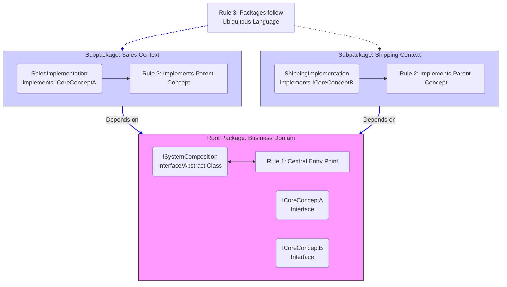
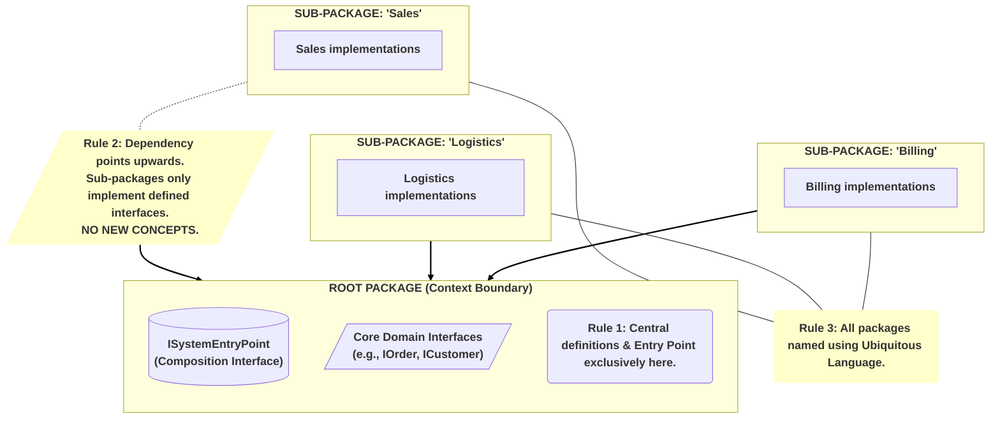

    
Summary of Rules
Rule 1: The Root Foundation The Root Package holds the System Entry Point (Composition Interface) and all core abstract domain concepts. It defines the "what".

Rule 2: Strict Implementation Dependency Sub-packages depend on the Root. They only contain implementations of interfaces defined above. They never introduce new interfaces or concepts.

Rule 3: Ubiquitous Language Naming Package names and structures strictly follow business terminology, ensuring shared understanding between stakeholders and developers.
