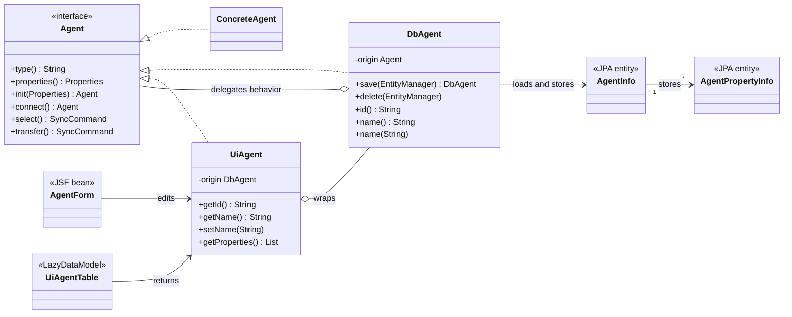

# Application Developer Guide

This guide describes the architecture, naming conventions, persistence model, JSF integration, testing, and deployment of the application.

For the business overview, see [README.md](README.md).

## Quick Start

### Build

```bash
mvn clean install -DskipTests
```

The generated WAR file is located in the application module's `target/` directory.

### Deploy to WildFly

Copy the WAR file to:

```text
${WILDFLY_HOME}/standalone/deployments
```

Start WildFly:

```bash
# Windows
standalone.bat

# Linux
standalone.sh
```

### Standalone Mode

```bash
mvn package
mvn wildfly-jar:run
```

## Technology Stack

- Java
- Jakarta EE, CDI, JPA, and Jakarta Faces
- PrimeFaces
- PostgreSQL or H2
- Quartz Scheduler
- WildFly
- Docker, Azure, and Terraform

## Project Layout

The physical Maven structure is independent of the business-oriented Java package structure.

```text
{parent-project-name}
├── {module-name}-app
├── {module-name}-lib
├── pom.xml
└── README.md
```

### Application Modules

The application module follows the standard Maven web layout:

```text
{module-name}-app/
├── src/
│   ├── main/
│   │   ├── java/
│   │   ├── resources/
│   │   │   ├── META-INF/
│   │   │   │   └── persistence.xml
│   │   │   └── application.properties
│   │   └── webapp/
│   │       ├── resources/
│   │       └── WEB-INF/
│   └── test/
└── pom.xml
```

- Java source files belong in `src/main/java`.
- Application resources belong in `src/main/resources`.
- XHTML pages belong in `src/main/webapp`.
- Browser resources belong in `src/main/webapp/resources`.
- Deployment descriptors belong in `src/main/webapp/WEB-INF`.

### Library Modules

**Optional:** Library `lib` modules may contain isolated integrations or infrastructure utilities:

```text
{module-name}-lib/
├── database/
├── paypal/
├── pdf/
├── sftp/
├── quartz/
└── pom.xml
```

Third-party integrations should remain compile-time isolated and should not become part of the central domain model.


## Packaging Rules

### 1. Packages never depend on sub-packages

The root package contains the most abstract concepts and defines the ubiquitous language.

```text
Root
 ↑
Package
 ↑
Sub-package
```

Dependencies point toward parent packages.

### 2. Sub-packages add detail, not new concepts

Every concept must already exist in an ancestor package. The rule applies recursively.

```text
Root package = business concepts
 ↑
Package = details of root concepts
 ↑
Sub-package = further details of parent concepts
 ↑
Sub-sub-package = further details of sub concepts
```

### 3. Packages represent business concepts

Use domain language `order/`, `product/`, `payment/`, or `user/` instead of framework or pattern terminology.

Create a package only when a new business concept is discovered. Package size alone is not a reason for another package.

A circular dependency may reveal a missing concept:

```text
order
  ↕
payment
```

The missing concept may be `checkout`:

```text
order
  ↓
checkout
  ↓
payment
```

**Avoid** generic layers or groupings: `service/, repository/, controller/, dto/, entity/, mapper/, common/, shared/, util/`


## Package Responsibilities

* `root package` = domain behavior and contracts
* `storage/database/` = persistence-backed implementations
* `storage/schema/` = JPA information model
* `user/` = user-facing wrappers and JSF interaction
* `application/` =  application composition and framework orchestration
* `other packages/` = for concepts in root package
* `other nested packages/` = further detail for concepts in parent packages

Example of a possible structure:

```text
org.example.inspection/
│
├── application/
│   ├── CdiAgents.java
│   └── WebInspectionApp.java
│
├── storage/
│   ├── database/
│   │   ├── DbAgent.java
│   │   ├── DbAgentProperty.java
│   │   └── ...
│   └── schema/
│       ├── AgentInfo.java
│       └── AgentPropertyInfo.java
│
├── user/
│   └── agent/
│       ├── UiAgent.java
│       ├── UiAgentProperty.java
│       ├── UiAgentTable.java
│       ├── AgentForm.java
│       └── AgentOverviewForm.java
│
├── Agent.java
├── Agents.java
├── Inspection.java
└── InspectionApp.java

```

## Composition Root

The `application/` package composes the object graph and integrates infrastructure.

It may integrate CDI, obtain container-managed resources, configure JPA access, integrate Quartz, configure scheduling, and connect domain, storage, and user objects.

No domain, storage, user, or integration package depends on `application/`.

Composition classes are named after the objects they provide: `WebInspectionApp`, `EntityManagers`, `Schedulers`, `ExternalSystems`

**Avoid** mechanism or Job tiles as suffixes: `Producer`, `Factory`, `Provider`, `Injector`, `Assembler`, `Configurator`

## Naming Conventions

All domain models, orchestration and graphical controls are also understood as business concepts of the users, as they are an integral part of the users' vocabulary and functional requirements. Examples include:

**Domain Models (Vocabulary):**

> Interfaces are (nouns) from the ubiquitous language:

* `User` → Represents the human actor in the system
* `Customer` → Representation of the contract partner
* `Product` → Definition of a tradable good
* `Payment` → Financial transaction process

The name identifies the thing represented by the object, not a technical role or job title such as `Service`, `Manager`, `Handler` or `Repository`.

**Business Orchestration (Process):**

> Classes describe the context (prefix-based):

* `OrderedProduct`→ product in an ordered state
* `ValidCheckout` → checkout that satisfies its rules
* `AuthenticatedUser` → authenticated form of User
* `JsonOrder` →  Order represented by JSON input
* `DbFile` →  persistence-backed File
* `UiAuthor` →  user-facing Author
* `PayPalPayment` → Payment implemented for PayPal

Prefixes describe a more specific form, state, origin, or perspective of an existing concept.

**Graphical Controls (Visible Concepts):**

> Graphical Control describe visible Element (suffix-based):

* `OrderTable` → order overview and interaction
* `CustomerCard` → customer master-data presentation
* `PaymentForm` → payment editing and submission
* `CatalogDialog` → catalog displayed as a dialog
* `StructureTree` → hierarchical structure control
* `AgentDropdown` → selectable list of agents
* `MainMenu` → main application menu
* `Navigation` → navigation through application destinations

Use control suffixes only when the object actually represents a visible control or composition.  
**Do not** rename arbitrary orchestration code to `Form`, `Table`, or `Dialog`.

## Domain Model

The root package contains behavioral contracts and follows these principles:

- true encapsulation
- Tell, Don't Ask
- behavior over data
- immutability where practical
- composition over inheritance
- contract-driven design
- business-oriented naming
- no unnecessary getters or setters
- no dependency on UI or persistence frameworks

A domain contract describes behavior:

```java
public interface Agent {

    String type();

    Properties properties();

    Agent init(Properties properties);

    Agent connect() throws IOException;

    Inspection inspect();

}
```

The domain does not depend on JPA, `EntityManager`, Jakarta Faces, PrimeFaces, CDI scopes, Quartz, database schemas, or UI data binding.

## The Problem: Data Boundaries of JSF

A behavioral domain object should not expose every field required by forms and tables. JSF binds components through JavaBeans properties:

```xml
<p:inputText value="#{agent.name}" />
```

Adding `getName()`, `setName()`, time-stamps, identifiers, and editable rows to `Agent` would turn the domain contract into a data container.

Binding XHTML directly to JPA entities creates another coupling:

```text
XHTML
  ↓
JPA entity
  ↓
lazy association
  ↓
open persistence context during rendering
```

A conventional DTO approach introduces disconnected structures, data boundaries and mapping chains:

```text
AgentEntity
  ↓  mapper
AgentDto
  ↓  mapper
AgentView
```

Those [Data Boundaries are the root cause of Maintenance Problems](https://javadevguy.wordpress.com/2019/06/06/data-boundaries-are-the-root-cause-of-maintenance-problems/). 

The application instead uses **wrapper-based decoration**.

## Object Model



The perspectives to resolve and minimize the Data Boundaries are:

* `Agent` = domain behavior contract
* `AgentInfo` = stored information
* `DbAgent` = persistence-backed Agent and wrapper around the domain agent
* `UiAgent` = JSF-facing wrapper and Agent decorator
* `AgentForm` = JSF view state and interaction

## Wrapper-Based Decoration

### Pure Decorator-Pattren

A pure decorator implements the same interface as its origin and mainly changes or extends behavior:

```java
public final class LoggedAgent implements Agent {

    private final Agent origin;
    private final Logger log;
    
    public LoggedAgent(Agent origin, Logger log) {
        this.origin = origin;
        this.log = log;
    }

    @Override
    public Agent connect() throws IOException {
        log.info("connect");
        return origin.connect();
    }
}
```

### Plain Wrapper-Pattren

A plain wrapper adapts the API for another context and need not implement the origin's interface:

```java
public final class UiAgent {

    private final DbAgent origin;
    
    public UiAgent(DbAgent origin) {
        this.origin = origin;
    }
    
    public String getName() {
        return origin.name();
    }
}
```

### Wrapper Decoration

The application combines both ideas:

```java
public final class UiAgent implements Agent {

    private final DbAgent origin;

    public UiAgent(DbAgent origin) {
        this.origin = origin;
    }
    
    @Override
    public Agent connect() throws IOException {
        return origin.connect();
    }

    public String getName() {
        return origin.name();
    }

    public void setName(String name) {
        origin.name(name);
    }
}
```

`UiAgent` is a wrapper because the UI-specific API is larger than `Agent`. `UiAgent` is also a decorator because `UiAgent` preserves `Agent` and delegates domain behavior.

> Use a wrapper to add a context-specific API while preserving the domain contract through decoration.

This is not a pure GoF decorator because the public API intentionally grows. It is not a DTO wrapper because the object remains behaviorally usable as an `Agent`.

## JPA Information Model

JPA entities are persistence implementation details. They may use mutable fields, field access, protected default constructors, getters and setters, bidirectional relationships, lazy associations, and technical identifiers.

```java
@Entity
@Access(AccessType.FIELD)
public class AgentInfo implements Serializable {

    private static final long serialVersionUID = 1L;

    private String id, String stage, type, name, description;
    private Date changed, created;

    @OneToMany(mappedBy = "agentInfo")
    private List<AgentPropertyInfo> agentPropertyInfos = new ArrayList<>();

}
```

```java
@Entity
@Access(AccessType.FIELD)
public class AgentPropertyInfo implements Serializable {

    private static final long serialVersionUID = 1L;

    private String id, type, name, value, defaultValue;
    private Long sortOrder;
    private byte[] content;

    @ManyToOne(fetch = FetchType.LAZY)
    private AgentInfo agentInfo;

}
```

### Relationship Naming

Foreign-key fields use the referenced entity name in lower camel case:

```java
private ParentInfo parentInfo;
```

Collections use the referenced entity name with a plural suffix:

```java
private List<ChildInfo> childInfos;
```

`mappedBy` exactly matches the owning field:

```java
@ManyToOne(fetch = FetchType.LAZY)
private ParentInfo parentInfo;
```

```java
@OneToMany(mappedBy = "parentInfo")
private List<ChildInfo> childInfos = new ArrayList<>();
```

## Explicit Persistence

The application does not rely on cascade or `orphanRemoval` for complex graphs. Database objects explicitly persist, update, and remove every part.

* `persist` new objects
* `update` changed objects
* `remove` deleted objects
* `update` owning relationships

`DbAgent.save(EntityManager)` reconciles `AgentInfo` and `AgentPropertyInfo` explicitly.

## Database Object

`DbAgent` is a persistence-backed implementation of `Agent` and a wrapper around a concrete domain agent.

```java
public final class DbAgent implements Agent {

    private final Agent origin;

    private String id, stage, type, name, description;
    private Date changed, created;
    private final List<DbAgentProperty> properties;

    @Override
    public Agent connect() throws IOException {
        return origin.init(properties()).connect();
    }

    public String id() {
        return id;
    }

    public String name() {
        return name;
    }

    public void name(String name) {
        this.name = name;
    }
}
```

### Projection Construction

Used by overview tables:

```java
new DbAgent(
    agents.of(type),
    id,
    stage,
    type,
    name,
    description,
    changed,
    created
);
```

Only scalar values required by the table are available.

### Detail Construction

Used by editors and behavior execution:

```java
new DbAgent(
    entityManager,
    agentInfoId,
    agents
);
```

The detail constructor loads and copies the complete required graph. JSF does not later dereference lazy JPA relationships.

## UI Objects

The `user/` package contains UI wrappers, editable child wrappers, form objects, lazy table models, validation, and navigation behavior.

```text
XHTML = binds to UiAgent on getter and setter
  ↓
UiAgent = exposes JavaBeans properties delegates Agent behavior to DbAgent
  ↓
DbAgent = exposes persistence capabilities delegates domain behavior to Agent
```

JSF pages do not bind directly to JPA entities, lazy JPA associations, `EntityManager`, or internal domain state.

## Pure JPA Lazy Table

Large result sets are loaded page by page without relying on a generic table abstraction.

```text
JPA Tuple projection
    ↓
DbAgent with scalar fields
    ↓
UiAgent with getter and setter
    ↓
LazyDataModel<UiAgent>
    ↓
JSF DataTable
```

The following class performs count, filtering, sorting, pagination, tuple selection, and tuple mapping directly:

```java
public final class UiAgentTable extends LazyDataModel<UiAgent> {

    private static final long serialVersionUID = 1L;

    private final EntityManager entityManager;
    private final Agents agents;

    public UiAgentTable(EntityManager entityManager, Agents agents) {
        this.entityManager = entityManager;
        this.agents = agents;
    }

    @Override
    public String getRowKey(UiAgent agent) {
        return agent.getId();
    }
    
    @Override
    public int count( Map<String, FilterMeta> filterBy) {
    
        CriteriaBuilder builder = entityManager.getCriteriaBuilder();

        CriteriaQuery<Long> criteria = builder.createQuery(Long.class);

        Root<AgentInfo> root = criteria.from(AgentInfo.class);

        criteria.select(builder.count(root));
        
        criteria.where(filters(builder, root, filterBy));

        return entityManager.createQuery(criteria).getSingleResult().intValue();
    }

    @Override
    public List<UiAgent> load(int first, int pageSize,
        Map<String, SortMeta> sortBy,Map<String, FilterMeta> filterBy) {
        
        CriteriaBuilder builder = entityManager.getCriteriaBuilder();

        CriteriaQuery<Tuple> criteria = builder.createTupleQuery();

        Root<AgentInfo> root = criteria.from(AgentInfo.class);

        criteria.multiselect(
            root.get("id").alias("id"),
            root.get("stage").alias("stage"),
            root.get("type").alias("type"),
            root.get("name").alias("name"),
            root.get("description").alias("description"),
            root.get("changed").alias("changed"),
            root.get("created").alias("created")
        );

        criteria.where(filters(builder, root, filterBy));

        List<Order> orders = orders(builder, root, sortBy);

        criteria.orderBy(orders);

        TypedQuery<Tuple> query = entityManager.createQuery(criteria);

        query.setFirstResult(first);
        query.setMaxResults(pageSize);

        List<UiAgent> result = new ArrayList<>();

        for (Tuple tuple : query.getResultList()) {
        
            String type = tuple.get("type", String.class);

            DbAgent dbAgent = new DbAgent(
                agents.of(type),
                tuple.get("id", String.class),
                tuple.get("stage", String.class),
                type,
                tuple.get("name", String.class),
                tuple.get("description", String.class),
                tuple.get("changed", Date.class),
                tuple.get("created", Date.class)
            );

            result.add(new UiAgent(dbAgent));
        }

        return result;
    }

    private Predicate filters(CriteriaBuilder builder, Root<AgentInfo> root,
        Map<String, FilterMeta> filterBy) {
        
        Predicate condition = builder.conjunction();

        for (FilterMeta filter : filterBy.values()) {
            Object filterValue = filter.getFilterValue();

            if (filterValue == null) {
                continue;
            }

            String value = filterValue.toString().trim().toLowerCase();

            if (value.isEmpty()) {
                continue;
            }

            Path<String> path = switch (filter.getField()) {
                case "stage" -> root.get("stage");
                case "type" -> root.get("type");
                case "name" -> root.get("name");
                case "description" -> root.get("description");
                default -> null;
            };

            if (path != null) {
                condition = builder.and(
                    condition,
                    builder.like(builder.lower(path), "%" + value + "%")
                );
            }
        }

        return condition;
    }

    private List<Order> orders(CriteriaBuilder builder,Root<AgentInfo> root,
        Map<String, SortMeta> sortBy) {
        
        List<SortMeta> sorts = new ArrayList<>(sortBy.values());
        sorts.sort(Comparator.comparing(SortMeta::getPriority));

        List<Order> result = new ArrayList<>();

        for (SortMeta sort : sorts) {
        
            Path<?> path = switch (sort.getField()) {
                case "stage" -> root.get("stage");
                case "type" -> root.get("type");
                case "name" -> root.get("name");
                case "description" -> root.get("description");
                case "changed" -> root.get("changed");
                case "created" -> root.get("created");
                default -> null;
            };

            if (path == null) {
                continue;
            }

            if (sort.getOrder() == SortOrder.ASCENDING) {
                result.add(builder.asc(path));
            } else if (sort.getOrder() == SortOrder.DESCENDING) {
                result.add(builder.desc(path));
            }
        }

        return result;
    }

}
```

The overview does not load `AgentPropertyInfo` and does not expose JPA entities to JSF.

## Detail Loading

A detail page loads the required graph at the persistence boundary:

```text
AgentInfo - LEFT JOIN FETCH AgentPropertyInfo
   ↓
DbAgent - copies complete state
   ↓
UiAgent - mutate state
   ↓
AgentForm - detail form
```

```java
public DbAgent(EntityManager entityManager, String agentInfoId, Agents agents) {

    AgentInfo info = entityManager.createQuery(
        """
        select distinct agentInfo
          from AgentInfo agentInfo
          left join fetch agentInfo.agentPropertyInfos
         where agentInfo.id = :id
        """,
        AgentInfo.class
    ).setParameter("id", agentInfoId).getSingleResult();

    origin = agents.of(info.getType());
    id = info.getId();
    type = info.getType();
    name = info.getName();
    description = info.getDescription();
    properties = new ArrayList<>();

    for (AgentPropertyInfo propertyInfo: info.getAgentPropertyInfos()) {
        properties.add(new DbAgentProperty(propertyInfo));
    }
}
```

After construction, rendering does not require an open persistence context.

## JSF Form

```java
@Named
@ViewScoped
public class AgentForm implements Serializable {

    private static final long serialVersionUID = 1L;

    @PersistenceContext(unitName = "application-jta")
    private transient EntityManager entityManager;

    @Inject
    private transient Agents agents;

    private String id;
    private transient UiAgent agent;

    @Transactional
    public UiAgent getAgent() {
        if (agent == null) {
            agent = new UiAgent(
                new DbAgent(entityManager, id, agents)
            );
        }
        return agent;
    }

    @Transactional
    public String save() {
    
        agent.save(entityManager);

        return "agent-detail.xhtml?faces-redirect=true&id=" + agent.getId();
    }
}
```

Wrappers do not need default constructors. They always wrap a valid origin.

## PrimeFaces Validation

Simple input rules belong to XHTML:

```xml
<p:inputText id="name" value="#{agent.name}" required="true" requiredMessage="Name is required">

    <f:validateLength minimum="3" maximum="120" />
  
</p:inputText>

<p:message for="name" />
```

Cross-field validation belongs to the form:

```java
public boolean valid(UiAgentConfig config) {

    if (config.getSourceAgentInfoId().equals(config.getTargetAgentInfoId())) {
    
        FacesContext context = FacesContext.getCurrentInstance();

        context.validationFailed();
        context.addMessage(
        	  null,
            new FacesMessage(
                FacesMessage.SEVERITY_ERROR,
                "Source and target agent must differ.", null
            )
        );

        return false;
    }

    return true;
}
```

Validation remains separated:

* **Domain** = validates business behavior
* **UI and JSF** = validate input and form consistency
* **Database** = enforces persistence constraints

## Serialization and Default Constructors

Default construction and serialization are independent concerns.

### JPA Entities

JPA entities require a public or protected no-argument constructor:

```java
protected AgentInfo() {
    // Required by JPA.
}
```

### CDI-Managed JSF Beans

`@ViewScoped` beans are created by CDI and must be passivation-capable:

```java
@Named
@ViewScoped
public class AgentForm implements Serializable {

}
```

### Wrapper Objects

`DbAgent`, `UiAgent`, and `UiAgentProperty` do not need default constructors.

Wrappers need `Serializable` only when intentionally stored as non-transient fields in a passivating scope. A pragmatic alternative is:

```java
private String id;
private transient UiAgent agent;
```

The wrapper is reconstructed from the identifier when required.

## Transactions

The application uses container-managed JTA transactions.  
**Do not** call, within the managed Bean context: `entityManager.getTransaction();` for a JTA persistence unit.

Transaction boundaries protect short, consistent operations:

- storing configuration
- updating stored information
- deleting stored information
- recording results and logs
- reconciling an edited graph

**Do not** wrap long-running external synchronization in one database transaction.

## Testing

Integration tests verify:

- JPA metadata and relationships
- projection tuple mapping
- sorting, filtering, counting, and pagination
- explicit child persistence
- explicit child removal
- detail graph loading
- behavior delegation through wrappers
- JSF form validation rules where practical

RESOURCE_LOCAL integration tests may override a JTA persistence unit for standalone execution:

```java
Map<Object, Object> overrides = Map.of(
    "jakarta.persistence.transactionType", "RESOURCE_LOCAL",
    "jakarta.persistence.schema-generation.database.action", "create-drop"
);
```

## Benefits

- The domain remains behavior-oriented.
- JSF receives the properties required for binding.
- JPA entities remain implementation details.
- Wrappers preserve the domain contract while adding context-specific APIs.
- Tuple projections avoid complete entity loading for tables.
- Detail pages materialize the required graph once.
- Rendering does not trigger lazy loading.
- No DTO-to-domain-to-view conversion chain is required.
- Persistence changes are explicit and testable.

## Drawbacks

### More Objects

```text
Agent
  ↑
DbAgent
  ↑
UiAgent
```

The model increases the number of objects and the conceptual load.

### Additional Indirection

```text
XHTML
  ↓
UiAgent
  ↓
DbAgent
  ↓
Agent
```

The boundaries improve separation but require additional navigation.

### Explicit Persistence Work

Without cascade and `orphanRemoval`, graph reconciliation requires explicit code and integration tests.

### Multiple Lifecycles

* **Table** = projection-backed DbAgent
* **Editor** = fully loaded DbAgent
* **Behavior execution** = configured Agent

The use case must select the correct construction mode.

### Wrapper Contract Discipline

A projection-backed `DbAgent` must not execute behavior that requires unloaded properties. The operation must load the required state or reconstruct a full `DbAgent` by identifier.

### View State Management

A complete wrapper graph in a passivating JSF scope may enlarge view state and require serialization. Keeping identifiers and reconstructing transient wrappers avoids this at the cost of additional loading.

### Suitability

For a small data-only application, direct entity binding is simpler. Wrapper-based decoration becomes valuable when behavior, integrations, multiple representations, or framework independence matter.

## Summary


* **Pure Decorator** = preserves the interface and mainly changes behavior
* **Plain Wrapper** = adapts the API for another context
* **Wrapper-Based Decoration** = preserves the domain interface and intentionally adds a context-specific API


* `Agent` = domain behavior contract
* `AgentInfo` = stored information
* `DbAgent` = persistence-backed Agent and domain wrapper
* `UiAgent` = JSF-facing wrapper and Agent decorator


* `XHTML` = binds to UiAgent
* `UiAgent` = exposes JSF properties delegates Agent behavior to DbAgent
* `DbAgent` = exposes persistence capabilities delegates business behavior to Agent
* `AgentInfo` = stores the persistence state used by DbAgent

This approach preserves behavioral OOP while satisfying the practical requirements of JPA, PrimeFaces, and Jakarta Faces.
