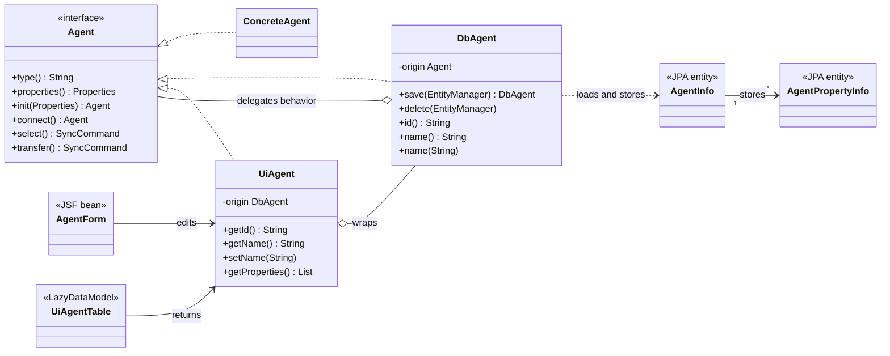

# Application Developer Guide

This guide describes the architecture, naming conventions, persistence model, JSF integration, testing, and deployment of the application.

For the business overview, see [README.md](README.md).

## Quick Start

### Build

```bash
mvn clean install -DskipTests
```

The generated WAR file is located in the application module's `target/` directory.

### Deploy to WildFly

Copy the WAR file to:

```text
${WILDFLY_HOME}/standalone/deployments
```

Start WildFly:

```bash
# Windows
standalone.bat

# Linux
standalone.sh
```

### Standalone Mode

```bash
mvn package
mvn wildfly-jar:run
```

## Technology Stack

- Java
- Jakarta EE, CDI, JPA, and Jakarta Faces
- PrimeFaces
- PostgreSQL or H2
- Quartz Scheduler
- WildFly
- Docker, Azure, and Terraform

## Project Layout

The physical Maven structure is independent of the business-oriented Java package structure.

```text
{app-name}
├── {app-name}-app
├── {app-name}-lib
│   ├── {lib-name-x}
│   ├── {lib-name-y}
│   └── pom.xml
├── pom.xml
└── README.md
```

### Application Module

The application module follows the standard Maven web layout:

```text
{app-name}-app/
├── src/
│   ├── main/
│   │   ├── java/
│   │   ├── resources/
│   │   │   ├── META-INF/
│   │   │   │   └── persistence.xml
│   │   │   └── application.properties
│   │   └── webapp/
│   │       ├── resources/
│   │       └── WEB-INF/
│   └── test/
└── pom.xml
```

- Java source files belong in `src/main/java`.
- Application resources belong in `src/main/resources`.
- XHTML pages belong in `src/main/webapp`.
- Browser resources belong in `src/main/webapp/resources`.
- Deployment descriptors belong in `src/main/webapp/WEB-INF`.

### Library Modules

**Optional:** Third-party libraries and infrastructure tools can be moved out of the main `...-app` project entirely. They live in dedicated, compile-time isolated sub-projects integrated as flat dependencies.

```text
{app-name}-lib/
├── database/
├── paypal/
├── pdf/
├── sftp/
├── quartz/
└── pom.xml
```

The classes in these technical projects **only common functionality** and can then be used in the business packages of main `...-app` project. For example, if we are using ORMs like JPA, isolate them in a separate project storage and then use JPA Entity classes in the business package `storage/` behind a class like `DbAgent.java`, which is designed as a Decorator, Wrapper, Bridge or Adapter pattern.


## Object-Oriented JSF

Traditional JavaServer Faces (JSF) applications often introduce DTOs, ViewModels, and mapper layers to bridge the gap between domain objects, persistence models, and user interfaces.

JSF binds components through JavaBeans properties (by getter and setter):

```xml
<p:inputText value="#{agent.name}" />
```

Adding `getName()`, `setName()`, timestamps, identifiers, or editable rows to `Agent` object would transform the domain contract into a data container.

Binding the HTML-Tags in a XHTML file in JSF directly to properties of JPA entities creates another form of coupling:

```text
XHTML
  ↓
JPA entity
  ↓
lazy association
  ↓
open persistence context during rendering
```

A conventional DTO approach introduces disconnected structures, data boundaries and mapping chains:

`AgentEntity` ↔ EntityToDtoMapper ↔ `AgentDto` ↔ DtoToViewMapper ↔ `AgentView`

This transfer of data across layer boundaries introduces unnecessary code and causes the original domain abstraction to fragment. Each layer transforms the same information for its own purpose, resulting in rigid and [maintenance-intensive systems](https://javadevguy.wordpress.com/2019/06/06/data-boundaries-are-the-root-cause-of-maintenance-problems/).

**Problem:**

* Object encapsulation is weakened by getters and setters
* Objects become data holders without behavior or responsibility
* Multiple transformations are required between objects and packages
* Business logic becomes scattered across Service and Controller layers
* Technical package names dominate the structure (`controller/`, `service/`, `domain/`, `repository/`)
* Object names describe architectural patterns rather than business concepts

A behavioral domain object should not expose every field required by UI forms or tables of a Database.

**Solution:**

This application follows an object-oriented approach based on wrapper decoration.

```text
user/
- UiUser.java (Data + Logic + UI)
    ↓
storage/
- DbUser.java (Data + Logic + DB)
    ↓
User.java (Interface)

```
**Benefits:**  
* True encapsulation
* No transformations needed
* No unnecessary getters or setters
* No dependency on UI or persistence frameworks
* Logic where it belongs, within the object's implementation
* Contract-driven design
* Behavior over data (Tell, Don't Ask)
* One object, one responsibility
* Immutability where practical
* Composition over inheritance
* Business-oriented class (User.java) and package (user/) naming

The structural perspectives used to minimize data boundaries in JSF applications are:

* `Agent` = domain behavior contract
* `AgentInfo` = stored information
* `DbAgent` = persistence-backed Agent implementation
* `UiAgent` = JSF-facing wrapper and Agent decorator
* `AgentForm` = JSF view state and interaction

## Naming Conventions

All domain models, orchestration and graphical controls are also understood as business concepts of the users, as they are an integral part of the users' vocabulary and functional requirements. Examples include:

**Domain Models (Vocabulary):**

> Interfaces are (nouns) from the ubiquitous language:

* `User` → Represents the human actor in the system
* `Customer` → Representation of the contract partner
* `Product` → Definition of a tradable good
* `Payment` → Financial transaction process

The name identifies the thing represented by the object, not a technical role or job title such as `Service`, `Manager`, `Handler` or `Repository`.

**Business Orchestration (Process):**

> Classes describe the context (prefix-based):

* `OrderedProduct`→ product in an ordered state
* `ValidCheckout` → checkout that satisfies its rules
* `AuthenticatedUser` → authenticated form of User
* `JsonOrder` →  Order represented by JSON input
* `DbFile` →  persistence-backed File
* `UiAuthor` →  user-facing Author
* `PayPalPayment` → Payment implemented for PayPal

Prefixes describe a more specific form, state, origin, or perspective of an existing concept.

**Graphical Controls (Visible Concepts):**

> Graphical Control describe visible Element (suffix-based):

* `OrderTable` → order overview and interaction
* `CustomerCard` → customer master-data presentation
* `PaymentForm` → payment editing and submission
* `CatalogDialog` → catalog displayed as a dialog
* `StructureTree` → hierarchical structure control
* `AgentDropdown` → selectable list of agents
* `MainMenu` → main application menu
* `Navigation` → navigation through application destinations

Use control suffixes only when the object actually represents a visible control or composition.  
**Do not** rename arbitrary orchestration code to `Form`, `Table`, or `Dialog`.

## Packaging Rules

### 1. Packages never depend on sub-packages

The root package contains the most abstract concepts and defines the ubiquitous language.

```text
Root
 ↑
Package
 ↑
Sub-package
```

**Dependencies point toward parent packages.**

It is allow to use sub-packages within other packages, as long as they are not at the same hierarchy level.

### 2. Sub-packages add detail, not new concepts

Every concept must already exist in an ancestor package. The rule applies recursively.

```text
Root package = business concepts
 ↑
Package = details of root concepts
 ↑
Sub-package = further details of parent concepts
 ↑
Sub-sub-package = further details of sub concepts
```

### 3. Packages represent business concepts

Use domain language `order/`, `product/`, `payment/`, or `user/` instead of framework or pattern terminology.  
**Avoid** generic layers or groupings: `service/, repository/, controller/, dto/, entity/, mapper/, common/, shared/, util/`

In general, create a package only when a new business concept is discovered. Package size alone is not a reason for another package.

**Resolve Circular Dependency**

For example a circular dependency between `order/` ↔ `payment/` packages mostly reveal a missing concept.  
The missing concept in this case is may be **Checkout**.  
The circular dependency can now be resolve like: `order/` → `checkout/` ← `payment/`.

### Package Responsibilities

* `root package` = domain behavior and contracts
* `storage/database/` = persistence-backed domain objects
* `storage/schema/` = JPA information model
* `user/` = user-facing wrappers and JSF interaction
* `application/` =  application composition and framework orchestration
* `other packages/` = for concepts in root package
* `other nested packages/` = further detail for concepts in parent packages

Example of a possible structure:

```text
org.example.inspection/
│
├── application/
│   ├── CdiAgents.java
│   └── CtxAgentApplication.java
│
├── storage/
│   ├── database/
│   │   ├── DbAgent.java
│   │   ├── DbAgentProperty.java
│   │   └── ...
│   └── schema/
│       ├── AgentInfo.java
│       └── AgentPropertyInfo.java
│
├── user/
│   └── agent/
│       ├── UiAgent.java
│       ├── UiAgentProperty.java
│       ├── UiAgentTable.java
│       ├── AgentForm.java
│       └── AgentOverviewForm.java
│
├── Agent.java
├── Agents.java
└── AgentApplication.java

```
#### Data Operation

The `storage/` package as archive contains data scheme information and provide operation to a database.

#### User Interaction

The `user/` package is the place where the business data becomes visible to the humans. It contains presentation concepts such: UI components, visual layout elements and provide UI controls for user interactions.

#### Composition Root

The `application/` package composes the object graph and integrates infrastructure.  
**No domain package, storage, user, or integration package depends on `application/`**

It may integrate CDI (Context Dependency Injection), `@WebListener` annotated on classes implements `jakarta.servlet.ServletContextListener` or `@WebFilter` (`jakarta.servlet.Filter`), obtain container-managed resources, configure JPA access, integrate Quartz, configure scheduling, and connect domain, storage, and user objects.

* The **Root Composition class** it named after the main application it provides: `CtxAgentApplication` implements `ServletContextListener`  
* The **CDI Producer classes** are named after the objects they provide `CdiEntityManager`, or `CdiQuartzScheduler`

**Avoid** mechanism or job tiles as name suffixes: `...Producer`, `...Factory`, `...Provider`, `...Injector`, `..Assembler`, `...Configurator`


## Wrapper Decoration

### Decorator Pattern

A pure decorator implements the same interface as its origin and mainly changes or extends behavior:

```java
public final class LoggedAgent implements Agent {

    private final Agent origin;
    private final Logger log;
    
    public LoggedAgent(Agent origin, Logger log) {
        this.origin = origin; this.log = log;
    }

    @Override
    public Agent connect() throws IOException {
        log.info("connect");
        return origin.connect();
    }
}
```

### Wrapper Pattern

A plain wrapper adapts the API for another context and need not implement the origin's interface:

```java
public final class UiAgent {

    private final DbAgent origin;
    
    public UiAgent(DbAgent origin) {
        this.origin = origin;
    }
    
    public String getName() {
        return origin.name();
    }
}
```

### Wrapper Decorator

The application combines both ideas:

```java
public final class UiAgent implements Agent {

    private final DbAgent origin;

    public UiAgent(DbAgent origin) {
        this.origin = origin;
    }
    
    @Override
    public Agent connect() throws IOException {
        return origin.connect();
    }

    public String getName() {
        return origin.name();
    }

    public void setName(String name) {
        origin.name(name);
    }
}
```

`UiAgent` is a wrapper because the UI-specific API is larger than `Agent`. `UiAgent` is also a decorator because `UiAgent` preserves `Agent` and delegates domain behavior.

> Use a wrapper to add a context-specific API while preserving the domain contract through decoration.

This is not a pure GoF decorator because the public API intentionally grows. It is not a DTO wrapper because the object remains behaviorally usable as an `Agent`.

## Domain Model

A domain contract (interface) describes behavior:

```java
public interface Agent {

    String type();

    Properties properties();

    Agent init(Properties properties);

    Agent connect() throws IOException;

    // ...

}
```

## Domain Objects

Domain Objects are implementation of contracts (interfaces).

```java
public final class SimpleAgent implements Agent {

    private final String type;
    private final Properties properties;
    
    public SimpleAgent(String type, Properties properties, ...) {
        this.type = type; this.properties = properties;
    }

    @Override
    public Agent connect() throws IOException {
        return origin.connect();
    }
    
    //...
}
```

The domain does not depend on JPA, `EntityManager`, Jakarta Faces, PrimeFaces, CDI scopes, Quartz, database schemas, or UI data binding.

## Persistence Model

JPA entities are persistence implementation details. They may use mutable fields, field access, protected default constructors, getters and setters, bidirectional relationships, lazy associations, and technical identifiers.

```java
@Entity
@Access(AccessType.FIELD)
public class AgentInfo implements Serializable {

    private static final long serialVersionUID = 1L;

    private String id, String stage, type, name, description;
    private Date changed, created;

    @OneToMany(mappedBy = "agentInfo")
    private List<AgentPropertyInfo> agentPropertyInfos = new ArrayList<>();

}
```

```java
@Entity
@Access(AccessType.FIELD)
public class AgentPropertyInfo implements Serializable {

    private static final long serialVersionUID = 1L;

    private String id, type, name, value, defaultValue;
    private Long sortOrder;
    private byte[] content;

    @ManyToOne(fetch = FetchType.LAZY)
    private AgentInfo agentInfo;

}
```

### Relationship Naming

Foreign-key fields use the referenced entity name in lower **camel case**:

```java
private ParentInfo parentInfo;
```

Collections use the referenced entity name with a **plural suffix**:

```java
private List<ChildInfo> childInfos;
```

`mappedBy` exactly matches the owning field:

```java
@ManyToOne(fetch = FetchType.LAZY)
private ParentInfo parentInfo;
```

```java
@OneToMany(mappedBy = "parentInfo")
private List<ChildInfo> childInfos = new ArrayList<>();
```

## Database Object

`DbAgent` is a complete persistence-backed implementation of `Agent`. `DbAgent` wraps a concrete `Agent`, owns all state required for domain behavior, and persists that state only when explicitly told to do so.

```java
public final class DbAgent implements Agent {

    private final Agent origin;
    private final String id, stage, type, name, description;
    private final Date changed, created;
    private final List<DbAgentProperty> properties;

    public DbAgent(Agent origin, String id, String stage, String type, String name, 
        String description, Date changed, Date created, List<DbAgentProperty> properties) {
        this.origin = origin; this.id = id; this.stage = stage;
        this.type = type; this.name = name; this.description = description;
        this.changed = changed; this.created = created;
        this.properties = List.copyOf(properties);
    }

    @Override
    public Properties properties() {
        Properties result = new Properties();
        for (DbAgentProperty property : this.properties) {
            result.put(property.name(), property.value() == null ? "": property.value());
        }
        return result;
    }

    @Override
    public Agent connect() throws IOException {
        return this.origin.init(this.properties()).connect();
    }

    public void storeTo(EntityManager entityManager) {
        // Explicitly reconcile AgentInfo and AgentPropertyInfo.
    }
}
```

A `DbAgent` is never partially functional. Every constructor receives all information required by `properties()`, `connect()`..., and other `Agent` behavior.

### Construction from a Table Projection

The overview first loads the paged scalar projection, then loads the properties for all IDs on that page in one additional query. The grouped properties are passed into the constructor.

```text
paged Agent tuples + properties for all page IDs
        ↓
complete DbAgent
        ↓
UiAgent
```

This avoids both incomplete agents and one property query per row.

```java
List<Tuple> rows = this.agentRows(first, pageSize, sortBy, filterBy);

List<String> ids = new ArrayList<>();

for (Tuple row : rows) {
    ids.add(row.get("id", String.class));
}

Map<String, List<DbAgentProperty>> propertiesByAgent = this.propertiesByAgent(ids);

List<UiAgent> result = new ArrayList<>();

for (Tuple row : rows) {

    String id = row.get("id", String.class);
    String type = row.get("type", String.class);

    DbAgent dbAgent = new DbAgent(
        this.agents.of(type),
        id,
        row.get("stage", String.class),
        type,
        row.get("name", String.class),
        row.get("description", String.class),
        row.get("changed", Date.class),
        row.get("created", Date.class),
        propertiesByAgent.getOrDefault(id, List.of())
    );

    result.add(new UiAgent(dbAgent));
}

return result;
```

The property query loads the complete page in one operation:

```java
private Map<String, List<DbAgentProperty>> propertiesByAgent(List<String> agentInfoIds) {
    List<AgentPropertyInfo> stored =
        entityManager.createQuery(
            """
            select propertyInfo
             from AgentPropertyInfo propertyInfo
             where propertyInfo.agentInfo.id in :agentInfoIds
             order by propertyInfo.agentInfo.id,
                      propertyInfo.sortOrder
            """,
            AgentPropertyInfo.class
        ).setParameter("agentInfoIds", agentInfoIds).getResultList();

    Map<String, List<DbAgentProperty>> result = new HashMap<>();

    for (AgentPropertyInfo propertyInfo : stored) {
    
        String agentInfoId = propertyInfo.getAgentInfo().getId();

        result.computeIfAbsent(
            agentInfoId, ignored -> new ArrayList<>()).add(new DbAgentProperty(propertyInfo)
        );
    }

    return result;
}
```

### Construction for a Detail Form

The detail query loads the same complete state with a fetch join and passes copied values into the same constructor.

```java
public DbAgent agent(EntityManager entityManager, String agentInfoId, Agents agents) {
    AgentInfo info = entityManager.createQuery(
        """
        select distinct agentInfo
          from AgentInfo agentInfo
          left join fetch agentInfo.agentPropertyInfos
         where agentInfo.id = :id
        """,
        AgentInfo.class
    ).setParameter("id", agentInfoId).getSingleResult();

    List<DbAgentProperty> properties = new ArrayList<>();

    for (AgentPropertyInfo propertyInfo : info.getAgentPropertyInfos()) {
        properties.add(new DbAgentProperty(propertyInfo));
    }

    return new DbAgent(
        agents.of(info.getType()),
        info.getId(),
        info.getStage(),
        info.getType(),
        info.getName(),
        info.getDescription(),
        info.getChanged(),
        info.getCreated(),
        properties
    );
}
```

Overview and detail construction differ only in how the complete values are obtained. The resulting `DbAgent` has the same behavioral guarantees in both cases.

## Explicit Persistence

The application does not rely on cascade or `orphanRemoval` for complex graphs. Database objects explicitly persist, update, and remove every part.

* `persist` new objects
* `update` changed objects
* `remove` deleted objects
* `update` owning relationships

`DbAgent.storeTo(EntityManager)` reconciles `AgentInfo` and `AgentPropertyInfo` explicitly.

## UI Objects

```text
XHTML = binds to UiAgent

UiAgent = exposes JavaBeans properties delegates Agent behavior to DbAgent

DbAgent = owns complete behavior-relevant state
    delegates domain behavior to Agent
    persists explicitly through storeTo(EntityManager)
```

JSF pages do not bind directly to JPA entities, lazy associations, `EntityManager`, or internal domain state.

## Pure JPA Lazy Table

```text
paged JPA Tuple projection
        +
batched property query
        ↓
complete DbAgent
        ↓
UiAgent
        ↓
LazyDataModel<UiAgent>
```

The table performs count, filtering, sorting, and pagination for the scalar rows. A second query retrieves the properties for every agent on the current page. No `DbAgent` is created without behavior-relevant properties.

```java
public final class UiAgentTable extends LazyDataModel<UiAgent> {

    private static final long serialVersionUID = 1L;

    private final EntityManager entityManager;
    private final Agents agents;

    public UiAgentTable(EntityManager entityManager, Agents agents) {
        this.entityManager = entityManager; this.agents = agents;
    }

    @Override
    public int count(Map<String, FilterMeta> filterBy) {
    
        CriteriaBuilder builder = entityManager.getCriteriaBuilder();

        CriteriaQuery<Long> criteria = builder.createQuery(Long.class);

        Root<AgentInfo> root = criteria.from(AgentInfo.class);

        criteria.select(builder.count(root));
        
        criteria.where(filters(builder, root, filterBy));

        return entityManager.createQuery(criteria).getSingleResult().intValue();
    }

    @Override
    public List<UiAgent> load(int first, int pageSize, Map<String, SortMeta> sortBy, Map<String, FilterMeta> filterBy) {
    
        List<Tuple> rows = this.agentRows(first, pageSize, sortBy, filterBy);

        List<String> ids = new ArrayList<>();

        for (Tuple row : rows) {
            ids.add(row.get("id", String.class));
        }

        Map<String, List<DbAgentProperty>> propertiesByAgent = propertiesByAgent(ids);

        List<UiAgent> result = new ArrayList<>();

        for (Tuple row : rows) {
            String id = row.get("id", String.class);
            String type = row.get("type", String.class);

            result.add(
                new UiAgent(
                    new DbAgent(
                        this.agents.of(type),
                        id,
                        row.get("stage", String.class),
                        type,
                        row.get("name", String.class),
                        row.get("description", String.class),
                        row.get("changed", Date.class),
                        row.get("created", Date.class),
                        propertiesByAgent.getOrDefault(id,List.of())
                    )
                )
            );
        }

        return result;
    }

    @Override
    public String getRowKey(UiAgent agent) {
        return agent.getId();
    }

    // agentRows(...), propertiesByAgent(...),
    // filters(...), and orders(...) use plain JPA.
}
```

The table performs two bounded database queries for the current page instead of producing partially functional objects or an N+1 query sequence.

## Detail Loading

```text
AgentInfo + AgentPropertyInfo
        ↓ copied into constructor values
complete DbAgent
        ↓
UiAgent
        ↓
AgentForm
```

After construction, rendering and domain behavior do not require an open persistence context.

## JSF Beans

JFS beans are mediator between XHTML file and UI-Objects:

```java
@Named
@ViewScoped
public class AgentForm implements Serializable {

    private static final long serialVersionUID = 1L;

    @PersistenceContext(unitName = "application-jta")
    private transient EntityManager entityManager;

    @Inject
    private transient Agents agents;

    private transient UiAgent agent;
    
    private String id;

    @Transactional
    public UiAgent getAgent() {
        if (agent == null) {
            agent = new UiAgent(
                new DbAgent(entityManager, id, agents)
            );
        }
        return agent;
    }

    @Transactional
    public String save() {
        agent.storeTo(entityManager);
        return "agent-detail.xhtml?faces-redirect=true&id=" + agent.getId();
    }
}
```

Wrappers do not need default constructors. They always wrap a valid origin.

## JSF Validation

Simple input rules belong to XHTML:

```xml
<p:inputText id="name" value="#{agent.name}" required="true" requiredMessage="Name is required">

    <f:validateLength minimum="3" maximum="120" />
  
</p:inputText>

<p:message for="name" />
```

Cross-field validation belongs to the form:

```java
public boolean valid(UiAgentConfig config) {

    if (config.getSourceAgentInfoId().equals(config.getTargetAgentInfoId())) {
    
        FacesContext context = FacesContext.getCurrentInstance();

        context.validationFailed();
        context.addMessage(null,
            new FacesMessage(
                FacesMessage.SEVERITY_ERROR,
                "Source and target agent must differ.", null
            )
        );

        return false;
    }

    return true;
}
```

Validation remains separated:

* **Domain** = validates business behavior
* **UI and JSF** = validate input and form consistency
* **Database** = enforces persistence constraints

## Serialization and Default Constructors

Default construction and serialization are independent concerns.

### JPA Entities

JPA entities require a public or protected no-argument constructor:

```java
protected AgentInfo() {
    // Required by JPA.
}
```

### CDI-Managed JSF Beans

`@ViewScoped` beans are created by CDI and must be passivation-capable:

```java
@Named
@ViewScoped
public class AgentForm implements Serializable {

}
```

### Wrapper Objects

`DbAgent`, `UiAgent`, and `UiAgentProperty` do not need default constructors.

Wrappers need `Serializable` only when intentionally stored as non-`transient` fields in a passivating scope. A pragmatic alternative is:

```java
private String id;
private transient UiAgent agent;
```

The wrapper is reconstructed from the identifier when required.

## Transactions

The application uses container-managed JTA transactions.  
**Do not** call, within the managed Bean context: `entityManager.getTransaction();` for a JTA persistence unit.

Transaction boundaries protect short, consistent operations:

- storing configuration
- updating stored information
- deleting stored information
- recording results and logs
- reconciling an edited graph

**Do not** wrap long-running external synchronization in one database transaction.

## Testing

Integration tests verify:

- JPA metadata and relationships
- projection tuple mapping
- sorting, filtering, counting, and pagination
- explicit child persistence
- explicit child removal
- detail graph loading
- behavior delegation through wrappers
- JSF form validation rules where practical

Integration tests may override the transaction type `JTA` persistence unit to  `RESOURCE_LOCAL` for standalone execution:

```java
Map<Object, Object> overrides = Map.of(
    "jakarta.persistence.transactionType", "RESOURCE_LOCAL",
    "jakarta.persistence.schema-generation.database.action", "create-drop"
);
```

## Benefits

- The domain remains behavior-oriented.
- JSF receives the properties required for binding.
- JPA entities remain implementation details.
- Wrappers preserve the domain contract while adding context-specific APIs.
- Tuple projections avoid loading complete JPA entity graphs while batched properties keep every `DbAgent` behaviorally complete.
- Overview and detail paths both construct behaviorally complete `DbAgent` objects.
- Rendering does not trigger lazy loading.
- No DTO-to-domain-to-view conversion chain is required.
- Persistence changes are explicit and testable.

## Drawbacks

**More Objects:** `Agent` <- `DbAgent` <- `UiAgent`  
The model increases the number of objects and the conceptual load.

**Additional Indirection:** `XHTML` -> `UiAgent` -> `DbAgent` -> `Agent`  
The boundaries improve separation but require additional navigation.

**Explicit Persistence**  
Without cascade and `orphanRemoval`, graph reconciliation requires explicit code and integration tests.

**Complete Construction Cost**  
Every `DbAgent` receives all state required for behavior. Overview pages therefore execute one paged scalar query and one batched property query. This deliberately exchanges a smaller projection object for a uniform behavioral contract.

**Query Coordination**  
Overview loading must keep scalar rows and batched properties consistent and grouped by identifier. Integration tests must verify agents with no properties, multiple properties, sorting, filtering, and page boundaries.

**View State Management**
A complete wrapper graph in a passivating JSF scope may enlarge view state and require serialization. Keeping identifiers and reconstructing transient wrappers avoids this at the cost of additional loading.

**Suitability**
For a small data-only application, direct entity binding is simpler. Wrapper-based decoration becomes valuable when behavior, integrations, multiple representations, or framework independence matter.

## Summary

* **Pure Decorator** = preserves the interface and mainly changes behavior
* **Plain Wrapper** = adapts the API for another context
* **Wrapper-Based Decoration** = preserves the domain interface and intentionally adds a context-specific API  

* `Agent` = domain behavior contract
* `AgentInfo` = stored information
* `DbAgent` = persistence-backed Agent and domain wrapper
* `UiAgent` = JSF-facing wrapper and Agent decorator  

* `XHTML` = binds to UiAgent
* `UiAgent` = exposes JSF properties delegates Agent behavior to DbAgent
* `DbAgent` = exposes persistence capabilities delegates business behavior to Agent
* `AgentInfo` = stores the persistence state used by DbAgent

This approach preserves behavioral OOP while satisfying the practical requirements of JPA, PrimeFaces, and Jakarta Faces.

**OO-JSF Diagram Model**



