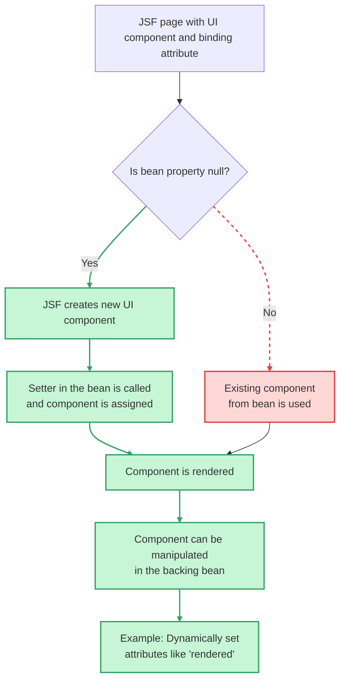

# JSF Component Binding

The binding attribute in JSF allows you to programmatically access and **manipulate UI components** from a backing bean
**by linking the component instance to a property** in the bean. When the page is rendered, if the bean property is **null**, 
JSF creates a new component instance and assigns it to the property via the setter. This is useful when you need to 
change a component's attributes, like rendered, dynamically based on application logic, as opposed to just binding the component's value.

**Key considerations**

**Scope:**
- Be mindful of the backing bean's scope. Binding a request-scoped component to a session-scoped bean can lead to errors, such as duplicate IDs if you navigate between pages.

**Necessity:**
- While powerful, component binding is often unnecessary in JSF 2.x and later. Many functional requirements can be met with alternative approaches like value binding or standard JSF/JSTL tags, which can lead to cleaner code. 

## How it works
- **Initial rendering:** When a page is built, the JSF framework processes the binding attribute. If the corresponding (getter) property in the backing bean is **null**, JSF creates an instance of the UI component (e.g., h:outputText) and sets it on the bean (setter) property.
- **Dynamic manipulation:** The bean can then use this component instance to modify its properties, such as setting the rendered attribute to true or false to show or hide elements on the page.
- **Component instance vs. value:** It's crucial to understand the difference between binding and value. Binding attaches the entire component instance to a bean property, while value attaches the component's value (the data it displays). 


**Explanation:**
- **binding attribute:** Links a UI component directly to a property in the backing bean.
- **Null check:** JSF checks if the property is null during rendering.
- **Component creation or reuse:** If null, a new instance is created and assigned. Otherwise, the existing one is used.
- **Manipulation:** The component can be accessed and modified programmatically in the bean, e.g., to dynamically control visibility or styling.

**🟢 Green Path: Desired flow**
- When the bean property is null, JSF creates the component, assigns it, renders it, and allows dynamic manipulation.

**🚫 Red Dashed Path: Forbidden/undesired path**
- If the bean property is not null, JSF uses the existing component, which might bypass the intended initialization logic.


## Example scenario
**Goal:** Hide a form element until a user clicks a button that triggers a specific action.
**Implementation:**
In your `.xhtml` file, use the binding attribute to link the component to a backing bean property:

```xml
<!DOCTYPE html>
<html xmlns="http://www.w3.org/1999/xhtml" xmlns:h="http://xmlns.jcp.org/jsf/html" xmlns:p="http://primefaces.org/ui" xmlns:f="http://xmlns.jcp.org/jsf/core">
<h:head>
    <title>JSF Component Binding</title>
</h:head>
<h:body>
    <h:form id="form">
        <!-- The component instance is bound to the bean, and the value is also bound -->
        <p:inputText id="input"
                     binding="#{bindingBean.inputText}"
                     value="#{bindingBean.userInput}"/> 
                     <br/>

        <!-- Bound commandButton component -->
        <!-- The component instance is bound to the bean -->
        <p:commandButton id="submitBtn"
                         binding="#{bindingBean.commandButton}"
                         value="Submit"/>
         
        <h:outputText id="output"
                      binding="#{bindingBean.outputText}"
                      value="You entered: #{bindingBean.userInput}" />

    </h:form>
</h:body>
</html>
```
- In your backing bean (e.g., taskFrom), have the corresponding property:
- In a method within the backing bean that is called by the button, you can now access and change the rendered property:

```java
import jakarta.faces.view.ViewScoped;
import jakarta.inject.Named;
import java.io.Serializable;

import org.primefaces.component.inputtext.InputText;
import org.primefaces.component.commandbutton.CommandButton;
import jakarta.faces.component.html.HtmlOutputText;

@Named
@ViewScoped
public class BindingBean implements Serializable {

    private InputText inputText;
    private CommandButton commandButton;
    private HtmlOutputText outputText;

    private String userInput;

    // Getters and setters for binding
    public InputText getInputText() {
        return inputText;  // 1. must be null
    }

    public void setInputText(InputText inputText) {
        this.inputText = inputText; // 2. when not null, can be animate
    }

    public CommandButton getCommandButton() {
        return commandButton; // 1. must be null
    }

    public void setCommandButton(CommandButton commandButton) {
        this.commandButton = commandButton; // 2. when not null, can be animate
    }

    public HtmlOutputText getOutputText() {
        return outputText; // 1. must be null
    }

    public void setOutputText(HtmlOutputText outputText) {
        this.outputText = outputText; // 2. when not null, can be animate
    }

    // Value binding
    public String getUserInput() {
        return userInput;
    }

    public void setUserInput(String userInput) {
        this.userInput = userInput;
    }

    // Action method
    public void submit() {
        System.out.println("Submitted: " + userInput);

        // Example: dynamically change button label
        if (commandButton != null) {
            commandButton.setValue("Submitted!");
        }

        // Example: dynamically style output text
        if (outputText != null) {
            outputText.setStyle("color: green; font-weight: bold;");
        }
    }
}
```

**🧠 What This Demonstrates**

- **binding on p:inputText:** Allows you to enable/disable or style the input field programmatically.
- **binding on p:commandButton:** Lets you change the label, disable the button, or even hide it dynamically.
- **Dynamic UI control:** You can now fully control the UI components from the backing bean, not just their values.

## References

- https://docs.oracle.com/javaee/6/tutorial/doc/bnatg.html
