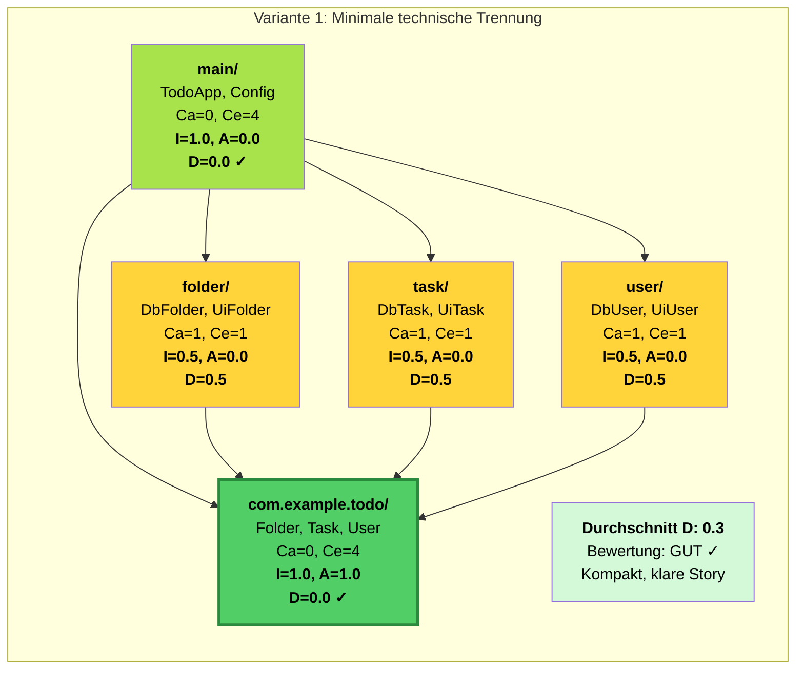
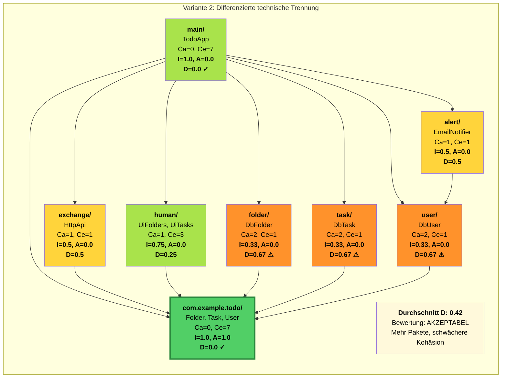
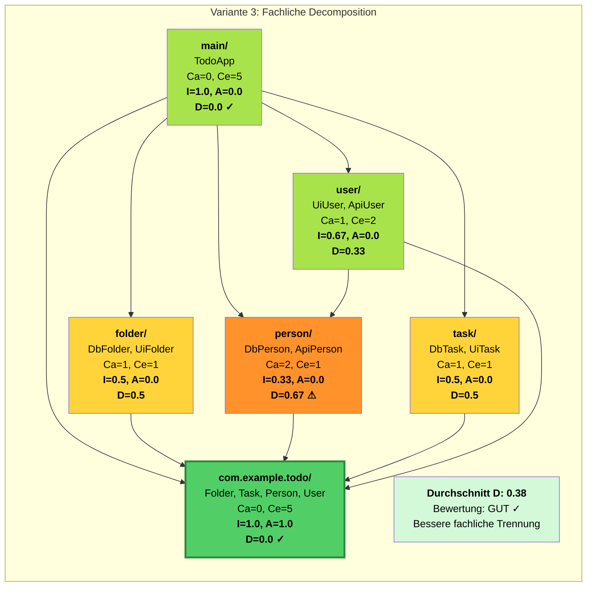
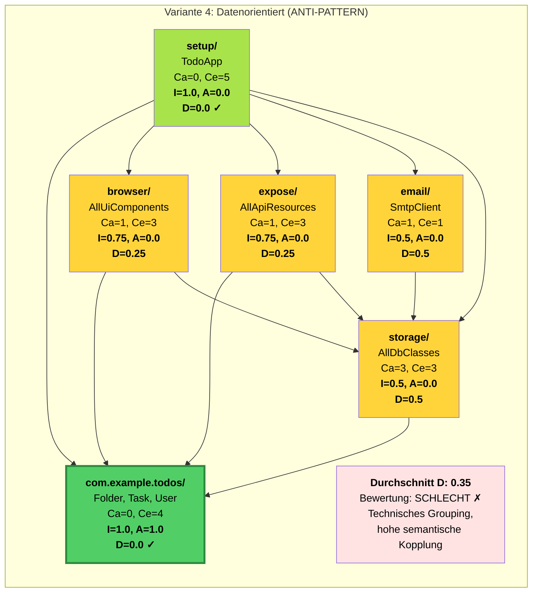
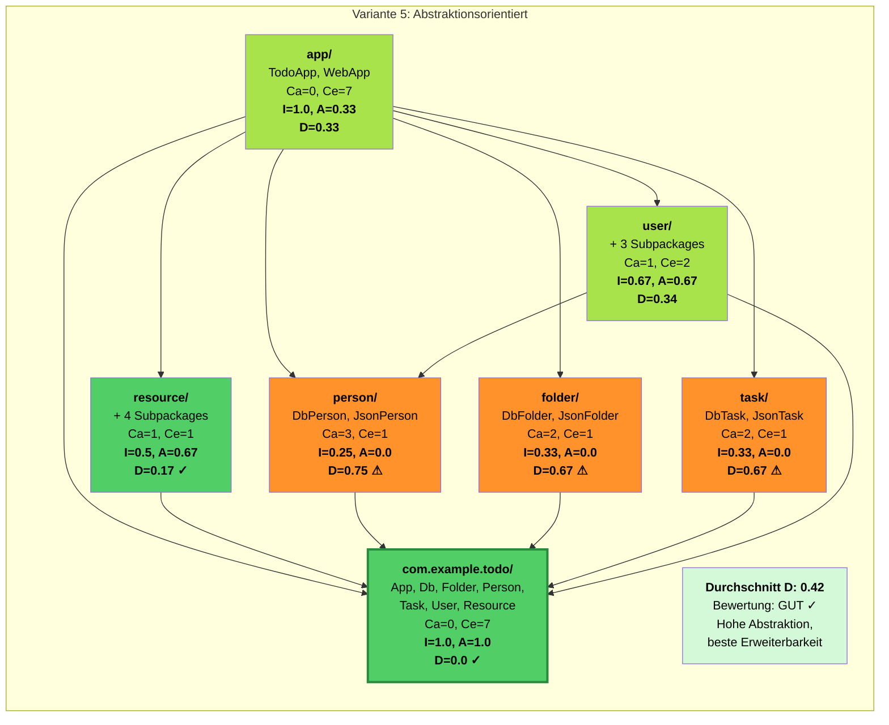
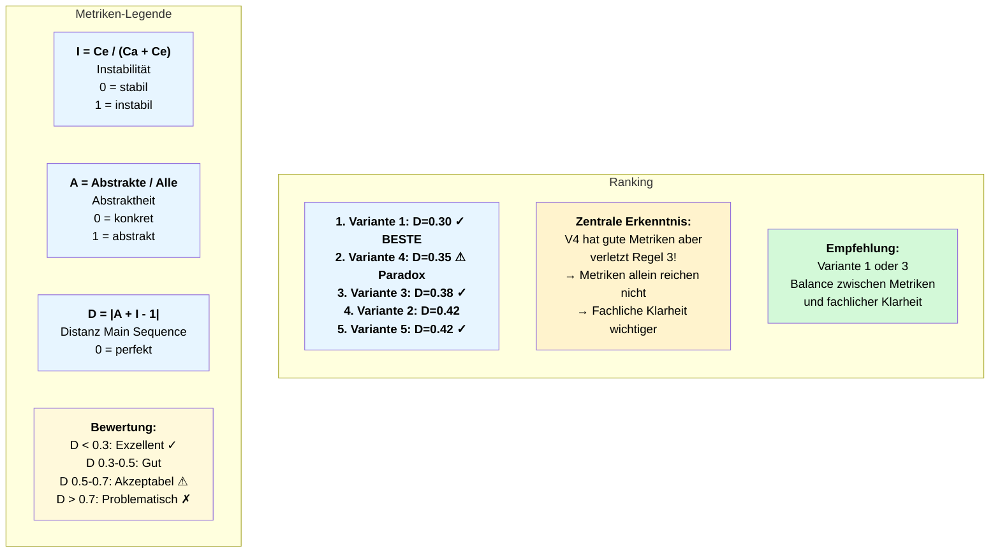
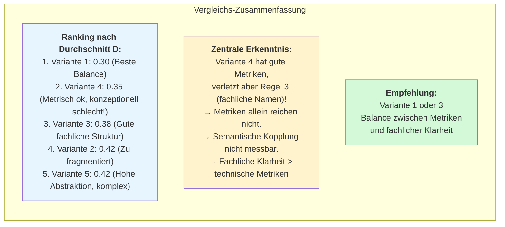

```mermaid

graph TB
    subgraph "Variante 1: Minimale technische Trennung"
        direction TB
        
        V1_ROOT["<b>com.example.todo/</b><br/>Folder, Task, User<br/>Ca=0, Ce=4<br/><b>I=1.0, A=1.0</b><br/><b>D=0.0 ✓</b>"]
        
        V1_FOLDER["<b>folder/</b><br/>DbFolder, UiFolder<br/>Ca=1, Ce=1<br/><b>I=0.5, A=0.0</b><br/><b>D=0.5</b>"]
        
        V1_TASK["<b>task/</b><br/>DbTask, UiTask<br/>Ca=1, Ce=1<br/><b>I=0.5, A=0.0</b><br/><b>D=0.5</b>"]
        
        V1_USER["<b>user/</b><br/>DbUser, UiUser<br/>Ca=1, Ce=1<br/><b>I=0.5, A=0.0</b><br/><b>D=0.5</b>"]
        
        V1_MAIN["<b>main/</b><br/>TodoApp, Config<br/>Ca=0, Ce=4<br/><b>I=1.0, A=0.0</b><br/><b>D=0.0 ✓</b>"]
        
        V1_MAIN --> V1_ROOT
        V1_MAIN --> V1_FOLDER
        V1_MAIN --> V1_TASK
        V1_MAIN --> V1_USER
        
        V1_FOLDER --> V1_ROOT
        V1_TASK --> V1_ROOT
        V1_USER --> V1_ROOT
        
        style V1_ROOT fill:#51cf66,stroke:#2b8a3e,stroke-width:3px,color:#000
        style V1_FOLDER fill:#ffd43b,color:#000
        style V1_TASK fill:#ffd43b,color:#000
        style V1_USER fill:#ffd43b,color:#000
        style V1_MAIN fill:#a9e34b,color:#000
        
        V1_RESULT["<b>Durchschnitt D: 0.3</b><br/>Bewertung: GUT ✓<br/>Kompakt, klare Story"]
        style V1_RESULT fill:#d3f9d8,color:#000
    end

```

```mermaid
graph TB    
    subgraph "Variante 2: Differenzierte technische Trennung"
        direction TB
        
        V2_ROOT["<b>com.example.todo/</b><br/>Folder, Task, User<br/>Ca=0, Ce=7<br/><b>I=1.0, A=1.0</b><br/><b>D=0.0 ✓</b>"]
        
        V2_ALERT["<b>alert/</b><br/>EmailNotifier<br/>Ca=1, Ce=1<br/><b>I=0.5, A=0.0</b><br/><b>D=0.5</b>"]
        
        V2_EXCHANGE["<b>exchange/</b><br/>HttpApi<br/>Ca=1, Ce=1<br/><b>I=0.5, A=0.0</b><br/><b>D=0.5</b>"]
        
        V2_FOLDER["<b>folder/</b><br/>DbFolder<br/>Ca=2, Ce=1<br/><b>I=0.33, A=0.0</b><br/><b>D=0.67 ⚠</b>"]
        
        V2_HUMAN["<b>human/</b><br/>UiFolders, UiTasks<br/>Ca=1, Ce=3<br/><b>I=0.75, A=0.0</b><br/><b>D=0.25</b>"]
        
        V2_TASK["<b>task/</b><br/>DbTask<br/>Ca=2, Ce=1<br/><b>I=0.33, A=0.0</b><br/><b>D=0.67 ⚠</b>"]
        
        V2_USER["<b>user/</b><br/>DbUser<br/>Ca=2, Ce=1<br/><b>I=0.33, A=0.0</b><br/><b>D=0.67 ⚠</b>"]
        
        V2_MAIN["<b>main/</b><br/>TodoApp<br/>Ca=0, Ce=7<br/><b>I=1.0, A=0.0</b><br/><b>D=0.0 ✓</b>"]
        
        V2_MAIN --> V2_ROOT
        V2_MAIN --> V2_ALERT
        V2_MAIN --> V2_EXCHANGE
        V2_MAIN --> V2_FOLDER
        V2_MAIN --> V2_HUMAN
        V2_MAIN --> V2_TASK
        V2_MAIN --> V2_USER
        
        V2_ALERT --> V2_USER
        V2_EXCHANGE --> V2_ROOT
        V2_HUMAN --> V2_ROOT
        V2_FOLDER --> V2_ROOT
        V2_TASK --> V2_ROOT
        V2_USER --> V2_ROOT
        
        style V2_ROOT fill:#51cf66,stroke:#2b8a3e,stroke-width:3px,color:#000
        style V2_ALERT fill:#ffd43b,color:#000
        style V2_EXCHANGE fill:#ffd43b,color:#000
        style V2_FOLDER fill:#ff922b,color:#000
        style V2_HUMAN fill:#a9e34b,color:#000
        style V2_TASK fill:#ff922b,color:#000
        style V2_USER fill:#ff922b,color:#000
        style V2_MAIN fill:#a9e34b,color:#000
        
        V2_RESULT["<b>Durchschnitt D: 0.42</b><br/>Bewertung: AKZEPTABEL<br/>Mehr Pakete, schwächere Kohäsion"]
        style V2_RESULT fill:#fff9db,color:#000
    end
```

```mermaid
graph TB    
    subgraph "Variante 3: Fachliche Decomposition"
        direction TB
        
        V3_ROOT["<b>com.example.todo/</b><br/>Folder, Task, Person, User<br/>Ca=0, Ce=5<br/><b>I=1.0, A=1.0</b><br/><b>D=0.0 ✓</b>"]
        
        V3_FOLDER["<b>folder/</b><br/>DbFolder, UiFolder<br/>Ca=1, Ce=1<br/><b>I=0.5, A=0.0</b><br/><b>D=0.5</b>"]
        
        V3_PERSON["<b>person/</b><br/>DbPerson, ApiPerson<br/>Ca=2, Ce=1<br/><b>I=0.33, A=0.0</b><br/><b>D=0.67 ⚠</b>"]
        
        V3_TASK["<b>task/</b><br/>DbTask, UiTask<br/>Ca=1, Ce=1<br/><b>I=0.5, A=0.0</b><br/><b>D=0.5</b>"]
        
        V3_USER["<b>user/</b><br/>UiUser, ApiUser<br/>Ca=1, Ce=2<br/><b>I=0.67, A=0.0</b><br/><b>D=0.33</b>"]
        
        V3_MAIN["<b>main/</b><br/>TodoApp<br/>Ca=0, Ce=5<br/><b>I=1.0, A=0.0</b><br/><b>D=0.0 ✓</b>"]
        
        V3_MAIN --> V3_ROOT
        V3_MAIN --> V3_FOLDER
        V3_MAIN --> V3_PERSON
        V3_MAIN --> V3_TASK
        V3_MAIN --> V3_USER
        
        V3_FOLDER --> V3_ROOT
        V3_PERSON --> V3_ROOT
        V3_TASK --> V3_ROOT
        V3_USER --> V3_ROOT
        V3_USER --> V3_PERSON
        
        style V3_ROOT fill:#51cf66,stroke:#2b8a3e,stroke-width:3px,color:#000
        style V3_FOLDER fill:#ffd43b,color:#000
        style V3_PERSON fill:#ff922b,color:#000
        style V3_TASK fill:#ffd43b,color:#000
        style V3_USER fill:#a9e34b,color:#000
        style V3_MAIN fill:#a9e34b,color:#000
        
        V3_RESULT["<b>Durchschnitt D: 0.38</b><br/>Bewertung: GUT ✓<br/>Bessere fachliche Trennung"]
        style V3_RESULT fill:#d3f9d8,color:#000
    end
```

```mermaid
graph TB
    subgraph "Variante 4: Datenorientiert (ANTI-PATTERN)"
        direction TB
        
        V4_ROOT["<b>com.example.todos/</b><br/>Folder, Task, User<br/>Ca=0, Ce=4<br/><b>I=1.0, A=1.0</b><br/><b>D=0.0 ✓</b>"]
        
        V4_BROWSER["<b>browser/</b><br/>AllUiComponents<br/>Ca=1, Ce=3<br/><b>I=0.75, A=0.0</b><br/><b>D=0.25</b>"]
        
        V4_EXPOSE["<b>expose/</b><br/>AllApiResources<br/>Ca=1, Ce=3<br/><b>I=0.75, A=0.0</b><br/><b>D=0.25</b>"]
        
        V4_EMAIL["<b>email/</b><br/>SmtpClient<br/>Ca=1, Ce=1<br/><b>I=0.5, A=0.0</b><br/><b>D=0.5</b>"]
        
        V4_STORAGE["<b>storage/</b><br/>AllDbClasses<br/>Ca=3, Ce=3<br/><b>I=0.5, A=0.0</b><br/><b>D=0.5</b>"]
        
        V4_SETUP["<b>setup/</b><br/>TodoApp<br/>Ca=0, Ce=5<br/><b>I=1.0, A=0.0</b><br/><b>D=0.0 ✓</b>"]
        
        V4_SETUP --> V4_ROOT
        V4_SETUP --> V4_BROWSER
        V4_SETUP --> V4_EXPOSE
        V4_SETUP --> V4_EMAIL
        V4_SETUP --> V4_STORAGE
        
        V4_BROWSER --> V4_ROOT
        V4_BROWSER --> V4_STORAGE
        V4_EXPOSE --> V4_ROOT
        V4_EXPOSE --> V4_STORAGE
        V4_EMAIL --> V4_STORAGE
        V4_STORAGE --> V4_ROOT
        
        style V4_ROOT fill:#51cf66,stroke:#2b8a3e,stroke-width:3px,color:#000
        style V4_BROWSER fill:#ffd43b,color:#000
        style V4_EXPOSE fill:#ffd43b,color:#000
        style V4_EMAIL fill:#ffd43b,color:#000
        style V4_STORAGE fill:#ffd43b,color:#000
        style V4_SETUP fill:#a9e34b,color:#000
        
        V4_RESULT["<b>Durchschnitt D: 0.35</b><br/>Bewertung: SCHLECHT ✗<br/>Technisches Grouping,<br/>hohe semantische Kopplung"]
        style V4_RESULT fill:#ffe3e3,color:#000
    end
```

```mermaid
graph TB
    subgraph "Variante 5: Abstraktionsorientiert"
        direction TB
        
        V5_ROOT["<b>com.example.todo/</b><br/>App, Db, Folder, Person,<br/>Task, User, Resource<br/>Ca=0, Ce=7<br/><b>I=1.0, A=1.0</b><br/><b>D=0.0 ✓</b>"]
        
        V5_APP["<b>app/</b><br/>TodoApp, WebApp<br/>Ca=0, Ce=7<br/><b>I=1.0, A=0.33</b><br/><b>D=0.33</b>"]
        
        V5_RESOURCE["<b>resource/</b><br/>+ 4 Subpackages<br/>Ca=1, Ce=1<br/><b>I=0.5, A=0.67</b><br/><b>D=0.17 ✓</b>"]
        
        V5_PERSON["<b>person/</b><br/>DbPerson, JsonPerson<br/>Ca=3, Ce=1<br/><b>I=0.25, A=0.0</b><br/><b>D=0.75 ⚠</b>"]
        
        V5_FOLDER["<b>folder/</b><br/>DbFolder, JsonFolder<br/>Ca=2, Ce=1<br/><b>I=0.33, A=0.0</b><br/><b>D=0.67 ⚠</b>"]
        
        V5_TASK["<b>task/</b><br/>DbTask, JsonTask<br/>Ca=2, Ce=1<br/><b>I=0.33, A=0.0</b><br/><b>D=0.67 ⚠</b>"]
        
        V5_USER["<b>user/</b><br/>+ 3 Subpackages<br/>Ca=1, Ce=2<br/><b>I=0.67, A=0.67</b><br/><b>D=0.34</b>"]
        
        V5_APP --> V5_ROOT
        V5_APP --> V5_RESOURCE
        V5_APP --> V5_PERSON
        V5_APP --> V5_FOLDER
        V5_APP --> V5_TASK
        V5_APP --> V5_USER
        
        V5_RESOURCE --> V5_ROOT
        V5_PERSON --> V5_ROOT
        V5_FOLDER --> V5_ROOT
        V5_TASK --> V5_ROOT
        V5_USER --> V5_ROOT
        V5_USER --> V5_PERSON
        
        style V5_ROOT fill:#51cf66,stroke:#2b8a3e,stroke-width:3px,color:#000
        style V5_APP fill:#a9e34b,color:#000
        style V5_RESOURCE fill:#51cf66,color:#000
        style V5_PERSON fill:#ff922b,color:#000
        style V5_FOLDER fill:#ff922b,color:#000
        style V5_TASK fill:#ff922b,color:#000
        style V5_USER fill:#a9e34b,color:#000
        
        V5_RESULT["<b>Durchschnitt D: 0.42</b><br/>Bewertung: GUT ✓<br/>Hohe Abstraktion,<br/>beste Erweiterbarkeit"]
        style V5_RESULT fill:#d3f9d8,color:#000
    end
```

```mermaid
graph TB
    subgraph "Ranking"
        direction TB
        
        RANK["<b>1. Variante 1: D=0.30 ✓ BESTE</b><br/><b>2. Variante 4: D=0.35 ⚠ Paradox</b><br/><b>3. Variante 3: D=0.38 ✓</b><br/><b>4. Variante 2: D=0.42</b><br/><b>5. Variante 5: D=0.42 ✓</b>"]
        
        INSIGHT["<b>Zentrale Erkenntnis:</b><br/>V4 hat gute Metriken aber<br/>verletzt Regel 3!<br/>→ Metriken allein reichen nicht<br/>→ Fachliche Klarheit wichtiger"]
        
        WINNER["<b>Empfehlung:</b><br/>Variante 1 oder 3<br/>Balance zwischen Metriken<br/>und fachlicher Klarheit"]
        
        style RANK fill:#e7f5ff,color:#000
        style INSIGHT fill:#fff3cd,color:#000
        style WINNER fill:#d3f9d8,color:#000
    end
    
    subgraph "Metriken-Legende"
        direction LR
        
        L1["<b>I = Ce / (Ca + Ce)</b><br/>Instabilität<br/>0 = stabil<br/>1 = instabil"]
        L2["<b>A = Abstrakte / Alle</b><br/>Abstraktheit<br/>0 = konkret<br/>1 = abstrakt"]
        L3["<b>D = |A + I - 1|</b><br/>Distanz Main Sequence<br/>0 = perfekt"]
        L4["<b>Bewertung:</b><br/>D < 0.3: Exzellent ✓<br/>D 0.3-0.5: Gut<br/>D 0.5-0.7: Akzeptabel ⚠<br/>D > 0.7: Problematisch ✗"]
        
        style L1 fill:#e7f5ff,color:#000
        style L2 fill:#e7f5ff,color:#000
        style L3 fill:#e7f5ff,color:#000
        style L4 fill:#fff9db,color:#000

    end
```

```mermaid
graph TB
    subgraph "Vergleichs-Zusammenfassung"
        direction TB
        
        COMPARE["<b>Ranking nach Durchschnitt D:</b><br/>1. Variante 1: 0.30 (Beste Balance)<br/>2. Variante 4: 0.35 (Metrisch ok, konzeptionell schlecht!)<br/>3. Variante 3: 0.38 (Gute fachliche Struktur)<br/>4. Variante 2: 0.42 (Zu fragmentiert)<br/>5. Variante 5: 0.42 (Hohe Abstraktion, komplex)"]
        
        INSIGHT["<b>Zentrale Erkenntnis:</b><br/>Variante 4 hat gute Metriken,<br/>verletzt aber Regel 3 (fachliche Namen)!<br/>→ Metriken allein reichen nicht.<br/>→ Semantische Kopplung nicht messbar.<br/>→ Fachliche Klarheit > technische Metriken"]
        
        WINNER["<b>Empfehlung:</b><br/>Variante 1 oder 3<br/>Balance zwischen Metriken<br/>und fachlicher Klarheit"]
        
        style COMPARE fill:#e7f5ff
        style INSIGHT fill:#fff3cd
        style WINNER fill:#d3f9d8
    end
```
