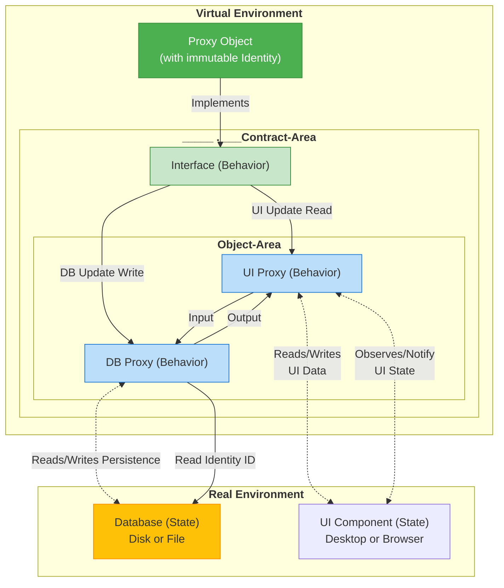

# The Mechanics of Good Object

> The central thesis of the blog posts by Yegor Bugayenko and Mihai A. Rodegbfr is that good objects should always be immutable proxies that animate data, rather than mapping it.

This holds true even when they represent real-world entities that change frequently, such as a document title (mutable).

## 1. The Problem: State vs. Identity

* A typical object consists of identity, state, and behavior.  
* An object is mutable if its internal encapsulated information (the state) can be changed after creation.

**Requirement:**

If a property (e.g., the title of a document) is frequently changed, it should not be part of the object's internal state.

### Example 1: The Mutable (Bad) Object

This object is bad because it retains its internal identity (the memory address) even though its state changes.

```java
public class Document {

    private int id;  
    private String title;

    public Document(int id, String title) {  
        this.id = id;  
        this.title = title;  
    }

    // Changes the object's internal state  
    public void setTitle(String newTitle) {  
        this.title = newTitle;  
    }

    // ... Getters and toString()  
}

// Usage: The same object (identity) with new state  
Document doc = new Document(50, "Old Title");  
doc.setTitle("New Title"); // State changes, identity remains
```

## 2. The Immutable Value (Value Object)

In conventional immutable design, a new object is created with every change. The state becomes the identity.

### Example 2: The Immutable Value Object (Inefficient for Frequent Changes)

```java
public class Document {

    private final int id;  
    private final String title; // Part of the internal state

    public Document(int id, String title) {  
        this.id = id;  
        this.title = title;  
    }

    // Returns a new object on change (Wither)  
    public Document withTitle(String newTitle) {  
        return new Document(this.id, newTitle);  
    }

    // ... printer methods like id() or title() and equals/hashCode (based on id AND title)  
}

// Usage: Two distinct objects (identities)  
Document first = new Document(50, "Title A");  
Document second = first.withTitle("Title B"); // Creates a new object
```

**Requirement:**

If a document is very large, it is inefficient to clone the entire data structure with every small change (like a title update).

## 3. The Solution: Immutable Proxy Object

The solution lies in recognizing that the title is not part of the object state, but part of the real-world entity (e.g., a file or a database row) that the object represents.

A good immutable object should only encapsulate its identity internally (e.g., the ID or storage location) and provide behavior to manipulate the external, mutable world. The object acts as a Proxy.

### Example 3: The Immutable Proxy Object (The Recommended Approach)

The object itself is immutable (only the ```ID``` is final), but its methods manipulate an external, mutable resource (simulated here by ```ExternalStorage```).

```java
public class Document {  

    private final ExternalStorage externalStorage = new ExternalStorage();
     
    // The ONLY internal state is the identity to the real world  
    private final int id;

    public Document(int id) {  
        this.id = id;  
    }

    // BEHAVIOR: Reads the title from the external world  
    public String title() {  
        return externalStorage.readTitle(this.id);  
    }

    // BEHAVIOR: Writes the title to the external world  
    public void title(String text) {  
        // Manipulates the external entity, not the object itself  
        externalStorage.writeTitle(this.id, text);  
    }

    // equals() and hashCode() are based ONLY on the ID (the identity)  
    @Override  
    public boolean equals(Object doc) {  
        return doc instanceof Document  
            && Document.class.cast(doc).id == this.id;  
    }  
}

// Simulates the external, mutable storage (database, file, etc.)  
public class ExternalStorage {

    private static final Map<Integer, String> storage = new HashMap<>(0);
  
    public static String readTitle(int id) {  
        return storage.getOrDefault(id, "Title not found");  
    }

    public static void writeTitle(int id, String title) {  
        storage.put(id, title);  
    }  
}

// Usage: The object (identity) remains constant,
// only the behavior changes the external world  
Document doc = new Document(50);  
doc.title("Title A"); // External storage is changed  
doc.title("Title B"); // External storage is changed  
// doc is still the SAME object
```

### 3.1 Horizontal Decomposition with Interfaces and Decorator Pattern

Technical aspects (```Caching```, ```Logging```, ```UI notification```) are wrapped horizontally around the interfaces as Decorators.

#### Example 3.1: The Immutable Proxy Object (Core Structure)

```java
import java.util.Map;
import java.util.HashMap;

// 1. Vertical Interface (Domain behavior)
public interface Document {
    String title();
    void title(String text);
}

// 2. Interface for the technical layer (Persistence behavior)
public interface DocumentStorage {
    String readTitle(int id);
    void writeTitle(int id, String title);
}

// 3. The Immutable Proxy Object (Encapsulates only the ID)
public class DefaultDocument implements Document {

    private final int id;
    private final DocumentStorage externalStorage;

    public DefaultDocument(int id, DocumentStorage storage) {  
        this.id = id;  
        this.externalStorage = storage;
    }

    @Override
    public String title() {  
        return this.externalStorage.readTitle(this.id);  
    }

    @Override
    public void title(String text) {  
        this.externalStorage.writeTitle(this.id, text);  
    }

    // equals() and hashCode() are based ONLY on the ID (the identity)
    @Override  
    public boolean equals(Object doc) {  
        return doc instanceof DefaultDocument && MyDocument.class.cast(doc).id == this.id;  
    }  
}

// 4. The base implementation of the storage
public class SimpleExternalStorage implements DocumentStorage {
  
    private final Map<Integer, String> storage = new HashMap<>(0);  
    
    @Override
    public String readTitle(int id) {  
        System.out.println("-> DB: Reading title from the database.");
        return storage.getOrDefault(id, "Title not found");  
    }  
    
    @Override
    public void writeTitle(int id, String title) {  
        System.out.println("-> DB: Writing title to the database.");
        storage.put(id, title);  
    }  
}
```

#### 3.1.1 Horizontal Decorator: Caching for Persistence (DB Aspect)

The ```CachedDocumentStorage``` wraps the base storage (```SimpleExternalStorage```) and adds the caching logic.

```java
// CachedDocumentStorage.java
public class CachedDocumentStorage implements DocumentStorage {

    private final DocumentStorage origin; // The wrapped storage
    private final Map<Integer, String> cache = new HashMap<>(0);

    public CachedDocumentStorage(DocumentStorage origin) {
        this.origin = origin;
    }

    @Override
    public String readTitle(int id) {
        if (cache.containsKey(id)) {
            System.out.println("-> CACHE: Title retrieved from cache.");
            return cache.get(id);
        }
        // Only delegate to original logic on a cache miss
        String title = this.origin.readTitle(id);
        cache.put(id, title);
        return title;
    }

    @Override
    public void writeTitle(int id, String title) {
        this.origin.writeTitle(id, title);
        cache.put(id, title); // Update the cache
    }
}
```

#### 3.1.2. Horizontal Decorator: UI Behavior (View Aspect)

**a) Observability (Event Triggering):**

```java
public class ObservedDocument implements Document {

    private final Document origin; // The wrapped domain object

    public ObservedDocument(Document origin) {
        this.origin = origin;
    }
    
    @Override
    public String title() {
        // Pure read operations are delegated directly
        return this.origin.title();
    }

    @Override
    public void title(String text) {

        // First, execute the technical logic (UI notification event)
        System.out.println("-> EVENT: Notifying all listeners about title update.");
        
        // Then, delegate the domain logic (persistence update)
        this.origin.title(text);
    }
}
```

**b) Presentation (Real UI Interaction):**

The PresentableDocument is the final decorator that injects the simulated UI component.

```java
// Simulates a simple UI component that can display changes
public class FakeUIComponent {

    public void displayTitleUpdate(String newTitle) {
        System.out.println("-> FAKE UI: Updating title display to: " + newTitle);
    }
}

// The final decorator that controls presentation
public class PresentableDocument implements Document {

    private final Document origin;
    private final FakeUIComponent uiComponent;

    public PresentableDocument(Document origin, FakeUIComponent uiComponent) {
        this.origin = origin;
        this.uiComponent = uiComponent;
    }

    @Override
    public String title() {
        // First, read the title (goes through all decorators back to storage)
        String currentTitle = this.origin.title();
        this.uiComponent.displayTitleUpdate(currentTitle); // Display title
        return currentTitle;
    }

    @Override
    public void title(String text) {
        // First, delegate the change to the Observable layer (triggers event, writes to DB/Cache)
        this.origin.title(text);
        // After the change, update the UI immediately
        this.uiComponent.displayTitleUpdate(text);
    }
}
```

### 3.2 Type-Safe Usage (Combination)

The client combines the aspects using interfaces.

```java
// 1. The base storage (DB connection)
DocumentStorage dbStorage = new SimpleExternalStorage(); 

// 2. Horizontally add Caching
DocumentStorage cachedStorage = new CachedDocumentStorage(dbStorage);

// 3. The immutable Proxy Object uses the cache
Document documentProxy = new DefaultDocument(50, cachedStorage); 

// 4. Horizontally add UI behavior (Observability)
Document observedDocument = new ObservedDocument(documentProxy);

// 5. Add the final presentation layer (with UI component)
FakeUIComponent ui = new FakeUIComponent();
Document finalDocument = new PresentableDocument(observedDocument, ui);

System.out.println("\n--- First Call: Writes to DB, Cache, and fires UI Event to animate data ---");
finalDocument.title("New, cached Title"); 

System.out.println("\n--- Second Call: Reads from Cache (no DB access) and updates UI ---");
finalDocument.title(); 
```

## Conclusion

 **Object == Proxy == Animator of Data**  
* A good object should be a proxy for the effective animation of data.
* The data itself (in memory, in a file, in a database) is dead and mutable.
* The object is alive and immutable, using its identity (ID) as a key to access and manipulate this external, mutable data.



## Explanation of the individual components

### 1. Object == Proxy

**Analogy:** An object can be treated like a proxy.
**Meaning:** A proxy is a placeholder or representative for another object.
* This statement suggests that in some contexts, one does not work directly with the actual object, but through a proxy that intercepts and modifies operations.
* This is a common design pattern in software development to control, validate, or log behavior.

### 2. State $\wedge$ Behavior $\in$ Object

**Analogy:** State and Behavior are components ($\in$) of an object.  
**Meaning:** This is a fundamental definition of object-oriented programming.
* An object bundles data (its state) and the methods that operate on that data (its behavior).

### 3. State $\neq$ Behavior

**Analogy:** State and Behavior are not the same thing.  
**Meaning:** The state of an object describes its properties or its current values (e.g., Car.Speed = 100).
* Behavior describes the actions the object can perform (e.g., Car.accelerate()).
* Behavior can change the state, but the two are conceptually different things.

### 4. State == Data

**Analogy:** The state of an object is equal to its data.  
**Meaning:** The state is represented by the values stored in the object's fields or attributes.
* In this sense, the state is simply the collection of data that the object contains at a specific point in time.

### 5. Behavior == Animation

**Analogy:** Behavior is equal to animation.  
**Meaning:** This is a more specific interpretation of the term "behavior" in a visual or graphical context.
* Particularly in the field of computer graphics and data visualization, the behavior of an object is often described by its animation – how it changes, moves, or reacts over time.
* Examples include "Behavioral Animation," where characters move based on rules, or animations in user interfaces.

### 6. Object $\Rightarrow$ Data Animator

**Analogy:** An object implies a Data Animator.  
**Meaning:** This statement summarizes the previous points and interprets them in the context of data visualization.
* If an Object has a State (Data) and a Behavior (Animation), then an object is essentially a Data Animator.
* The Data (State) defines what should be visualized.
* The Animation (Behavior) ensures that the representation of the data changes or moves.

> **A good object is an immutable animator of mutable data.**

## References

- [How an Immutable Object Can Have State and Behavior?](https://www.yegor256.com/2014/12/09/immutable-object-state-and-behavior.html)
- [Data Should Be Animated, Not Mapped](https://amihaiemil.com/2017/09/01/data-should-be-animated-not-represented.html)
- [Gradients of Immutability](https://www.yegor256.com/2016/09/07/gradients-of-immutability.html)
- [Objects Should Be Immutable](https://www.yegor256.com/2014/06/09/objects-should-be-immutable.html)
- [Immutable Objects Are Not Dumb](https://www.yegor256.com/2014/12/22/immutable-objects-not-dumb.html)
