# How to Structure and Naming Code "like a Pro…"

**(Draft!!!)**

*"with 3 [Happy Packaging](https://javadevguy.wordpress.com/2017/12/18/happy-packaging/) Rules..."*

1. Packages should never depend on sub-packages.  
2. Sub-packages should not introduce new concepts, just more details.  
3. Packages should reflect business-concepts, not technical ones.

*"... so that your code tells a customer story and achieves the [next level of readability](https://www.informatik-aktuell.de/entwicklung/programmiersprachen/next-level-lesbarkeit.html)."*

## **1 Terminology and Demarcation**

**Good code** is not just bug-free, but also maintainable, reusable, and above all, **easy to understand**. The **key** to this lies in a domain-oriented package structure that follows the principles of **Object-Oriented *Package* Design** (OOPD).

In this context, a **package** should not be understood as a folder for grouping related classes, as is often the case in a *[Layered Architecture](https://javadevguy.wordpress.com/2019/01/06/reevaluating-the-layered-architecture/)*. Instead, it represents a **logical, modular unit** that **encapsulates the technical realization** of domain concepts.

The **demarcation** of Object-Oriented Package Design from **"Layered Architecture"** is the **crucial point**. Well-known representatives like Clean Architecture or the package structures often proposed in Domain-Driven Design (DDD) organize code according to technical layers (```domain```, ```application```, ```infrastructure```, ```presentation```). Although these approaches are intended to promote maintainability and further development through the **separation of concerns into package layers**, in practice, they often achieve the opposite and **contradict the Single Responsibility Principle (SRP)**.

Robert Bräutigam describes the core problems in his blog article *[Data Boundaries are the root cause of Maintenance Problems](https://javadevguy.wordpress.com/2019/06/06/data-boundaries-are-the-root-cause-of-maintenance-problems/)*. Let's identify and understand the underlying problems.

**Data-Oriented Abstractions through Data Boundaries:**  
The constant transfer of data across layer boundaries (```User``` -> ```UserDTO``` -> ```UserViewModel```) creates unnecessary code and causes the original, domain-specific abstraction to disintegrate. Each layer must transform the data for its own purpose, leading to rigid and maintenance-intensive systems.

**Technical Communication via Architecture:**  
A layered architecture describes technical dependencies, not domain-specific ones. A new developer must first understand the entire architecture before they can dive into the business logic. 

**Semantic Coupling:**  
This most critical type of coupling is often caused by getters. If one object knows too much about the internal details (*private fields*) of another object, both classes are semantically coupled. Changes in the detail object then propagate invisibly throughout the entire application.

**Subjective Interpretation of the "SRP":**
The definition according to **Clean Architecture**:

> "A class should only have one reason to change"

is very subjective and often too broad. By separating the data from the business logic and transporting it across layer boundaries, *objects are stripped of all responsibility*. This leads to *unnecessary package* layers and *procedural code* built around *Data Transfer Objects* (DTOs).

**DTOs across layer boundaries**

```
controller/
    ├── UserController (no logic)
    │       ↓
    └── UserViewModel (data only)
            ↓
service/
    ├── UserService (procedural logic)
    │       ↓
    └── UserDTO (data only)
            ↓
domain/
    ├── UserEntity (data only)
    │       ↓
    └── UserDbModel (data only)
            ↓
repository/
    └── UserRepository (no logic)
```

**Problem:** 
- Objects without responsibility
- Compound names of objects with **suffixes** describe the architecture patterns  
- Many transformations between packages
- Logic scattered in Service layer
- Technical package names (```controller```, ```service```, ```domain```, ```repository```)

**OOP without DTOs**

```
com.example.app/
    └── User.java (Interface)
            ↓
user/
    └── DbUser.java (Data + Logic + DB)
```

**Advantage:**
- One object, one responsibility
- One Concept, one Name (```User.java```)
- No transformations needed
- Logic where it belongs, within the object's implementation, identified by a prefix (like ```DbUser.java```).
- Domain-oriented package names (```user```)

This is why and how Robert Bräutigam defines the **SRP** more pragmatically and objectively through the principles of **Coupling** and **Cohesion**:

> **SRP = Maximize Cohesion and Minimize Coupling.**

* **Cohesion:** Refers to the dependencies within an object. High cohesion means that the methods (behavior) and fields (data) of an object are strongly related to each other (physical dependency).  
* **Coupling:** Refers to the dependencies between objects. Low coupling minimizes the extent to which changes in one object have far-reaching effects on others.

A **package** in the sense of the *Single Responsibility Principle* is a **logical capsule and boundary of trust**.

* It defines a **clear interface** (API) outwards and protects the internal complexity — the implementation details — inwards.  
* This is often referred to as **Component-Based Design**, where packages and modules directly reflect the **domain concepts**.

The logical role of a package should follows the OOD principles of **Modularity** and **Information Hiding**.

**Modularity:**  
Software is structured into independent, clearly defined modules (packages). Each package forms a logical unit that encapsulates a domain concept.  

**Information Hiding:**  
Each module (package) hide its implementation details and provides only a clearly defined interface to the outside.  

**Encapsulation:**  
A module (package) should hide the implementation details (e.g., ```database access```, ```external API calls```, or ```complex algorithms```) from the outside world. The classes within the module work together to fulfill a single, abstract business logic (```Business Concept```).

**Focus on Business Concepts:**  
Ideally, the **package** as a module represents an **abstract business concept**, such as:

* Order management (```Order```)  
* Customer master data (```Customer```, ```Customerbase```)  
* Payment processing (```Bill```, ```Billing``` , ```Payment```)  
* External API integration (```Jira```, ```Http```)

and **not** a technical view, such as:
* ```Entity```, ```Model```, ```Service```, ```Repository```, ```Controller```, ```JiraClient```, ```JiraModel```, ```JiraAdapter```  

as well as **not** technical layers, such as:
* ```Domain```, ```Application```, ```Infrastructure```, ```Presentation```

| Feature | Layered Architecture (Layers) | Object-Oriented Package (Module) |
| :---- | :---- | :---- |
| Grouping | **Vertical by technical tasks** (e.g., ```UI```, ```Business Logic```, ```Data Access```). | **Horizontal by logical, business concepts** (e.g., ```Customer```, ```Order```, ```Inventory```). |
| Encapsulation | **Rather weak**; implementation details (e.g., ```Database```) are usually in the lowest layer (Data). | **Strong**; the implementation details (e.g., which database is used) remain within the package. |
| Goal | **Separation** of technical responsibilities. | **Encapsulation** of domain concepts and their realization. |

## **2 Package Design Principles**

To find a perfect balance between reusability and change-friendliness, the **Package Design Principles** (according to Robert C. Martin) are helpful.

### **Principles for Cohesion (Internal Organization)**

| Principle | Summary | Goal |
| :---- | :---- | :---- |
| **Reuse-Release Equivalency Principle (REP)** | The unit of reuse is the unit of release. | Everything that is reused together should be bundled in one package and receive a common version number. |
| **Common Closure Principle (CCP)** | Classes that change together belong together. | Minimizes the impact of changes. If a change is pending, it should affect only one or very few packages (changes should be enclosed within the packages). |
| **Common Reuse Principle (CRP)** | Classes in a package should be reused together. | Avoids unnecessary dependencies. If you use one class from a package, you should use most of the other classes in that package as well (or at least be prepared to be affected by their dependencies). |

**Note:**

* **REP** and **CCP** promote larger packages for **easy maintenance**;  
* **CRP** promotes smaller, more focused packages for **easy reuse**.  
* The **perfect design** lies **in the middle**.

### **Principles for Coupling (Dependency Control)**

These principles govern the relationships between packages in a large project.

| Principle | Summary | Goal |
| :---- | :---- | :---- |
| **Acyclic Dependencies Principle (ADP)** | The dependency structure of the packages must be a Directed ```Acyclic Graph (DAG)```. | ```Cycles (circular dependencies)``` between packages are forbidden! They make releases difficult and lead to the ["Morning-After-Syndrome"](https://stackoverflow.com/questions/45783173/acyclic-dependency-principle-how-could-component-dependency-cycles-be-reason-f). |
| **Stable Dependencies Principle (SDP)** | Dependencies should point in the direction of **stability**. | A package should only depend on packages that are more stable than itself. Stable packages are hard to change and have many incoming dependencies. |
| **Stable Abstractions Principle (SAP)** | Stable packages should be **abstract**. Unstable packages should be **concrete**. | Stable (hard to change) packages should be easily extensible through interfaces and abstract classes (**Open-Closed Principle** at the package level). |

## **3 Object and Methods Naming**

While package structure defines the architecture, class and method naming determines clarity at the micro level. 
* Names of classes and methods should reflect real-world concepts and responsibilities, not technical mechanics.

### **3.1 Object Naming**

**Objects are Nouns:**  
A class name should represent the entity (**thing, person, concept**) it models not the action it performs.  
Name an object after **what it *is*** (e.g., ```Invoice```, ```User```, ```Order```), **not what it *does***.

* **Bad! Names:** ```Processor```, ```Generator```, ```Calculator```
* **Good! Names:** ```Report```, ```RandomNumber```, ```BmiMetric```

**One Concept, One Name:**  
A domain-driven object should have a single, clear noun. If the name becomes long, it usually means the object mixes responsibilities that should be split.
* **Compound names** like ```CustomerDataProcessor``` or ```FileContentWriter``` are a code smell.
* **Examples of corrections:** ```UserAccountManager``` → ```User``` or ```Account```, ```DatabaseConnectionHolder``` → ```Connection```.

**Avoid Functional Endings:** 
* **Name Endings:** ```FileWriter → File```, ```DataValidator → Rule``` , ```JiraClient → Jira``` or just ```Http``` instead of ```HttpClient```.

**Avoid “Utility” Suffixes:**:
* **Suffixes like** ```-Manager```, ```-Controller```, ```-Helper```, ```-Util```, ```-Service```, or ```-Client``` often indicate a violation of the **Single Responsibility Principle** (SRP). They suggest that the object coordinates multiple unrelated tasks instead of owning a clear, domain-focused responsibility.
* Also **Suffixes** such as ```-er```, ```-or```, ```-able``` often signal procedural decomposition or “naked data.”

**Prefixed Maming**  
According to best practices (see [Amihai Emil](https://amihaiemil.com/2018/01/07/my-take-on-object-naming.html) and [Yegor Bugayenko](https://www.yegor256.com/2020/03/03/prefixed-naming.html)), classes should start with a prefix that reflects their role or context, especially when multiple implementations exist. **For example:**
* ```AwsInvoice``` vs. ```AzureInvoice``` (prefix indicates environment)
* ```HttpRequest``` vs. FtpRequest``` (prefix indicates protocol)  

This approach improves clarity without resorting to suffixes like Manager or Service.

### **3.2 Methods Naming**

#### **3.2.1 Single Action Rule (Exclusivity)**  
Each method performs one clear, complete action related to the object itself. 
* **Avoid:** Methods that combine multiple responsibilities, e.g., ```createAndPersistUser(User u)```.
* **Compliant:** ```user.persist()```.

#### **3.2.2 Command Naming (Mutators)**  
Methods that change state or produce a modified object should be named as commands (imperative). 
* **Avoid:** Using verbs like update, set, modify. Example: ```updateThePrice(NewPrice p)```.
* **Compliant:** ```price(NewPrice p)```, ```increase(Amount a)```, ```complete()```.

#### **3.2.3 Query Naming (Accessors)**  
Methods without side effects should be named as queries, clearly expressing their nature.
*  **Avoid:** Using **get** or **set** as a prefix, e.g., ```getFirstName()``` or```setFirstName(String firstName)```.  
*  **Compliant:** ```firstName()```, ```isCompleted()```, ```hasPermissions()```, ```toXml()```.

#### **3.2.4 Method Chaining (Access to Objects)**  
Methods returning domain objects (```value objects```, ```entities```, ```collections```) should be named after the returned object. This supports encapsulation and Fluent APIs according to the [Law-of-Demeter](https://javadevguy.wordpress.com/2017/05/14/the-genius-of-the-law-of-demeter/).
* **Avoid:** Calls like ```user.getGroup().getRights()``` (violates 4.2.3).
* **Compliant**: ```user.group().rights()```. In the chain, where no internal variables are exposed and each call returns a **new object**.

## **4 Measurable Code Quality**

How can we measure **"stability"** and **"abstraction"**? With three simple metrics!

### **Instability (I)**

Indicates how easy it is to change a package.

* **Formula:**  
  I = C_e / (C_a + C_e)  
* $C_e$**:** Number of outgoing dependencies  
  *(How many other packages are used by this package?)*  
* $C_a$**:** Number of incoming dependencies  
  *(How many other packages use this package?)*

**Interpretation:**

* I = 0 → maximally stable (many packages depend on it, it depends on few)  
* I = 1 → maximally unstable (depends on many, but nobody depends on it)

### **Abstractness (A)**

Shows the proportion of abstract classes (interfaces) in the package.

* **Formula:**  
  A = Number of abstract classes and interfaces / Total number of classes in the package

**Interpretation:**

* A = 0 → completely concrete (hard to change, hard to extend)  
* A = 1 → completely abstract (easy to extend)

### **Distance from the Main Sequence (D)**

Measures the distance of a package from the ideal balance line (Main Sequence: $A + I = 1$). A smaller $D$ value indicates a better architectural quality of the package.

* **Formula:**  
  D = |A + I - 1|

**Interpretation:**

* D = 0 → ideal package (perfect balance of stability and abstraction)  
* D $approx$ 1 → problem case (either concrete and stable, or abstract and unstable)

### **The Main Sequence (A-I Plot)**

Ideal packages lie on or near the main sequence:
```
A + I = 1
```
* Ideal Location 1 (Top left):  
  A = 1, I = 0  
  Maximally stable and abstract (core interfaces, frameworks)  
* Ideal Location 2 (Bottom right):  
  A = 0, I = 1  
  Maximally unstable and concrete (implementations that change often)  
* Problem Case:  
  A = 0, I = 0  
  Stable and concrete – hard to change and hard to extend.

With these metrics, you can objectively evaluate the architectural quality of a package and systematically improve it.  
The following diagram summarizes the interpretation from above.


**Explanation of each zone:**

**Main Sequence (A + I = 1)**

**Ideal balance:** Abstract components are stable, concrete components are flexible
* Packages here are well-designed and maintainable

**Core Interfaces (A≈1, I≈0)**

* Highly abstract, highly stable
* Frameworks, interfaces, base classes
* Many packages depend on them, they depend on few

**Implementations (A≈0, I≈1)**

* Highly concrete, highly unstable
* Business logic, specific implementations
* Depend on many packages, few depend on them
* Easy to change without breaking others

**Zone of Pain (A≈0, I≈0)**

* Concrete and stable - worst combination
* Hard to change (stable) but should change often (concrete)
* Database schemas, legacy code with many dependents
* Causes rigidity and maintenance nightmares

**Zone of Uselessness (A≈1, I≈1)**

**Abstract and unstable**
* Nobody uses them (unstable) yet they're abstract
* Over-engineered abstractions with no dependents
* Wasted effort, should be removed or simplified

**Balanced (A=0.5, I=0.5)**

* Mid-point on main sequence
* **Good balance between abstraction and stability**

### **Example Calculation:**

**Assumption**  
In the package todo, there is 1 Interface (```Task.java```). In the subpackage task, there are 4 concrete classes:

```
com.example.todo/  
├── exchange/  
├── folder/  
├── task/  
│   ├── DbTask.java  
│   ├── JsonTask.java  
│   ├── NotifiedTask.java  
│   └── InMemTask.java  
├── main/  
├── Task.java
```

**Metrics**

* **Abstractness (A):**  
  * 1 Interface (Task.java)  
  * 4 concrete classes  
  * Total: 5 classes  
  * A = 1 / 5 = 0.2  
* **Instability (I):**  
  * The package task does not depend on any other package → $C_e$ = 0  
  * 4 other packages use task (e.g., main, folder, exchange, user) → $C_a$ = 4  
  * I = 0 / (4 + 0) = 0 / 4 = 0  
* **Main Sequence:**  
  A + I = 0.2 + 0 = 0.2  
* **Distance (D):**  
  D = $|0.2 + 0 - 1| = 0.8$

**Interpretation:**  
The package is concrete and maximally stable. It lies significantly below the main sequence (ideal: 1).


## **5 The Storytelling Approach (Path to the "Pro...")**

To truly structure *packages and code* like a pro, we must stop writing code that merely *works*, and start writing code that tells a **story**. The ability to efficiently convey domain-specific information to the reader can be viewed in 5 levels.

| Level | Focus | Description |
| :---- | :---- | :---- |
| **Level 0: Works** | Procedural | Code compiles and fulfills the task. Long, procedural methods, deep nesting, logical errors. **Consequence:** The reader must mentally simulate the entire technical process. |
| **Level 1: Appearance** | Syntax (Clean Code) | Short methods, meaningful names, consistent formatting. The scene is well-lit. **Problem:** The code is *readable*, but *information-poor*. Knowledge is "distributed" in the code, which destroys maintainability (e.g., empty PetType class). |
| **Level 2: Localized** | Context & Patterns | The dialogue is in context. Classes summarize the entire context for a piece of code. **Technique:** Shift the context from the outside into the class (e.g., Vets.toApiFormat()). Methods can become private. |
| **Level 3: Requirement-Relevant** | Domain & Intent | Classes tell something about the application's requirements, not just about implementation details like frameworks (DTO, Service, Controller). **Goal:** Objects are tightly tailored to the application's needs to maximize information density. |
| **Level 4: Organized** | Hierarchy & Flow | Information is presented **progressively**. The top-level packages contain the most important domain concepts, subpackages contain more details. **Result:** The reader can gradually gain an overview and finds features along the domain concepts. |

The transition from **Level 3** (Requirement-Relevant) to **Level 4** (Organized) requires a conscious break from the habit of **technical grouping** (e.g.,``` model/```, ```service/```, ```web/```). The professional instead follows a clear navigation path that helps the reader localize changes efficiently.

**Starting Point of the Story (The Beginning!):**

* The **Root-Package** must **contain** the most important, most **abstract concepts** (e.g., ```Interfaces/Abstract``` Classes).  
* **Subpackages** are always created **based on abstractions** in the **next higher package** (e.g., ```User.java``` -> ```user/```).

**Technical Grouping (Avoid!):**

* **Example:** ```model/```, ```repository/```, ```service/```, ```web/```.  
* **Problem:** The developer must know the entire architecture (e.g., "Layered Architecture") to know where to apply a change. Knowledge is **distributed**.

**Domain Packaging (The Goal!):**

* **Example (Better):** ```pet/```, ```owner/```, ```visit/```.  
* **Advantage:** One directly selects the **domain context** of the change and then proceeds to the details. Knowledge is **localized**.

## **6 Three Pragmatic Packaging Rules**

To ensure this domain-specific, progressive flow of information, observe the following three rules by Robert Bräutigam, which put the theoretical principles **(ADP, SDP)** into practice:

**Rule 1: Packages should never depend on sub-packages.**

This is the most important rule to ensure the Directed Acyclic Graph (DAG) and satisfy the Acyclic Dependencies Principle (ADP).

* The **Root-Package** is the **start of the story**. It must contain the most important, most abstract concepts (e.g., Interfaces), without knowing the implementation details in the sub-packages.  
* **Consequence:** Changes in a sub-package cannot inadvertently affect the parent package. This **eliminates circular dependencies**.

**Rule 2: Sub-packages should not introduce new concepts.**

The entire logical feature set of the application must already be recognizable in the parent package, usually in the form of interfaces or abstract classes.

* **Sub-packages** only serve to provide **more details** (```implementations```, ```specializations```) of the concepts defined in the parent package.  
* **Consequence:** The reader does not have to dive into all sub-packages to ensure they haven't missed an important feature. They can progressively and safely work through the hierarchy.

**Rule 3: Packages should reflect business concepts, not technical concepts. (Do not use technical grouping!)**

Use the language of the domain, not that of the framework or an architectural pattern, in package names.

| Technical (Bad) | Domain (Better) |
| :---- | :---- |
| ``controller/``,  ``adapter/``,  ``web/``,  ``ui/``,  ``api/`` | ``checkout/``, ``expose/``, ``exchange/``, ``human/``, ``page/``, ``site/``, ``display/``, ``control/`` |
| ``service/``, ``usecase/``, ``consumer/``, ``producer/``, ``job/`` | ``billing/``, ``payment/``, ``audit/``, ``alert/``, ``task/``, ``notification/``|
| ``entity/``, ``model/``, ``value/``, ``db/``, ``aggregate/``, ``repository/`` | ``bill/``, ``order/``, ``car/``, ``customer/``, ``account/``, ``store/``, ``storage/``, ``base/`` |
| ``common/``, ``util/``, ``client/``, ``client.http/``, ``lib/``, ``logger/``, ``security/`` | ``tax/``, ``rule/``, ``unit/``, ``unit.iso/``, ``jira/``, ``jira.http/``,   ``log/``, ``text/``, ``text.regex/``,  ``some-concept-need-security.sha2/`` |
| ``config/``, ``properties/``, ``injections/`` | root compostition: ``com.company.todolist.todo/``, ``game/`` or more abstrakt: ``com.company.todo.app/`` or tecnical: ``boot``, ``startup/``, ``setup/``, ``main/``, ``launch/``|


**Advantage:**

* The package structure forms a **navigation aid** for the reader that follows the business requirements.  
* When a business change is pending, the package name points directly to the location of the change.

## **7 Practical Application**

The packages of an object-oriented system are based on clear OOPD principles. There are no layers in the traditional sense of Clean Architecture or DDD. Instead, packages are hierarchically organized according to domain concepts. Dependencies flow from specific details to general abstractions, ensuring a clean and traceable structure. The three rules of Robert Bräutigam are a pragmatic approach for an OOP-compliant package structure, which is illustrated below using a Todo application.

However, before the first lines of code are written, it is necessary to precisely understand and record the domain concept and the associated requirements.

### **7.1. Domain Analysis and Design**

* **Identify and inquire about the domain**, how the concept works in the real world, and what business rules apply.  
* **Create a domain model** that maps the business logic with relevant object entities belonging to this concept.  
* **Determine interfaces:** how the application should interact with the outside world (UI, persistence, and API interfaces).  
* **Determine deployment:** initialization, integration of configuration, security, etc.

**Case Study: Todo Application**

*Brief Description: This application offers users the ability to organize personal tasks in folders via a web interface. Optionally, users are automatically notified of their tasks by the application. To enable integration into other applications, the system also provides an external API.*

#### **7.1.1. User Management**

* **Identification and Authentication:** The application must be able to identify and manage users.  
* **Personalization:** Tasks and folders must be assignable to specific users.

#### **7.1.2. Task and Folder Management**

* **Tasks:** Users must be able to create, edit, delete, and manage individual tasks.  
* **Folders:** Users must be able to organize tasks in folders (create, edit, and delete folders).  
* **Relationships:** A task must be assigned to a folder and a user. A folder must be assigned to a user.

#### **7.1.3. Notification Function**

* **Optionality:** The application must offer the possibility to optionally and automatically notify users about their tasks.  
* **Mechanism:** There must be a mechanism for automatic notification based on the tasks.

#### **7.1.4. Integration with External Systems**

* **API Provision:** The application must provide an external API to enable integration with other applications.  
* **Access to Functionality:** The API should enable access to the core functions of the Todo application (e.g., creating, reading, updating, and deleting tasks and folders).

#### **7.1.5. User Interface**

* **Web Interface:** The application must provide a web interface through which users can interact with the application.  
* **Interaction:** Through the web interface, users should be able to manage tasks and folders and configure notification options.

### **7.2. Implementation of the Core Logic**

The heart of every application is the Root Package (com.example.todo), which serves as the stable, domain-specific API of the entire application.  
Technical aspects such as: initialization ```init/```, configuration ```config/```, persistence ```db/```, human ```ui/``` and machine interfaces ```api/```, are implementation details and are hidden according to the motto:

> * “Model the problem, not the technology! …hide implementation details, like the fact that you are using MVC.”

Thus, **details are not mapped as separate packages**, but are hidden as concrete implementation within the domain packages, following the package structure of Variant 1

### **7.2.1. Package Structure: Variant 1**

**Layer 0: Root Package**

* **Question:** What does the app do?
```
com.example.todo/
```
* **Content:** 3 files provide an overview, 100 % of the features are visible.

```
com.example.todo/  
├── Folder.java  
├── Task.java  
└── User.java
```

**Result** for the reader: The reader now knows that the app manages (```Task```(s) in ```Folder```(s) for ```User```(s).")

**Layer 1: Subpackages**

* **Question:** How is it implemented?

```
com.example.todo/  
├── app/  
├── folder/  
├── task/  
├── user/  
├── Folder.java  
├── Task.java  
└── User.java
```

* **Content:** 3–4 classes per concept, various implementations.

```
├── task/  
│ ├── DbTask.java  
│ ├── JsonTask.java  
│ ├── NotifiedTask.java  
│ └── InMemTask.java  
├── Task.java
```

**Result for the reader:** The reader now knows that "```Task.java``` has ```InMemory...```, ```DB...```, and ```Json...``` variants of implementation as decoration."

**Layer 2: Class Details**

* **Question:** How does DbTask work?  
* **Content:** SQL Queries and Connection Handling.

```java
public final class DbTask implements Task {

    private final String id;  
    private final Connection conn;  
    private final boolean completed;

    public DbTask(Connection conn, String id) {  
        this.id = id;  
        this.conn = conn;  
        this.completed = false;  
    }  
    // Select * From Task...  
}
```

**Result for the reader:** The reader now knows that ("```DbTask.java``` speaks directly with SQL.")

* ```app/``` - Entry point, initialization, and configuration of the entire application.
* ```folder/``` - Database, user interfaces, and exchange via Http.  
* ```task/``` - Database, user interfaces, and exchange via Http.  
* ```user/``` - Database, user interfaces, exchange via Http, email sending, and authorization.  

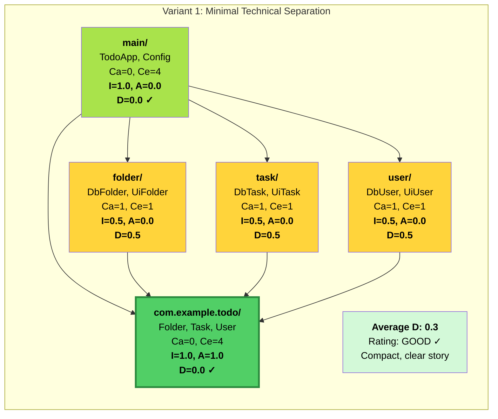


### **7.2.2. Package Structure: Variant 2**

A **more differentiated separation** of **technical aspects** as packages tends to **negatively** affect readability, see Variant 2.

```
com.example.todo/  
├── alert/  
├── exchange/  
├── folder/  
├── human/  
├── main/  
├── task/  
├── user/  
├── Folder.java  
├── Task.java  
└── User.java
```

* ```folder/```, ```task/```, ```user/``` - concrete realizations, e.g., for communication with the **real** database.  
* ```alert/``` - automatic notification upon certain events.  
* ```human/``` - user interfaces with graphical controls.  
* ```exchange/``` - exchange via Http.  
* ```main/``` - entry point for initialization and configuration of the entire application.

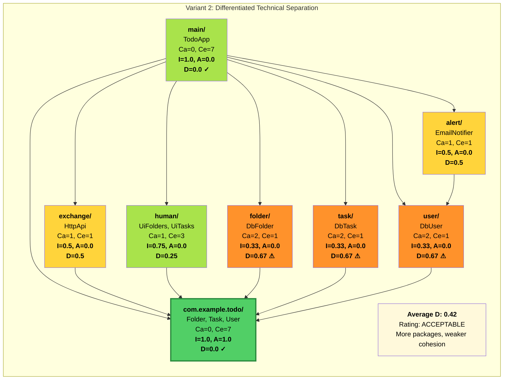

### **7.2.3. Package Structure: Variant 3**

A more differentiated separation (**Decomposition**) of the domain aspects as packages tends to **positively** affect readability, see Variant 3 (e.g., through **Decomposition of** User aspects UI and Person becomes Person and User = UI)

```
com.example.todo/  
├── folder/  
├── person/  
├── main/  
├── task/  
├── user/  
├── Folder.java  
├── Task.java  
├── Person.java  
└── User.java
```

* ```folder/``` - Database, user interfaces, and exchange via Http.  
* ```task/``` - Database, user interfaces, and exchange via Http.  
* ```person/``` - Database, user interfaces, exchange via Http.  
* ```user/``` - User interfaces, exchange via Http, email sending, and authorization.  
* ```main/``` - Entry point for initialization and configuration of the entire application.

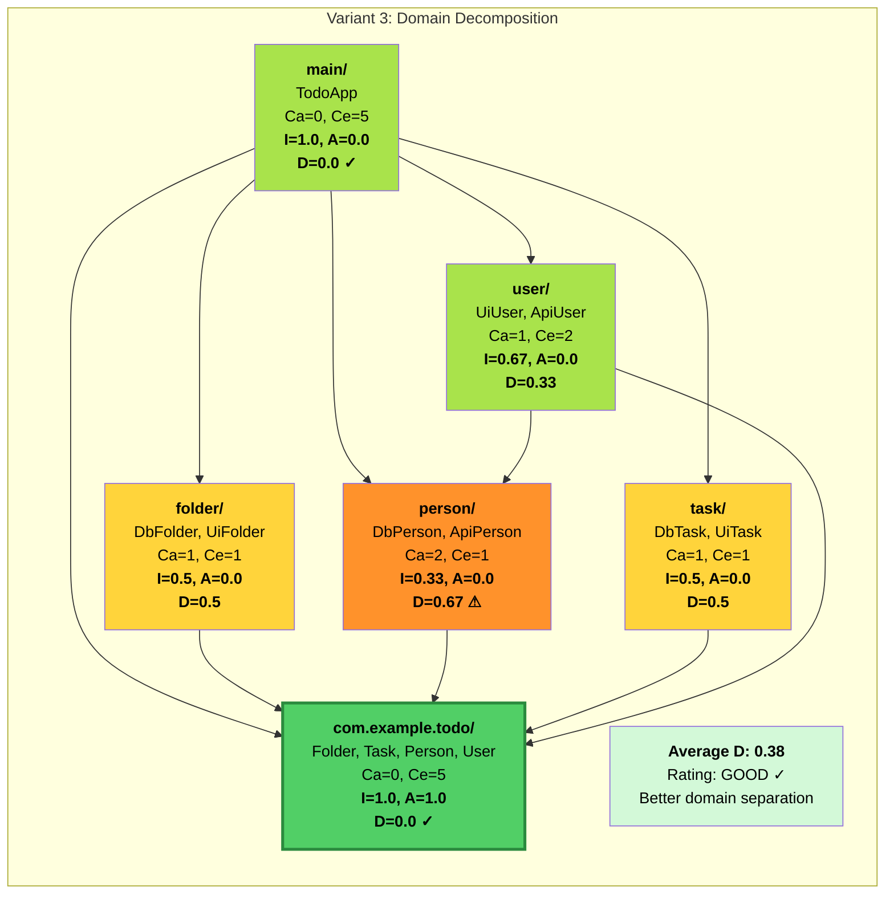

### **7.2.4. Package Structure: Variant 4**

A **data-oriented separation** of the **technical** aspects as packages now definitely **negatively** affects readability, see Variant 4 and compare with package structures of Variants 1, 2, and 3.

```
com.example.todos/  
├── browser/ (All details for graphical controls)  
├── expose/ (All details for exchange via Http)  
├── email/ (Helper classes for communication with email server)  
├── storage/ (All details for communication with database)  
├── setup/  
├── Folder.java  
├── Task.java  
└── User.java
```

* ```storage/``` - all realizations for communication with the real database  
* ```email/``` - all helper classes for communication with email server  
* ```browser/``` - all user interfaces with graphical controls.  
* ```expose/``` - exchange of all resources via Http  
* ```setup/``` - entry point for initialization and configuration of the entire application.

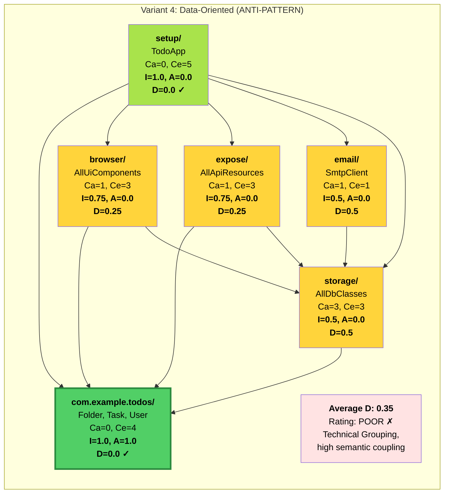
    
### **7.2.5. Package Structure: Variant 5**

An **abstraction-oriented separation** of the domain and technical aspects as packages can rather **positively** affect readability, see Variant 5
```
com.example.todo/  
├── app/  
├── exchange/  
│ ├── envelop/  
│ ├── message  
│ ├── resource/  
│ ├── service/  
│ ├── Envelop.java  
│ ├── Message.java  
│ ├── Resource.java  
│ └── Service.java  
├── person/  
├── folder/  
├── task/  
├── user/  
│ ├── control/  
│ │ ├── Action.java  
│ │ ├── Button.java  
│ │ ├── Dialog.java  
│ │ ├── Form.java  
│ │ ├── Image.java  
│ │ ├── Menu.java  
│ │ ├── Text.java  
│ │ ├── Label.java  
│ │ ├── Table.java  
│ │ └── Tree.java  
│ ├── layout/  
│ │ ├── Color.java  
│ │ ├── Border.java  
│ │ ├── Box.java  
│ │ └── Grid.java  
│ ├── page/  
│ │ ├── MainMenu.java  
│ │ ├── FolderTree.java  
│ │ ├── TaskTable.java  
│ │ ├── TaskDialog.java  
│ │ └── TodoForm.java  
│ ├── Control.java  
│ ├── Layout.java  
│ ├── Page.java  
│ ├── DbUser.java  
│ └── WebUser.java  
├── App.java  
├── Db.java  
├── Message.java  
├── Folder.java  
├── Person.java  
├── Task.java  
└── User.java
```

The inevitable technical aspects to be realized, such as initialization, integration of configuration, UI, persistence, and API interfaces, are also mapped as an abstraction in the root package to maximize readability and maintainability.

* **App** - **abstracts** the application itself. - Entry point, init... and config... of the **entire** application.  
* **Db** - **abstracts** persistence in the application. - Communication with the real database.  
* **User** - **abstracts** user-specific controls and layout elements.  
* **Resource** - **abstracts** the exchange of **resources**.  
* **Message** - **abstracts** the optional functionality for notifications.

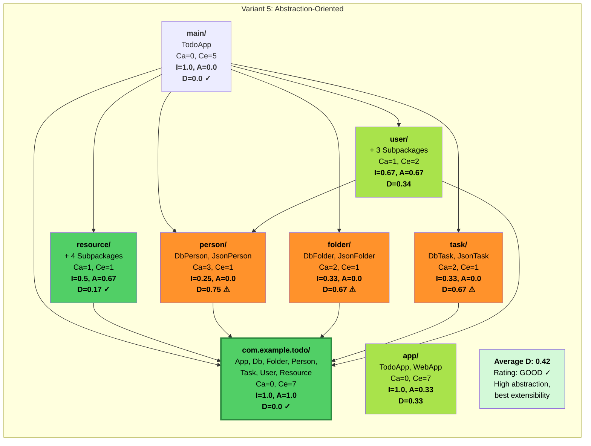

### **7.2.6. Comparison and Summary**

**Ranking by Average D:**

* **Variant 1:** 0.30 (Best balance)  
* **Variant 4:** 0.35 (Metrically okay, conceptually bad!)  
* **Variant 3:** 0.38 (Good domain structure)  
* **Variant 2:** 0.42 (Too fragmented)  
* **Variant 5:** 0.42 (High abstraction, complex)

**Central Insight:**

* **Variant 4** has good metrics, but violates Rule 3 (domain names)!  
* Metrics alone are not enough.  
* Semantic coupling is not measurable.  
* Domain clarity > technical metrics.

**Recommendation:**

* **Variant 1** or **3**  
* Balance between metrics and domain clarity

## **8 Full-Stack Example**

The final example (full-stack application) demonstrates how the root package (```com.example.todo/```) serves as a stable API and all **implementation details** are **encapsulated** in the **domain-oriented** subpackages. The **goal** is to create **loosely coupled, maintainable**, and above all, **domain-clear structures** through composition and encapsulation.

```
com.example.todo/  
├── app/  
│ ├── ConsoleApp.java  
│ ├── ResourceApp.java  
│ ├── TodoApp.java  
│ ├── TodoDb.java  
│ └── WebApp.java  
├── exchange/  
│ ├── envelop/  
│ │ ├── WrappedRequest.java  
│ │ └── WrappedResponse.java  
│ ├── media  
│ │ └── TodoHype.java  
│ ├── resource/  
│ │ └── TodoResource.java  
│ ├── service/  
│ │ └── TodoService.java  
│ ├── Envelop.java  
│ ├── Media.java  
│ └── Served.java  
├── folder/  
│ ├── DbFolder.java  
│ └── JsonFolder.java  
├── person/  
│ ├── DbPerson.java  
│ ├── JsonPerson.java  
│ └── NotifiedPerson.java  
├── task/  
│ ├── DbTask.java  
│ └── JsonTask.java  
├── user/  
│ ├── control/  
│ │ ├── Action.java  
│ │ ├── Button.java  
│ │ ├── Dialog.java  
│ │ ├── Form.java  
│ │ ├── Image.java  
│ │ ├── Menu.java  
│ │ ├── Text.java  
│ │ ├── Label.java  
│ │ ├── Table.java  
│ │ └── Tree.java  
│ ├── layout/  
│ │ ├── Color.java  
│ │ ├── Border.java  
│ │ ├── Box.java  
│ │ └── Grid.java  
│ ├── page/  
│ │ ├── MainMenu.java  
│ │ ├── FolderTree.java  
│ │ ├── TaskTable.java  
│ │ ├── TaskDialog.java  
│ │ └── TodoForm.java  
│ ├── Control.java  
│ ├── Layout.java  
│ ├── Page.java  
│ ├── DbUser.java  
│ └── WebUser.java  
├── App.java  
├── Db.java  
├── Message.java  
├── Folder.java  
├── Person.java  
├── Task.java  
└── User.java
```

As core abstractions from the business requirements, the entities **Folder, Task, Person, Message** and **User** are placed as interfaces directly in the root package, supplemented by technical abstractions such as **App, Db**, and **Served**. The subpackages refer exclusively to the abstractions in the next higher package and encapsulate the implementation details. Likewise, a strict dependency inversion (**Inversion of Control**) is ensured. The root package thus remains independent of the implementation details.

### **8.1. Initialization, Dependency Injection, and Configuration (app/)**

* **Domain Justification:** The ```App.java``` is the highest abstraction of the application. Initialization, configuration, and building the object graph **(DI)** are implementation details of the App abstraction and therefore belong in the subpackage ```app/```.  
* **Package Name:** ```app/```. This name is domain-abstract and describes the core of the application.  
* **Content:** The package contains the concrete implementations of the ```App.java``` interface, such as ```TodoApp.java```, ```ConsoleApp.java```, or ```WebApp.java```.  
* **DI Container:** External DI containers are avoided to keep the construction of the object graph transparent and traceable. Dependency injection and configuration occur in a single place in the App.java implementations.

### **8.2. User Interface and its Subpackages (user/)**

* **Domain Justification:** The user interface **(UI)** is a central business concept from the end-user perspective **("How do I interact with my tasks?")**. The abstractions ```User.java```, ```Page.java```, and ```Control.java``` define the interface of the UI, while the subpackage ```user/``` encapsulates its implementation details.  
* **Package Name:** ```user/```. The package is dedicated to the domain concept **"User"** and implements its **UI** interaction.  
* **Content:** The subpackage contains the implementation of ```WebUser.java```. It also includes internal, UI-specific subpackages such as ```control/``` (reusable UI controls) and ```page/``` (complete page views), which completely encapsulate the technical details of the chosen UI technology (e.g., HTML/CSS/JS, frameworks).

### **8.3. Database Persistence (Decorator Pattern)**

* **Domain Justification:** Persistence is an internal detail for the realization of domain concepts (```Folder```, ```Task```, ```Person```). Instead of a technical ```db/``` package, the **Decorator design pattern** is used to extend objects with persistence behavior. The ```Db.java``` interface in the root package abstracts database access.  
* **Packaging:** The persistence logic is directly integrated into the domain packages (```folder/```, ```task/```, ```person/```, ```user/```).  
* **Example:** ```DbFolder.java``` **(Decorator):** A class that implements the ```Folder``` interface and decorates another ```Folder``` object to make it persistent. It injects the Db abstraction. The details of the database implementation (JDBC, ORM) are encapsulated within this class.

### **8.4. API Interface and its Subpackages (exchange/)**

* **Domain Justification:** The API is the domain concept of information exchange with external systems. It is abstracted by the ```Resource.java``` interface in the root package. The subpackage ```resource/``` realizes this interface and summarizes all technical details of the API provision (e.g., JAX-RS, SOAP).  
* **Package Name:** ```exchange/```. This name is domain-specific and describes the information exchange between external applications.  
* **Content:** It contains implementations of Resource.java (e.g., TodoResource.java for JAX-RS), Message.java, and Service.java, as well as technical subpackages like ```envelop/``` and ```media/``` for encapsulating I/O objects and formats (e.g., HATEOAS).

### **8.5. Utility Classes - Avoidance of (util/)**

* **Domain Justification:** In a strictly object-oriented world, static utility classes do not exist. Logic should always be encapsulated in an object and reused via composition or the Decorator pattern.  
* **Avoidance of util/ packages:** Packages like ```util/``` or ```helper/``` are too technical and **violate Rule 3**.  
* **Solution:** Package-private helper classes within the domain packages or independent objects (e.g., ```JsonPerson.java``` with its own JSON logic) that are included via composition. This promotes adherence to SRP and testability.

## **9 Conclusion: The "Pro..." as an Architect**

The true ***"Pro..."*** is characterized by the fact that they:

* **Always reflect the domain:** They exclusively use the language of the domain in the package structure to create a navigation aid that directly follows the business logic (Rule 3).  
* **Know the OOPD principles and measurement procedures:** They use the component principles (REP, CCP, CRP, ADP, SDP, SAP) and **metrics (A, I, and D) for quantifying code quality** and identifying problem cases in the architecture.  
* **Act pragmatically according to rules, measure, and adjust if necessary:** They apply the three golden rules (no dependency on sub-packages, progressive detailing, domain-specific names) as pragmatic guidelines to prevent cycles (Rule 1) and ensure a progressive story (Rule 2).

> Code structure is an architectural decision that lays the foundation for the long-term success of your project.

## **10 Sources and Further Links**

This article is based on the established component principles of Robert C. Martin and the pragmatic rules for object-oriented packaging as summarized by Robert Bräutigam.

**Primary Sources:**

* **Robert Bräutigam (2017):** **"Happy Packaging!"**  
  * The three golden rules.  
  * *Link:* https://javadevguy.wordpress.com/2017/12/18/happy-packaging/  
* **Robert Bräutigam (2017):** **"Next Level Readability (German: Lesbarkeit)"**  
  * The philosophy of "Customer Story" coding.  
  * *Link:* https://www.informatik-aktuell.de/entwicklung/programmiersprachen/next-level-lesbarkeit.html  
* **Robert Bräutigam (2018):** **"Best way to naming classes and packages in Java"**  
  * Quote: “Model the problem, not the technology! Find suitable abstractions straight from the business requirements and hide implementation details, like the fact that you are using MVC.”  
  * *Link:* https://softwareengineering.stackexchange.com/a/372121  
* **Robert C. Martin (Uncle Bob):** **"Component Principles"**  
  * The theoretical foundations and metrics for coupling (ADP, SDP, SAP) and cohesion (REP, CCP, CRP).  
  * *Source:* Robert C. Martin, *Agile Software Development, Principles, Patterns, and Practices*. Prentice Hall, 2002

**Example for Change "Add Priority"**

| Architecture Approach | Number of Changed Files | Number of Changed Packages | Effort for Change | Example for Change "Add Priority" |
| :---- | :---- | :---- | :---- | :---- |
| **Layered Architecture** | 5–6 | 4 | High | Task (Domain), TaskDTO (Application), TaskMapper (Application), TaskService (Application), TaskController (Presentation), TaskEntity (Infrastructure) |
| **OO Package Design** | 1–2 | 1 | Low | Task.java (Interface): Add priority() method SimpleTask.java / DbTask.java: Implement priority |

**Result:**

* Layered: 6 files, 4 packages must be adapted  
* OO: 2 files, 1 package must be adapted  
* **→ 70% fewer changes with OO Package Design!**

## **11 Appendices**

### **11.1 OO vs Layered Architecture**

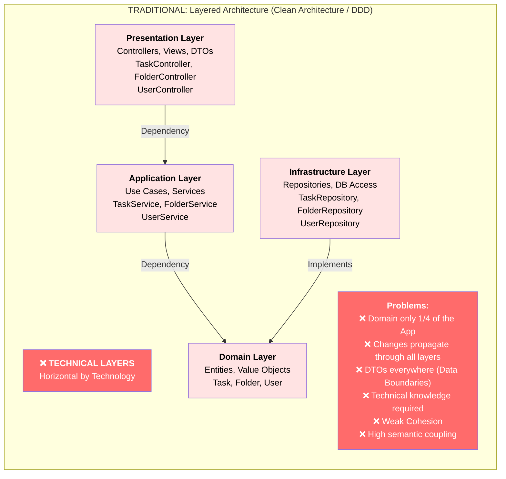

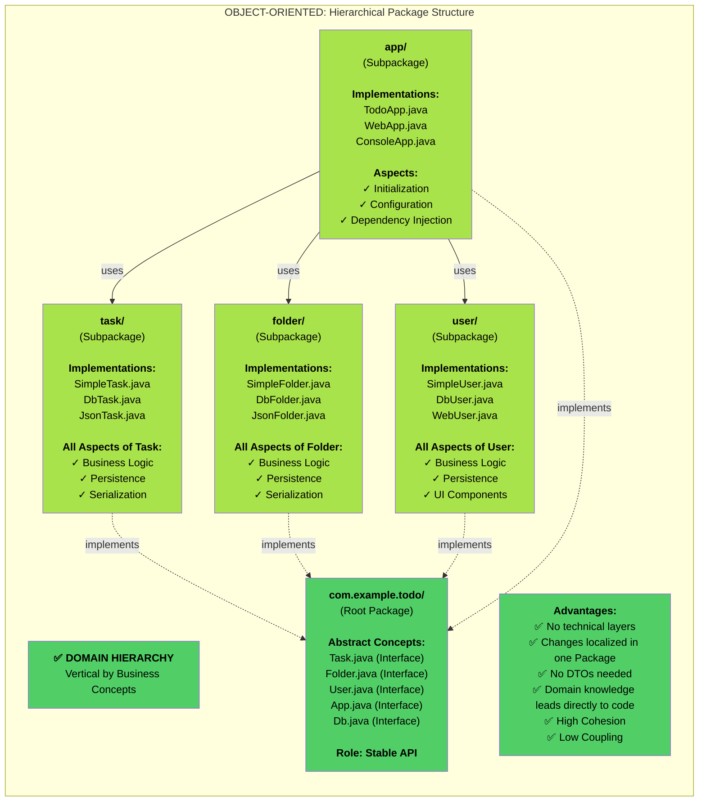

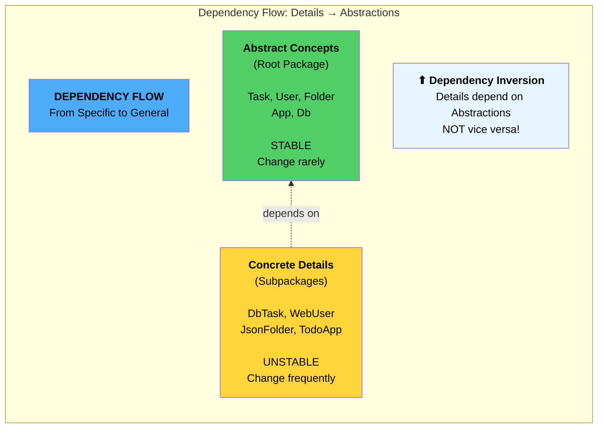

```mermaid
graph TB       
    subgraph "Example: Feature Change 'Add Priority'"  
        direction TB  
          
        CHANGE_TITLE["<b>CHANGE: Task<br/> gets 'Priority' field</b>"]  
          
        subgraph "Layered: 5-6 Files Change"  
            L1["1 Task (Domain)"]  
            L2["2 TaskDTO (Application)"]  
            L3["3 TaskMapper (Application)"]  
            L4["4 TaskService (Application)"]  
            L5["5 TaskController (Presentation)"]  
            L6["6 TaskEntity (Infrastructure)"]  
              
            L1 --> L2 --> L3 --> L4 --> L5 --> L6  
              
            style L1 fill:#ffe3e3,color:#000  
            style L2 fill:#ffe3e3,color:#000  
            style L3 fill:#ffe3e3,color:#000  
            style L4 fill:#ffe3e3,color:#000  
            style L5 fill:#ffe3e3,color:#000  
            style L6 fill:#ffe3e3,color:#000  
        end

        RESULT["<b>Result:</b><br/>Layered: 6 files, 4 Packages"]  
          
        style CHANGE_TITLE fill:#4dabf7,color:#000  
        style RESULT fill:#51cf66,color:#000  
    end
```

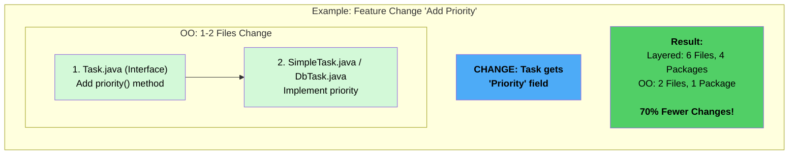

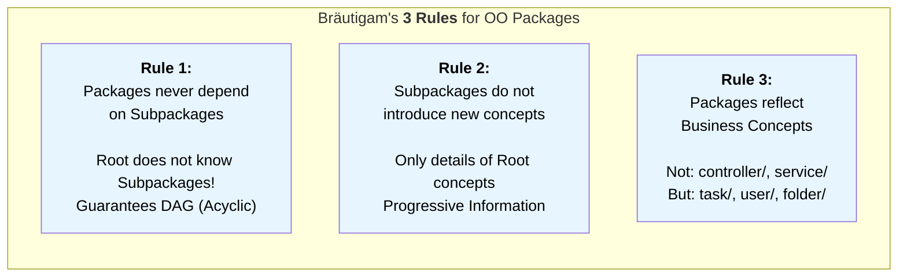

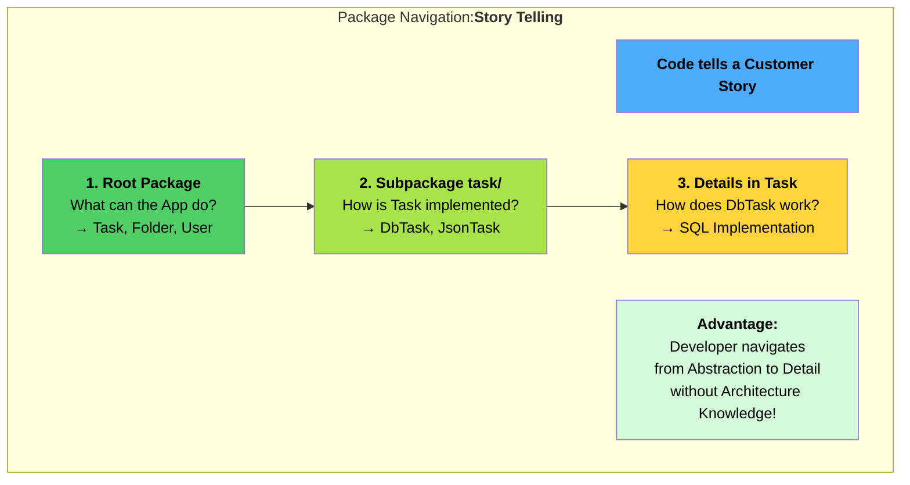

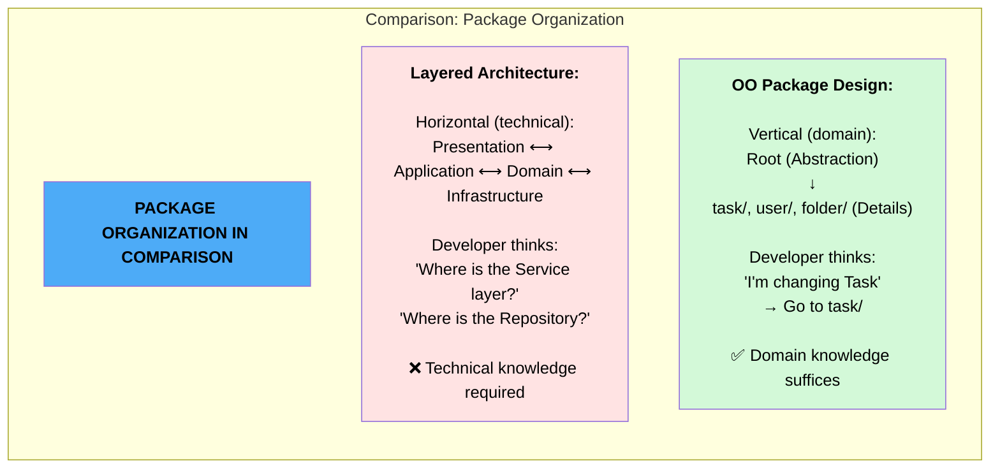

## **11.2 Dependencies Principles**
```mermaid
%% Acyclic Dependencies Principle (ADP)  
graph TB  
    subgraph "BAD: Cyclic Dependencies - Morning After Syndrome"  
        A1[Package A]  
        B1[Package B]  
        C1[Package C]  
        D1[Package D]  
          
        A1 -->|depends on| B1  
        B1 -->|depends on| C1  
        C1 -->|depends on| D1  
        D1 -->|depends on| A1  
          
        style A1 fill:#ff6b6b  
        style B1 fill:#ff6b6b  
        style C1 fill:#ff6b6b  
        style D1 fill:#ff6b6b  
    end  
      
    subgraph "GOOD: Acyclic Dependencies - DAG Structure"  
        A2[Package A]  
        B2[Package B]  
        C2[Package C]  
        D2[Package D]  
        E2[Package E]  
          
        A2 -->|depends on| B2  
        A2 -->|depends on| C2  
        B2 -->|depends on| D2  
        C2 -->|depends on| D2  
        D2 -->|depends on| E2  
          
        style A2 fill:#51cf66  
        style B2 fill:#51cf66  
        style C2 fill:#51cf66  
        style D2 fill:#51cf66  
        style E2 fill:#51cf66  
    end  
      
    subgraph "Breaking Cycles with DIP"  
        X1[Package X]  
        Y1[Package Y]  
        I1[Interface Package]  
          
        X1 -->|depends on| I1  
        Y1 -->|depends on| I1  
        Y1 -.->|implements| I1  
          
        style I1 fill:#4dabf7  
        style X1 fill:#51cf66  
        style Y1 fill:#51cf66  
    end
```

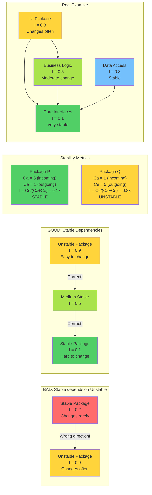
