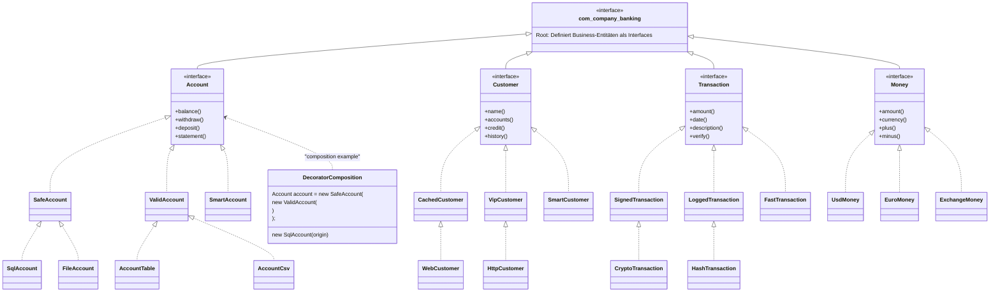

```mermaid
%% OOP-konforme Package-Architektur (Yegor's Principles)
classDiagram

%% Level 0: Domain (Root)
class com_company_banking {
  <<interface>>
  Root: Definiert Business-Entitäten als Interfaces
}

%% Level 1: Business Entity Interfaces
class Account {
  <<interface>>
  +balance()
  +withdraw()
  +deposit()
  +statement()
}
class Customer {
  <<interface>>
  +name()
  +accounts()
  +credit()
  +history()
}
class Transaction {
  <<interface>>
  +amount()
  +date()
  +description()
  +verify()
}
class Money {
  <<interface>>
  +amount()
  +currency()
  +plus()
  +minus()
}

com_company_banking <|-- Account
com_company_banking <|-- Customer
com_company_banking <|-- Transaction
com_company_banking <|-- Money

%% Level 2: Core Decorators
class SafeAccount
class ValidAccount
class SmartAccount
Account <|.. SafeAccount
Account <|.. ValidAccount
Account <|.. SmartAccount

class CachedCustomer
class VipCustomer
class SmartCustomer
Customer <|.. CachedCustomer
Customer <|.. VipCustomer
Customer <|.. SmartCustomer

class SignedTransaction
class LoggedTransaction
class FastTransaction
Transaction <|.. SignedTransaction
Transaction <|.. LoggedTransaction
Transaction <|.. FastTransaction

class UsdMoney
class EuroMoney
class ExchangeMoney
Money <|.. UsdMoney
Money <|.. EuroMoney
Money <|.. ExchangeMoney

%% Level 3: Technical Details
class SqlAccount
class AccountTable
SafeAccount <|.. SqlAccount
ValidAccount <|.. AccountTable

class FileAccount
class AccountCsv
SafeAccount <|.. FileAccount
ValidAccount <|.. AccountCsv

class WebCustomer
class HttpCustomer
CachedCustomer <|.. WebCustomer
VipCustomer <|.. HttpCustomer

class CryptoTransaction
class HashTransaction
SignedTransaction <|.. CryptoTransaction
LoggedTransaction <|.. HashTransaction

%% Decorator Pattern Example (Composition)
class DecoratorComposition {
  Account account = new SafeAccount(
      new ValidAccount(
        new SqlAccount(origin)
      )
    );
}
Account <.. DecoratorComposition : "composition example"

%% Legend and Principles (as comments)
%% - Business-Entitäten als Interfaces: Account, Customer, Money (nicht AccountService)
%% - Decorator Pattern: SafeAccount, ValidAccount - Komposition statt Vererbung
%% - Sub-Packages: Nur technische Details (SQL, File, Web) - keine neuen Business-Konzepte
%% - ✓ Parent ↛ Child Dependencies
%% - ✓ "Was es ist" nicht "was es tut"
%% - ✓ Intelligente Objekte statt Daten-Container
```
