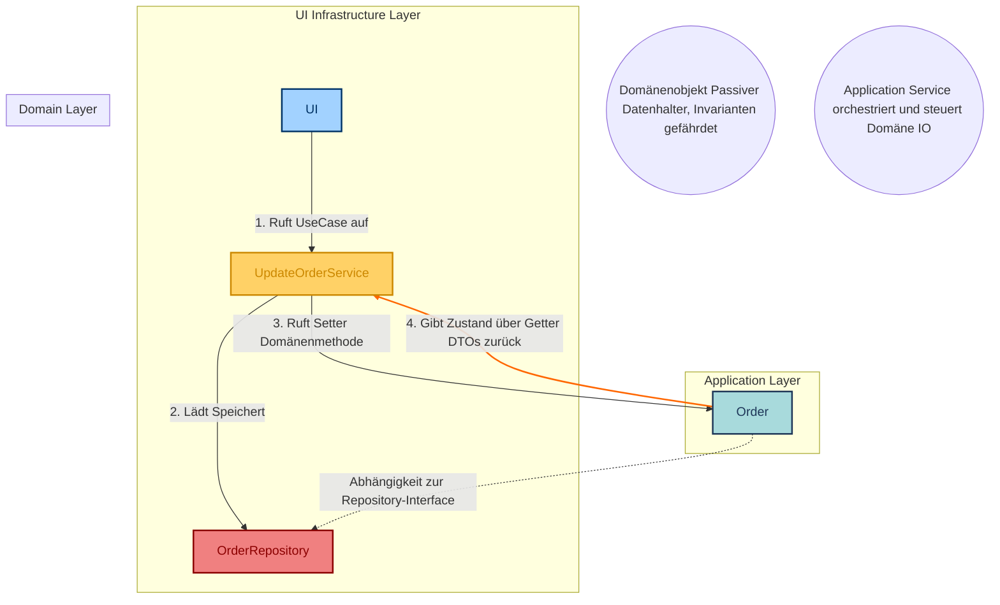
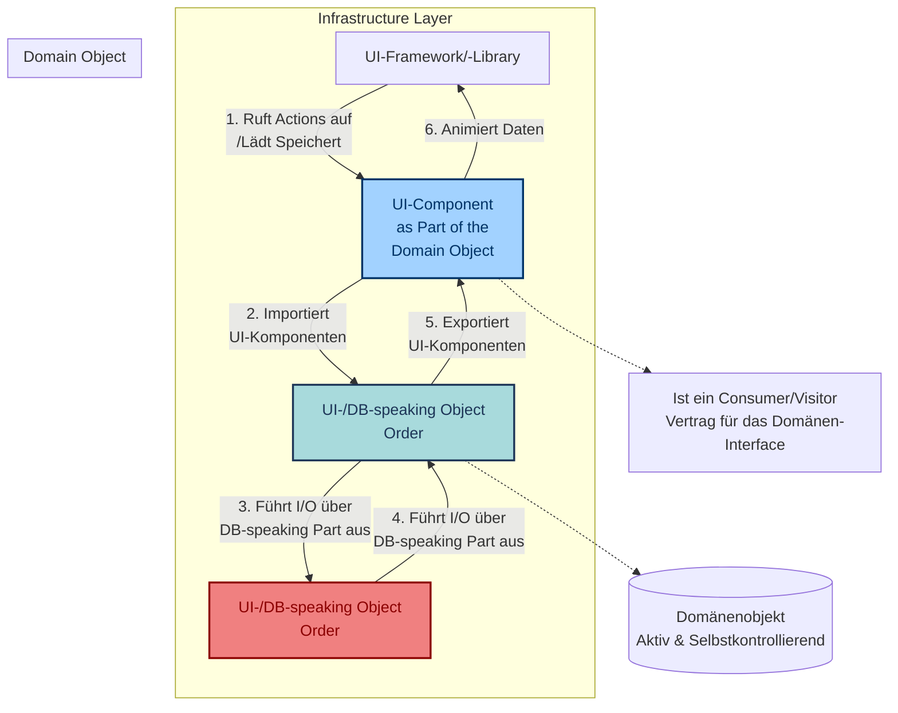

## **Manifest der Aktiven Objekte: Vertragliche Kapselung in OO-DDD**

Dieses Dokument bietet eine vollständige Analyse des grundlegenden Konflikts zwischen **Objektorientierter Programmierung (OOP)** und der traditionellen **Schichtenarchitektur** in Bezug auf die **Datenkapselung**. Ziel ist die Etablierung eines **aktiven, selbstkontrollierenden Domänenobjekts** als Kernprinzip des Object-Oriented Domain Driven Design (OO-DDD).

Der zentrale Paradigmenwechsel liegt in der Kontrolle des **Kontrollflusses**: weg von der externen **Orchestrierung** (Service Layer) hin zur **Autonomie** des Domänenobjekts.

### **1\. Die Krise der Kapselung: Das Enterprise-Anti-Pattern**

OOP verlangt, dass Objekte **Verantwortung** für ihren Zustand übernehmen und diesen schützen. Kapselung bedeutet, **Geheimnisse** zu haben und eine **effektive Abstraktion** zu bieten, sodass Probleme einmal gelöst und danach nie wieder bedacht werden müssen.

#### **1.1 Der Bruch der Kapselung: Ask vs. Tell**

Das häufigste Anti-Pattern in der Unternehmenssoftware (**"Enterprise"-Code**) bricht das Prinzip **"Tell, Don't Ask"**, indem es Logik aus dem Objekt in den Service-Layer verlagert. Dies reduziert das Domänenobjekt auf einen passiven **Datenhalter** mit öffentlichen Gettern.

| Prinzipienkonform (Tell, Don't Ask) | Anti-Pattern (Daten-Exposition) |
| :---- | :---- |
| **Aktiv:** Das Objekt führt die Logik selbst aus: cat.speak(). | **Passiv:** Der Service fragt den Zustand ab: service.speak(cat.getSpeech()). |
| Das Cat-Objekt entscheidet in seiner speak()-Methode, *wie* und *was* es sagt. | Der Service ist für die Logik verantwortlich. Die **Invarianten** des Objekts sind gefährdet. |

### **2\. Die Klassische Schichtenarchitektur (Das Passive Domänenobjekt)**

In der klassischen Layered Architecture wird die Domäne auf eine **Datenstruktur** reduziert. Der Use Case (Application Service) agiert als Controller, der Domäne, Repository und UI orchestriert.

#### **2.1 Strukturelle Probleme der Schichtenarchitektur**

Die Architektur schafft zwar technische Trennung, führt aber zu einer logischen Überlastung der externen Layer:

1. **Domänen-Reduzierung:** Die "Domäne" ist oft nur **ein Viertel der gesamten Anwendung** und wird durch die Application- und Infrastructure-Layer dominiert.  
2. **Daten-Leakage und Kopplung:** Layers neigen dazu, Daten nach oben zu leaken (über **DTOs**), was ungewollte Kopplung erzeugt.  
3. **Setter-Anti-Pattern:** Die Notwendigkeit von Settern zur Befüllung durch Frameworks zwingt zur Verlagerung der **Validierung** (Schutz der Invarianten) in den Application Service oder den UI-Controller. **Die Kapselung ist gebrochen.**

#### **2.2 Diagramm: Kontrollfluss der Klassischen Architektur (Orchestrierung)**

Der Application Service ist der Dirigent, der die Domäne und I/O steuert.

### **3\. Radikale OO-DDD Kapselung: Das UI of Objects Prinzip**

Das **UI of Objects** Prinzip ist die Architekturstrategie zur **strikten Entkopplung** der Domäne von der UI. Es fordert, dass die Domäne die Kontrolle über ihre äußere Repräsentation und ihre Zustandsänderung übernimmt.

**Der zentrale Punkt:** Die UI **spricht das Objekt an**, jedoch nur über einen **volldefinierten, vertraglich zugesicherten Kanal**, den das Objekt selbst bereitstellt. Das Domänenobjekt ist der **Vertragsgeber**.

Dieses Prinzip wird durch zwei notwendige, **taktische Kommunikationsverträge** implementiert:

#### **3.1 Taktischer Vertrag: Der View (Der Lesekanal)**

Die UI **spricht** das Objekt an und **fragt** nach seiner Darstellung. Das Domänenobjekt **antwortet** mit einer fertigen View oder einem Snapshot. Das Objekt **weiß, wie es sich zu präsentieren hat**.

**Mechanismus:**

1. Die UI ruft die vertraglich definierte Methode auf (employee.toView()).  
2. Das Objekt generiert einen **View-Adapter (Snapshot)**, der **nur Getter** und keine Setter enthält.  
3. **Resultat:** Die Domäne kontrolliert, welche Informationen und in welcher Formatierung sie nach außen gibt. Die UI kann nicht in den internen Zustand blicken.

#### **3.2 Taktischer Vertrag: Der Action Command (Der Schreibkanal/Invarianten-Gatekeeper)**

Um den Zustand zu ändern, **spricht die UI das Objekt** mit einer gültigen Geschäftsaktion an. Der Action Command ist der **Gatekeeper**, der den Aufruf der Domänenmethode kapselt.

**Mechanismus:**

1. Die UI löst einen gekapselten **Action Command** aus (z.B. RenameEmployeeAction.call()).  
2. Der Command ruft die geschäftskritische Domänenmethode auf (employee.rename(String newName)).  
3. **Resultat:** Der Action Command verhindert, dass UI-Frameworks direkt Setter aufrufen und somit die Validierungslogik umgehen. Die Kommunikation ist auf **gültige, vom Domänenobjekt definierte Geschäftsaktionen** beschränkt.

**Beispiel (JSF Action Command):**
```xml
\\\<\\\!-- Der Action Command als Gatekeeper: Die UI löst eine gekapselte Action aus. \--\\\>  
\\\<h:commandButton value="Speichern (Action)"  
                 action="\\\#{employeeFrom.inputView.updateAction.call()}" /\\\>
```
#### **3.3 Self-Persistency (Der DB-Speaking Part)**

Als radikale Form der Kapselung wird die **Persistenz-Logik in das Domänenobjekt verlagert**. Nach einer erfolgreichen Zustandsänderung (rename()) ruft das Domänenobjekt intern seine I/O-Logik auf, um sich selbst zu persistieren.

* **Resultat:** Das Domänenobjekt ist das einzige, das entscheidet, **wann** und **wie** es gespeichert wird. Der Application Service entfällt als orchestraler Persistenz-Steuerer.

#### **3.4 Diagramm: Kontrollfluss der OO-DDD-Kapselung (Autonomie)**

Das Domänenobjekt ist aktiv, es kontrolliert die Persistenz (DB) und die Darstellung (View) autonom.


### **4\. Umfassender Architektur-Vergleich**

| Merkmal | Klassisch (Schichten/Hexagonal) | OO-DDD (UI of Objects) |
| :---- | :---- | :---- |
| **Rolle des Domänenobjekts** | **Passiv** (Datenhalter), verletzt **Kapselung**. | **Aktiv** (Invarianten-Beschützer), folgt **Tell, Don't Ask**. |
| **Kontrollprinzip** | **Ask, then Tell** (Controller/Service steuert und validiert). | **Tell, Don't Ask** (Domäne steuert sich selbst und ihre Invarianten). |
| **UI-Kommunikation** | **Daten** reisen (Domäne → DTO → UI) und erzeugen Kopplung. | **Views** reisen (Domäne liefert die fertige Darstellung über **View-Vertrag**). |
| **Validierung** | **Verteilt** (Service/Controller) oder **gebrochen** (durch Setter). | **Gekapselt** (ausschließlich in der Domäne, geschützt durch **Action Commands**). |
| **Persistenz** | Externer Dienst (**Repository**) orchestriert die Speicherung. | Interner Logikblock (**DB-Speaking Part**) steuert die Speicherung (Self-Persistency). |
| **Ziel** | Klare **Abgrenzung** von technischen Schichten. | Klare **Kapselung** des Objekts, Fokus auf **Wartbarkeit** und **Code-Qualität**. |

