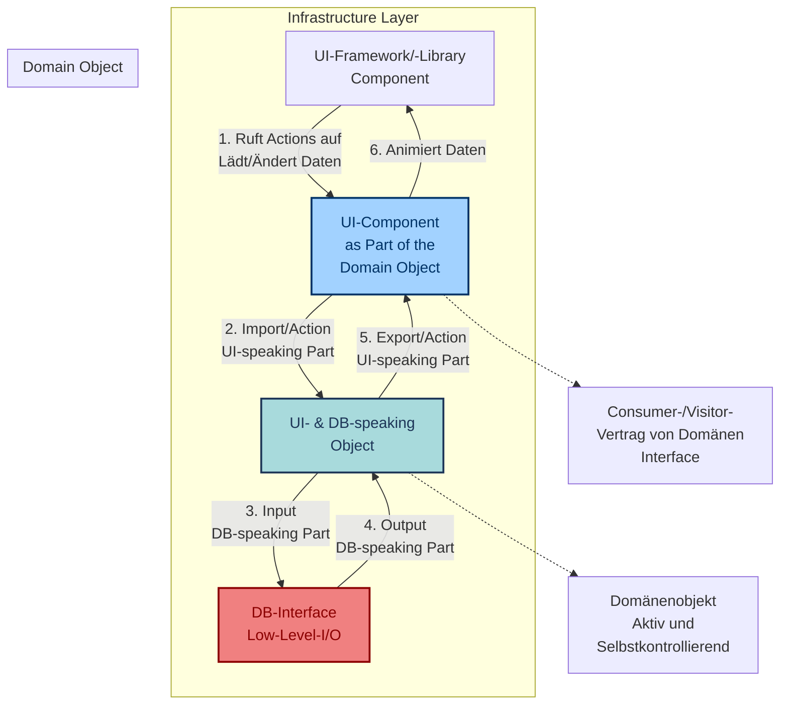
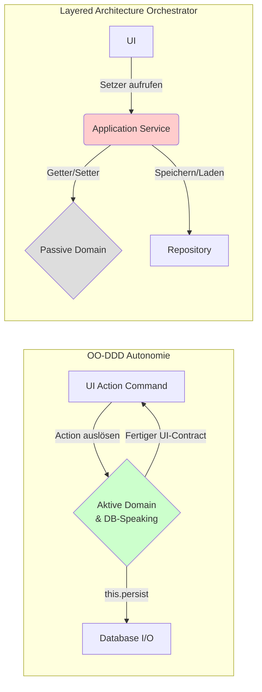

## **Implementing: Object-Oriented Domain Driven Design (OO-DDD)**

Dieses Dokument bietet eine vollständige Analyse des grundlegenden Konflikts zwischen **Objektorientierter Programmierung (OOP)** und der traditionellen **Schichtenarchitektur** in Bezug auf die **Datenkapselung**. Ziel ist die Etablierung eines **aktiven, selbstkontrollierenden Domänenobjekts** als Kernprinzip des Object-Oriented Domain Driven Design (OO-DDD).

Der zentrale Paradigmenwechsel liegt in der Kontrolle des **Kontrollflusses**: weg von der externen **Orchestrierung** (Service Layer) hin zur **Autonomie** des Domänenobjekts.

### **1. Die Krise der Kapselung: Das Enterprise-Anti-Pattern**

OOP verlangt, dass Objekte **Verantwortung** für ihren Zustand übernehmen und diesen schützen. Kapselung bedeutet, **Geheimnisse** zu haben und eine **effektive Abstraktion** zu bieten, sodass Probleme einmal gelöst und danach nie wieder bedacht werden müssen.

#### **1.1 Der Bruch der Kapselung: Ask vs. Tell**

Das häufigste Anti-Pattern in der Unternehmenssoftware (**"Enterprise"-Code**) bricht das Prinzip **"Tell, Don't Ask"**, indem es Logik aus dem Objekt in den Service-Layer verlagert. Dies reduziert das Domänenobjekt auf einen passiven **Datenhalter** mit öffentlichen Gettern.

| Prinzipienkonform (Tell, Don't Ask) | Anti-Pattern (Daten-Exposition) |
| :---- | :---- |
| **Aktiv:** Das Objekt führt die Logik selbst aus: cat.speak(). | **Passiv:** Der Service fragt den Zustand ab: service.speak(cat.getSpeech()). |
| Das Cat-Objekt entscheidet in seiner speak()-Methode, *wie* und *was* es sagt. | Der Service ist für die Logik verantwortlich. Die **Invarianten** des Objekts sind gefährdet. |

### **2. Die Klassische Schichtenarchitektur (Das Passive Domänenobjekt)**

In der klassischen Layered Architecture wird die Domäne auf eine **Datenstruktur** reduziert. Der Use Case (Application Service) agiert als Controller, der Domäne, Repository und UI orchestriert.

#### **2.1 Strukturelle Probleme der Schichtenarchitektur**

Die Architektur schafft zwar technische Trennung, führt aber zu einer logischen Überlastung der externen Layer:

1. **Domänen-Reduzierung:** Die "Domäne" ist oft nur **ein Viertel der gesamten Anwendung** und wird durch die Application- und Infrastructure-Layer dominiert.  
2. **Daten-Leakage und Kopplung:** Layers neigen dazu, Daten nach oben zu leaken (über **DTOs**), was ungewollte Kopplung erzeugt.  
3. **Setter-Anti-Pattern:** Die Notwendigkeit von Settern zur Befüllung durch Frameworks zwingt zur Verlagerung der **Validierung** (Schutz der Invarianten) in den Application Service oder den UI-Controller. **Die Kapselung ist gebrochen.**

#### **2.2 Diagramm: Kontrollfluss der Klassischen Architektur (Orchestrierung)**

Der Application Service ist der Dirigent, der die Domäne und I/O steuert.


```java
// Das passive Domänenobjekt im "Enterprise"-Code
public class Order {  
    private int amount;  
    
    // Setter für Data Binding – Verletzung der Invarianten
    public void setAmount(int amount) {  
        // KEIN SCHUTZ. Der Zustand kann von außen jederzeit ungültig gesetzt werden.
        this.amount = amount;   
    }  
    // Getter – lädt externe Services zur Orchestrierung ein.
    public int getAmount() {  
        return amount;
    }
}
```

```java
/**
 * EmployeeComparison.java
 *
 * Vergleicht das Setter-Anti-Pattern (passive DTO) mit dem aktiven OO-DDD-Objekt.
 *
 * Passive DTO (Anti-Pattern):
 * - Logik liegt extern (im Service Layer).
 * - Daten (Naked Data) sind ungeschützt (Setter).
 * - Invarianten können leicht gebrochen werden.
 *
 * Aktives OO-DDD-Objekt:
 * - Logik liegt intern (in der Business-Methode).
 * - Kapselung ist gewährleistet (keine Setter).
 * - Schutz der Invarianten durch das Objekt selbst.
 */

// --- ANTI-PATTERN: Passive DTO (Naked Data) ---
class PassiveEmployeeDTO {
    private int salary;
    private boolean isManager;

    // Setter erlaubt JEDEM, den Zustand ohne Validierung zu ändern
    public void setSalary(int salary) {
        this.salary = salary;
    }

    public int getSalary() {
        return salary;
    }

    public boolean isManager() {
        return isManager;
    }

    public void setIsManager(boolean isManager) {
        this.isManager = isManager;
    }
}

// --- ORCHESTRATOR: Der Gott-Service (Muss alle Regeln prüfen) ---
class SalaryService {
    public void grantBonus(PassiveEmployeeDTO employee, int bonusAmount) {
        // EXTERN: Der Service MUSS die Invarianten prüfen, da das Objekt es nicht tut.
        if (employee.isManager() && employee.getSalary() + bonusAmount > 10000) {
            System.err.println("SERVICE: Regelbruch! Manager-Gehalt darf 10000 nicht überschreiten.");
            return;
        }

        // Der Service orchestriert die Zustandsänderung
        employee.setSalary(employee.getSalary() + bonusAmount);
        System.out.println("SERVICE: Bonus von " + bonusAmount + " gewährt. Neues Gehalt: " + employee.getSalary());
    }
}
```

### **3. Radikale OO-DDD Kapselung: Das UI of Objects Prinzip**

Das **UI of Objects** Prinzip ist die Architekturstrategie zur **strikten Entkopplung** der Domäne von der UI. Es fordert, dass die Domäne die Kontrolle über ihre äußere Repräsentation und ihre Zustandsänderung übernimmt.

**Der zentrale Punkt:** Die UI **spricht das Objekt an**, jedoch nur über einen **volldefinierten, vertraglich zugesicherten Kanal**, den das Objekt selbst bereitstellt. Das Domänenobjekt ist der **Vertragsgeber**.

Dieses Prinzip wird durch zwei notwendige, **taktische Kommunikationsverträge** implementiert:

#### **3.1 Taktischer Vertrag: Der View (Der Lesekanal)**

Die UI **spricht** das Objekt an und **fragt** nach seiner Darstellung. Das Domänenobjekt **antwortet** mit einer fertigen View oder einem Snapshot. Das Objekt **weiß, wie es sich zu präsentieren hat**.

**Mechanismus:**

1. Die UI ruft die vertraglich definierte Methode auf (employee.toView()).  
2. Das Objekt generiert einen **View-Adapter (Snapshot)**, der **nur Getter** und keine Setter enthält.  
3. **Resultat:** Die Domäne kontrolliert, welche Informationen und in welcher Formatierung sie nach außen gibt. Die UI kann nicht in den internen Zustand blicken.

#### **3.2 Taktischer Vertrag: Der Action Command (Der Schreibkanal/Invarianten-Gatekeeper)**

Um den Zustand zu ändern, **spricht die UI das Objekt** mit einer gültigen Geschäftsaktion an. Der Action Command ist der **Gatekeeper**, der den Aufruf der Domänenmethode kapselt.

**Mechanismus:**

1. Die UI löst einen gekapselten **Action Command** aus (z.B. RenameEmployeeAction.call()).  
2. Der Command ruft die geschäftskritische Domänenmethode auf (employee.rename(String newName)).  
3. **Resultat:** Der Action Command verhindert, dass UI-Frameworks direkt Setter aufrufen und somit die Validierungslogik umgehen. Die Kommunikation ist auf **gültige, vom Domänenobjekt definierte Geschäftsaktionen** beschränkt.

**Beispiel (JSF Action Command):**
```xml
<\!-- Der Action Command als Gatekeeper: Die UI löst eine gekapselte Action aus. --\>  
<h:commandButton value="Speichern (Action)"  
                 action="\\\#{employeeFrom.inputView.updateAction.call()}" />
```
#### **3.3 Self-Persistency (Der DB-Speaking Part)**

Als radikale Form der Kapselung wird die **Persistenz-Logik in das Domänenobjekt verlagert**. Nach einer erfolgreichen Zustandsänderung (rename()) ruft das Domänenobjekt intern seine I/O-Logik auf, um sich selbst zu persistieren.

**Resultat:** Das Domänenobjekt ist das einzige, das entscheidet, **wann** und **wie** es gespeichert wird. Der Application Service entfällt als orchestraler Persistenz-Steuerer.

#### **3.4 Diagramm: Kontrollfluss der OO-DDD-Kapselung (Autonomie)**

Das Domänenobjekt ist aktiv, es kontrolliert die Persistenz (DB) und die Darstellung (View) autonom.


```java
/**
 * AccountNumber.java
 *
 * Repräsentiert eine Kontonummer im OO-DDD.
 * Dieses Objekt ist aktiv und stellt einen View Contract zur Verfügung (UI of Objects).
 * Es gibt KEINE öffentlichen Getter oder Setter, um die Invariante (den Wert selbst) zu schützen.
 */

// Mock-Klassen zur Simulation eines UI-Frameworks (z.B. Wicket)
class Component {}
class Label extends Component {
    public Label(String componentId, String value) {
        // Simuliert die Erzeugung eines Labels in der UI
        System.out.println("UI: Label-Komponente '" + componentId + "' mit Wert: " + value + " erstellt.");
    }
}
class TextField<T> extends Component {
    public TextField(String componentId) {
        // Simuliert die Erzeugung eines editierbaren Feldes
        System.out.println("UI: Eingabefeld '" + componentId + "' für AccountNumber erstellt.");
    }
}

public final class AccountNumber {
    // Der Zustand ist private und final (unveränderlich)
    private final String accountNumber;

    /**
     * Konstruktor zur Validierung und Initialisierung.
     * Stellt sicher, dass die Kontonummer nur im gültigen Zustand erzeugt werden kann (Invariante).
     */
    public AccountNumber(String accountNumber) {
        if (accountNumber == null || !accountNumber.matches("\\d{10}")) {
            throw new IllegalArgumentException("Ungültige Kontonummer. Muss 10 Ziffern sein.");
        }
        this.accountNumber = accountNumber;
    }

    /**
     * Der Lese-Vertrag (View Contract):
     * Liefert dem UI die fertige Darstellung, ohne den internen Wert preiszugeben.
     * @param componentId Die ID der UI-Komponente.
     * @return Eine UI-Komponente zur Anzeige.
     */
    public Component display(String componentId) {
        // Hier könnte Domänenlogik enthalten sein, z.B. Maskierung von Ziffern.
        String maskedNumber = "XXXXXX" + this.accountNumber.substring(6);
        return new Label(componentId, maskedNumber);
    }

    /**
     * Der Bearbeitungs-Vertrag:
     * Liefert dem UI eine editierbare Komponente, falls das Objekt diese Funktion unterstützt.
     * @param componentId Die ID der UI-Komponente.
     * @return Eine editierbare UI-Komponente.
     */
    public Component displayEditable(String componentId) {
        return new TextField<AccountNumber>(componentId);
    }

    // KEIN public String getAccountNumber() !!!

    public static void main(String[] args) {
        try {
            System.out.println("--- 1. OO-DDD Kapselung in Aktion ---");
            AccountNumber validAccount = new AccountNumber("1234567890");
            
            // Die UI interagiert über Verträge (display/displayEditable)
            validAccount.display("accountDisplayField");
            validAccount.displayEditable("accountEditField");

            System.out.println("\n--- 2. Verletzung der Invariante verhindern ---");
            // Dieses Objekt wird NIE in einem ungültigen Zustand existieren
            AccountNumber invalidAccount = new AccountNumber("123"); 
        } catch (IllegalArgumentException e) {
            System.err.println("Fehler abgefangen: " + e.getMessage());
        }
    }
}
```

```java
// --- OO-DDD: Aktives, Gekapseltes Objekt ---
class ActiveEmployee {
    // Zustand ist private und kann nur über den Konstruktor initialisiert werden
    private int salary;
    private final boolean isManager;

    public ActiveEmployee(int initialSalary, boolean isManager) {
        this.salary = initialSalary;
        this.isManager = isManager;
    }

    /**
     * Die Business-Methode (Action Command)
     * Das Objekt WEISS, wie seine Invarianten geschützt werden müssen (Kapselung).
     * @param bonusAmount Der zu gewährende Bonus
     */
    public void applyBonus(int bonusAmount) {
        // INTERN: Das Objekt prüft die Invariante selbst.
        int newSalary = this.salary + bonusAmount;

        if (this.isManager && newSalary > 10000) {
            throw new IllegalArgumentException("DOMAIN: Manager-Gehalt darf 10000 nicht überschreiten!");
        }

        // Zustandsänderung ist nur durch diese gültige Business-Aktion möglich
        this.salary = newSalary;
        System.out.println("DOMAIN: Bonus von " + bonusAmount + " angewandt. Neues Gehalt: " + this.salary);

        // Nach der Logik ruft das Objekt sich selbst speichernde Logik auf (Self-Persistency)
        this.persist();
    }

    // Simuliert die Self-Persistency
    private void persist() {
        System.out.println("DOMAIN: Zustand des Mitarbeiters (ID: " + this.hashCode() + ") nach Business-Aktion gespeichert.");
    }

    // Bietet nur einen unveränderlichen Snapshot (View Contract) an
    public void display(EmployeeView view) {
         view.setSalary(this.salary);
    }
}

// Immutable View Snapshot für die UI
class EmployeeView {
    private final int salary;
    public EmployeeView(int salary) {
        this.salary = salary;
    }
    // OK: Getter sind hier erlaubt, da dies ein reiner, unveränderlicher Daten-Snapshot ist
    public int getSalary() { return salary; }
}


public class EmployeeComparison {
    public static void main(String[] args) {
        System.out.println("=================================================");
        System.out.println("== 1. Problemfall: Passive DTOs und Service Layer (Orchestrierung) ==");
        System.out.println("=================================================");
        PassiveEmployeeDTO passiveManager = new PassiveEmployeeDTO();
        passiveManager.setSalary(9500);
        passiveManager.setIsManager(true);
        
        SalaryService service = new SalaryService();
        service.grantBonus(passiveManager, 1000); // Regelbruch wird vom Service abgefangen

        // Der wahre Fehler: Die Kapselung ist zerstört. JEDER kann den Zustand brechen:
        System.out.println("\n--- Naked Data Exploit (Regelbruch durch Infrastruktur) ---");
        passiveManager.setSalary(15000); // Setter umgeht JEDE Logik im Service Layer!
        System.out.println("Exploit-Gehalt: " + passiveManager.getSalary());
        System.out.println("-> Das DTO ist ungültig, der Service kann das nicht verhindern.");


        System.out.println("\n\n=================================================");
        System.out.println("== 2. Lösung: Aktives OO-DDD Objekt (Autonomie) ==");
        System.out.println("=================================================");
        ActiveEmployee activeManager = new ActiveEmployee(9500, true);
        
        try {
            // Das Objekt führt die Logik und Validierung INTERN aus
            activeManager.applyBonus(300); // Geht durch
            activeManager.applyBonus(1000); // Führt zum Fehler und verhindert Zustandsänderung
        } catch (IllegalArgumentException e) {
            System.err.println("FEHLER: " + e.getMessage());
        }
        
        // Versuch, den Zustand von außen zu manipulieren (nicht möglich, da keine Setter!)
        // activeManager.salary = 15000; // Würde nicht kompilieren
        
        // Lesezugriff nur über den View Contract:
        EmployeeView view = new EmployeeView(); 
        activeManager.display(view);
        System.out.println("\nUI-Ansicht (Snapshot): " + view.getSalary());
    }
}
```

### 4. Vergleich: Layered Architecture vs. OO-DDD (Kontrollfluss)

Der fundamentalste Unterschied liegt in der Umkehrung der Kontrolle von einem externen **Orchestrator** (Application Service) zur **Autonomie** des Domänenobjekts.

#### 4.1 Klassische Layered Architecture (Orchestrierung)

In der klassischen Architektur steuert der Application Service alle Aktionen. Die Domäne ist eine passive Ressource.

* **Rolle des Application Service:** Er ist der Dirigent. Er lädt Daten (Repository), validiert, ruft Setter auf (Domäne), speichert (Repository), und steuert die Transaktion.
* **Architektonische Konsequenz:** Der Domänenkern wird zu einem kleinen Teil (oft nur $\approx 1/4$) der Anwendung reduziert und von technischen Layern dominiert (vgl. MATHEMA).

#### 4.2 OO-DDD (Autonomie)

In OO-DDD ist das Domänenobjekt **Self-Controlling**. Es agiert als **DB-Speaking Part** seiner selbst und entscheidet, wann und wie es gespeichert wird.

**Kontrollfluss-Umkehr:**

1.  Die UI sendet einen **Action Command** an die Domäne.
2.  Das Domänenobjekt führt die Geschäftslogik aus (**Invarianten werden geschützt**).
3.  Das Domänenobjekt ruft intern seine I/O-Logik auf (`this.persist()`).
4.  Das Objekt gibt entweder eine Fehlermeldung oder eine fertige **View-Darstellung** zurück.

**Diagramm: Verschiebung des Kontrollflusses** 



### **5. Umfassender Architektur-Vergleich**

| Merkmal | Klassisch (Schichten/Hexagonal) | OO-DDD (UI of Objects) |
| :---- | :---- | :---- |
| **Rolle des Domänenobjekts** | **Passiv** (Datenhalter), verletzt **Kapselung**. | **Aktiv** (Invarianten-Beschützer), folgt **Tell, Don't Ask**. |
| **Kontrollprinzip** | **Ask, then Tell** (Controller/Service steuert und validiert). | **Tell, Don't Ask** (Domäne steuert sich selbst und ihre Invarianten). |
| **UI-Kommunikation** | **Daten** reisen (Domäne → DTO → UI) und erzeugen Kopplung. | **Daten** sind geschützt (Domäne liefert die fertige Darstellung über **UI-Vertrag**). |
| **Validierung** | **Verteilt** (Service/Controller) oder **gebrochen** (durch Setter). | **Gekapselt** (ausschließlich in der Domäne, geschützt durch **Action Commands/Observers**). |
| **Persistenz** | Externer Dienst (**Repository**) orchestriert die Speicherung. | Interner Logikblock (**DB-Speaking Part**) steuert die Speicherung (Self-Persistency). |
| **Ziel** | Klare **Abgrenzung** von technischen Schichten. | Klare **Kapselung** des Objekts, Fokus auf **Wartbarkeit** und **Code-Qualität**. |

