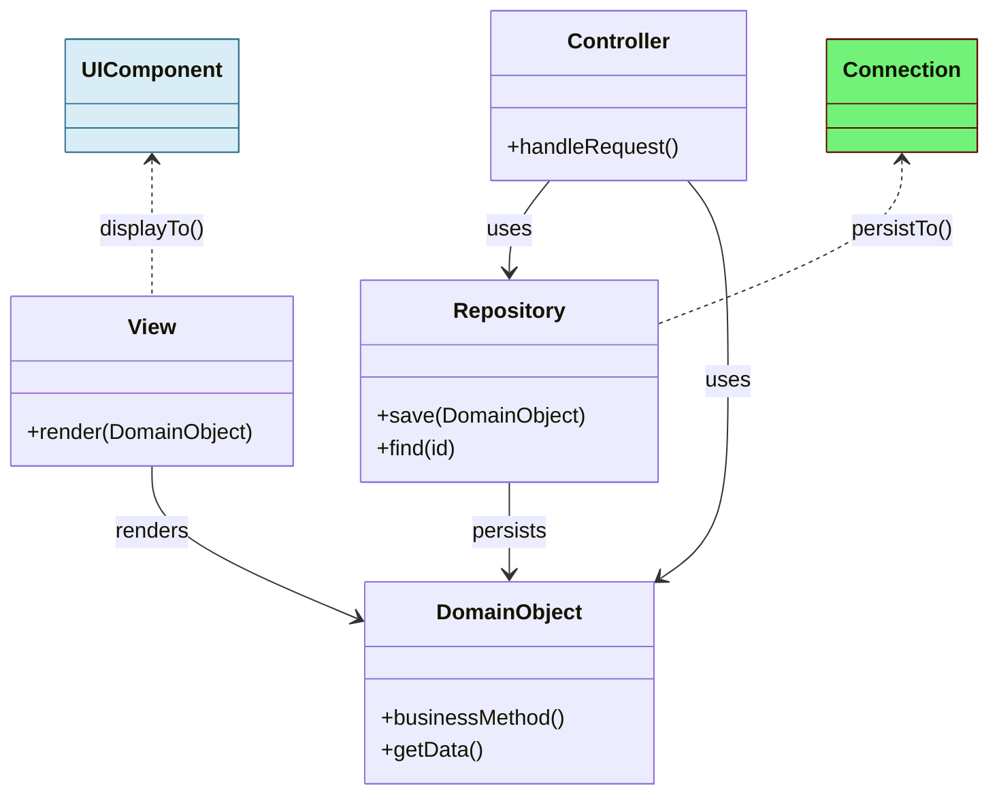
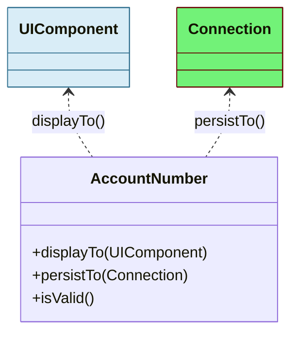
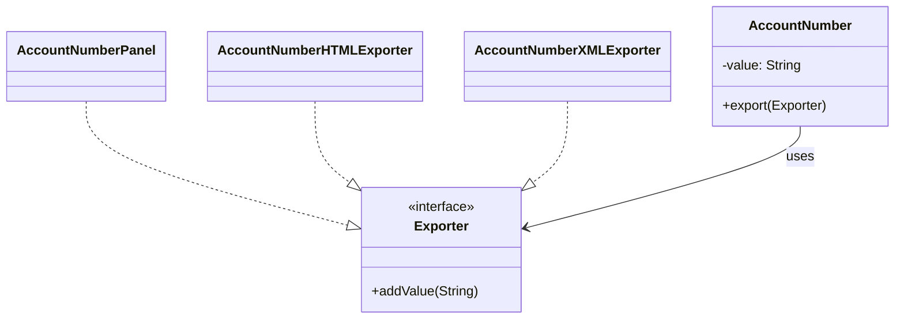
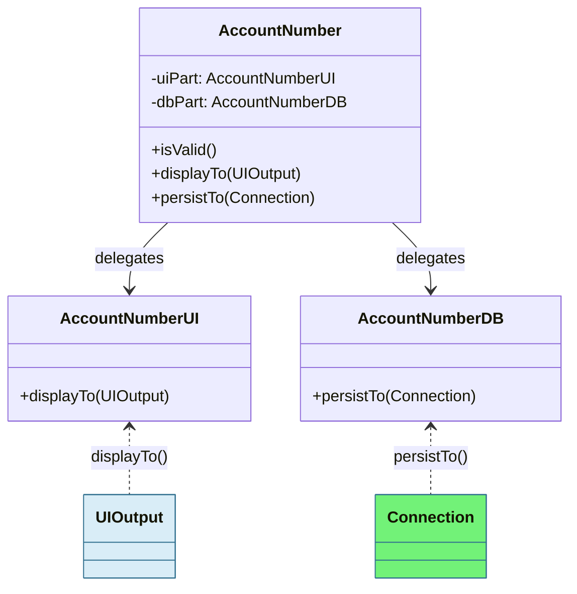
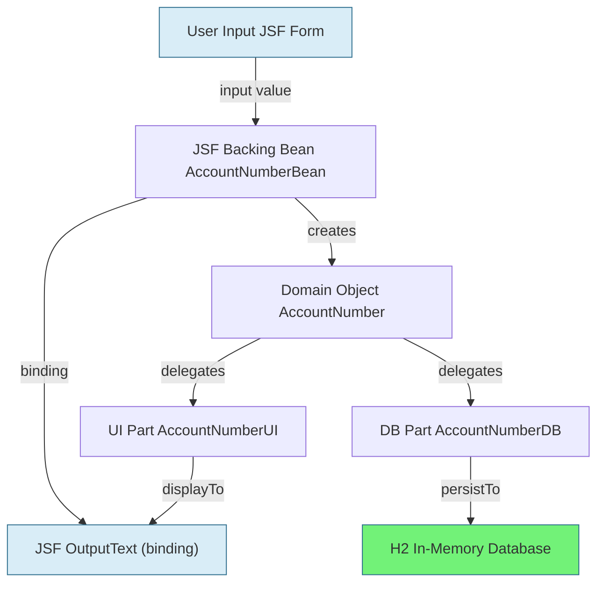

# Classic DDD vs. Object-Oriented UI & Persistence

This post compares **Classic DDD** with  object-oriented alternative, where an object know how to present and persist themselves.

- **UI and Database speaking Objects**

You’ll see diagrams, code, and a full JSF + H2 example using the OOP approach.

---
## Introduction

Classic Domain-Driven Design (DDD) has long separated domain logic, persistence, and UI into distinct layers. 
But object-oriented thinking by Yegor Bugayenko, Robert Bräutigam, Allen Holub and Others, 
proposing that objects should encapsulate not just data and business logic, but also know how to present and persist themselves.

However, this shift is not just about encapsulation—it addresses deeper architectural issues:

### Architecture: Problems and Insights

- **Data Boundaries** ([Bräutigam](https://javadevguy.wordpress.com/2019/06/06/data-boundaries-are-the-root-cause-of-maintenance-problems/)):
  - Artificial separation of data and behavior leads to tight coupling between layers.
  - DTOs and mappings create duplication and increase maintenance cost.

- **Layered Architecture** ([Bräutigam](https://javadevguy.wordpress.com/2019/01/06/reevaluating-the-layered-architecture/)):
  - Layers often leak data upwards.
  - UI and service layers become tightly coupled to domain structure.
  - Changes in domain ripple through all layers.

- **Service Layer Critique** ([Amihai Emil](https://amihaiemil.com/2020/05/14/the-almighty-service-layer.html)):
  - Service layers often become dumping grounds for logic.
  - They violate encapsulation and SRP.
  - Often unnecessary if domain objects are properly designed.

- **Model Integrity** ([V. Zurauskas](https://www.vzurauskas.com/2018/07/24/maintaining-model-integrity)):
  - Pulling data out of objects to process it elsewhere breaks encapsulation.
  - True OOP means objects manage their own state and behavior.

### Takeaways

- Avoid unnecessary layering and DTOs.
- Let objects manage their own UI and persistence.
- Favor delegation over service layers.
- Preserve model integrity by avoiding data leaks.

(R. Bräutigam) 
- *Model the problem, not the technology!*
- *Find suitable abstractions straight from the business requirements and*
- ***hide implementation details, like the fact that you are using MVC.***

---

## 1. Classic DDD

**Principle:**
- Domain objects are pure, containing only business logic.
- UI and persistence are handled by separate layers (Repositories, Controllers, Views).
- Data is transferred via DTOs or entities.

### Diagram



### Java Example

```java
// Domain object: only business logic
public class AccountNumber {
    private final String accountNumber;

    public AccountNumber(String accountNumber) {
        this.accountNumber = accountNumber;
    }

    public boolean isValid() {
        return accountNumber != null && accountNumber.matches("\d{10}");
    }

    public String getAccountNumber() {
        return accountNumber;
    }
}
```

```java
// Repository: handles persistence
public class AccountNumberRepository {
    private final DataSource dataSource;

    public AccountNumberRepository(DataSource dataSource) {
        this.dataSource = dataSource;
    }

    public void save(AccountNumber accountNumber) throws SQLException {
        try (Connection conn = dataSource.getConnection();
             PreparedStatement stmt = conn.prepareStatement(
                 "INSERT INTO account_numbers (number) VALUES (?)")) {
            stmt.setString(1, accountNumber.getAccountNumber());
            stmt.executeUpdate();
        }
    }
}
```

```java
// Controller: handles UI logic
public class AccountNumberController {
    private final AccountNumberRepository repository;

    public AccountNumberController(AccountNumberRepository repository) {
        this.repository = repository;
    }

    public void handleSave(String input) throws SQLException {
        AccountNumber acc = new AccountNumber(input);
        if (acc.isValid()) {
            repository.save(acc);
        }
    }
}
```

```java
// View: renders data
public class AccountNumberView {
    public void render(AccountNumber accountNumber) {
        System.out.println("Account: " + accountNumber.getAccountNumber());
    }
}
```

---

## 2. UI of Objects

**Principle:**
- The domain object directly implements UI and persistence logic.

### Diagram



### Java Example

```java
public final class AccountNumber {
    private final String accountNumber;

    public AccountNumber(String accountNumber) {
        this.accountNumber = accountNumber;
    }

    public boolean isValid() {
        return accountNumber != null && accountNumber.matches("\d{10}");
    }

    public void displayTo(Component component) {
        component.setValue(accountNumber);
    }

    public void persistTo(Connection connection) throws SQLException {
        try (PreparedStatement stmt = connection.prepareStatement(
                "INSERT INTO account_numbers (number) VALUES (?)")) {
            stmt.setString(1, accountNumber);
            stmt.executeUpdate();
        }
    }
}
```

---

## 3. UI Bilder of Objects


**Principle:**  
- The business object (AccountNumber) does not expose getters/setters.  
- Instead, it delegates representation (UI, HTML, XML, etc.) to separate Exporter-/Import-`Builder` objects via an `interface`.  
- This isolates the business object from its representations and keeps it pure and maintainable.

### Diagram



### Java Example: Exporter Pattern for Multiple Representations

**1. The Domain Object**

```java
public class AccountNumber {
    private final String value;

    public interface Exporter {
        void addValue(String value);
    }

    public AccountNumber(String value) {
        this.value = value;
    }

    public void export(Exporter builder) {
        builder.addValue(value);
    }
}
```

**2. Swing UI Exporter**

```java
import javax.swing.*;

public class AccountNumberPanel extends JPanel implements AccountNumber.Exporter {
    private final JLabel valueLabel = new JLabel();

    public AccountNumberPanel() {
        setLayout(new BoxLayout(this, BoxLayout.Y_AXIS));
        add(new JLabel("Account Number:"));
        add(valueLabel);
    }

    @Override
    public void addValue(String value) {
        valueLabel.setText(value);
    }
}
```

**3. HTML Exporter**

```java
public class AccountNumberHTMLExporter implements AccountNumber.Exporter {
    private final StringBuilder out = new StringBuilder();

    @Override
    public void addValue(String value) {
        out.append("<tr><td>Account Number:</td><td>")
           .append("<input type="text" name="accountNumber" value="")
           .append(value)
           .append(""/></td></tr>
");
    }

    public String extractHTML() {
        return "<table>" + out.toString() + "</table>";
    }
}
```

**4. XML Exporter**

```java
public class AccountNumberXMLExporter implements AccountNumber.Exporter {
    private final StringBuilder out = new StringBuilder();

    @Override
    public void addValue(String value) {
        out.append("<AccountNumber>").append(value).append("</AccountNumber>");
    }

    public String extractXML() {
        return out.toString();
    }
}
```

**Benefits:**
- No getters/setters.
- UI logic is encapsulated.
- Changes to UI representation are localized.
- Fully object-oriented and cohesive.

## 4. UI/DB Part of Objects

**Principle:**
- The domain object delegates UI and persistence to internal collaborators.

### Diagram



### Full JSF + H2 Example

With JSF and the `binding` attribute, objects can directly manipulate UI components (`displayTo()`), while persisting themselves to a database like H2.

```java
package com.example.account;

import jakarta.faces.component.UIOutput;
import java.sql.Connection;
import java.sql.SQLException;

public final class AccountNumber {
    private final String value;
    private final AccountNumberUI uiPart;
    private final AccountNumberDB dbPart;

    public AccountNumber(String value) {
        this.value = value;
        this.uiPart = new AccountNumberUI(value);
        this.dbPart = new AccountNumberDB(value);
    }

    public boolean isValid() {
        return value != null && value.matches("\\d{10}");
    }

    // Delegates UI rendering
    public void displayTo(UIOutput outputComponent) {
        uiPart.displayTo(outputComponent);
    }

    // Delegates persistence
    public void persistTo(Connection connection) throws SQLException {
        dbPart.persistTo(connection);
    }
}
```

```java
package com.example.account;

import java.sql.Connection;
import java.sql.PreparedStatement;
import java.sql.SQLException;

public final class AccountNumberDB {
    private final String value;

    public AccountNumberDB(String value) {
        this.value = value;
    }

    public void persistTo(Connection connection) throws SQLException {
        try (PreparedStatement stmt = connection.prepareStatement(
                "INSERT INTO account_numbers (number) VALUES (?)")) {
            stmt.setString(1, value);
            stmt.executeUpdate();
        }
    }
}
```

```java

package com.example.account;

import jakarta.faces.component.UIOutput;

public final class AccountNumberUI {
    private final String value;

    public AccountNumberUI(String value) {
        this.value = value;
    }

    public void displayTo(UIOutput outputComponent) {
        outputComponent.setValue(value);
    }
}

```

```xml

<!DOCTYPE html>
<html xmlns="http://www.w3.org/1999/xhtml"
      xmlns:h="http://xmlns.jcp.org/jsf/html">
<h:head>
    <title>Account Number Entry</title>
</h:head>
<h:body>
    <h:form>
        <h:outputLabel for="acc" value="Account Number:" />
        <h:inputText id="acc" value="#{accountNumberBean.input}" />
        #{accountNumberBean.submit}
        <br/>
        <!-- Bound outputText component for displayTo() -->
        <h:outputText id="out" binding="#{accountNumberBean.out}" />
        <br/>
        <h:outputText value="#{accountNumberBean.message}" />
    </h:form>
</h:body>
</html>
```

---

## 4. Architekturdiagramm: Extended UI of Objects mit JSF & H2



---

## 5. Comparison Table

| Approach         | Domain Logic | UI Logic | Persistence Logic | Encapsulation | Flexibility | Boilerplate | DTOs/Entities |
|------------------|-------------|----------|------------------|---------------|-------------|-------------|---------------|
| Classic DDD      | Domain Obj  | View     | Repository       | Medium        | High        | High        | Yes           |
| OOP UI Object    | Domain Obj  | Domain Obj | Domain Obj     | High          | Low         | Low         | No            |
| OOP UI Bilder    | Domain Obj  | Internal Part | Internal Part | High          | High        | Medium      | No            |

---

## 6. Summary

Classic DDD separates domain, UI, and persistence, but often leads to anemic models and boilerplate. The Object-Oriented UI & Persistence approach brings behavior back into the object:

- UI of Objects: Maximum encapsulation, but tight coupling.
- UI Bilder of Objects: Delegates UI and DB logic internally, maintaining encapsulation and flexibility.

---

## 7. References

- [Robert Bräutigam: Data boundaries are the root cause of maintenance problems](https://javadevguy.wordpress.com/2019/06/06/data-boundaries-are-the-root-cause-of-maintenance-problems/)
- [Robert Bräutigam: Reevaluating the layered architecture](https://javadevguy.wordpress.com/2019/01/06/reevaluating-the-layered-architecture/)
- [Amihai Emil: The almighty service layer](https://amihaiemil.com/2020/05/14/the-almighty-service-layer.html)
- [Vytautas Žurauskas: Maintaining Model Integrity)](https://www.vzurauskas.com/2018/07/24/maintaining-model-integrity)
- [Allen Holub: More on Getters and Setters (InfoWorld)](https://www.infoworld.com/article/2161050/more-on-getters-and-setters.html)
- [Yegor Bugayenko: ORM Offensive Anti-Pattern](https://www.yegor256.com/2014/12/01/orm-offensive-anti-pattern.html)
- [Yegor Bugayenko: Active Record](https://www.yegor256.com/2016/07/26/active-record.html)
- [JSF Component Binding (Oracle Docs)](https://docs.oracle.com/javaee/6/tutorial/doc/bnatg.html)
- [StackOverflow: How to use component binding in JSF](https://stackoverflow.com/questions/18667927/how-to-use-component-binding-in-jsf-right-request-scoped-component-in-session)

