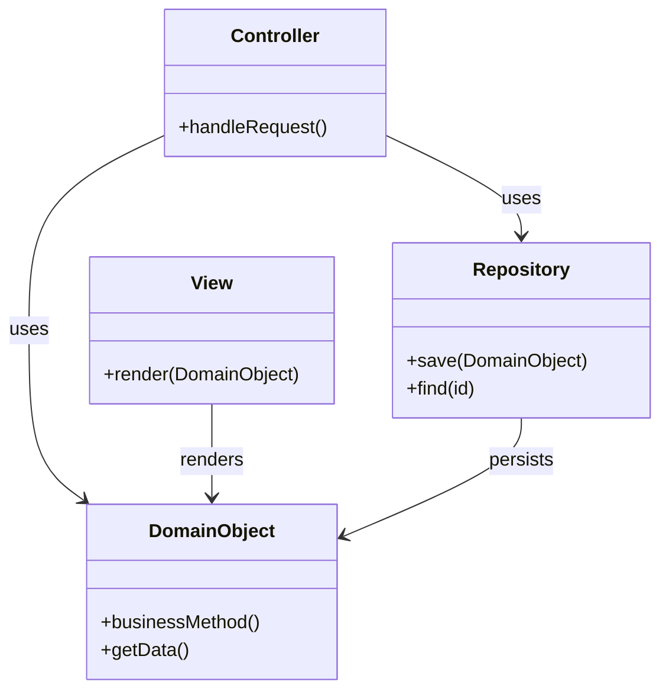
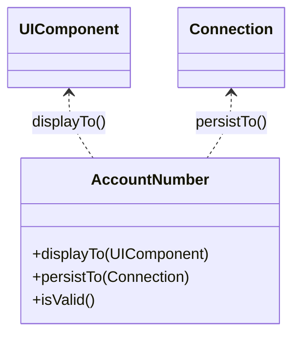
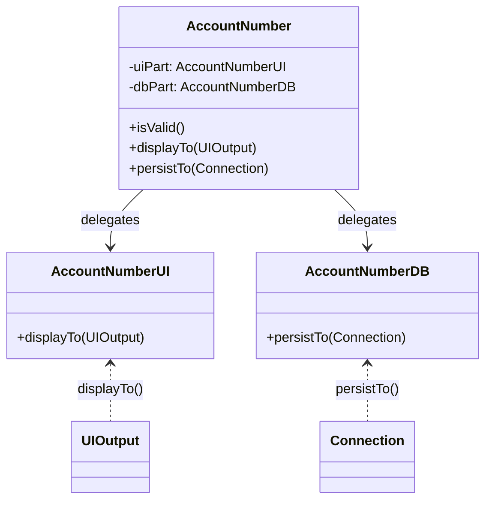

# Classic DDD vs. Object-Oriented UI & Persistence

**A practical comparison with Java & JSF examples, diagrams, and lessons learned from modern OOP, DDD, and the “UI of Objects” approach.**

---


## Introduction

Classic Domain-Driven Design (DDD) has long separated domain logic, persistence, and UI into distinct layers. 
But modern object-oriented thinking—championed by Robert Bräutigam, Yegor Bugayenko, and Allen Holub—challenges this, 
proposing that objects should encapsulate not just data and business logic, but also know how to present and persist themselves.

However, this shift is not just about encapsulation—it addresses deeper architectural issues:

### Architecture: Problems and Insights

- **Data Boundaries** ([Bräutigam](https://javadevguy.wordpress.com/2019/06/06/data-boundaries-are-the-root-cause-of-maintenance-problems/)):
  - Artificial separation of data and behavior leads to tight coupling between layers.
  - DTOs and mappings create duplication and increase maintenance cost.

- **Layered Architecture** ([Bräutigam](https://javadevguy.wordpress.com/2019/01/06/reevaluating-the-layered-architecture/)):
  - Layers often leak data upwards.
  - UI and service layers become tightly coupled to domain structure.
  - Changes in domain ripple through all layers.

- **Service Layer Critique** ([Amihai Emil](https://amihaiemil.com/2020/05/14/the-almighty-service-layer.html)):
  - Service layers often become dumping grounds for logic.
  - They violate encapsulation and SRP.
  - Often unnecessary if domain objects are properly designed.

- **Model Integrity** ([V. Zurauskas](https://www.vzurauskas.com/2018/07/24/maintaining-model-integrity)):
  - Pulling data out of objects to process it elsewhere breaks encapsulation.
  - True OOP means objects manage their own state and behavior.

### Takeaways

- Avoid unnecessary layering and DTOs.
- Let objects manage their own UI and persistence.
- Favor delegation over service layers.
- Preserve model integrity by avoiding data leaks.

This post compares **Classic DDD** with two object-oriented alternative, where an object know how to present and persist themselves.

- **Direct UI of Objects**
- **Extended UI of Objects**

You’ll see diagrams, code, and a full JSF + H2 example using the “Extended” approach.

---


## 1. Classic DDD

**Principle:**
- Domain objects are pure, containing only business logic.
- UI and persistence are handled by separate layers (Repositories, Controllers, Views).
- Data is transferred via DTOs or entities.

### Diagram



### Java Example

```java
// Domain object: only business logic
public class AccountNumber {
    private final String accountNumber;

    public AccountNumber(String accountNumber) {
        this.accountNumber = accountNumber;
    }

    public boolean isValid() {
        return accountNumber != null && accountNumber.matches("\d{10}");
    }

    public String getAccountNumber() {
        return accountNumber;
    }
}
```

```java
// Repository: handles persistence
public class AccountNumberRepository {
    private final DataSource dataSource;

    public AccountNumberRepository(DataSource dataSource) {
        this.dataSource = dataSource;
    }

    public void save(AccountNumber accountNumber) throws SQLException {
        try (Connection conn = dataSource.getConnection();
             PreparedStatement stmt = conn.prepareStatement(
                 "INSERT INTO account_numbers (number) VALUES (?)")) {
            stmt.setString(1, accountNumber.getAccountNumber());
            stmt.executeUpdate();
        }
    }
}
```

```java
// Controller: handles UI logic
public class AccountNumberController {
    private final AccountNumberRepository repository;

    public AccountNumberController(AccountNumberRepository repository) {
        this.repository = repository;
    }

    public void handleSave(String input) throws SQLException {
        AccountNumber acc = new AccountNumber(input);
        if (acc.isValid()) {
            repository.save(acc);
        }
    }
}
```

```java
// View: renders data
public class AccountNumberView {
    public void render(AccountNumber accountNumber) {
        System.out.println("Account: " + accountNumber.getAccountNumber());
    }
}
```

---

## 2. Direct UI of Objects

**Principle:**
- The domain object directly implements UI and persistence logic.

### Diagram



### Java Example

```java
public final class AccountNumber {
    private final String accountNumber;

    public AccountNumber(String accountNumber) {
        this.accountNumber = accountNumber;
    }

    public boolean isValid() {
        return accountNumber != null && accountNumber.matches("\d{10}");
    }

    public void displayTo(Component component) {
        component.setValue(accountNumber);
    }

    public void persistTo(Connection connection) throws SQLException {
        try (PreparedStatement stmt = connection.prepareStatement(
                "INSERT INTO account_numbers (number) VALUES (?)")) {
            stmt.setString(1, accountNumber);
            stmt.executeUpdate();
        }
    }
}
```

---

## 3. Extended UI of Objects

**Principle:**
- The domain object delegates UI and persistence to internal collaborators.

### Diagram



### Full JSF + H2 Example

(See full code in the previous section)

---

## 4. Architekturdiagramm: Extended UI of Objects mit JSF & H2

```mermaid
flowchart TD
    UserInput["User Input (JSF Form)"]
    Bean["JSF Backing Bean (AccountNumberBean)"]
    Domain["Domain Object (AccountNumber)"]
    UI["UI Part (AccountNumberUI)"]
    DB["DB Part (AccountNumberDB)"]
    H2["H2 In-Memory Database"]
    OutputText["JSF OutputText (binding)"]

    UserInput -->|input value| Bean
    Bean -->|creates| Domain
    Bean -->|binding| OutputText
    Domain -->|delegates| UI
    Domain -->|delegates| DB
    UI -->|displayTo(binding)| OutputText
    DB -->|persistTo| H2
```

---

## 5. Comparison Table

| Approach         | Domain Logic | UI Logic | Persistence Logic | Encapsulation | Flexibility | Boilerplate | DTOs/Entities |
|------------------|-------------|----------|------------------|---------------|-------------|-------------|---------------|
| Classic DDD      | Domain Obj  | View     | Repository       | Medium        | High        | High        | Yes           |
| Direct UI Obj    | Domain Obj  | Domain Obj | Domain Obj     | High          | Low         | Low         | No            |
| Extended UI Obj  | Domain Obj  | Internal Part | Internal Part | High          | High        | Medium      | No            |

---

## 6. Summary

Classic DDD separates domain, UI, and persistence, but often leads to anemic models and boilerplate. The Object-Oriented UI & Persistence approach brings behavior back into the object:

- Direct UI of Objects: Maximum encapsulation, but tight coupling.
- Extended UI of Objects: Delegates UI and DB logic internally, maintaining encapsulation and flexibility.

With JSF and the `binding` attribute, objects can directly manipulate UI components (`displayTo()`), while persisting themselves to a database like H2.

---

## 7. References

- [Yegor Bugayenko: ORM Offensive Anti-Pattern](https://www.yegor256.com/2014/12/01/orm-offensive-anti-pattern.html)
- [Yegor Bugayenko: Active Record](https://www.yegor256.com/2016/07/26/active-record.html)
- [Allen Holub: More on Getters and Setters (InfoWorld)](https://www.infoworld.com/article/2161050/more-on-getters-and-setters.html)
- [JSF Component Binding (Oracle Docs)](https://docs.oracle.com/javaee/6/tutorial/doc/bnatg.html)
- [StackOverflow: How to use component binding in JSF](https://stackoverflow.com/questions/18667927/how-to-use-component-binding-in-jsf-right-request-scoped-component-in-session)

