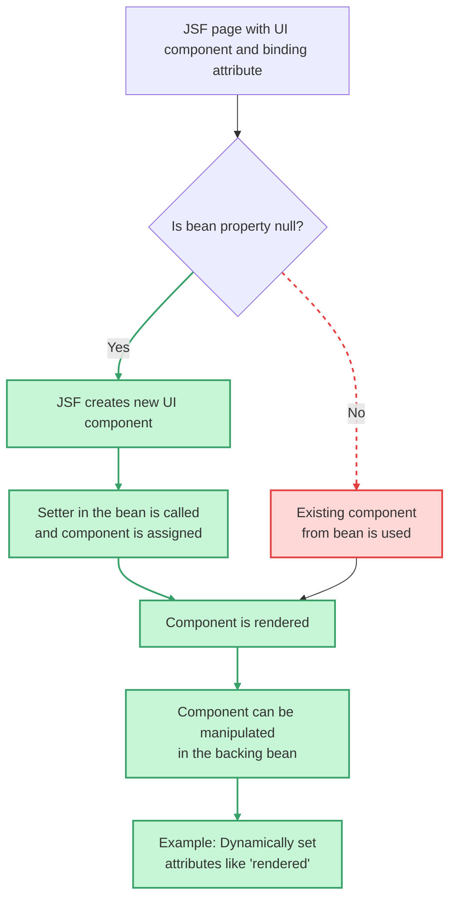

# JSF Component Binding

The binding attribute in JSF allows you to programmatically access and manipulate UI components from a backing bean<br>
by linking the component instance to a property in the bean. When the page is rendered, if the bean property is null,<br> 
JSF creates a new component instance and assigns it to the property via the setter. This is useful when you need to<br>
change a component's attributes, like rendered, dynamically based on application logic, as opposed to just binding the component's value.

**Key considerations**
**Scope:** 
- Be mindful of the backing bean's scope. Binding a request-scoped component to a session-scoped bean can lead to errors, such as duplicate IDs if you navigate between pages. 
**Necessity:**
- While powerful, component binding is often unnecessary in JSF 2.x and later. Many functional requirements can be met with alternative approaches like value binding or standard JSF/JSTL tags, which can lead to cleaner code. 

## How it works
- **Initial rendering:** When a page is built, the JSF framework processes the binding attribute. If the corresponding (getter) property in the backing bean should be null, JSF creates an instance of the UI component (e.g., h:outputText) and sets it on the bean (setter) property.
- **Dynamic manipulation:** The bean can then use this component instance to modify its properties, such as setting the rendered attribute to true or false to show or hide elements on the page.
- **Component instance vs. value:** It's crucial to understand the difference between binding and value. binding attaches the entire component instance to a bean property, while value attaches the component's value (the data it displays). 




**Explanation:**
- **binding attribute:** Links a UI component directly to a property in the backing bean.
- **Null check:** JSF checks if the property is null during rendering.
- **Component creation or reuse:** If null, a new instance is created and assigned. Otherwise, the existing one is used.
- **Manipulation:** The component can be accessed and modified programmatically in the bean, e.g., to dynamically control visibility or styling.

**🟢 Green Path: Desired flow**
When the bean property is null, JSF creates the component, assigns it, renders it, and allows dynamic manipulation.
**🚫 Red Dashed Path: Forbidden/undesired path**
If the bean property is not null, JSF uses the existing component, which might bypass the intended initialization logic.


## Example scenario
**Goal:** Hide a form element until a user clicks a button that triggers a specific action.
**Implementation:**
In your `.xhtml` file, use the binding attribute to link the component to a backing bean property:

```xml
<h:outputText binding="#{taskFrom.taskOutputText}" ... />
```
- In your backing bean (e.g., taskFrom), have the corresponding property:

```java
      private UIOutput taskOutputText;

      // Getter and setter for taskOutputText
      public UIOutput getTaskOutputText() {
          return taskOutputText;
      }

      public void setTaskOutputText(UIOutput taskOutputText) {
          this.taskOutputText = taskOutputText;
      }
```
- In a method within the backing bean that is called by the button, you can now access and change the rendered property:


```java
   public void submit() {
            // ... your other logic ...
            if (customer.isLargeOrder()) {
                taskOutputText.getAttributes().put("rendered", true);
            } else {
                taskOutputText.getAttributes().put("rendered", false);
            }
        }
```
## References

- https://docs.oracle.com/javaee/6/tutorial/doc/bnatg.html
