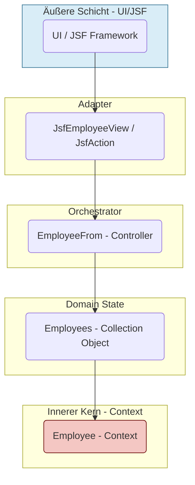
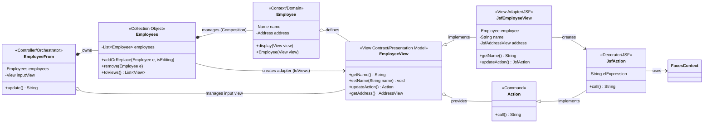
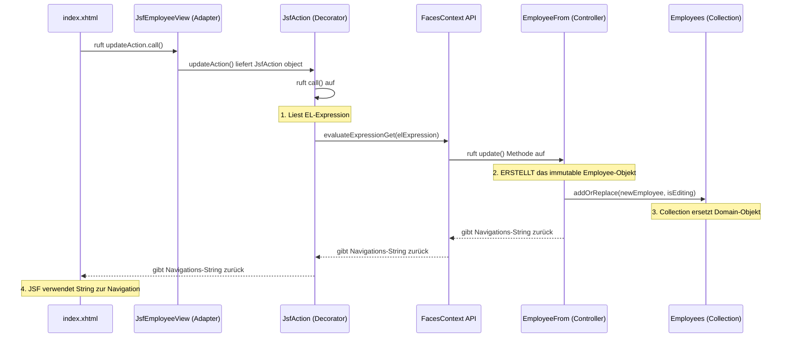

# **Das View/Action-Muster (OO-DDD)**


Das View/Action-Muster ist eine Architekturstrategie zur **strikten Entkopplung** der Domäne von der Benutzeroberfläche (UI). Es ist eine fortgeschrittene Interpretation des **Presentation-Model/Supervising Controller** Musters, das die Invarianten von Domänenobjekten (Contexts) schützt.

## **1\. Problemstellung und Konsequenzen**

Das Design von Benutzeroberflächen steht im Konflikt mit den Kernprinzipien der Objektorientierten Programmierung (OOP), insbesondere der **Datenkapselung** und dem **Single Responsibility Principle (SRP)**.

### **1.1 Die Problemstellung im UI-Kontext (Das Anti-Pattern)**

Herkömmliche Architekturen zwingen Domänenobjekte (Contexts) dazu, sich in **Datenstrukturen (DTOs)** umzuwandeln. Dies ist notwendig, damit UI-Frameworks (z. B. JSF, Spring MVC) die Daten binden können, führt aber zur **Überladung der Domäne** mit UI-spezifischen Verantwortlichkeiten:

**Beispiel: Das Setter-Anti-Pattern in der Domäne**

```java
public class Employee {  
    private String name;  
    private int salary;

    // Das Domänenobjekt stellt Setter zur Verfügung, um vom UI-Framework befüllt zu werden  
    public void setSalary(int salary) {  
        // WICHTIG: Die Validierung (z.B. salary darf nicht negativ sein) fehlt hier oft.  
        this.salary \= salary;   
    }  
    // ... andere Setter und Getter  
}

```

1. **Framework-Kopplung:** Domänenobjekte müssen direkt Setter und Getter bereitstellen. Dies koppelt die Domäne an den Lebenszyklus des UI-Frameworks.  
2. **Verletzung der Invarianten:** Wie im obigen Beispiel kann der Zustand des Objekts von außen in einem ungültigen Zustand hinterlassen werden. Wenn ein Controller den Aufruf employee.setSalary(-100) ausführt, ist das Domänenobjekt **inkonsistent**. Der Schutz der Geschäftsregeln liegt nicht mehr beim Objekt selbst, was gegen die **Kapselung** verstößt.  
3. **Verletzung des SRP:** Das Domänenobjekt wird indirekt verantwortlich für:  
   * **Geschäftslogik** (Berechnung, Validierung).  
   * **UI-Formatierung** (z. B. Währungssymbole, Datumsformate).  
   * **UI-Aktionen** (z. B. Logik zur Aktivierung/Deaktivierung von Buttons).

### **1.2 Die Konsequenz: Geteilter Zustand**

* **Datenstrukturen** (DTOs, Objekte mit Gettern/Settern) sind **Zustand**.  
* Das Weitergeben von Datenstrukturen bedeutet das **Teilen von Zustand**.  
* **Geteilter Zustand** ist die **Wurzel allen Übels** in komplexen Softwaresystemen, da er zu unkontrollierbaren, nicht-lokalen Änderungen und schwer zu verfolgenden Fehlern führt.

OOP-Objekte wurden erfunden, um ein Paradigma zu schaffen, in dem der geteilte Zustand **minimiert und kontrolliert** werden kann. Ziel ist die **Maximierung der Kohäsion** (Zusammenhalt von Logik und Zustand im Objekt) und **Minimierung der Kopplung** (gegenseitige Abhängigkeit zwischen Objekten).

### **1.3 Detaillierte Fallstudien zu OOP-Verletzungen**

Die Verweigerung von **Gettern und Settern** in der Domäne ist die direkte Konsequenz der Einhaltung von Kapselung:

#### **Fallstudie A: Das Getter/Setter-Anti-Pattern (DTO)**

Angenommen, ein Mitarbeiter (Employee) darf kein negatives Gehalt (salary) haben (eine **Invariante**).

| Ansatz | Code (Konzept) | Problem (Verletzung) |
| :---- | :---- | :---- |
| **DTO/Getter-Setter** | employee.setSalary(-100); | Externe Akteure (Controller, Services) **ignorieren die Invariante**. Die Geschäftslogik zur Gehaltsprüfung muss **überall** im Code wiederholt oder in einer separaten Validierungsschicht implementiert werden. Das Domänenobjekt wird passiv und schutzlos. |
| **View/Action (Context)** | employee.increaseSalary(amount); | Der **Context** (Employee) führt die Änderung **selbst** durch. Da das Objekt **immutable** (unveränderlich) ist, wird bei der Erstellung des neuen Objekts (new Employee(...)) im Konstruktor die Invariante garantiert (if (salary \< 0\) throw new IllegalArgumentException();). |

#### **Fallstudie B: Der Prozedurale Service Layer**

Wenn die Geschäftslogik in Services (EmployeeService) ausgelagert wird, entsteht ein **prozeduraler** Stil, der gegen das Prinzip **"Tell, Don't Ask"** verstößt.

1. **ASK:** Der Service muss das Domänenobjekt um Daten bitten (employee.getSalary()).  
2. **CALCULATE:** Der Service führt die eigentliche Logik aus (newSalary \= oldSalary \+ 50).  
3. **TELL:** Der Service setzt das Ergebnis zurück (employee.setSalary(newSalary)).

Die **Kohäsion** ist niedrig, da die Logik (was mit dem Gehalt zu tun ist) vom Zustand (das Gehalt selbst) getrennt ist. Das **View/Action-Muster** korrigiert dies, indem es die Logik **lokalisiert** und das Objekt aktiviert (employee.increaseSalary()).

## **2\. Muster zur UI-Entkopplung und deren Bewertung**

Es gibt verschiedene Muster zur Entkopplung der Domäne von der UI. Die Bewertung erfolgt anhand der Einhaltung des Prinzips: **Das Domänenobjekt darf keine UI-spezifische Verantwortung tragen.**

| Muster | Rolle des Domänenobjekts | OOP-Konformität | Nachteile |
| :---- | :---- | :---- | :---- |
| **Active Record** | Hält den Zustand und die Persistenzlogik. | **Niedrig.** Stark gekapselt, aber verletzt SRP durch das Mischen von Geschäftslogik und Persistence/UI-Binding. | Domänenobjekt ist an DB/UI gekoppelt. |
| **DTO (Data Transfer Object)** | Zustandstransport zwischen Layers. | **Niedrig.** Das Domänenobjekt wird durch Getter/Setter zur reinen Datenstruktur, verliert Kapselung. | Shared State wird im gesamten System verbreitet. |
| **Service Layer** | Domänenobjekt ist passiv; Services führen die Logik aus. | **Niedrig.** Die Domäne wird zur Datenstruktur. Die Logik ist prozedural im Service verteilt (geringe Kohäsion). | Verletzung des "Tell, Don't Ask"-Prinzips. |
| **UI of Objects** | Das Domänenobjekt erzeugt seine eigene UI-Komponente. | **Mittel.** Domäne kapselt die Logik und kennt UI-Framework-Interfaces (Component). | Direkte Kopplung an das UI-Framework-API. |
| **Presentation Model (PM) / Supervising Controller (SC)** | Trennt UI-Zustand (PM) von Domäne. | **Hoch.** Domänenobjekt ist entkoppelt, interagiert nur über eine definierte Schnittstelle mit dem PM. | Die Synchronisation zwischen PM und Domäne kann komplex werden. |

## **3\. Synthese: Das OOP-Ziel**

Das Ziel muss die **Maximierung der Kohäsion** und **Minimierung der Kopplung** sein, was zur strikten Einhaltung der Kapselung führt.

Die Synthese der obigen Muster führt zur Notwendigkeit, einen **Adapter/Vertrag** zu schaffen, der:

1. **Den geteilten Zustand für die UI aufnimmt:** Der Adapter hält die rohen, unvalidierten UI-Daten (Strings, Employee.View).  
2. **Die Geschäftslogik dem Objekt überlässt:** Das Domänenobjekt muss die Kontrolle darüber behalten, **wann** und **wie** die Daten vom Adapter übernommen werden (Import-Logik).  
3. **Die Aktionsausführung entkoppelt:** Die Logik zur Ausführung eines UI-Events (z. B. onclick, action) muss vom UI-Framework losgelöst sein.

Dies wird durch eine Kombination des **Presentation Model** mit dem **Command-Muster** erreicht.

## **4\. Die View/Action-Muster Lösung**

Das View/Action-Muster ist die konkrete Umsetzung des Presentation Model/Supervising Controller, die das **Command-Muster** (Action) nutzt, um die Aktionsausführung zu entkoppeln.

### **4.1 Die Architektur-Zwiebel (Abhängigkeits-Schichten)**

Dieses Zwiebel-Diagramm visualisiert die strikte Entkopplung: Die Abhängigkeiten zeigen immer vom Äußeren (UI) zum Inneren (Domäne). Der innere Kern (Context) ist **UI-agnostisch**.



### **4.2 Die Idee und der Entkopplungsmechanismus**

Die Kernidee ist, dass das Domänenobjekt nicht die Verantwortung für die Darstellung trägt, sondern seine **eigenen, abstrakten Anforderungen** an die Präsentation stellt.

* **1\. Domänenobjekt (Employee):** Das unveränderliche Herz. Es kennt **nur** sein inneres Interface (Employee.View). Es ist *UI-agnostisch*.  
* **2\. View-Interface (Employee.View):** Der Vertrag/Adapter. Er definiert die abstrakten **Datenfelder** und **Aktionen** der UI.  
* **3\. UI-Framework (JsfEmployeeView):** Der Adapter/die Implementierung. Sie bindet das Interface an die technische UI (z. B. JSF-Tags, HTML-Input-Felder).

Das Domänenobjekt (Employee) arbeitet ausschließlich mit dem **View-Interface** als bidirektionale Schnittstelle:

* **Import (Formular → Domain):** new Employee(View view)  Das Domänenobjekt zieht (pullt) die Daten selbst aus der View, um sich **unveränderlich** zu erstellen und die Invarianten zu prüfen.  
* **Export (Domain → Formular):** employee.display(View view)  Das Domänenobjekt drückt (pusht) seine formatierten Daten in eine View, um sich darzustellen.

## **5\. Kernkomponenten und Struktur**

### **5.1 Der Context (Das Subjekt)**

* **Klasse:** Employee.java  
* **Rolle:** Das unveränderliche Domänenobjekt. Definiert **Employee.View** als internes Interface.

### **5.2 Der View-Vertrag (Interface)**

* **Interface:** Employee.View  
* **Rolle:** Das **Presentation Model**. Definiert bidirektionalen Datenaustausch und alle verfügbaren **Aktionen** (updateAction()).

### **5.3 Die View-Implementierung (Der Adapter)**

* **Klasse:** JsfEmployeeView.java  
* **Rolle:** Implementiert den Employee.View-Vertrag. Hält die rohen UI-Daten (Strings) und ist der **JSF-Bindungspunkt**.

### **5.4 Das Action Command (Der Decorator)**

* **Klasse:** JsfAction.java  
* **Rolle:** Kapselt eine ausführbare Operation (Command). Speichert den **EL-String** ("\#{employeeFrom.update()}") und führt ihn **manuell über die FacesContext-API** in der Methode call() aus. Dies entkoppelt die View von der Ausführungslogik.

### **5.5 Das Collection Object**

* **Klasse:** Employees.java  
* **Rolle:** Kapselt die Liste der **Employee** Domänenobjekte. Verwaltet den **Zustand der Sammlung** (Hinzufügen, Ersetzen, Entfernen) und bietet eine Methode toViews() zur Darstellung an.

### **5.6 Der Controller (Der Orchestrator)**

* **Klasse:** EmployeeFrom.java  
* **Rolle:** Überwacht den **inputView** (Supervising Controller), verwaltet den Session-Zustand und delegiert alle Domänenoperationen an die **Employees**\-Instanz. Führt UI-spezifische Aufgaben (Navigation, FacesMessage) aus.

## **6\. Der Interaktionsfluss**

### **6.1 Datenaustausch (Bidirektional)**

| Fluss | Methode | Verantwortlich | Mechanismus |
| :---- | :---- | :---- | :---- |
| **Import** (Formular → Domain) | new Employee(View view) | Employee (Context) | Der Context **zieht** die Daten aus der View (Builder-Muster). |
| **Export** (Domain → Formular) | employees.toViews() | Employees (Collection) | Die Collection erzeugt **Adapter** (JsfEmployeeView) für die Darstellung. |

### **6.2 Action-Ausführung (Command)**

1. **View Kapselung:** Die JsfEmployeeView erzeugt eine JsfAction und speichert den Ziel-EL-String.  
2. **UI-Aufruf:** Im Frontend wird action="\#{inputView.updateAction.call()}" gebunden.  
3. **Action Ausführung:** Die Methode JsfAction.call() **unterbricht den normalen JSF-Zyklus**, wertet den gespeicherten EL-String manuell aus und ruft die Controller-Methode (EmployeeFrom.update()) auf.  
4. **Delegation:** Der Controller delegiert die Änderung des Sammlungszustands an **Employees.addOrReplace(...)**.

## **7\. Visuelle Veranschaulichung (Mermaid)**

### **7.1 Statische Struktur (Klassendiagramm)**

Dieses Diagramm zeigt die Kapselungs- und Implementierungsbeziehungen. Es hebt hervor, dass die Domäne (Employee) nur ihre eigenen Interfaces kennt, während der Controller die Employees-Collection besitzt.



### **7.2 Dynamischer Flow (Sequenzdiagramm: Action-Ausführung)**

Dieses Diagramm veranschaulicht den Delegations-Flow von der UI bis zur Employees-Collection.




## 8. Java Quellcode-Implementierung (Mock-Up)
Die folgenden Java-Klassen illustrieren die zentralen Komponenten des View/Action-Musters, wobei die JSF-spezifischen Teile (wie @ManagedBean, FacesContext-Aufrufe) zur Vereinfachung auskommentiert oder gemockt sind.

### 8.1 Interfaces und Domain-Objekte

```java
import java.util.List;
import java.util.ArrayList;
import java.util.function.Function;

// -----------------------------------------------------------
// Mock-Typen für Kontext (Domain Layer)
// -----------------------------------------------------------

// Schnittstelle für die Adresse (Teil des View Contract)
public interface AddressView {}
// Repräsentation eines Domänen-Namens
public class Name { 
    private final String value; 
    public Name(String value) { this.value = value; } 
    @Override public String toString() { return value; } 
}
// Repräsentation einer Domänen-Adresse
public class Address { 
    public Address(AddressView view) { 
        // Logik zur Übernahme der Adressdaten
    }
}
// Mock-Implementierung für die Adress-View
class JsfAddressView implements AddressView {}


// -----------------------------------------------------------
// Type 1: EmployeeView (View Contract / Presentation Model)
// -----------------------------------------------------------
public interface EmployeeView {
    // Bidirektionaler Datenaustausch
    String getName();
    void setName(String name);
    AddressView getAddress();

    // Action Command, bereitgestellt vom Vertrag
    Action updateAction();
}


// -----------------------------------------------------------
// Type 2: Action (Command Interface)
// -----------------------------------------------------------
public interface Action {
    // Führt die gekapselte Logik aus und gibt den Navigations-String zurück
    String call();
}


// -----------------------------------------------------------
// Type 3: Employee (Context / Domain Object)
// -----------------------------------------------------------
// Das Domänenobjekt ist unveränderlich (immutable) und kennt nur den View-Vertrag.
public class Employee {
    private final Name name;
    private final Address address;

    /**
     * Import-Logik (Pull-Prinzip): Der Konstruktor erstellt das Domänenobjekt
     * unveränderlich, indem er die Daten aus dem View-Vertrag zieht.
     * Hier findet die strenge Validierung der Invarianten statt.
     */
    public Employee(EmployeeView view) {
        if (view.getName() == null || view.getName().isEmpty()) {
            throw new IllegalArgumentException("Name darf nicht leer sein.");
        }
        // Konvertierung und Validierung...
        this.name = new Name(view.getName());
        this.address = new Address(view.getAddress());
    }

    /**
     * Export-Logik (Push-Prinzip): Das Domänenobjekt formatiert seine
     * gekapselten Daten zur Darstellung in den View-Vertrag.
     */
    public void display(EmployeeView view) {
        view.setName(this.name.toString());
        // address.display(view.getAddress()); // Delegation zur Adresse
    }
    
    // Weitere Geschäftslogik-Methoden...
}
```

### 8.2 Adapter, Decorator und Collection
```java
// -----------------------------------------------------------
// Type 4: JsfAction (Decorator / JSF Command Implementation)
// -----------------------------------------------------------
// Kapselt den EL-Ausdruck und führt ihn manuell im JSF-Lebenszyklus aus.
public class JsfAction implements Action {
    private final String elExpression; // z.B. "#{employeeFrom.update}"
    
    public JsfAction(String elExpression) {
        this.elExpression = elExpression;
    }

    @Override
    public String call() {
        // *** Kritischer Entkopplungspunkt: Die Action ruft EL manuell auf ***
        System.out.println("INFO: JsfAction wird ausgeführt: " + elExpression);
        
        // Mock-Code für FacesContext-Interaktion:
        // FacesContext context = FacesContext.getCurrentInstance();
        // ... (Logik zur Evaluierung des elExpression MethodExpression) ...
        // return (String) methodExpression.invoke(...);
        
        return "SUCCESS"; // Mock-Rückgabe für Navigation
    }
}

// -----------------------------------------------------------
// Type 5: JsfEmployeeView (View Adapter / JSF Implementation)
// -----------------------------------------------------------
// Implementiert den View-Vertrag und dient als JSF-Binding-Target für die UI.
// @Named @ViewScoped (JSF-spezifische Mock-Annotationen)
public class JsfEmployeeView implements EmployeeView {
    // Rohe, unvalidierte UI-Daten (Strings, direkt gebunden durch JSF)
    private String name;
    private final JsfAddressView address;
    private Employee employee; // Optional: Halten des Domain-Objekts für IDs/Kontext

    public JsfEmployeeView() { 
        this.address = new JsfAddressView(); 
    }
    
    // Konstruktor für die Darstellung (Export)
    public JsfEmployeeView(Employee employee) {
        this();
        this.employee = employee;
        employee.display(this); // Domain-Objekt befüllt den Adapter (Push)
    }

    @Override public String getName() { return name; }
    @Override public void setName(String name) { this.name = name; }
    @Override public AddressView getAddress() { return this.address; }
    
    @Override
    public Action updateAction() {
        // Die View kapselt die Referenz auf den Controller als JsfAction Command
        return new JsfAction("#{employeeFrom.update}");
    }
}

// -----------------------------------------------------------
// Type 6: Employees (Collection Object)
// -----------------------------------------------------------
// Kapselt die Liste der Domänenobjekte und verwaltet den Zustand der Sammlung.
public class Employees {
    private final List<Employee> employees = new ArrayList<>();

    // Ersetzt ein bestehendes oder fügt ein neues Employee-Objekt hinzu
    public void addOrReplace(Employee newEmployee, boolean isEditing) {
        if (isEditing) {
            // Logik zum Finden und Ersetzen
            System.out.println("INFO: Bestehenden Mitarbeiter ersetzt.");
        } else {
            this.employees.add(newEmployee);
            System.out.println("INFO: Neuen Mitarbeiter hinzugefügt.");
        }
    }

    /**
     * Erstellt für jedes Domänenobjekt einen passenden View-Adapter.
     * Die Domänenobjekte befüllen diese Adapter selbstständig (Export-Logik).
     */
    public List<EmployeeView> toViews(Function<Employee, EmployeeView> adapterFactory) {
        return employees.stream()
                .map(adapterFactory) // Erzeugt JsfEmployeeView(employee)
                .collect(Collectors.toList());
    }
}
```

## 8.3 Controller
```java
import java.util.stream.Collectors;

// -----------------------------------------------------------
// Type 7: EmployeeFrom (Controller / Orchestrator)
// -----------------------------------------------------------
// Koordiniert den Fluss, überwacht die InputView und delegiert an die Collection.
// @Named @SessionScoped (JSF-spezifische Mock-Annotationen)
public class EmployeeFrom {
    private final Employees employees = new Employees(); 
    private final EmployeeView inputView = new JsfEmployeeView(); // Der Input-Adapter

    /**
     * Die Update-Methode wird über die JsfAction aufgerufen (z.B. von #{employeeFrom.update}).
     * Sie ist der Supervising Controller.
     */
    public String update() {
        try {
            // 1. Import: Erstellung des IMMUTABLE Domänenobjekts (Context)
            Employee newEmployee = new Employee(inputView); 

            // 2. Zustandsspeicherung/Delegation:
            boolean isEditing = false; // Logik müsste über inputView ermittelt werden
            employees.addOrReplace(newEmployee, isEditing); 

            // 3. UI-Feedback & Navigation
            System.out.println("INFO: Daten erfolgreich gespeichert.");
            return "index.xhtml?faces-redirect=true";

        } catch (IllegalArgumentException e) {
            // 4. Fehlerbehandlung (z.B. FacesMessage senden)
            System.err.println("FEHLER (Validierung): " + e.getMessage());
            return null; // Bleibt auf der Seite

        } catch (Exception e) {
            System.err.println("Unerwarteter Fehler: " + e.getMessage());
            return null;
        }
    }
    
    // Getter für die UI zur Anzeige der vorhandenen Mitarbeiter
    public List<EmployeeView> getAllEmployeeViews() {
        // Factory-Methode für toViews, die den Adaptertyp liefert
        return employees.toViews(employee -> new JsfEmployeeView(employee));
    }
    
    // Getter für die UI zur Bindung des Eingabe-Formulars
    public EmployeeView getInputView() {
        return inputView;
    }
}
```

## 8.4 View (.xhtml)

```java
<!DOCTYPE html>
<html xmlns="http://www.w3.org/1999/xhtml"
      xmlns:h="http://xmlns.jcp.org/jsf/html"
      xmlns:f="http://xmlns.jcp.org/jsf/core"
      xmlns:ui="http://xmlns.jcp.org/jsf/facelets">
<h:head>
    <title>View/Action Muster Demo</title>
</h:head>
<h:body>
    <h1>Mitarbeiterverwaltung (View/Action Pattern)</h1>

    <h:form id="employeeForm">
        <!-- 
            Bindung des Formulars an den Input-Adapter (EmployeeFrom.inputView).
            Der Controller stellt den Adapter bereit, der das EmployeeView-Interface implementiert.
            Alle Eingabefelder binden an die rohen String-Properties dieses Adapters.
        -->
        <h2>Neuen/Existierenden Mitarbeiter bearbeiten</h2>
        
        <h:panelGrid columns="3">
            <h:outputLabel for="nameInput" value="Name:" />
            <h:inputText id="nameInput" value="#{employeeFrom.inputView.name}" required="true"/>
            <h:message for="nameInput" style="color: red;"/>
            
            <h:outputLabel for="addressInput" value="Adresse (Mock):" />
            <h:inputText id="addressInput" value="#{employeeFrom.inputView.address.street}" disabled="true" />
            <h:outputText value="*über AddressView implem."/>
        </h:panelGrid>

        <br/>

        <!-- 
            Der zentrale Entkopplungsmechanismus: Action Command.
            Anstatt direkt die Controller-Methode (z.B. #{employeeFrom.update}) aufzurufen,
            wird die gekapselte JsfAction über den View-Vertrag aufgerufen.
            JsfAction.call() führt dann den EL-String manuell aus.
        -->
        <h:commandButton value="Speichern (Action)" 
                         action="#{employeeFrom.inputView.updateAction.call()}" />
        
        <h:messages globalOnly="true" style="color: blue;" />
    </h:form>

    <hr/>

    <h2>Aktuelle Mitarbeiter (Liste)</h2>
    <!-- 
        Anzeige der Mitarbeiter. Die Liste wird von Employees.toViews() erzeugt.
        Jede Zeile im Data-Table ist eine separate JsfEmployeeView Instanz (Adapter).
    -->
    <h:dataTable value="#{employeeFrom.allEmployeeViews}" var="e">
        <h:column>
            <f:facet name="header">ID (Mock)</f:facet>
            <h:outputText value="#{e.id}" />
        </h:column>
        <h:column>
            <f:facet name="header">Name</f:facet>
            <h:outputText value="#{e.name}" />
        </h:column>
        <h:column>
            <f:facet name="header">Aktion</f:facet>
            <!-- Beispiel für eine weitere Action, die direkt an den Controller delegiert -->
            <h:commandLink value="Bearbeiten" 
                           action="#{employeeFrom.edit(e)}" />
        </h:column>
    </h:dataTable>

</h:body>
</html>
```
